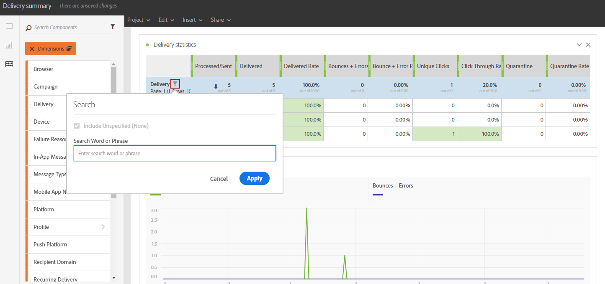

# コンポーネントの追加{#adding-components}

コンポーネントは、様々なディメンション、指標、期間を使用してレポートをカスタマイズするのに役立ちます。

1. 「 **[!UICONTROL Components]** 」タブをクリックして、コンポーネントのリストにアクセスします。

   

1. 「 **[!UICONTROL Components]** 」タブに表示される各カテゴリには、最も使用されている5つの項目が表示されます。カテゴリの名前をクリックすると、コンポーネントの完全なリストにアクセスできます。

   コンポーネントの表は、次の4つのカテゴリに分かれています。

   * **Dimension**:受信者のブラウザーやドメイン、配信の成功など、配信ログから詳細を取得します。
   * **指標**:メッセージのステータスの詳細を取得します。例えば、メッセージが配信され、ユーザーが開いた場合などです。
   * **[!UICONTROL Segments]**:受信者の年齢範囲に応じてデータをフィルターします。**[!UICONTROL Segments]** は、フリーフォームテーブルまたはパネルの上部バーに直接ドラッグ&amp;ドロップできます。

      このカテゴリは、管理者が画面に表示される動的レポート使用契約の条項を承認した場合にのみ使用できます。 管理者が契約を却下した場合、セグメントは「**[!UICONTROL Components]**」タブに表示されず、データは収集されません。

   * **時間**:テーブルの期間を設定します。

1. コンポーネントをパネルにドラッグ&amp;ドロップして、データのフィルタリングを開始します。

   

1. コンポーネントをドラッグ&amp;ドロップした後、**[!UICONTROL Row settings]**&#x200B;オプションを使用してテーブルをさらに設定できます。

   

1. また、**検索**&#x200B;アイコンをクリックして、テーブルをさらにフィルタリングすることもできます。 この検索を使用して、例えば特定の配信やブラウザーなど、特定の結果を検索できます。

   

必要な数のコンポーネントをドラッグ&amp;ドロップして相互に比較できます。

**関連トピック：**

* [コンポーネントのリスト](../../reporting/using/list-of-components-.md)
* [レポートのリスト](../../reporting/using/defining-the-report-period.md)
