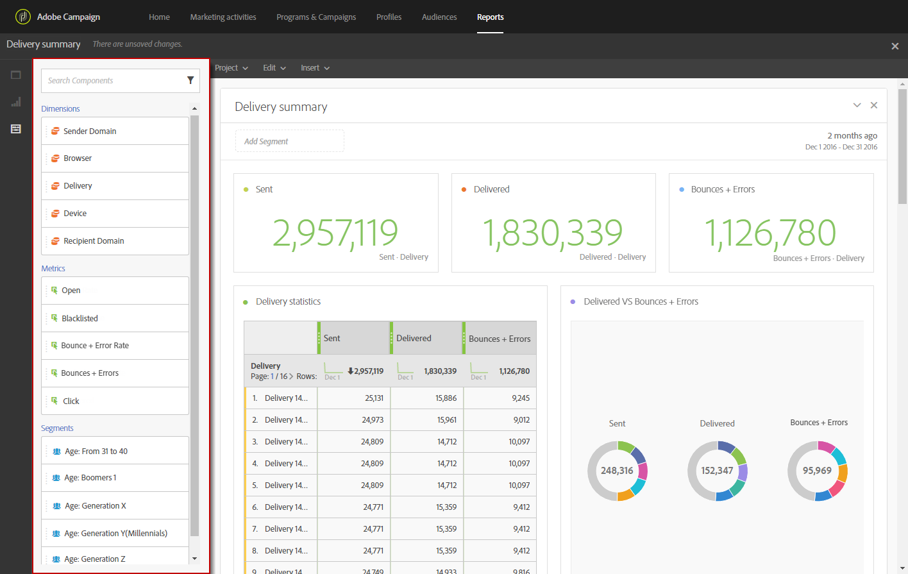
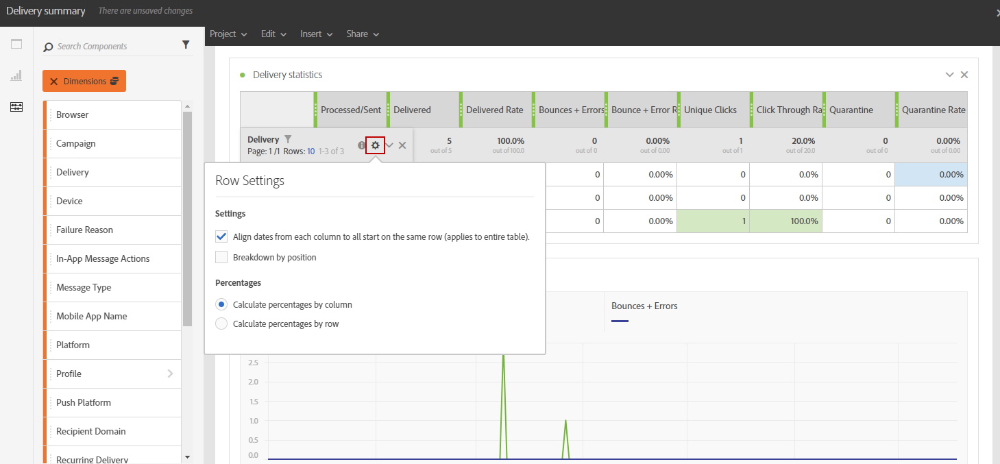

# コンポーネントの追加{#adding-components}

コンポーネントでは、様々なディメンション、指標および期間を使用してレポートをカスタマイズできます。

1. 「**[!UICONTROL Components]**」タブをクリックして、コンポーネントのリストにアクセスします。

   

1. **[!UICONTROL Components]** タブに表示される各カテゴリには、最も使用されている5つの項目が表示されます。カテゴリの名前をクリックすると、コンポーネントの完全なリストにアクセスできます。

   コンポーネントテーブルは、次の 4 つのカテゴリに分かれています。

   * **ディメンション**：配信ログから詳細（受信者のブラウザーやドメイン、配信の成功など）を取得します。
   * **指標**：メッセージのステータスに関する詳細を取得します。 例えば、メッセージが配信され、ユーザーがそれを開いたかどうかについての情報を取得します。
   * **[!UICONTROL Segments]**：受信者の年齢範囲に応じてデータをフィルタリングします。 **[!UICONTROL Segments]**&#x200B;は、フリーフォームテーブルまたはパネルの上部バーに直接ドラッグ&amp;ドロップできます。

     このカテゴリは、画面に表示される動的レポートの使用契約の利用条件を管理者が承認した場合にのみ使用できます。 管理者が契約書を辞退した場合、セグメントは&#x200B;**[!UICONTROL Components]** タブに表示されず、データは収集されません。

   * **時間**：テーブルの期間を設定します。

1. パネルにコンポーネントをドラッグ＆ドロップして、データのフィルタリングを開始します。

   

1. コンポーネントをドラッグ&amp;ドロップした後、**[!UICONTROL Row settings]** オプションを使用してテーブルをさらに設定できます。

   

1. また、**検索**&#x200B;アイコンをクリックして、テーブルをさらにフィルターすることもできます。 この検索を使用すると、特定の配信やブラウザーなど、特定の結果を探すことができます。

   

必要な数のコンポーネントをドラッグ＆ドロップして、相互に比較できます。

**関連トピック：**

* [コンポーネントのリスト](../../reporting/using/list-of-components.md)
* [レポートのリスト](../../reporting/using/defining-the-report-period.md)
