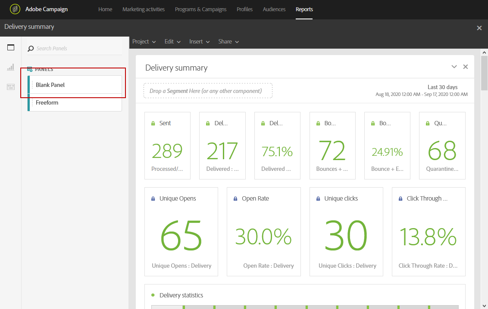

# パネルの追加{#adding-panels}

## 空のパネルの追加{#adding-a-blank-panel}

レポートを開始するには、パネルのセットを追加してあらかじめ用意されているレポートやカスタムレポートに追加します。 各パネルには異なるデータセットが含まれ、フリーフォームテーブルとビジュアライゼーションで構成されます。

このパネルでは、必要に応じてレポートを作成できます。 様々な期間でデータをフィルターするために、レポートに必要な数のパネルを追加できます。

1. **パネル**&#x200B;アイコンをクリックします。 「**挿入」タブ**&#x200B;をクリックし、「**新しい空白パネル**」を選択して、パネルを追加することもできます。

   

1. **空のパネル**&#x200B;をダッシュボードにドラッグ&amp;ドロップします。

   

パネルにフリーフォームテーブルを開始のターゲット設定データに追加できるようになりました。

## フリーフォームテーブルの追加{#adding-a-freeform-table}

フリーフォームテーブルを使用すると、**コンポーネント**&#x200B;テーブルで使用できる様々な指標とディメンションを使用して、データを分析するテーブルを作成できます。

各テーブルとビジュアライゼーションはサイズ変更が可能で、移動してレポートをより適切にカスタマイズできます。

1. **パネル**&#x200B;アイコンをクリックします。

   

1. **フリーフォーム**&#x200B;アイテムをダッシュボードにドラッグ&amp;ドロップします。

   また、「**挿入**」タブをクリックし、「**新しいフリーフォーム**」を選択するか、空のパネルで「**フリーフォームテーブル追加**」をクリックして、テーブルを追加することもできます。

   

1. **[!UICONTROL Exclude proof]**&#x200B;セグメントは既にデフォルトで選択されています。 必要に応じて、**[!UICONTROL Components]**&#x200B;タブの&#x200B;**[!UICONTROL Segments]**&#x200B;の1つを上部バーにドラッグ&amp;ドロップして変更できます。

   

1. 「**コンポーネント**」タブから列と行に項目をドラッグ&amp;ドロップして、テーブルを作成します。

   

1. **設定**&#x200B;アイコンをクリックして、列でのデータの表示方法を変更します。

   

   **[!UICONTROL Column settings]**&#x200B;は次の要素で構成されます。

   * **[!UICONTROL Number]**:列内の概要番号を表示または非表示にできます。
   * **[!UICONTROL Percent]**:列内のパーセントの表示/非表示を切り替えることができます。
   * **[!UICONTROL Interpret zero as no value]**:値がゼロの場合は表示/非表示を切り替えます。
   * **[!UICONTROL Background]**:セル内の水平方向の進捗バーの表示/非表示を切り替えます。
   * **[!UICONTROL Include retries]**:結果に再試行を含めることができます。これは&#x200B;**[!UICONTROL Sent]**&#x200B;と&#x200B;**[!UICONTROL Bounces + Errors]**&#x200B;でのみ使用できます。

1. 1つまたは複数の行を選択し、**視覚化**&#x200B;アイコンをクリックします。 選択した行を反映するビジュアライゼーションが追加されます。

   

必要な数のコンポーネントを追加でき、ビジュアライゼーションを追加してデータをグラフィカルに表示できるようになりました。
