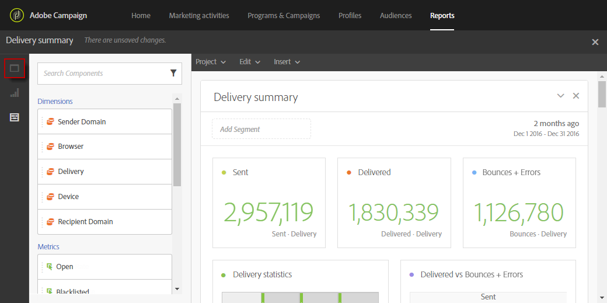
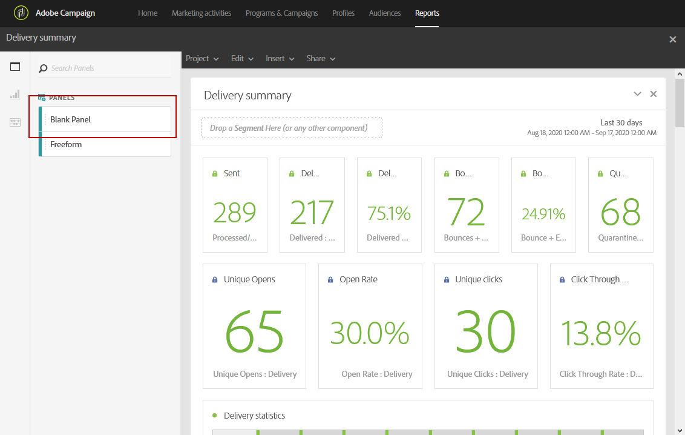
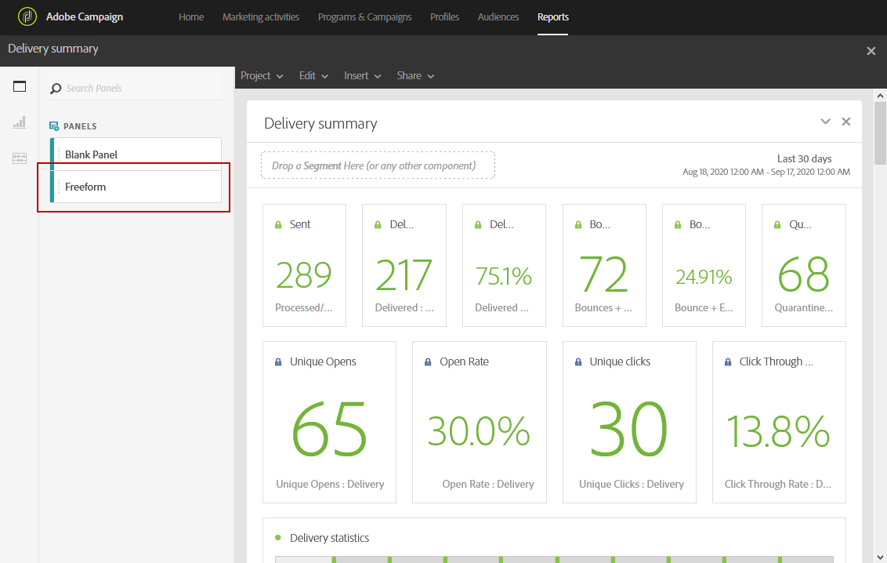
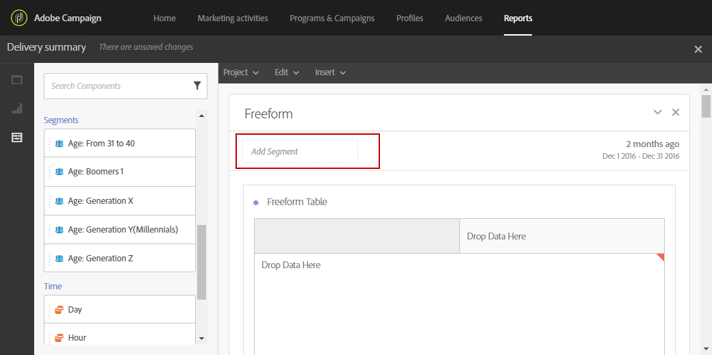
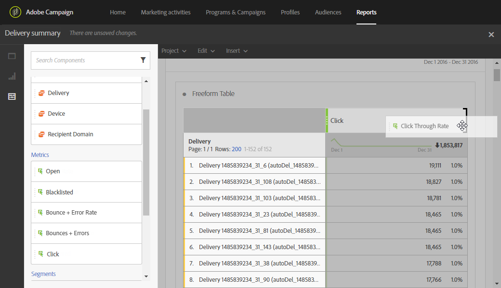
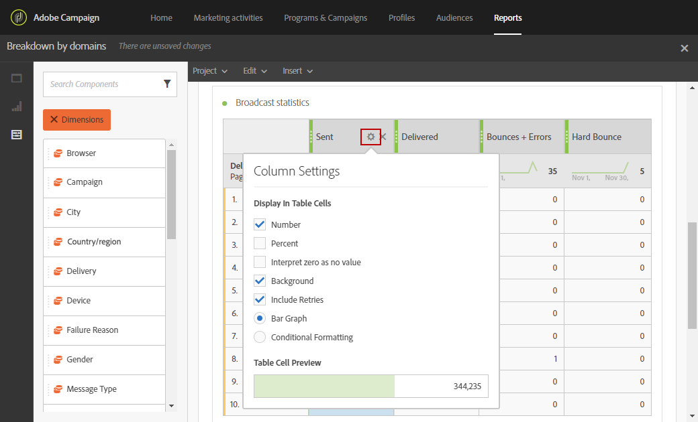
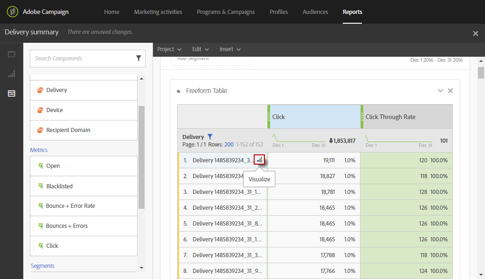

# パネルの追加{#adding-panels}

## 空のパネルの追加 {#adding-a-blank-panel}

レポートを開始するには、標準またはカスタムのレポートに一連のパネルを追加します。 各パネルは、様々なデータセットを含み、フリーフォームテーブルとビジュアライゼーションで構成されています。

このパネルを使用すると、必要に応じてレポートを作成できます。 異なる期間でデータをフィルタリングするために、レポートに必要な数のパネルを追加できます。

1. 「**パネル**」アイコンをクリックします。 また、「**タブを挿入**」をクリックして「**新しい空のパネルl**」を選択することで、パネルを追加することもできます。

   

1. **空のパネル**&#x200B;をダッシュボードにドラッグ＆ドロップします。

   

これで、パネルにフリーフォームテーブルを追加して、データのターゲティングを開始できるようになりました。

## フリーフォームテーブルの追加 {#adding-a-freeform-table}

フリーフォームテーブルでは、**コンポーネント**&#x200B;テーブルにある様々な指標やディメンションを使ってテーブルを作成し、データを分析できます。

各テーブルとビジュアライゼーションはサイズ変更したり、移動したりしてレポートをカスタマイズできます。

1. **[!UICONTROL Panels]** アイコンをクリックします。

   

1. **[!UICONTROL Freeform]**&#x200B;項目をダッシュボードにドラッグ&amp;ドロップします。

   テーブルを追加するには、**[!UICONTROL Insert]** タブをクリックして&#x200B;**[!UICONTROL New Freeform]**&#x200B;を選択するか、空のパネルで&#x200B;**[!UICONTROL Add a freeform table]**&#x200B;をクリックします。

   

1. **[!UICONTROL Drop a segment here]** フィールドで、**[!UICONTROL Components]** タブから&#x200B;**[!UICONTROL Segment]**&#x200B;を上部バーに追加します。

   

1. **[!UICONTROL Components]** タブから項目を列と行にドラッグ&amp;ドロップして、テーブルを作成します。

   

1. **[!UICONTROL Settings]** アイコンをクリックして、列でのデータの表示方法を変更します。

   

   **[!UICONTROL Column settings]**&#x200B;は次の要素で構成されています：

   * **[!UICONTROL Number]**：列の要約番号を表示または非表示にできます。
   * **[!UICONTROL Percent]**：列のパーセントを表示または非表示にできます。
   * **[!UICONTROL Interpret zero as no value]**：値が0に等しい場合に表示または非表示にできます。
   * **[!UICONTROL Background]**: セルの水平方向の進行状況バーを表示または非表示にできます。
   * **[!UICONTROL Include retries]**：結果に再試行を含めることができます。 これは、**[!UICONTROL Sent]**&#x200B;と&#x200B;**[!UICONTROL Bounces + Errors]**&#x200B;でのみ使用できます。

1. 1つまたは複数の行を選択し、**[!UICONTROL Visualize]** アイコンをクリックします。 ビジュアライゼーションが追加され、選択した行が反映されます。

   

必要な数のコンポーネントを追加し、ビジュアライゼーションを追加して、データをグラフで表示できるようになりました。
