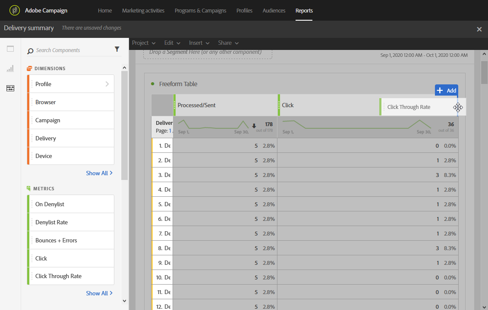

# Adding panels{#adding-panels}

## Adding a blank panel {#adding-a-blank-panel}

レポートを開始するには、パネルのセットをデフォルトレポートまたはカスタムレポートに追加します。各パネルには異なるデータセットが含まれており、フリーフォームテーブルとビジュアライゼーションで構成されています。

このパネルでは、必要に応じてレポートを作成できます。レポートに必要な数のパネルを追加して、異なる期間にデータをフィルターできます。

1. **パネル** アイコンをクリックします。**「挿入»タブをクリック?し、?«空白のパネル?******

   

1. **空のパネル** をダッシュボードにドラッグ&amp;ドロップします。

   

フリーフォームテーブルをパネルに追加して、ターゲットデータを開始できるようになりました。

## Adding a freeform table {#adding-a-freeform-table}

Freeform tables allow you to create a table to analyze your data using the different metrics and dimensions available in the **Component** table.

各テーブルとビジュアライゼーションはサイズ変更可能で、レポートをより適切にカスタマイズするために移動できます。

1. **パネル** アイコンをクリックします。

   

1. **フリーフォーム** アイテムをダッシュボードにドラッグ&amp;ドロップします。

   **「挿入** 」タブをクリックして「新規フリーフォーム」を選択 **** するか、空のパネルで「フリーフォームテーブルを追加」をクリック **して、テーブルを追加** することもできます。

   

1. If needed, drag and drop **[!UICONTROL Segments]** from the **[!UICONTROL Components]** tab into the top bar to filter your report depending on your recipient's age range.

   

1. **「コンポーネント」** タブから項目をドラッグ&amp;ドロップして、テーブルを作成します。

   

1. **設定** アイコンをクリックして、列にデータを表示する方法を変更します。

   

   The **[!UICONTROL Column settings]** is composed of:

   * **[!UICONTROL Number]**:を使用すると、列にサマリ番号を表示または非表示にすることができます。
   * **[!UICONTROL Percent]**:列のパーセントを表示または非表示にできます。
   * **[!UICONTROL Interpret zero as no value]**:値がゼロの場合は表示または非表示にできます。
   * **[!UICONTROL Background]**:を使用すると、セル内の水平プログレスバーの表示/非表示を切り替えることができます。
   * **[!UICONTROL Include retries]**:結果に再試行を含めることができます。This is only available for **[!UICONTROL Sent]** and **[!UICONTROL Bounces + Errors]**.

1. Select one or multiple rows and click the **Visualize** icon. 選択した行を反映するビジュアライゼーションが追加されます。

   

必要な数だけコンポーネントを追加できるようになり、ビジュアライゼーションを追加してデータをグラフィカルに表現できるようになりました。
