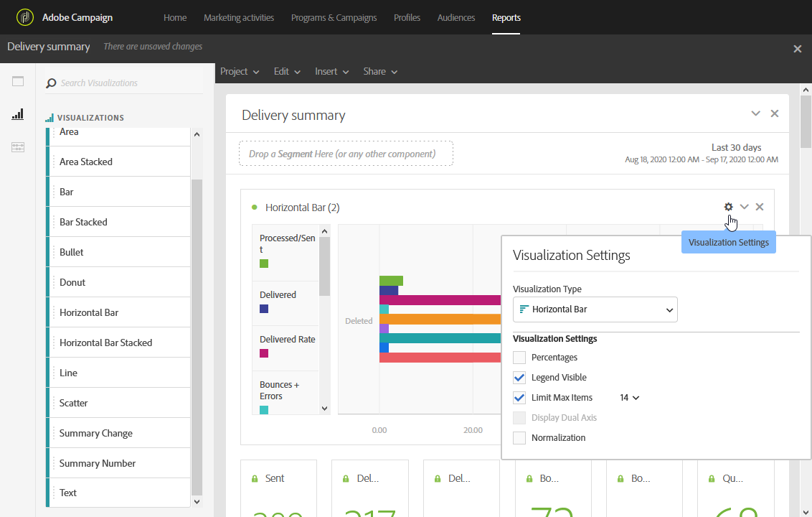

# ビジュアライゼーションの追加{#adding-visualizations}

「**ビジュアライゼーション**」タブでは、領域、ドーナツ、グラフなどのビジュアライゼーション項目をドラッグ&amp;ドロップできます。 ビジュアライゼーションにより、データをグラフで表示できます。

1. 「**[!UICONTROL Visualizations]**」タブで、ビジュアライゼーション項目をパネルにドラッグ&amp;ドロップします。

   

1. パネルにビジュアライゼーションを追加すると、動的レポートによってフリーフォームテーブルのデータが自動的に検出されます。 視覚化の設定を選択します。
1. 複数のフリーフォームテーブルがある場合は、**データSourceの設定** ウィンドウで、グラフに追加できるデータソースを選択します。 このウィンドウは、ビジュアライゼーションのタイトルの横にある色付きの点をクリックしても使用できます。

   

1. 「**[!UICONTROL Visualization]** 設定」ボタンをクリックして、グラフのタイプやグラフに表示される内容を直接変更します。

   * **パーセンテージ**：値をパーセンテージで表示します。
   * **Y 軸をゼロに固定**：値の範囲がゼロより大きい場合でも、Y 軸を強制的にゼロにします。
   * **凡例を表示**：凡例を非表示にできます。
   * **正規化**：値を強制的に一致させます。
   * **二重軸を表示**: グラフに別の軸を追加します。
   * **項目数の上限**：表示するグラフの数を制限します。
   * **しきい値**：グラフのしきい値を設定できます。 黒い点線で表示されます。

   

このビジュアライゼーションにより、レポート内のデータをより明確に表示できます。
