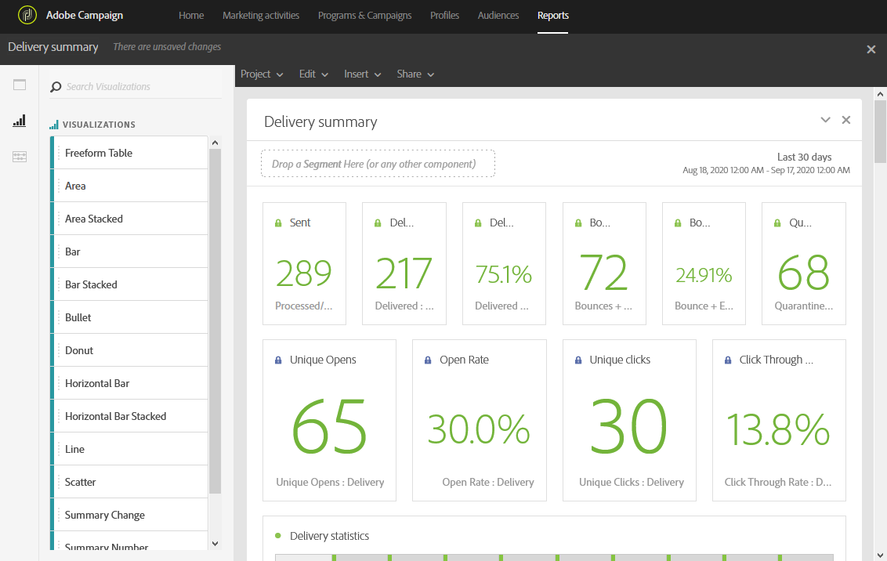

# ビジュアライゼーションの追加{#adding-visualizations}

「**ビジュアライゼーション**」タブでは、領域、ドーナツ、グラフなどのビジュアライゼーション項目をドラッグ&amp;ドロップできます。 ビジュアライゼーションを使用すると、データをグラフィカルに表示できます。

1. 「**[!UICONTROL Visualizations]**」タブで、ビジュアライゼーション項目をパネルにドラッグ&amp;ドロップします。

   

1. パネルにビジュアライゼーションを追加した後、動的レポートはフリーフォームテーブルのデータを自動的に検出します。 ビジュアライゼーションの設定を選択します。
1. 複数のフリーフォームテーブルがある場合は、**データソース設定**&#x200B;ウィンドウで、グラフに追加する使用可能なデータソースを選択します。 このウィンドウは、ビジュアライゼーションのタイトルの横にある色付きの点をクリックしても使用できます。

   

1. 「**[!UICONTROL Visualization]**&#x200B;設定」ボタンをクリックして、グラフの種類や表示内容を直接変更します。例：

   * **割合**:値をパーセントで表示します。
   * **Y軸をゼロに固定**:値の範囲が0より大きい場合でも、Y軸を強制的にゼロにします。
   * **凡例を表示**:凡例を非表示にできます。
   * **正規化**:値を強制的に一致させます。
   * **二重軸を表示**:グラフに別の軸を追加します。
   * **最大項目数の制限**:表示するグラフの数を制限します。
   * **しきい値**:グラフにしきい値を設定できます。黒い点線で表示されます。

   

このビジュアライゼーションを使用すると、レポート内のデータをより明確に表示できます。
