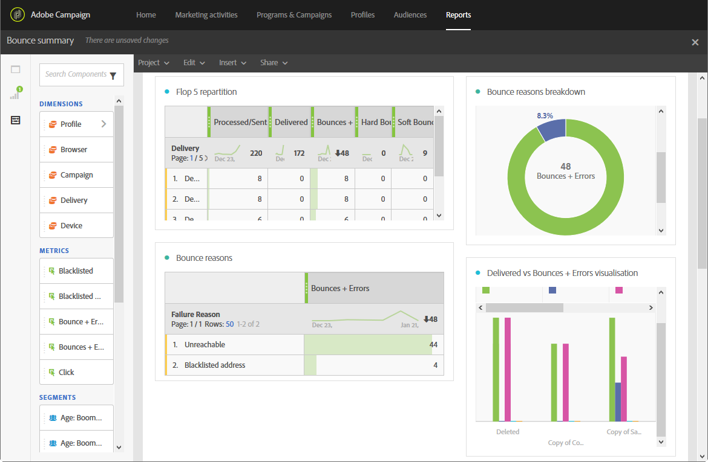

# バウンス概要{#bounce-summary}

このレポートでは、配信中に発生した全体的なハードエラーとソフトエラー、およびバウンスの自動処理について詳しく説明します（[配信エラーについて](../../sending/using/understanding-delivery-failures.md)を参照）。

各テーブルは、概要の数値とグラフで表されています。 それぞれのビジュアライゼーション設定で、詳細の表示方法を変更できます。

**フロップ 5 の再区分**&#x200B;には、強制隔離数が最も多い 5 つの配信が一覧表示されます。

**バウンスの理由**&#x200B;テーブルには、各配信でバウンスの原因となったエラーの種類に関する利用可能なデータが含まれています。

* **[!UICONTROL User unknown]**：配信が無効な電子メールアドレスに送信されたときに生成されるエラーのタイプ。
* **[!UICONTROL Invalid domain]**: ドメインが間違っているか、もはや存在しないメールアドレスに配信を送信したときに生成されるエラーの種類です。
* **[!UICONTROL Unreachable]**: メッセージ配信文字列で発生したエラーの種類（ドメインに一時的に到達できないなど）。
* **[!UICONTROL Account disabled]**：配信が存在しない電子メールアドレスに送信されたときに生成されるエラーの種類。
* **[!UICONTROL Mailbox full]**：受信者の受信トレイがいっぱいになったときに生成されるエラーの種類。 このエラーが生成されるまで、メッセージを配信する試みは 5 回あります。
* **[!UICONTROL Not connected]**：受信者の携帯電話がオフの場合、またはメッセージの送信時にネットワークに接続されていない場合に生成されるエラーの種類です。

  >[!NOTE]
  >
  >この種のエラーは、モバイルチャネルでの配信のみに該当します。

* **[!UICONTROL Refused]**: アドレスがインターネット サービス プロバイダー（ISP）によって拒否されたときに生成されるエラーの種類です。 例えば、スパム対策ソフトウェアによってセキュリティルールが適用された場合などです。

**ドメインの再区分**&#x200B;テーブルには、受信者ドメインに応じた、配信中に発生した全体的な問題が表示されます。
