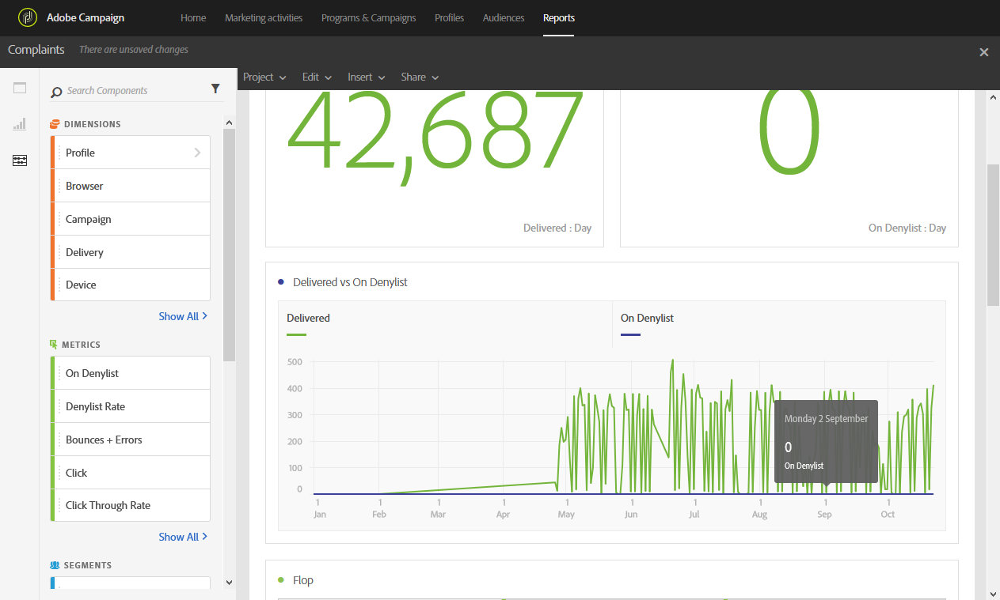

# 苦情{#complaints}

**[!UICONTROL Complaints]** レポートは、最も多くの宣言を受信した配信をスパムとして特定します。

**フロップ**&#x200B;テーブルは、受信者ドメイン別に並べ替えられ、メールまたは迷惑メールを報告した受信者の数を表示します。 テーブルの結果は、グラフや概要の数値でも使用できます。

**「配信」と「ブロックリスト登録済み」の比較**&#x200B;のテーブルには、メールをスパムまたは迷惑メールとして報告した受信者の数が一覧表示されます。 テーブルは配信ごとに並べ替えられています。
