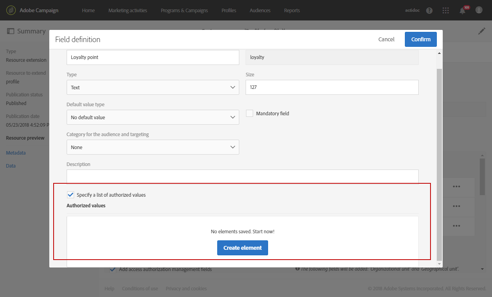
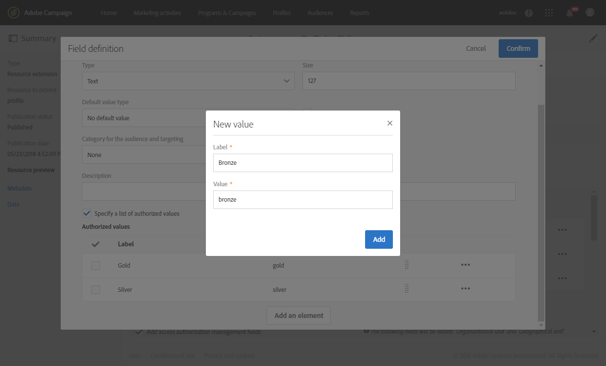
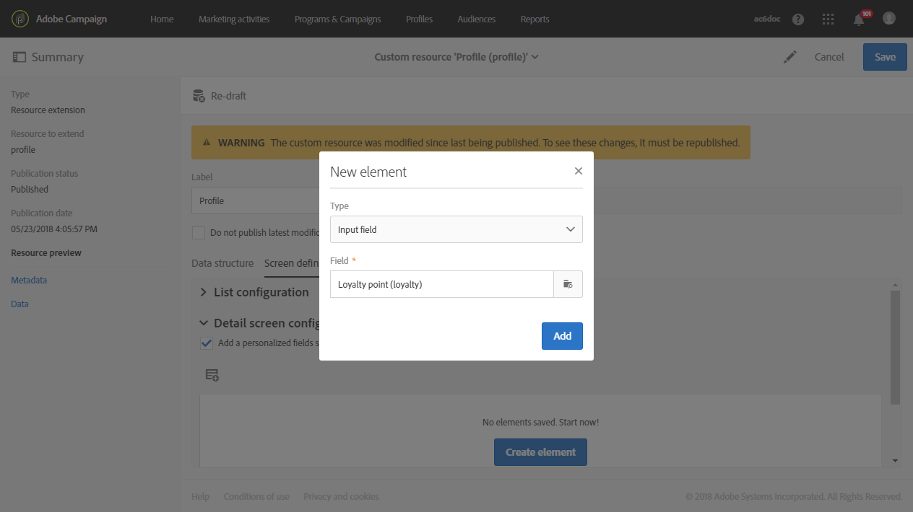
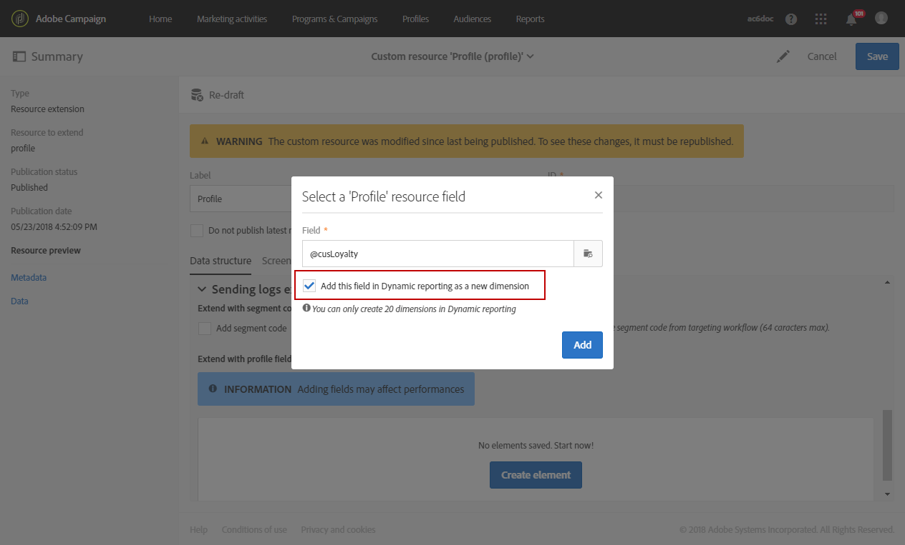
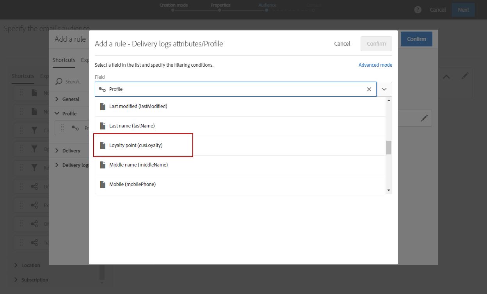

# カスタムプロファイルディメンションの作成{#creating-a-custom-profile-dimension}

また、プロファイルのカスタムリソース拡張で作成されたカスタムプロファイルデータに基づいて、レポートの作成や管理を行うこともできます。

この例では、カスタムプロファイルフィールド&#x200B;**忠誠度プログラム**&#x200B;を作成し、3つのレベルに分けます。金、銀、青銅。 その後、このカスタムプロファイルを拡張して、動的レポートでカスタムプロファイルディメンションとして使用できるようにします。

* [手順1:新しいプロファイルフィールドの作成](#step-1--create-a-new-profile-field)
* [手順2:プロファイルフィールドを使用して送信ログを拡張する](#step-2--extend-the-sending-logs-with-the-profile-field)
* [手順3:忠誠度プログラムに登録されている配信をターゲットにする受信者の作成](#step-3--create-a-delivery-targeting-recipients-enrolled-in-the-loyalty-program)
* [手順4:カスタムプロファイルディメンションを使用して受信者をフィルターする動的レポートの作成](#step-4--create-a-dynamic-report-to-filter-recipients-with-the-custom-profile-dimension)

## 手順1:新しいプロファイルフィールドの作成{#step-1--create-a-new-profile-field}

まず、受信者に忠誠度レベルを割り当てる新しいプロファイルフィールド&#x200B;**忠誠度プログラム**&#x200B;を作成する必要があります。金、銀、青銅。

>[!NOTE]
>
>カスタムリソースは管理者のみが管理できます。

それには、次の手順に従います。

1. 詳細設定メニューで、**[!UICONTROL Administration]** > **[!UICONTROL Development]** > **[!UICONTROL Custom resources]**&#x200B;を選択し、次に&#x200B;**[!UICONTROL Profile (profile)]**&#x200B;カスタムリソースを選択します。

   

1. 「**[!UICONTROL Data structure]**」タブの&#x200B;**[!UICONTROL Fields]**&#x200B;カテゴリで、「**[!UICONTROL Add field]**」ボタンをクリックします。

   

1. **[!UICONTROL Label]**, **[!UICONTROL ID]**&#x200B;を入力し、カスタムリソース&#x200B;**[!UICONTROL Type]**&#x200B;を選択します。 ここで&#x200B;**[!UICONTROL Text]**&#x200B;を選んだのは、受信者が金、銀、青銅のどちらかを選ぶからです。

   

1. アイコンをクリックして、フィールドを定義します。

   

1. ここでは、**[!UICONTROL Specify a list of authorized valued]**&#x200B;をチェックして認証値を指定し、**[!UICONTROL Create element]**&#x200B;をクリックして各値を作成する必要があります。

   

1. **[!UICONTROL Label]**&#x200B;と&#x200B;**[!UICONTROL Value]**&#x200B;を入力し、**[!UICONTROL Add]**&#x200B;をクリックします。 この例では、値gold、silver、bronzeを作成する必要があります。 終了したら&#x200B;**[!UICONTROL Confirm]**&#x200B;をクリックします。

   

1. 「**[!UICONTROL Screen definition]**」タブを選択します。**[!UICONTROL Detail screen configuration]**&#x200B;ドロップダウンで、**[!UICONTROL Add personalized fields]**&#x200B;セクションをチェックして、プロファイルに新しいセクションを作成します。

   

1. **[!UICONTROL Add an element]**&#x200B;ボタンをクリックして、新しいセクションを作成します。 **[!UICONTROL Type]**&#x200B;を選択します。**[!UICONTROL Input field]**、**[!UICONTROL Value]**、または&#x200B;**[!UICONTROL List]**。次に、この新しいセクションに追加するフィールドを示します。

   

1. また、**[!UICONTROL Customize the title of the section where the fields will be displayed]**&#x200B;フィールド内のセクションにタイトルを追加することもできます。

   設定が完了したら、**[!UICONTROL Save]**&#x200B;をクリックします。

   

1. 詳細設定メニューで、**[!UICONTROL Administration]**/**[!UICONTROL Development]**/**[!UICONTROL Publication]**&#x200B;を選択して、カスタムリソースの公開を開始します。
1. **[!UICONTROL Prepare publication]**&#x200B;をクリックし、準備が完了したら、**[!UICONTROL Publish]**&#x200B;ボタンをクリックします。

   

これで、新しいプロファイルフィールドを使用し、受信者が選択できる状態になります。

## 手順2:プロファイルフィールド{#step-2--extend-the-sending-logs-with-the-profile-field}を使用して送信ログを拡張します。

プロファイルフィールドが作成されたら、送信ログをプロファイルフィールドと共に拡張し、動的レポートで関連付けられたカスタムプロファイルディメンションを作成する必要があります。

プロファイルフィールドでログを拡張する前に、PIIウィンドウが&#x200B;**[!UICONTROL Sending logs extension]**&#x200B;タブへのアクセス権を持つように許可されたことを確認してください。 詳しくは、この[ページ](../../reporting/using/about-dynamic-reports.md#dynamic-reporting-usage-agreement)を参照してください。

>[!NOTE]
>
>ログは、管理者がプロファイルフィールドを使用してのみ拡張できます。

1. 詳細設定メニューで、**[!UICONTROL Administration]** > **[!UICONTROL Development]** > **[!UICONTROL Custom resources]**&#x200B;を選択し、次に&#x200B;**[!UICONTROL Profile (profile)]**&#x200B;カスタムリソースを選択します。
1. **[!UICONTROL Sending logs extension]**&#x200B;ドロップダウンを開きます。
1. 「**[!UICONTROL Create element]**」ボタンをクリックします。

   

1. 以前に作成したフィールドを選択し、**[!UICONTROL Confirm]**&#x200B;をクリックします。
1. **[!UICONTROL Add this field in Dynamic reporting as a new dimension]**&#x200B;をチェックして、カスタムプロファイルディメンションを作成します。

   

   このオプションは、PIIウィンドウが受け入れられた場合にのみ使用できます。 詳しくは、この[ページ](../../reporting/using/about-dynamic-reports.md#dynamic-reporting-usage-agreement)を参照してください。

1. **[!UICONTROL Add]**&#x200B;をクリックし、カスタムリソースを保存します。
1. カスタムリソースが変更されたので、それを発行して新しい変更を実装する必要があります。

   詳細設定メニューで、**[!UICONTROL Administration]**/**[!UICONTROL Development]**/**[!UICONTROL Publication]**&#x200B;を選択して、カスタムリソースの公開を開始します。

1. **[!UICONTROL Prepare publication]**&#x200B;をクリックし、準備が完了したら、**[!UICONTROL Publish]**&#x200B;ボタンをクリックします。

   

これで、カスタムプロファイルが、レポートでカスタムプロファイルディメンションとして使用できるようになります。

フィールドが作成され、送信ログがこのプロファイルフィールドで拡張されたので、配信で開始のターゲット設定受信者を使用できます。

## 手順3:ロイヤルティプログラム{#step-3--create-a-delivery-targeting-recipients-enrolled-in-the-loyalty-program}に登録されている配信をターゲットにする受信者を作成します

プロファイルフィールドが公開されると、配信を開始できます。 この例では、忠誠度プログラムに登録されているすべての受信者をターゲットします。

1. 「**[!UICONTROL Marketing activities]**」タブで「**[!UICONTROL Create]**」をクリックし、「**[!UICONTROL Email]**」を選択します。
1. **[!UICONTROL Email type]**&#x200B;を選択し、電子メールのプロパティを入力します。
1. ロイヤルティプログラムに登録されているターゲット受信者に対して、**[!UICONTROL Profiles (attributes)]**&#x200B;アクティビティをドラッグ&amp;ドロップします。
1. **[!UICONTROL Field]**&#x200B;ドロップダウンから、以前に作成したフィールドを選択します。

   

1. **[!UICONTROL Filter conditions]**&#x200B;を選択します。 ここでは、3つの忠誠度プログラムのレベルの1つに含まれる受信者をターゲットします。

   

1. 「**[!UICONTROL Confirm]**」をクリックし、フィルタリングが完了したら「**[!UICONTROL Next]**」をクリックします。
1. メッセージの内容、送信者名、件名を定義してパーソナライズします。 電子メールの作成に関する詳細は、[ページ](../../designing/using/designing-content-in-adobe-campaign.md)を参照してください。

   次に、**[!UICONTROL Create]**&#x200B;をクリックします。

1. 準備が整ったら、プレビューしてメッセージを送信できます。 メッセージの準備と送信の方法について詳しくは、[ページ](../../sending/using/preparing-the-send.md)を参照してください。

選択した受信者に電子メールが正しく送信されたら、開始によるデータのフィルタリングを行い、レポートを使用して配信の成功を追跡できます。

## 手順4:カスタムプロファイルディメンション{#step-4--create-a-dynamic-report-to-filter-recipients-with-the-custom-profile-dimension}を使用して受信者をフィルターする動的レポートを作成します

配信を送信した後、**[!UICONTROL Profile]**&#x200B;テーブルのカスタムプロファイルディメンションを使用してレポートを分類できます。

1. 「**[!UICONTROL Reports]**」タブからあらかじめ用意されているレポートを選択するか、**[!UICONTROL Create]**&#x200B;ボタンをクリックして最初から開始します。

   

1. **[!UICONTROL Dimensions]**&#x200B;カテゴリで、**[!UICONTROL Profile]**&#x200B;をクリックし、カスタムの&#x200B;**忠誠度プログラム**&#x200B;プロファイルディメンションをフリーフォームテーブルにドラッグ&amp;ドロップします。

   

1. **[!UICONTROL Processed/Sent]**&#x200B;指標と&#x200B;**[!UICONTROL Open]**&#x200B;指標をドラッグ&amp;ドロップして、データのフィルタリングを開始に行います。

   

1. 必要に応じて、ワークスペースにビジュアライゼーションをドラッグ&amp;ドロップします。

   

**関連トピック：**

* [カスタムプロファイルデータを使用した洞察に富んだレポートの作成](https://helpx.adobe.com/campaign/kb/simplify-campaign-management.html#Reportandshareinsightswithallstakeholders)
