# カスタムプロファイルディメンションの作成{#creating-a-custom-profile-dimension}

プロファイルカスタムリソース拡張機能で作成したカスタムプロファイルデータに基づいて、レポートを作成および管理することもできます。

この例では、カスタムプロファイルフィールド **ロイヤルティプログラム**&#x200B;を作成します。このフィールドは、ゴールド、シルバー、ブロンズの3つのレベルに分けられます。 このカスタムプロファイルは、ダイナミックレポートでカスタムプロファイルディメンションとして使用できるように拡張されます。

* [手順1：新しいプロファイルフィールドの作成](#step-1--create-a-new-profile-field)
* [手順2：プロファイルフィールドで送信ログを拡張する](#step-2--extend-the-sending-logs-with-the-profile-field)
* [手順3：ロイヤルティプログラムに登録されている受信者をターゲットとする配信を作成する](#step-3--create-a-delivery-targeting-recipients-enrolled-in-the-loyalty-program)
* [手順4：動的レポートを作成して、カスタムプロファイルディメンションで受信者をフィルタリングする](#step-4--create-a-dynamic-report-to-filter-recipients-with-the-custom-profile-dimension)

## 手順1：新しいプロファイルフィールドの作成 {#step-1--create-a-new-profile-field}

まず、受信者にロイヤルティレベルを割り当てる新しいプロファイルフィールド **ロイヤルティプログラム**&#x200B;を作成する必要があります。ゴールド、シルバー、ブロンズです。

>[!NOTE]
>
>カスタムリソースは管理者のみが管理できます。

それには、次の手順に従います。

1. 詳細設定メニューから、**[!UICONTROL Administration]** > **[!UICONTROL Development]** > **[!UICONTROL Custom resources]**&#x200B;を選択し、**[!UICONTROL Profile (profile)]** カスタムリソースを選択します。

   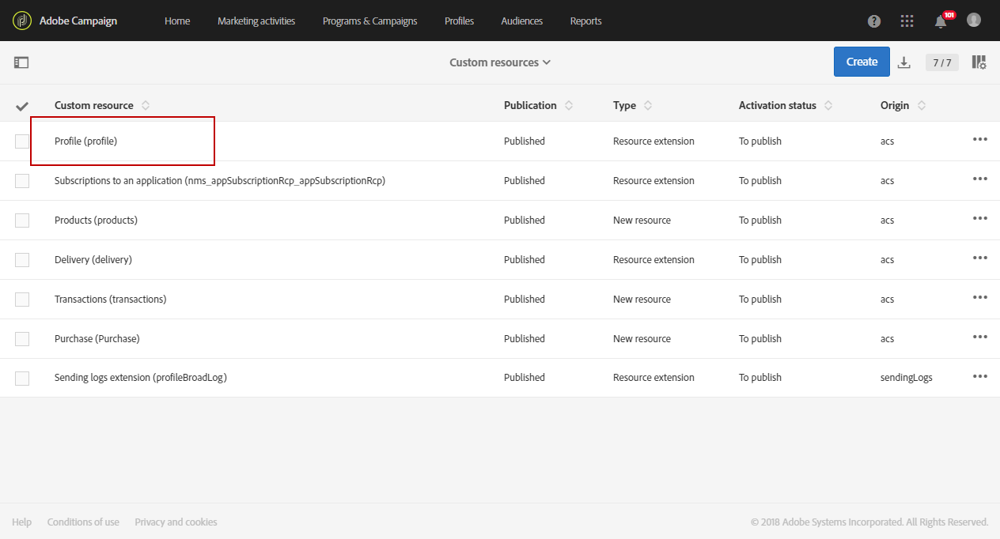

1. 「**[!UICONTROL Data structure]**」タブの&#x200B;**[!UICONTROL Fields]** カテゴリで、「**[!UICONTROL Add field]**」ボタンをクリックします。

   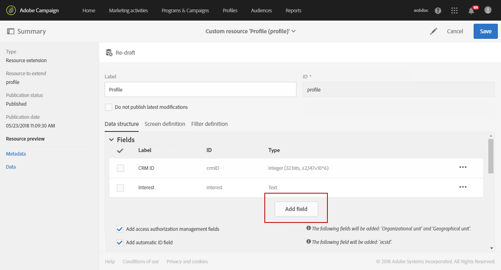

1. **[!UICONTROL Label]**、**[!UICONTROL ID]**&#x200B;を入力し、カスタムリソース **[!UICONTROL Type]**&#x200B;を選択します。 ここでは、受信者はゴールド、シルバー、ブロンズのいずれかを選択できるため、**[!UICONTROL Text]**&#x200B;を選択しました。

   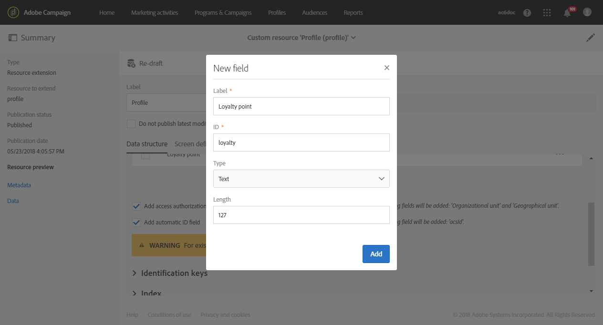

1.  アイコンをクリックして、フィールドを定義します。

   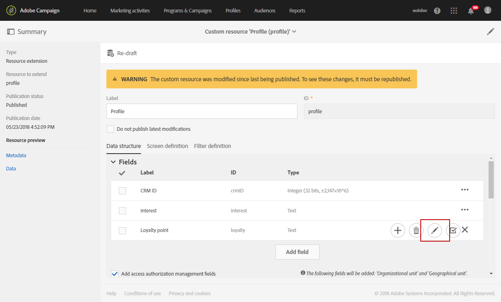

1. ここでは、**[!UICONTROL Specify a list of authorized valued]**&#x200B;を確認して承認済み値を指定し、**[!UICONTROL Create element]**&#x200B;をクリックして各値を作成する必要があります。

   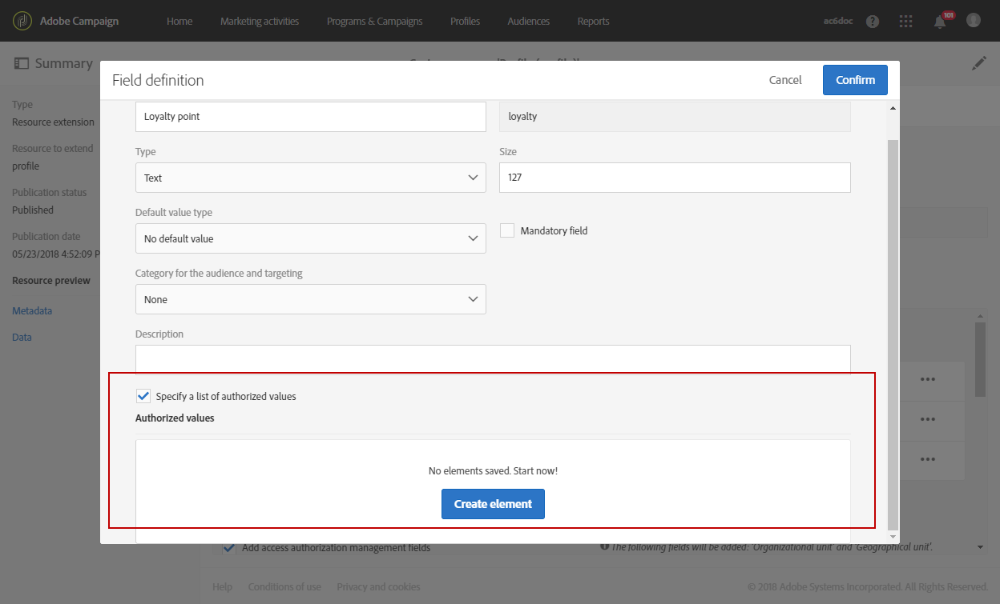

1. **[!UICONTROL Label]**&#x200B;と&#x200B;**[!UICONTROL Value]**&#x200B;を入力し、**[!UICONTROL Add]**&#x200B;をクリックします。 この例では、ゴールド、シルバー、ブロンズの値を作成する必要があります。 完了したら、**[!UICONTROL Confirm]**&#x200B;をクリックします。

   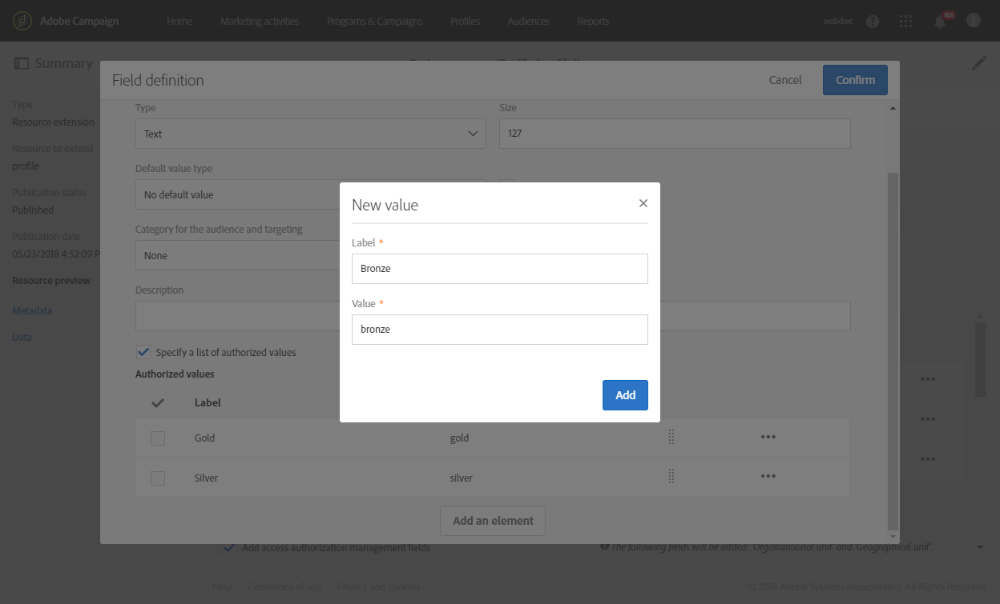

1. 「**[!UICONTROL Screen definition]**」タブを選択します。 **[!UICONTROL Detail screen configuration]** ドロップダウンで、**[!UICONTROL Add personalized fields]** セクションをチェックして、プロファイルに新しいセクションを作成します。

   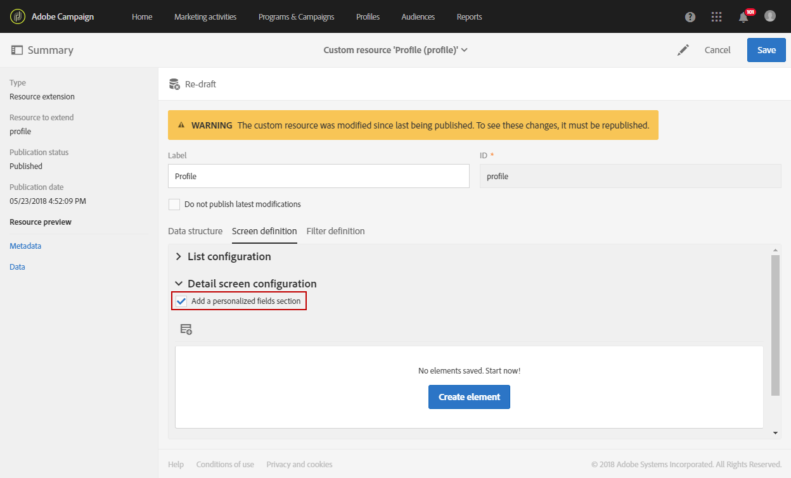

1. 「**[!UICONTROL Add an element]**」ボタンをクリックして、新しいセクションを作成します。 **[!UICONTROL Type]** : **[!UICONTROL Input field]**、**[!UICONTROL Value]**&#x200B;または&#x200B;**[!UICONTROL List]**&#x200B;を選択し、この新しいセクションに追加するフィールドを選択します。

   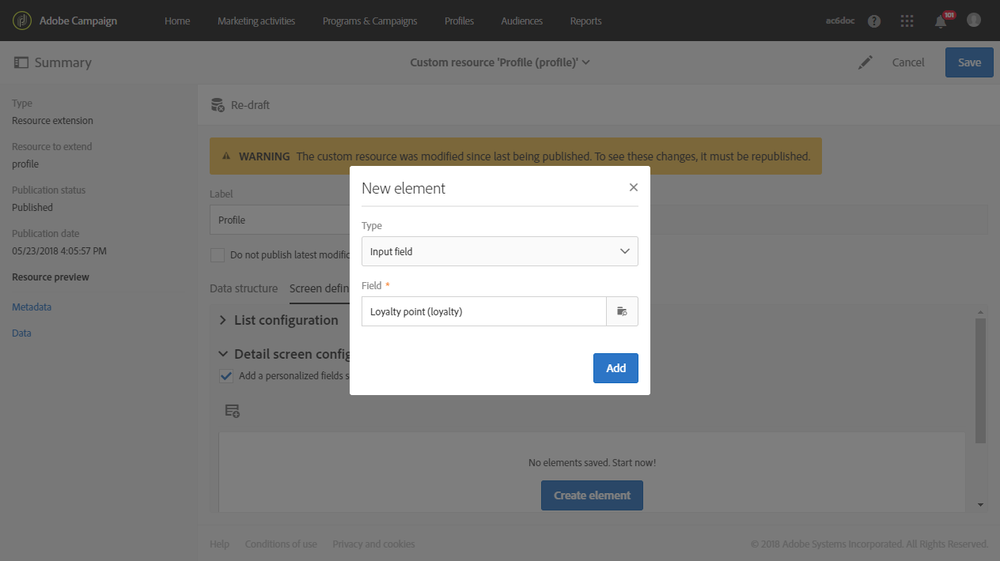

1. フィールド **[!UICONTROL Customize the title of the section where the fields will be displayed]**&#x200B;のセクションにタイトルを追加することもできます。

   設定が完了したら、**[!UICONTROL Save]**&#x200B;をクリックします。

   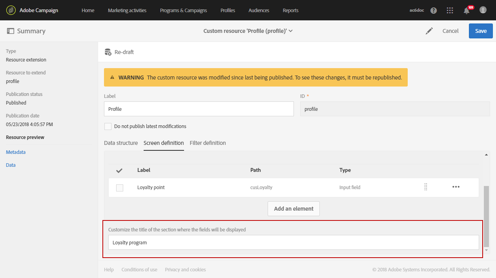

1. 詳細メニューから、**[!UICONTROL Administration]** > **[!UICONTROL Development]** > **[!UICONTROL Publication]**&#x200B;を選択して、カスタムリソースの公開を開始します。
1. 「**[!UICONTROL Prepare publication]**」をクリックし、準備が完了したら、「**[!UICONTROL Publish]**」ボタンをクリックします。

   

これで、受信者が新しいプロファイルフィールドを使用して選択する準備が整いました。

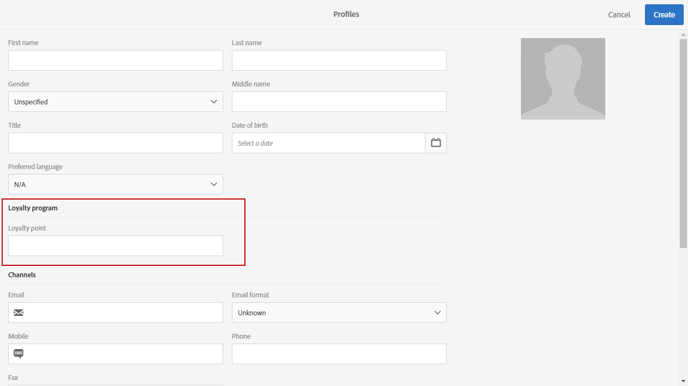

## 手順2：プロファイルフィールドで送信ログを拡張する {#step-2--extend-the-sending-logs-with-the-profile-field}

プロファイルフィールドが作成されたので、プロファイルフィールドを使用して送信ログを拡張し、動的レポートに関連するカスタムプロファイルディメンションを作成する必要があります。

プロファイルフィールドでログを拡張する前に、PII ウィンドウが&#x200B;**[!UICONTROL Sending logs extension]** タブへのアクセスを許可されていることを確認してください。 詳しくは、この[ページ](../../reporting/using/about-dynamic-reports.md#dynamic-reporting-usage-agreement)を参照してください。

>[!NOTE]
>
>ログは、管理者がプロファイルフィールドを使用してのみ拡張できます。

1. 詳細設定メニューから、**[!UICONTROL Administration]** > **[!UICONTROL Development]** > **[!UICONTROL Custom resources]**&#x200B;を選択し、**[!UICONTROL Profile (profile)]** カスタムリソースを選択します。
1. **[!UICONTROL Sending logs extension]** ドロップダウンを開きます。
1. 「**[!UICONTROL Create element]**」ボタンをクリックします。

   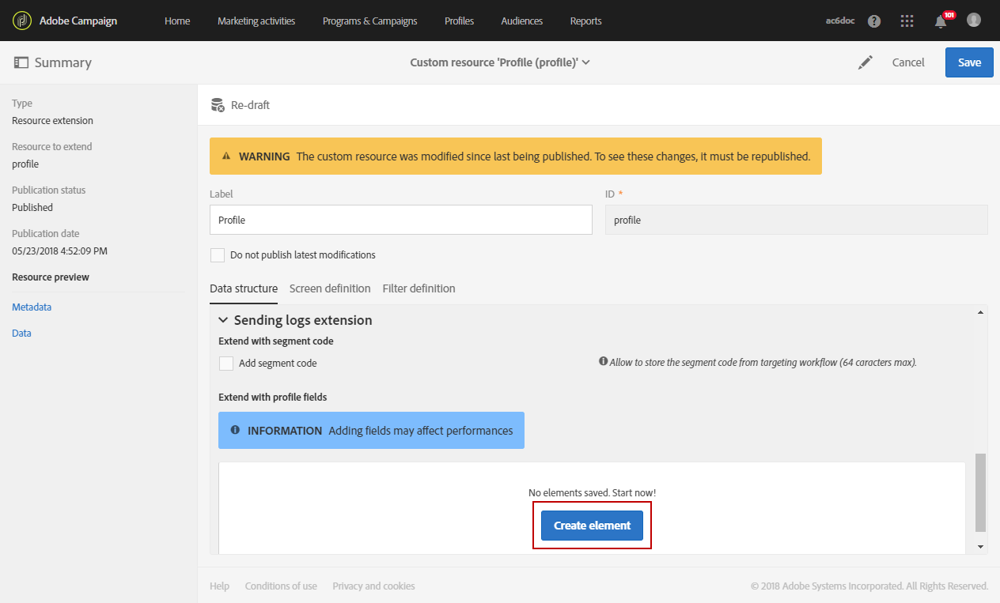

1. 以前に作成したフィールドを選択し、**[!UICONTROL Confirm]**&#x200B;をクリックします。
1. カスタムプロファイルディメンションを作成するには、**[!UICONTROL Add this field in Dynamic reporting as a new dimension]**&#x200B;を確認してください。

   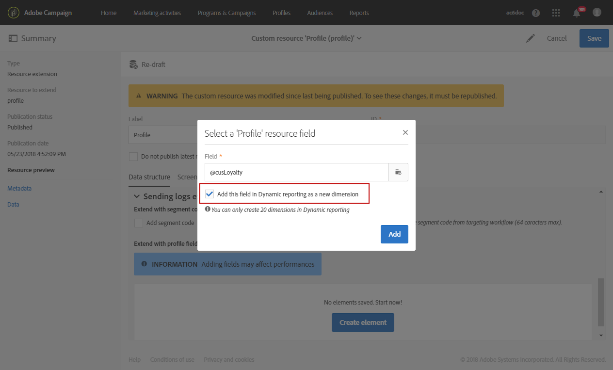

   このオプションは、PII ウィンドウが受け入れられた場合にのみ使用できます。 詳しくは、この[ページ](../../reporting/using/about-dynamic-reports.md#dynamic-reporting-usage-agreement)を参照してください。

1. 「**[!UICONTROL Add]**」をクリックして、カスタムリソースを保存します。
1. カスタムリソースが変更されたので、新しい変更を実装するためにそれを公開する必要があります。

   詳細メニューから、**[!UICONTROL Administration]** > **[!UICONTROL Development]** > **[!UICONTROL Publication]**&#x200B;を選択して、カスタムリソースの公開を開始します。

1. 「**[!UICONTROL Prepare publication]**」をクリックし、準備が完了したら、「**[!UICONTROL Publish]**」ボタンをクリックします。

   

カスタムプロファイルは、レポートでカスタムプロファイルディメンションとして使用できるようになります。

フィールドが作成され、送信ログがこのプロファイルフィールドで拡張されたので、配信の受信者をターゲットにすることができます。

## 手順3：ロイヤルティプログラムに登録されている受信者をターゲットとする配信を作成する {#step-3--create-a-delivery-targeting-recipients-enrolled-in-the-loyalty-program}

プロファイルフィールドを公開したら、配信を開始できます。 この例では、ロイヤルティプログラムに登録されているすべての受信者をターゲットにします。

1. 「**[!UICONTROL Marketing activities]**」タブで「**[!UICONTROL Create]**」をクリックし、「**[!UICONTROL Email]**」を選択します。
1. **[!UICONTROL Email type]**&#x200B;を選択し、メールのプロパティを入力してください。
1. ロイヤルティプログラムに登録されている受信者をターゲットにするには、**[!UICONTROL Profiles (attributes)]** アクティビティをドラッグ&amp;ドロップします。
1. **[!UICONTROL Field]** ドロップダウンから、以前に作成したフィールドを選択します。

   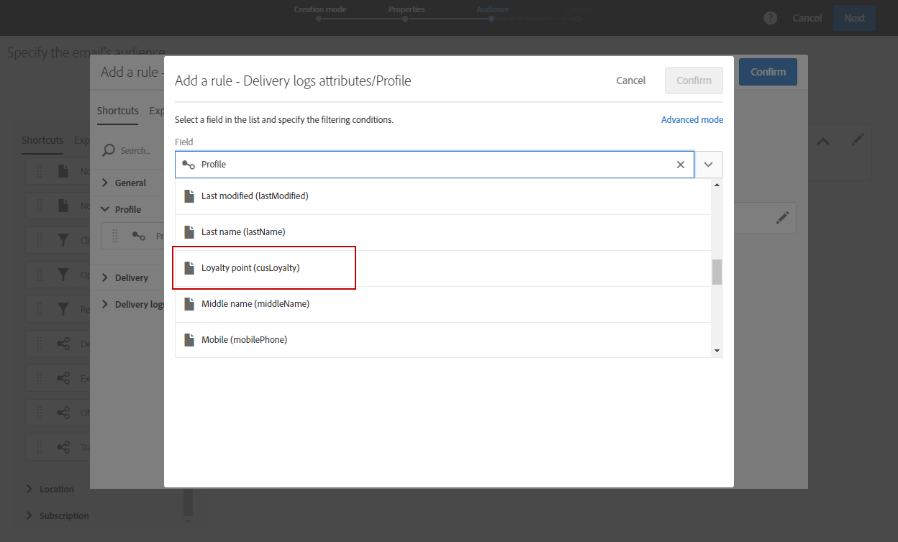

1. **[!UICONTROL Filter conditions]**&#x200B;を選択します。 ここでは、3つのロイヤルティプログラムのレベルのいずれかに属する受信者をターゲットにしたいと考えています。

   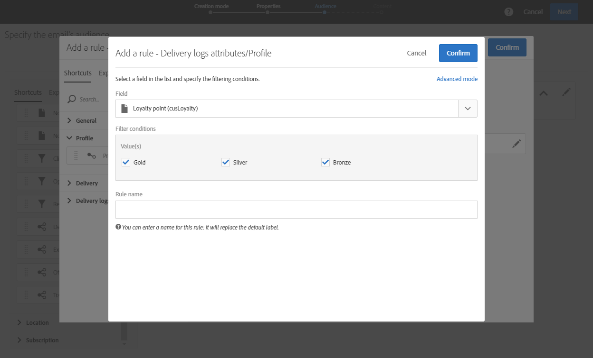

1. **[!UICONTROL Confirm]**&#x200B;をクリックし、フィルタリングが完了したら、**[!UICONTROL Next]**&#x200B;をクリックします。
1. メッセージのコンテンツ、送信者の名前、件名を定義し、パーソナライズできます。 メール作成について詳しくは、この[&#x200B; ページ &#x200B;](../../designing/using/designing-content-in-adobe-campaign.md)を参照してください。

   次に、**[!UICONTROL Create]**&#x200B;をクリックします。

1. 準備ができたら、メッセージをプレビューして送信できます。 メッセージの準備と送信方法について詳しくは、この[&#x200B; ページ &#x200B;](../../sending/using/preparing-the-send.md)を参照してください。

選択した受信者に電子メールが正しく送信されたら、データのフィルタリングを開始し、レポートを使用して配信の成功を追跡できます。

## 手順4：動的レポートを作成して、カスタムプロファイルディメンションで受信者をフィルタリングする {#step-4--create-a-dynamic-report-to-filter-recipients-with-the-custom-profile-dimension}

配信を送信した後、**[!UICONTROL Profile]** テーブルのカスタムプロファイルディメンションを使用してレポートを分類できます。

1. **[!UICONTROL Reports]** タブから、すぐに使用できるレポートを選択するか、**[!UICONTROL Create]** ボタンをクリックして最初から開始します。

   

1. **[!UICONTROL Dimensions]** カテゴリで、**[!UICONTROL Profile]**&#x200B;をクリックし、カスタム **ロイヤルティプログラム** プロファイルディメンションをフリーフォームテーブルにドラッグ&amp;ドロップします。

   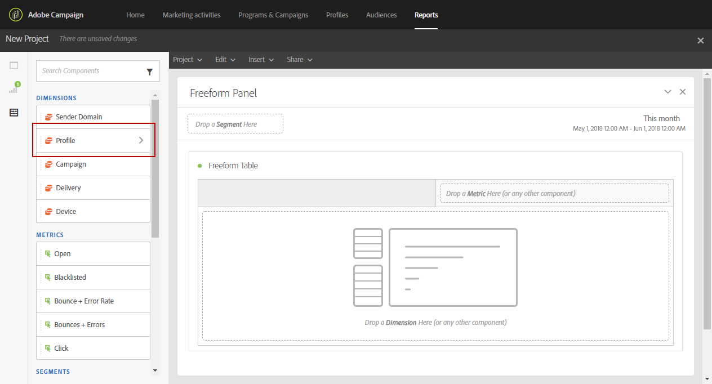

1. **[!UICONTROL Processed/Sent]**&#x200B;および&#x200B;**[!UICONTROL Open]**&#x200B;指標をドラッグ&amp;ドロップして、データのフィルタリングを開始します。

   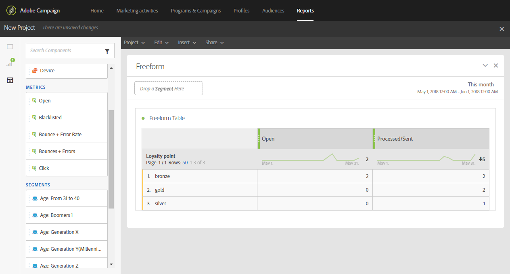

1. 必要に応じて、ワークスペースにビジュアライゼーションをドラッグ＆ドロップします。

   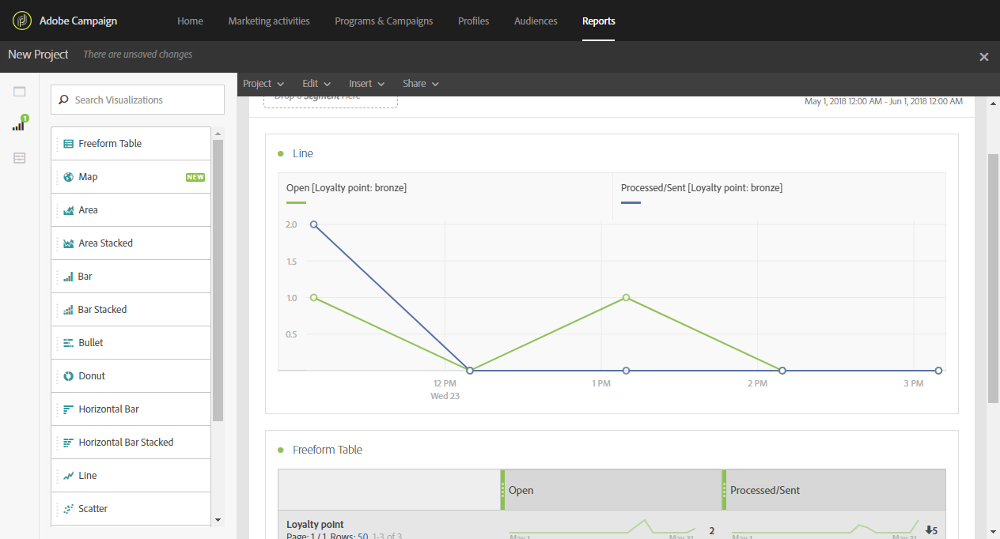

**関連トピック：**

* [カスタムプロファイルデータを使用してインサイトに満ちたレポートを作成](https://helpx.adobe.com/campaign/kb/simplify-campaign-management.html#Reportandshareinsightswithallstakeholders)
