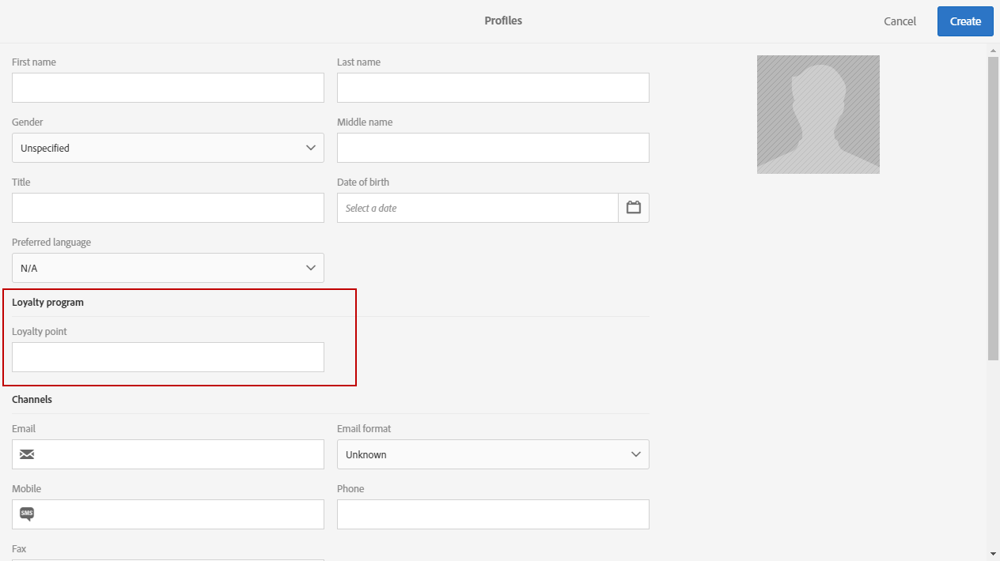

# カスタムプロファイルディメンションの作成{#creating-a-custom-profile-dimension}

また、プロファイルのカスタムリソース拡張中に作成されたカスタムプロファイルデータに基づいて、レポートを作成および管理することもできます。

この例では、カスタムプロファイルフィールド&#x200B;**Loyalty programs**&#x200B;を作成し、3つのレベルに分けます。金、銀、青銅。 次に、このカスタムプロファイルが、動的レポートでカスタムプロファイルディメンションとして使用できるように拡張されます。

* [手順1:新しいプロファイルフィールドの作成](#step-1--create-a-new-profile-field)
* [手順2:プロファイルフィールドを使用した送信ログの拡張](#step-2--extend-the-sending-logs-with-the-profile-field)
* [手順3:ロイヤリティプログラムに登録された受信者をターゲティングした配信の作成](#step-3--create-a-delivery-targeting-recipients-enrolled-in-the-loyalty-program)
* [手順4:動的レポートの作成により、カスタムプロファイルディメンションで受信者をフィルターします](#step-4--create-a-dynamic-report-to-filter-recipients-with-the-custom-profile-dimension)

## 手順1:新しいプロファイルフィールドの作成 {#step-1--create-a-new-profile-field}

最初に、受信者にロイヤルティレベルを割り当てる新しいプロファイルフィールド&#x200B;**ロイヤルティプログラム**&#x200B;を作成する必要があります。金、銀、青銅。

>[!NOTE]
>
>カスタムリソースは管理者のみが管理できます。

それには、次の手順に従います。

1. 詳細設定メニューから、**[!UICONTROL Administration]** > **[!UICONTROL Development]** > **[!UICONTROL Custom resources]**&#x200B;を選択し、**[!UICONTROL Profile (profile)]**&#x200B;カスタムリソースを選択します。

   

1. 「**[!UICONTROL Data structure]**」タブの「**[!UICONTROL Fields]**」カテゴリで、「**[!UICONTROL Add field]**」ボタンをクリックします。

   

1. **[!UICONTROL Label]**、**[!UICONTROL ID]**&#x200B;を入力し、カスタムリソース&#x200B;**[!UICONTROL Type]**&#x200B;を選択します。 ここでは、**[!UICONTROL Text]**&#x200B;を選択しました。受信者は、金、銀、青銅の中から選択できます。

   

1. アイコンをクリックして、フィールドを定義します。

   

1. ここでは、**[!UICONTROL Specify a list of authorized valued]**&#x200B;をチェックして承認された値を指定し、**[!UICONTROL Create element]**&#x200B;をクリックして各値を作成する必要があります。

   

1. **[!UICONTROL Label]**&#x200B;と&#x200B;**[!UICONTROL Value]**&#x200B;を入力し、**[!UICONTROL Add]**&#x200B;をクリックします。 この例では、値gold、silver、bronzeを作成する必要があります。 終了したら「**[!UICONTROL Confirm]**」をクリックします。

   

1. 「**[!UICONTROL Screen definition]**」タブを選択します。**[!UICONTROL Detail screen configuration]**&#x200B;ドロップダウンで、**[!UICONTROL Add personalized fields]**&#x200B;セクションをチェックして、プロファイルに新しいセクションを作成します。

   

1. **[!UICONTROL Add an element]**&#x200B;ボタンをクリックして、新しいセクションを作成します。 **[!UICONTROL Type]**&#x200B;を選択します。**[!UICONTROL Input field]**、**[!UICONTROL Value]**&#x200B;または&#x200B;**[!UICONTROL List]**&#x200B;を入力し、この新しいセクションに追加するフィールドを指定します。

   

1. フィールド&#x200B;**[!UICONTROL Customize the title of the section where the fields will be displayed]**&#x200B;でセクションにタイトルを追加することもできます。

   設定が完了したら、「**[!UICONTROL Save]**」をクリックします。

   

1. 詳細設定メニューで、 **[!UICONTROL Administration]** > **[!UICONTROL Development]** > **[!UICONTROL Publication]**&#x200B;を選択して、カスタムリソースのパブリッシュを開始します。
1. **[!UICONTROL Prepare publication]**&#x200B;をクリックし、準備が完了したら、「**[!UICONTROL Publish]**」ボタンをクリックします。

   

これで、新しいプロファイルフィールドを使用して、受信者が選択できる状態になりました。

## 手順2:プロファイルフィールドを使用した送信ログの拡張 {#step-2--extend-the-sending-logs-with-the-profile-field}

プロファイルフィールドが作成されたら、送信ログをプロファイルフィールドで拡張して、動的レポートで関連付けられたカスタムプロファイルディメンションを作成する必要があります。

プロファイルフィールドを使用してログを拡張する前に、PIIウィンドウが「**[!UICONTROL Sending logs extension]**」タブへのアクセスを許可されたことを確認してください。 詳しくは、この[ページ](../../reporting/using/about-dynamic-reports.md#dynamic-reporting-usage-agreement)を参照してください。

>[!NOTE]
>
>ログは、管理者がプロファイルフィールドでのみ拡張できます。

1. 詳細設定メニューから、**[!UICONTROL Administration]** > **[!UICONTROL Development]** > **[!UICONTROL Custom resources]**&#x200B;を選択し、**[!UICONTROL Profile (profile)]**&#x200B;カスタムリソースを選択します。
1. **[!UICONTROL Sending logs extension]**&#x200B;ドロップダウンを開きます。
1. 「**[!UICONTROL Create element]**」ボタンをクリックします。

   

1. 以前に作成したフィールドを選択し、「**[!UICONTROL Confirm]**」をクリックします。
1. 「**[!UICONTROL Add this field in Dynamic reporting as a new dimension]**」をオンにして、カスタムプロファイルディメンションを作成します。

   

   このオプションは、PIIウィンドウが受け入れられた場合にのみ使用できます。 詳しくは、この[ページ](../../reporting/using/about-dynamic-reports.md#dynamic-reporting-usage-agreement)を参照してください。

1. **[!UICONTROL Add]**&#x200B;をクリックし、カスタムリソースを保存します。
1. カスタムリソースは変更されたので、新しい変更を実装するにはパブリッシュする必要があります。

   詳細設定メニューで、 **[!UICONTROL Administration]** > **[!UICONTROL Development]** > **[!UICONTROL Publication]**&#x200B;を選択して、カスタムリソースのパブリッシュを開始します。

1. **[!UICONTROL Prepare publication]**&#x200B;をクリックし、準備が完了したら、「**[!UICONTROL Publish]**」ボタンをクリックします。

   

これで、カスタムプロファイルが、レポートでカスタムプロファイルディメンションとして使用できるようになりました。

フィールドが作成され、送信ログがこのプロファイルフィールドで拡張されたので、配信で受信者のターゲティングを開始できます。

## 手順3:ロイヤリティプログラムに登録された受信者をターゲティングした配信の作成 {#step-3--create-a-delivery-targeting-recipients-enrolled-in-the-loyalty-program}

プロファイルフィールドが公開されたら、配信を開始できます。 この例では、ロイヤルティプログラムに登録されているすべての受信者をターゲットにします。

1. 「**[!UICONTROL Marketing activities]**」タブで「**[!UICONTROL Create]**」をクリックし、「**[!UICONTROL Email]**」を選択します。
1. **[!UICONTROL Email type]**&#x200B;を選択し、電子メールのプロパティを入力します。
1. ロイヤリティプログラムに登録された受信者をターゲットにするには、「**[!UICONTROL Profiles (attributes)]**」アクティビティをドラッグ&amp;ドロップします。
1. **[!UICONTROL Field]**&#x200B;ドロップダウンから、以前に作成したフィールドを選択します。

   

1. **[!UICONTROL Filter conditions]**&#x200B;を選択します。 ここでは、3つのロイヤリティープログラムのレベルの1つに属する受信者をターゲットにします。

   

1. 「**[!UICONTROL Confirm]**」をクリックし、フィルタリングが完了したら「**[!UICONTROL Next]**」をクリックします。
1. メッセージの内容、送信者名、件名を定義し、パーソナライズします。 Eメールの作成について詳しくは、この[ページ](../../designing/using/designing-content-in-adobe-campaign.md)を参照してください。

   次に、「**[!UICONTROL Create]**」をクリックします。

1. 準備が整ったら、メッセージをプレビューして送信できます。 メッセージの準備と送信の方法について詳しくは、[ページ](../../sending/using/preparing-the-send.md)を参照してください。

選択した受信者にEメールが正しく送信されたら、データのフィルタリングを開始し、レポートを使用して配信の成功をトラッキングできます。

## 手順4:動的レポートの作成により、カスタムプロファイルディメンションで受信者をフィルターします {#step-4--create-a-dynamic-report-to-filter-recipients-with-the-custom-profile-dimension}

配信を送信した後、**[!UICONTROL Profile]**&#x200B;テーブルのカスタムプロファイルディメンションを使用してレポートを分類できます。

1. 「**[!UICONTROL Reports]**」タブで、標準のレポートを選択するか、「**[!UICONTROL Create]**」ボタンをクリックして最初からレポートを開始します。

   

1. 「**[!UICONTROL Dimensions]**」カテゴリで「**[!UICONTROL Profile]**」をクリックし、カスタムの「**ロイヤルティプログラム**」プロファイルディメンションをフリーフォームテーブルにドラッグ&amp;ドロップします。

   

1. **[!UICONTROL Processed/Sent]**&#x200B;指標と&#x200B;**[!UICONTROL Open]**&#x200B;指標をドラッグ&amp;ドロップして、データのフィルタリングを開始します。

   

1. 必要に応じて、ワークスペースにビジュアライゼーションをドラッグ&amp;ドロップします。

   

**関連トピック：**

* [カスタムプロファイルデータを使用した洞察に富んだレポートの作成](https://helpx.adobe.com/campaign/kb/simplify-campaign-management.html#Reportandshareinsightswithallstakeholders)
