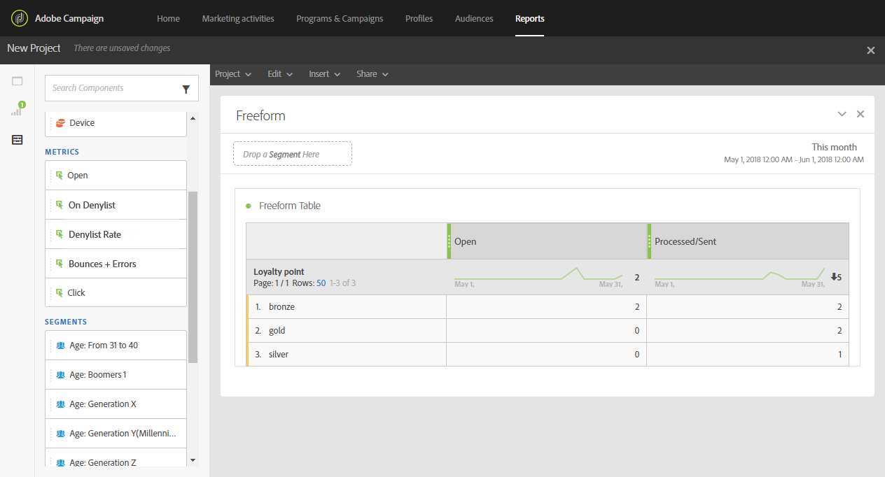

# カスタムプロファイルディメンションの作成{#creating-a-custom-profile-dimension}

レポートは、プロファイルカスタムリソース拡張機能で作成したカスタムプロファイルデータに基づいて作成および管理することもできます。

この例では、カスタムプロファイルフィールド **ロイヤルティプログラム** を作成します。これは、金、銀、銅の 3 つのレベルに分割されます。 その後、このカスタムプロファイルは拡張され、動的レポートのカスタムプロファイルディメンションとして使用できるようになります。

* [手順 1：新しいプロファイルフィールドの作成](#step-1--create-a-new-profile-field)
* [手順 2：プロファイルフィールドを使用した送信ログの拡張](#step-2--extend-the-sending-logs-with-the-profile-field)
* [手順 3：ロイヤルティプログラムに登録した受信者をターゲティングする配信を作成する](#step-3--create-a-delivery-targeting-recipients-enrolled-in-the-loyalty-program)
* [手順 4：カスタムプロファイルディメンションを使用して受信者をフィルタリングするための動的レポートの作成](#step-4--create-a-dynamic-report-to-filter-recipients-with-the-custom-profile-dimension)

## 手順 1：新しいプロファイルフィールドの作成 {#step-1--create-a-new-profile-field}

まず、受信者にロイヤルティレベル（ゴールド、シルバー、ブロンズ **を割り当てる新しいプロファイルフィールド** ロイヤルティプログラム）を作成する必要があります。

>[!NOTE]
>
>カスタムリソースは、管理者のみが管理できます。

それには、次の手順に従います。

1. 詳細メニューで、**[!UICONTROL Administration]** > **[!UICONTROL Development]** > **[!UICONTROL Custom resources]** を選択し、**[!UICONTROL Profile (profile)]** カスタムリソースを選択します。

   

1. 「**[!UICONTROL Data structure]**」タブの「**[!UICONTROL Fields]**」カテゴリで、「**[!UICONTROL Add field]**」ボタンをクリックします。

   

1. **[!UICONTROL Label]**、**[!UICONTROL ID]** を入力し、カスタムリソース **[!UICONTROL Type]** を選択します。 ここでは、受信者がゴールド、シルバー、ブロンズから選択できるので、**[!UICONTROL Text]** を選択しました。

   

1.  アイコンをクリックして、フィールドを定義します。

   

1. ここでは、**[!UICONTROL Specify a list of authorized valued]** をチェックして許可された値を指定し、**[!UICONTROL Create element]** をクリックして各値を作成する必要があります。

   

1. **[!UICONTROL Label]** を入力 **[!UICONTROL Value]**、「**[!UICONTROL Add]**」をクリックします。 この例では、値 gold、silver、bronze を作成する必要があります。 終了したら「**[!UICONTROL Confirm]**」をクリックします。

   

1. 「**[!UICONTROL Screen definition]**」タブを選択します。**[!UICONTROL Detail screen configuration]** ドロップダウンで、「」セクション **[!UICONTROL Add personalized fields]** チェックして、プロファイルに新しいセクションを作成します。

   

1. 「**[!UICONTROL Add an element]**」ボタンをクリックして、新しいセクションを作成します。 **[!UICONTROL Input field]**、**[!UICONTROL Value]**、**[!UICONTROL List]** のい **[!UICONTROL Type]** れかのフィールドを選択した後、この新しいセクションに追加するフィールドを選択します。

   

1. また、フィールド **[!UICONTROL Customize the title of the section where the fields will be displayed]** でセクションにタイトルを追加することもできます。

   設定が完了したら、「**[!UICONTROL Save]**」をクリックします。

   

1. 詳細メニューから、**[!UICONTROL Administration]** / **[!UICONTROL Development]** / **[!UICONTROL Publication]** を選択して、カスタムリソースの公開を開始します。
1. 「」をクリック **[!UICONTROL Prepare publication]**、準備が完了したら「**[!UICONTROL Publish]**」ボタンをクリックします。

   

これで、受信者が新しいプロファイルフィールドを使用して選択する準備が整いました。

## 手順 2：プロファイルフィールドを使用した送信ログの拡張 {#step-2--extend-the-sending-logs-with-the-profile-field}

プロファイルフィールドを作成したので、次は、プロファイルフィールドで送信ログを拡張して、関連するカスタムプロファイルディメンションを動的レポートに作成する必要があります。

プロファイルフィールドを使用してログを拡張する前に、PII ウィンドウが「**[!UICONTROL Sending logs extension]**」タブへのアクセス権を持つことを確認します。 詳しくは、この[ページ](../../reporting/using/about-dynamic-reports.md#dynamic-reporting-usage-agreement)を参照してください。

>[!NOTE]
>
>ログは、管理者によるプロファイルフィールドでのみ拡張できます。

1. 詳細メニューで、**[!UICONTROL Administration]** > **[!UICONTROL Development]** > **[!UICONTROL Custom resources]** を選択し、**[!UICONTROL Profile (profile)]** カスタムリソースを選択します。
1. **[!UICONTROL Sending logs extension]** ドロップダウンを開きます。
1. 「**[!UICONTROL Create element]**」ボタンをクリックします。

   

1. 以前に作成したフィールドを選択し、「**[!UICONTROL Confirm]**」をクリックします。
1. カスタムプロファイルディメンションを作成する **[!UICONTROL Add this field in Dynamic reporting as a new dimension]** 合は、「」をオンにします。

   

   このオプションは、PII ウィンドウが承認された場合にのみ使用できます。 詳しくは、この[ページ](../../reporting/using/about-dynamic-reports.md#dynamic-reporting-usage-agreement)を参照してください。

1. 「」 **[!UICONTROL Add]** クリックして、カスタムリソースを保存します。
1. カスタムリソースは変更されたので、新しい変更を実装するには公開する必要があります。

   詳細メニューから、**[!UICONTROL Administration]** / **[!UICONTROL Development]** / **[!UICONTROL Publication]** を選択して、カスタムリソースの公開を開始します。

1. 「」をクリック **[!UICONTROL Prepare publication]**、準備が完了したら「**[!UICONTROL Publish]**」ボタンをクリックします。

   

カスタムプロファイルは、レポートのカスタムプロファイルディメンションとして使用できるようになりました。

フィールドが作成され、このプロファイルフィールドで送信ログが拡張されたので、配信での受信者のターゲティングを開始できます。

## 手順 3：ロイヤルティプログラムに登録した受信者をターゲティングする配信を作成する {#step-3--create-a-delivery-targeting-recipients-enrolled-in-the-loyalty-program}

プロファイルフィールドが公開されたら、配信を開始できます。 この例では、ロイヤルティプログラムに登録したすべての受信者をターゲットにします。

1. 「**[!UICONTROL Marketing activities]**」タブで「**[!UICONTROL Create]**」をクリックし、「**[!UICONTROL Email]**」を選択します。
1. **[!UICONTROL Email type]** を選択し、メールのプロパティを入力します。
1. ロイヤルティプログラムに登録されている受信者をターゲットにするには、**[!UICONTROL Profiles (attributes)]** アクティビティをドラッグ&amp;ドロップします。
1. 以前に作成したフィールドを **[!UICONTROL Field]** ドロップダウンから選択します。

   

1. **[!UICONTROL Filter conditions]** を選択します。 ここでは、3 つのロイヤルティプログラムのレベルのいずれかに属する受信者をターゲットにします。

   

1. 「」をクリック **[!UICONTROL Confirm]**、フィルタリングが完了したら「**[!UICONTROL Next]**」をクリックします。
1. メッセージの内容、送信者名、件名を定義してパーソナライズします。 メール作成について詳しくは、この [&#x200B; ページ &#x200B;](../../designing/using/designing-content-in-adobe-campaign.md) を参照してください。

   次に、「**[!UICONTROL Create]**」をクリックします。

1. 準備が整ったら、メッセージをプレビューして送信できます。 メッセージの準備および送信方法について詳しくは、この [&#x200B; ページ &#x200B;](../../sending/using/preparing-the-send.md) を参照してください。

選択した受信者にメールを正しく送信したら、データのフィルタリングを開始し、レポートを使用して配信の成功を追跡できます。

## 手順 4：カスタムプロファイルディメンションを使用して受信者をフィルタリングするための動的レポートの作成 {#step-4--create-a-dynamic-report-to-filter-recipients-with-the-custom-profile-dimension}

配信を送信したら、**[!UICONTROL Profile]** のテーブルのカスタムプロファイルディメンションを使用してレポートを分類できます。

1. 「**[!UICONTROL Reports]**」タブから、標準提供のレポートを選択するか、「**[!UICONTROL Create]**」ボタンをクリックして最初から作成します。

   

1. **[!UICONTROL Dimensions]** カテゴリで、「」をクリック **[!UICONTROL Profile]**、カスタム **ロイヤルティプログラム** プロファイルディメンションをフリーフォームテーブルにドラッグ&amp;ドロップします。

   

1. **[!UICONTROL Processed/Sent]** と **[!UICONTROL Open]** の指標をドラッグ&amp;ドロップして、データのフィルタリングを開始します。

   

1. 必要に応じて、ビジュアライゼーションをワークスペースにドラッグ&amp;ドロップします。

   

**関連トピック：**

* [&#x200B; カスタムプロファイルデータを使用した洞察に満ちたレポートの作成 &#x200B;](https://helpx.adobe.com/campaign/kb/simplify-campaign-management.html#Reportandshareinsightswithallstakeholders)
