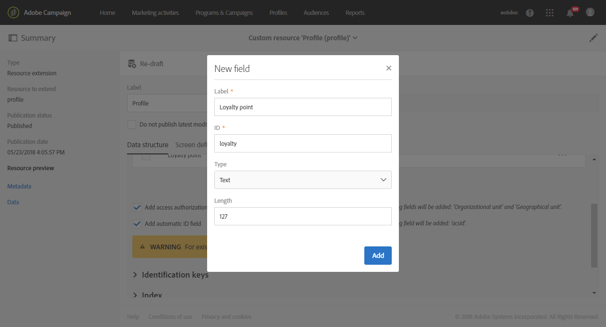

# カスタムプロファイルディメンションの作成{#creating-a-custom-profile-dimension}

また、カスタムプロファイルのカスタム拡張機能で作成されたカスタムプロファイルデータに基づいて作成および管理することもできます。

この例では、次の3つのレベルに分けるカスタムプロファイルフィールド **の忠誠プログラム** を作成します。ゴールド、シルバー、ブロンズこのカスタムプロファイルは、動的レポートのカスタムプロファイルディメンションとして使用できるように拡張されます。

* [手順1:新しいプロファイルフィールドの作成](../../reporting/using/creating-a-custom-profile-dimension.md#step-1--create-a-new-profile-field)
* [手順2:プロファイルフィールドを使用した送信ログの拡張](../../reporting/using/creating-a-custom-profile-dimension.md#step-2--extend-the-sending-logs-with-the-profile-field)
* [手順3:ロイヤルティプログラムに登録されている配信ターゲット受信者の作成](../../reporting/using/creating-a-custom-profile-dimension.md#step-3--create-a-delivery-targeting-recipients-enrolled-in-the-loyalty-program)
* [手順4:カスタムプロファイルディメンションを使用して受信者をフィルターする動的レポートを作成します](../../reporting/using/creating-a-custom-profile-dimension.md#step-4--create-a-dynamic-report-to-filter-recipients-with-the-custom-profile-dimension)

## 手順1:新しいプロファイルフィールドの作成 {#step-1--create-a-new-profile-field}

まず、受信者に忠誠度レベルを割り当てる新しいプロファイルフィールド **の忠誠プログラム** を作成する必要があります。ゴールド、シルバー、ブロンズ

>[!NOTE]
>
>カスタムリソースは管理者のみが管理できます。

そのためには、次の手順を実行します。

1. 詳細メニューから **[!UICONTROL Administration]** 、/ **[!UICONTROL Development]** / **[!UICONTROL Custom resources]****[!UICONTROL Profile (profile)]** カスタムリソースを選択します。

   

1. **[!UICONTROL Data structure]** タブの **[!UICONTROL Fields]** カテゴリで、ボタンを **[!UICONTROL Add field]** クリックします。

   

1. を **[!UICONTROL Label]**&#x200B;入力し、 **[!UICONTROL ID]** カスタムリソースを選択 **[!UICONTROL Type]**&#x200B;します。ここでは **[!UICONTROL Text]** 、受信者はゴールド、シルバー、ブロンズの選択肢を選ぶことができます。

   

1.  アイコンをクリックして、フィールドを定義します。

   

1. ここで、をクリック **[!UICONTROL Specify a list of authorized valued]** して各値を作成して、認証された値を指定する必要があり **[!UICONTROL Create element]**&#x200B;ます。

   

1. を **[!UICONTROL Label]** クリックして **[!UICONTROL Value]** 、をクリック **[!UICONTROL Add]**&#x200B;します。この例では、ゴールド、シルバー、ブロンズの値を作成する必要があります。終了したらクリック **[!UICONTROL Confirm]** します。

   

1. **[!UICONTROL Screen definition]** タブを選択します。**[!UICONTROL Detail screen configuration]** ドロップダウンで **[!UICONTROL Add personalized fields]** 、プロファイルに新しいセクションを作成します。

   

1. ボタンを **[!UICONTROL Add an element]** クリックして、新しいセクションを作成します。次のいずれかを選択 **[!UICONTROL Type]**&#x200B;します。 **[!UICONTROL Input field]**&#x200B;また **[!UICONTROL Value]** は **[!UICONTROL List]**、この新しいセクションに追加するフィールドを指定します。

   

1. フィールド内のセクションにタイトルを追加 **[!UICONTROL Customize the title of the section where the fields will be displayed]**&#x200B;することもできます。

   設定が完了したら、をクリック **[!UICONTROL Save]** します。

   

1. 詳細メニューから **[!UICONTROL Administration]** 、/ **[!UICONTROL Development]** &gt; **[!UICONTROL Publication]** を選択してカスタムリソースの公開を開始します。
1. 「準備」をクリック **[!UICONTROL Prepare publication]** したら、ボタンを **[!UICONTROL Publish]** クリックします。

   

新しいプロファイルフィールドを受信者によって使用および選択できるようになりました。

## 手順2:プロファイルフィールドを使用した送信ログの拡張 {#step-2--extend-the-sending-logs-with-the-profile-field}

プロファイルフィールドが作成されたら、プロファイルフィールドと共に送信ログを拡張して、動的レポートに関連付けられたカスタムプロファイルディメンションを作成する必要があります。

プロファイルフィールドでログを拡張する前に、PIIウィンドウがタブに **[!UICONTROL Sending logs extension]** アクセスできることを確認してください。詳しくは、 [このページ](../../reporting/using/about-dynamic-reports.md#dynamic-reporting-usage-agreement)を参照してください。

>[!NOTE]
>
>ログは、管理者がプロファイルフィールドを使用してのみ拡張できます。

1. 詳細メニューから **[!UICONTROL Administration]** 、/ **[!UICONTROL Development]** / **[!UICONTROL Custom resources]****[!UICONTROL Profile (profile)]** カスタムリソースを選択します。
1. **[!UICONTROL Sending logs extension]** ドロップダウンを開きます。
1. ボタンを **[!UICONTROL Create element]** クリックします。

   

1. 以前に作成したフィールドを選択し、をクリック **[!UICONTROL Confirm]**&#x200B;します。
1. カスタムプロファイルディメンションを作成 **[!UICONTROL Add this field in Dynamic reporting as a new dimension]** します。

   

   このオプションは、PIIウィンドウが受け入れられた場合にのみ使用できます。詳しくは、 [このページ](../../reporting/using/about-dynamic-reports.md#dynamic-reporting-usage-agreement)を参照してください。

1. カスタムリソースを保存 **[!UICONTROL Add]** します。
1. カスタムリソースは変更されたので、新しい変更を実装するには公開する必要があります。

   詳細メニューから **[!UICONTROL Administration]** 、/ **[!UICONTROL Development]** &gt; **[!UICONTROL Publication]** を選択してカスタムリソースの公開を開始します。

1. 「準備」をクリック **[!UICONTROL Prepare publication]** したら、ボタンを **[!UICONTROL Publish]** クリックします。

   

カスタムプロファイルがレポート内のカスタムプロファイルディメンションとして使用できるようになりました。

これで、フィールドが作成され、ログの送信がこのプロファイルフィールドによって拡張されたので、配信中にターゲットを設定することができます。

## 手順3:ロイヤルティプログラムに登録されている配信ターゲット受信者の作成 {#step-3--create-a-delivery-targeting-recipients-enrolled-in-the-loyalty-program}

プロファイルフィールドが公開されたら、配信を開始できます。この例では、ロイヤルティプログラムに登録されているすべての受信者をターゲットにします。

1. **[!UICONTROL Marketing activities]** タブから、をクリック **[!UICONTROL Create]****[!UICONTROL Email]**&#x200B;します。
1. 次に **[!UICONTROL Email type]** 、電子メールのプロパティを入力します。
1. ロイヤルティプログラムに登録されている受信者をターゲットにするには、アクティビティを **[!UICONTROL Profiles (attributes)]** ドラッグ&amp;ドロップします。
1. **[!UICONTROL Field]** ドロップダウンから前に作成したフィールドを選択します。

   

1. を選択 **[!UICONTROL Filter conditions]**&#x200B;します。ここでは、3つの忠誠プログラムのレベルの一部である受信者をターゲットにします。

   

1. をクリック **[!UICONTROL Confirm]** し、フィルターを実行したら、をクリック **[!UICONTROL Next]**&#x200B;します。
1. メッセージコンテンツ、送信者名および件名を定義してパーソナライズします。電子メールの作成について詳しくは、 [このページ](../../designing/using/about-email-content-design.md#about-the-email-designer)を参照してください。

   次に、をクリック **[!UICONTROL Create]**&#x200B;します。

1. 準備ができたら、メッセージをプレビューして送信できます。メッセージの準備および送信方法について詳しくは、この [ページ](../../sending/using/preparing-the-send.md)を参照してください。

選択した受信者に電子メールが正しく送信されると、データのフィルタを開始し、レポートで配信の成功を追跡できます。

## 手順4:カスタムプロファイルディメンションを使用して受信者をフィルターする動的レポートを作成します {#step-4--create-a-dynamic-report-to-filter-recipients-with-the-custom-profile-dimension}

配信を送信した後、表から **[!UICONTROL Profile]** カスタムプロファイルディメンションを使用してレポートを分類できます。

1. タブから **[!UICONTROL Reports]** 、すぐに使用できるレポートを選択するか、ボタンを **[!UICONTROL Create]** クリックして最初から開始します。

   

1. **[!UICONTROL Dimensions]** カテゴリで、 **[!UICONTROL Profile]** カスタム **ロイヤルティプログラム** プロファイルディメンションをクリックしてフリーフォームテーブルにドロップ&amp;ドロップします。

   

1. データのフィルタを開始 **[!UICONTROL Processed/Sent]** するには、および **[!UICONTROL Open]** 指標をドラッグ&amp;ドロップします。

   

1. 必要に応じてワークスペースにビジュアライゼーションをドラッグ&amp;ドロップします。

   

**関連トピック:**

* [カスタムプロファイルデータを使用した洞察力のあるレポートの作成](https://helpx.adobe.com/campaign/kb/simplify-campaign-management.html#Reportandshareinsightswithallstakeholders)
