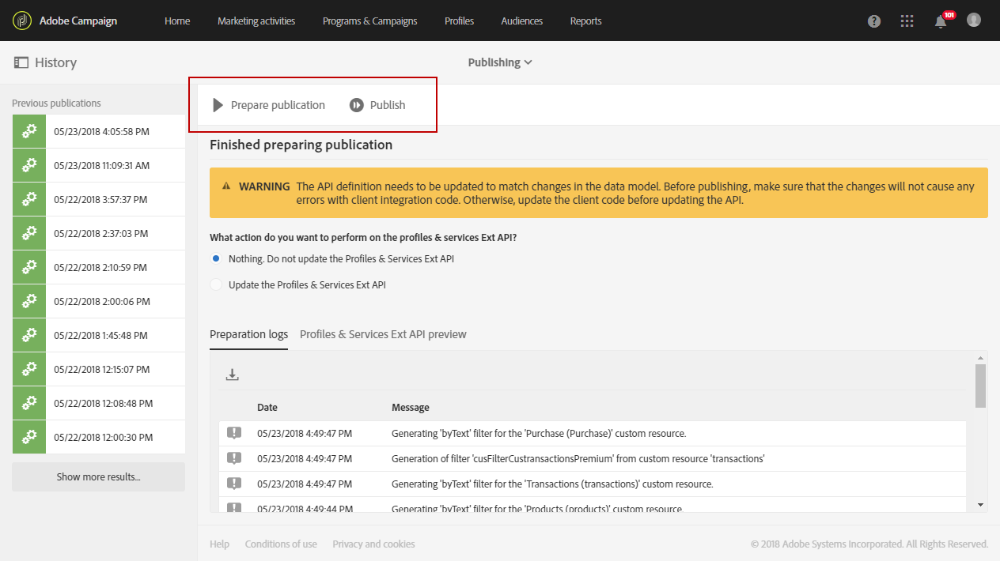
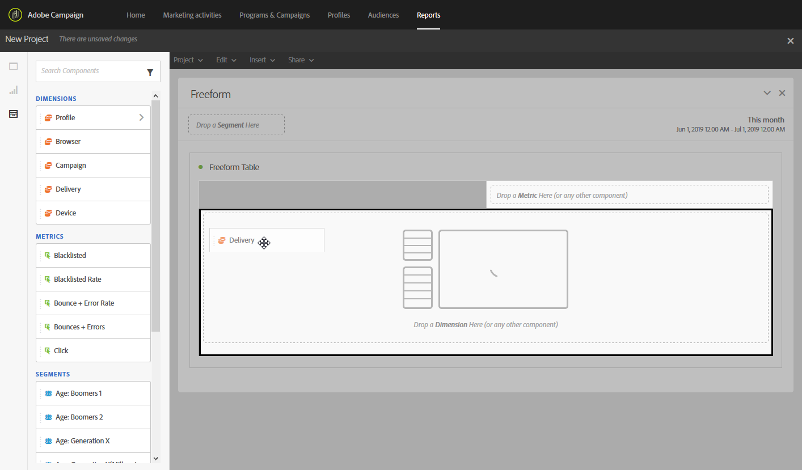

# ワークフローセグメントに基づくレポートの作成{#creating-a-report-workflow-segment}

>[!CAUTION]
> **[!UICONTROL Segment code]**&#x200B;は、電子メールとSMS配信のみをターゲットにできます。

ワークフローを作成し、異なるターゲットオーディエンスに母集団をフィルタリングしたら、このターゲティングワークフローで定義されたセグメントに基づいてマーケティングキャンペーンの効率を測定できます。
レポートでこれらのセグメントをターゲットにするには：

* [手順1：セグメントを使用したプロファイルのカスタムリソースの更新](#step-1--update-profiles-custom-resource-segments)
* [ステップ 2：セグメントを含むワークフローの作成](#step-2--create-a-workflow-segments)
* [手順3：動的レポートを作成してセグメントをフィルタリングする](#step-3--create-a-dynamic-report-filter-segments)

>[!CAUTION]
>これらのデータの収集を開始するには、Dynamic Reporting使用許諾契約書に同意する必要があります。
>
>この契約書について詳しくは、この[&#x200B; ページ &#x200B;](../../reporting/using/about-dynamic-reports.md#dynamic-reporting-usage-agreement)を参照してください。

## 手順1：セグメントを使用したプロファイルのカスタムリソースの更新{#step-1--update-profiles-custom-resource-segments}

セグメントコードをレポートする前に、セグメントコードを保存するために&#x200B;**[!UICONTROL Profiles]** カスタムリソースを更新する必要があります。

1. 詳細設定メニューから、Adobe Campaign ロゴを使用して、**[!UICONTROL Administration]** > **[!UICONTROL Development]** > **[!UICONTROL Custom resources]**&#x200B;を選択し、**[!UICONTROL Profile (profile)]** リソースを選択します。
1. **[!UICONTROL Data structure]** タブの&#x200B;**[!UICONTROL Sending logs extension]** メニューで、**[!UICONTROL Add segment code]**&#x200B;をチェックして、ターゲティングワークフローからセグメントコードを保存し、動的レポートに送信します。

   **[!UICONTROL Segment code]**&#x200B;は、レポートの&#x200B;**[!UICONTROL Profile]** ディメンション セクションで利用できます。

   

1. カスタムリソースを保存します。

1. 次に、カスタムリソースを公開する必要があります。
詳細設定メニューから、**[!UICONTROL Administration]** > **[!UICONTROL Development]** > **[!UICONTROL Publishing]**&#x200B;を選択します。

   

1. 「**[!UICONTROL Prepare publication]**」をクリックし、準備が完了したら、「**[!UICONTROL Publish]**」ボタンをクリックします。 カスタムリソースについて詳しくは、この[&#x200B; ページ &#x200B;](../../developing/using/updating-the-database-structure.md)を参照してください。

セグメントコードを使用してワークフローの作成を開始できるようになりました。

セグメントコードは、**[!UICONTROL Sending logs extension]**&#x200B;でセグメントコードを有効にするとすぐに収集されます。

## ステップ 2：セグメントを含むワークフローの作成 {#step-2--create-a-workflow-segments}

>[!NOTE]
>メール配信の入力トランジションが空の場合、前のトランジションのセグメントコードがデフォルトで追加されます。

まず、異なるターゲット母集団を持つワークフローを作成する必要があります。 ここでは、オーディエンスの年齢に応じてパーソナライズされた電子メールを送信したいと考えています。1つは20～30歳のプロファイル用で、もう1つは30～40歳のプロファイル用です。

1. ワークフローの構築。 ワークフローの作成方法について詳しくは、この[&#x200B; ページ &#x200B;](../../automating/using/building-a-workflow.md)を参照してください。

1. パレットからアクティビティをドラッグしてワークスペースにドロップし、**[!UICONTROL Query]** アクティビティを追加します。

1. 20歳から40歳のプロファイルをターゲットにし、後でよりターゲットを絞った母集団にセグメント化します。

   

1. クエリの結果を2つのターゲット母集団に分割する&#x200B;**[!UICONTROL Segmentation]** アクティビティを追加します。 セグメント化について詳しくは、この[&#x200B; ページ &#x200B;](../../automating/using/segmentation.md)を参照してください。

1. **[!UICONTROL Segmentation]** アクティビティをダブルクリックして設定します。 **[!UICONTROL Edit properties]**&#x200B;をクリックして、最初のセグメントを編集します。

   

1. 20 ～ 30歳のプロファイルをクエリし、完了したら&#x200B;**[!UICONTROL Confirm]**&#x200B;をクリックします。

   

1. 「**[!UICONTROL Add an element]**」をクリックして2番目のセグメントを作成し、上記の手順で説明されているように設定して、30～40歳のプロファイルをターゲットにします。

1. 動的レポートを通じて渡される各母集団の&#x200B;**[!UICONTROL Segment code]**&#x200B;を編集します。

   >[!NOTE]
   >このステップは必須です。そうしないと、レポートを作成するセグメントを把握できません。

   

1. セグメントの後に&#x200B;**[!UICONTROL Email delivery]** アクティビティをドラッグ&amp;ドロップします。

   

1. ターゲットとなる母集団に応じて、配信をパーソナライズします。 メール作成について詳しくは、この[&#x200B; ページ &#x200B;](../../designing/using/designing-content-in-adobe-campaign.md)を参照してください。

1. ワークフローを保存します。

1. ワークフローの準備ができたら、**[!UICONTROL Start]**&#x200B;をクリックします。

セグメントコードを追跡するためのレポートにアクセスできるようになりました。

## 手順3：動的レポートを作成してセグメントをフィルタリングする {#step-3--create-a-dynamic-report-filter-segments}

ワークフローで配信を送信した後、ワークフローのセグメントコードを使用してレポートを分類できます。

1. **[!UICONTROL Reports]** タブから、すぐに使用できるレポートを選択するか、**[!UICONTROL Create new project]** ボタンをクリックして最初から開始します。

   
1. **[!UICONTROL Delivery]** ディメンションをフリーフォームテーブルにドラッグ&amp;ドロップします。

   

1. **[!UICONTROL Open]**&#x200B;および&#x200B;**[!UICONTROL Click]**&#x200B;指標など、様々な指標をテーブルにドラッグ&amp;ドロップして、データのフィルタリングを開始します。
1. **[!UICONTROL Dimensions]** カテゴリで、**[!UICONTROL Profile]** ディメンションをクリックし、ワークフローの配信に&#x200B;**[!UICONTROL Segment code]** ディメンションをドラッグ&amp;ドロップして、ターゲット母集団に応じてメール配信の成功を測定します。

   

1. 必要に応じて、ワークスペースにビジュアライゼーションをドラッグ＆ドロップします。

   
