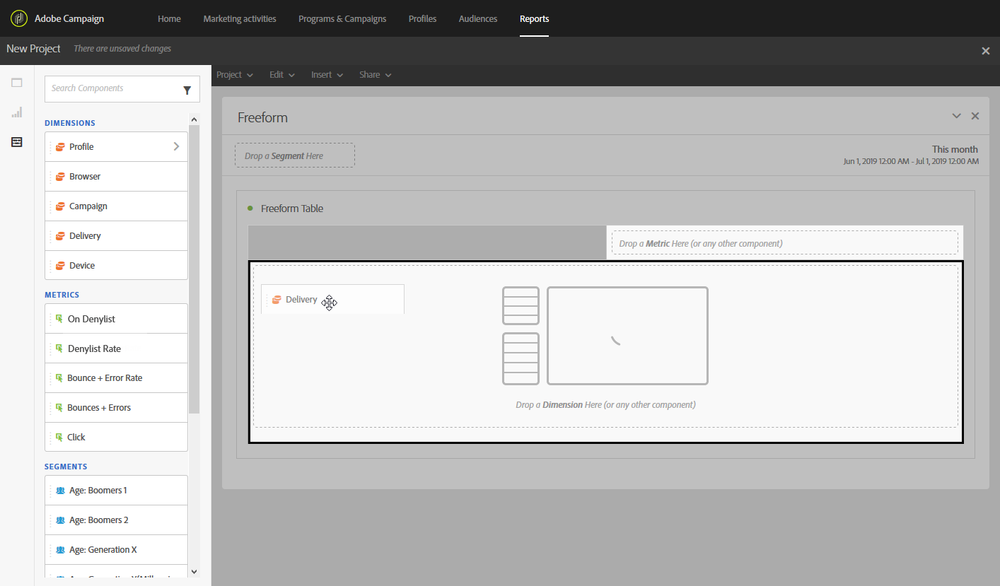

# Creating a report based on workflow segments{#creating-a-report-workflow-segment}

ワークフローを作成し、訪問者を別のターゲットオーディエンスにフィルターすると、このターゲティングワークフローで定義されているセグメントに基づいてマーケティングキャンペーンの効率を測定できます。
レポートでこれらのセグメントをターゲットにするには:

* [手順1:プロファイルを使用したプロファイルカスタムリソースの更新](#step-1--update-profiles-custom-resource-segments)
* [手順2:セグメントを使用したワークフローの作成](#step-2--create-a-workflow-segments)
* [手順3:セグメントをフィルターする動的レポートの作成](#step-3--create-a-dynamic-report-filter-segments)

>[!CAUTION]
>これらのデータの収集を開始するには、動的レポート使用規約を受け入れる必要があります。
>For more on this agreement, refer to this [page](../../reporting/using/about-dynamic-reports.md#dynamic-reporting-usage-agreement).

## Step 1: Update Profiles custom resource with segments{#step-1--update-profiles-custom-resource-segments}

Before reporting on your segment code, you need to update your **[!UICONTROL Profiles]** custom resource for your segment codes to be stored.

1. From the advanced menu, via the Adobe Campaign logo, select **[!UICONTROL Administration]** &gt; **[!UICONTROL Development]** &gt; **[!UICONTROL Custom resources]**, then select the **[!UICONTROL Profile (profile)]** resource.
1. In the **[!UICONTROL Sending logs extension]** menu from the **[!UICONTROL Data structure]** tab, check **[!UICONTROL Add segment code]** to allow storage of your segment codes from targeting workflows and to send it to dynamic reporting.

   The **[!UICONTROL Segment code]** will then be available in the **[!UICONTROL Profile]** dimension section of your report.

   

1. カスタムリソースを保存します。

1. これで、カスタムリソースを公開する必要があります。
From the advanced menu, select **[!UICONTROL Administration]** &gt; **[!UICONTROL Development]** &gt; **[!UICONTROL Publishing]**.

   

1. Click **[!UICONTROL Prepare publication]** then when the preparation is done, click the **[!UICONTROL Publish]** button. For more information on custom resource, refer to this [page](../../developing/using/updating-the-database-structure.md).

セグメントコードを使用してワークフローを作成できるようになりました。

Note that segment codes will be collected as soon as you enable the segment code in the **[!UICONTROL Sending logs extension]**.

## Step 2: Create a workflow with segments {#step-2--create-a-workflow-segments}

>[!NOTE]
>電子メール配信の入力トランジションが空の場合、以前の移行のセグメントコードがデフォルトで追加されます。

まず、ターゲット母集団ごとにワークフローを作成する必要があります。ここでは、オーディエンスの年齢に応じてパーソナライズされる電子メールを送信します。20~30歳のプロファイルと、30~40才のプロファイルに別の配信を提供します。

1. ワークフローを作成します。For more details on how to create your workflow, refer to this [page](../../automating/using/building-a-workflow.md).

1. **[!UICONTROL Query]** アクティビティを追加するには、パレットからドラッグしてワークスペースにドロップします。

1. ターゲットプロファイルを20から40才で、よりターゲット化された訪問者数にセグメント化します。

   

1. **[!UICONTROL Segmentation]** アクティビティを追加して、クエリ結果をターゲットの2人の訪問者に分割します。For more on segmentation, refer to this [page](../../automating/using/targeting-data.md#segmenting-data).

1. Double click the **[!UICONTROL Segmentation]** activity to configure it. Edit the first segment by clicking **[!UICONTROL Edit properties]**.

   

1. Query profiles between the age of 20 to 30 and click **[!UICONTROL Confirm]** when done.

   

1. Click **[!UICONTROL Add an element]** to create your second segment and configure it as described in the steps above to target profiles between the age of 30 to 40.

1. Edit the **[!UICONTROL Segment code]** for each population to be passed on through dynamic reporting.

   >[!NOTE]
   >この手順は必須です。また、レポートするセグメントを理解することはできません。

   

1. Drag and drop an **[!UICONTROL Email delivery]** activity after your segments.

   

1. ターゲット母集団に応じて配信をパーソナライズします。For more on email creation, refer to this [page](../../designing/using/about-email-content-design.md).

1. ワークフローを保存します。

1. Click **[!UICONTROL Start]** when your workflow is ready.

レポートにアクセスして、セグメントコードを追跡できるようになりました。

## Step 3: Create a dynamic report to filter segments {#step-3--create-a-dynamic-report-filter-segments}

ワークフローで配信を送信した後、ワークフローのセグメントコードを使用してレポートを分類できます。

1. From the **[!UICONTROL Reports]** tab, select an out-of-the-box report or click the **[!UICONTROL Create new project]** button to start one from scratch.

   
1. Drag and drop the **[!UICONTROL Delivery]** dimension to your freeform table.

   

1. Drag and drop different metrics to your table such as the **[!UICONTROL Open]** and **[!UICONTROL Click]** metrics to start filtering your data.
1. **[!UICONTROL Dimensions]** カテゴリでディメンションを **[!UICONTROL Profile]** クリックし、ワークフローの配信に **[!UICONTROL Segment code]** ディメンションをドラッグ&amp;ドロップして、ターゲット母集団に応じて電子メール配信の成功を測定します。

   

1. 必要に応じてワークスペースにビジュアライゼーションをドラッグ&amp;ドロップします。

   
