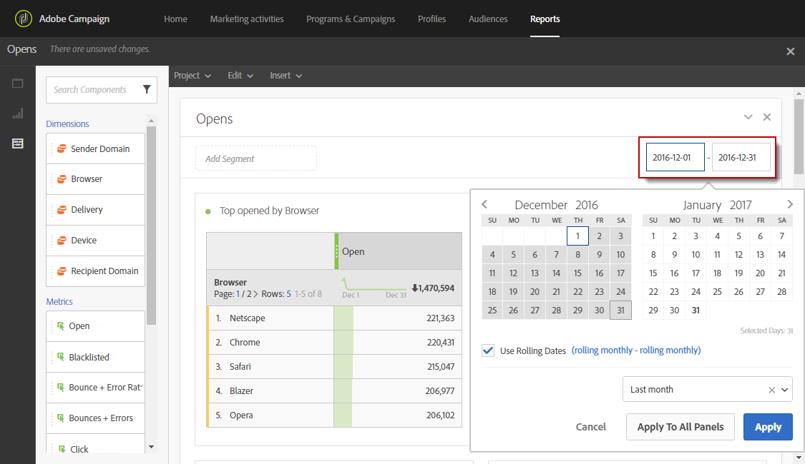

# レポート期間の定義{#defining-the-report-period}

>[!NOTE]
>
>データレポートは、過去3年間のみ利用できます。 データ保持期間について詳しくは、アドビコンサルタントまたは技術管理者にお問い合わせください。

レポートを開始またはレポートにアクセスする前に、期間を適用する必要があります。 指定された期間はレポートの右上に表示されます。

デフォルトでは、キャンペーンまたはプログラムの場合、フィルター期間はプログラムまたはキャンペーンの開始日と終了日に設定されます。 配信の場合、開始日は送信日に、終了日は送信日に 7日を加えた日付になります。

フィルターを変更するには、開始日と期間を選択するか、または事前に設定された期間（先週、2 か月前など）を使用します。

フィルターを適用または変更すると、レポートが自動的に更新されます。 選択したレポート期間によって管理されるのは、その期間内に作成された配信のデータセット全体ではなく、その期間内に発生したイベントです。例えば、配信が 1月1日から 5日まで行われ、レポート期間が 1月1日から 2日までの場合、部分的なデータが表示されることがあります。 開封やクリックは、配信から 1 か月後でも発生する可能性があるため、選択した期間が開封／クリックの数に影響を与える可能性があります。

