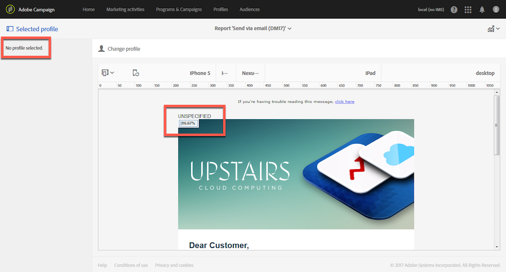
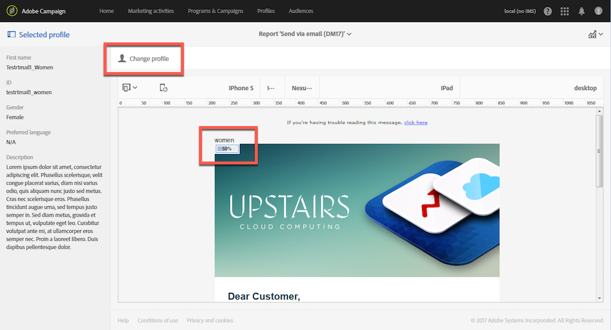

# ホットクリック{#hot-clicks}

このレポートは、各配信またはトランザクションメッセージの **[!UICONTROL Reports]** ボタンからアクセスできます。

メッセージの内容（HTMLやテキスト）と、各リンクのクリックの割合が表示されます。

配信用に動的コンテンツを作成した場合は、定義した条件ごとに割合を表示できます。 配信への条件付きコンテンツの挿入について詳しくは、「動的コンテンツの [定義](../../designing/using/personalization.md#defining-dynamic-content-in-an-email)」を参照してください。

例えば、次の条件を持つ配信を作成したとします。

* 受信者が男性か女性の場合、主画像のリンクは異なります。
* また、25を超える受信者にのみ表示される特殊オファーへのリンクも追加しました。

メッセージが送信されたら、配信ダッシュボード **[!UICONTROL Reports]** から/ **[!UICONTROL Hot clicks]** を選択します。

デフォルトでは、プロファイルは選択されていません。 性別が不明な受信者、および25歳未満の受信者または年齢が不明なユーザーのクリックのみが表示されます。

女性のクリック数を表示するには、 **[!UICONTROL Change profile]** ボタンをクリックし、女性テストプロファイルを選択します。 男性用のクリック数を表示するには、同様に進み、男性のテストプロファイルを選択します。

25を超える受信者のクリック数を表示するには、 **[!UICONTROL Change profile]** ボタンをクリックし、生年月日がこの条件に一致するテストプロファイルを選択します。

テストプロファイルについて詳しくは、「テストプロファイル [について](../../audiences/using/managing-test-profiles.md)」を参照してください。

>[!NOTE]
>
>特定のリンクのクリック数は、配信内のすべての条件付きコンテンツの合計クリック数に対する割合です。 したがって、動的なコンテンツを定義した場合、特定のテストプロファイルに対して表示される割合の合計が100に等しくないことがあります。

同様に、定期的な配信やトランザクションメッセージの場合は、表示する動的コンテンツに対応するテストプロファイルを選択できますが、選択した実行配信に従ってクリック率を表示することもできます。

実行配信は、次の場合に作成される、アクションを実行できない、機能しない技術的なメッセージです。

* 定期的な配信が実行または更新されるたび。

   例えば、この配信を管理するワークフローが月に1回実行される場合、1か月に1回実行配信が発生します。 さらに、配信の内容が更新されるたびに、追加の実行配信が作成されます。

   定期的な電子メール配信について詳しくは、 [電子メール配信](../../automating/using/email-delivery.md)を参照してください。

* デフォルトでは、トランザクションメッセージの場合は月に1回、トランザクションメッセージを編集して再度公開するたびに使用されます。

   トランザクションメッセージについて詳しくは、トランザクションメッセージの使用 [の手引きを参照してください](../../channels/using/getting-started-with-transactional-msg.md)。

>[!NOTE]
>
>追跡されるURLのIDは実行ごとに異なるので、特定のメッセージのすべての実行配信についてホットクリックデータを集計することはできません。 一度に1つの実行配信に対してのみ表示できます。

メッセージが送信されたら、配信ダッシュボード **[!UICONTROL Reports]** から/ **[!UICONTROL Hot clicks]** を選択します。

デフォルトでは、最後の実行配信が選択されます。 別のボタンをクリックし **[!UICONTROL Change execution delivery]** て選択します。

選択した配信実行に対するクリックの割合のみが表示されます。
