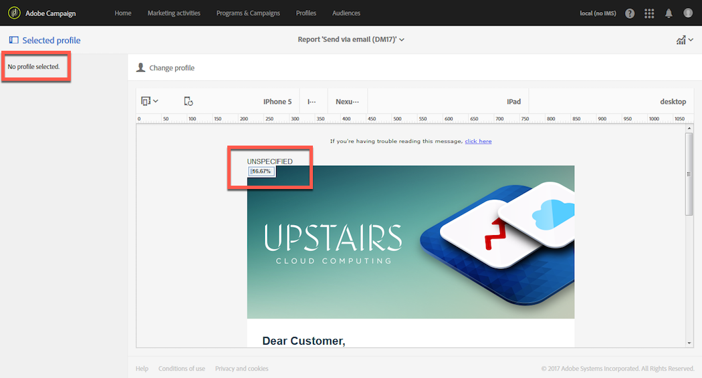
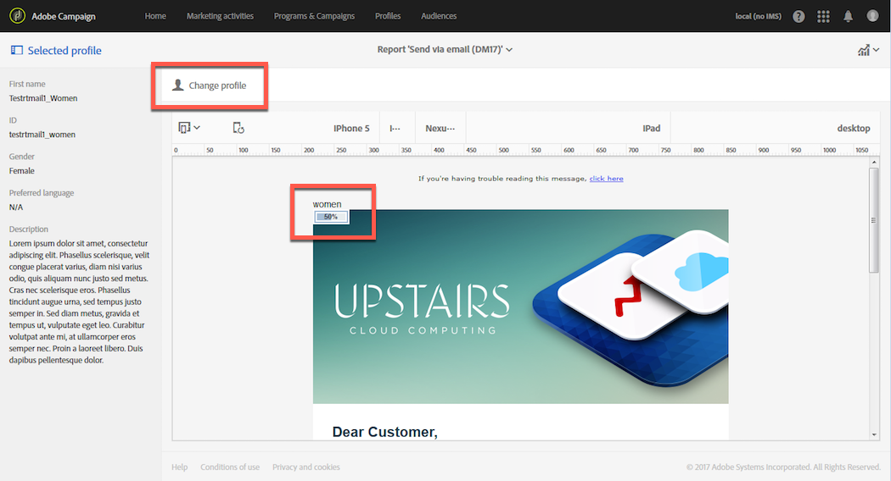

# ホットクリック{#hot-clicks}

>[!IMPORTANT]
>
>「ホットクリック数」レポートには、HTML版の電子メールのみが表示され、テキスト版はサポートされていません。

このレポートには、各配信またはトランザクションメッセージの&#x200B;**[!UICONTROL Reports]** ボタンからアクセスできます。

各リンクのクリック率を含むメッセージのコンテンツが表示されます。

配信の動的コンテンツを作成した場合は、定義した各条件の割合を表示できます。 配信に条件付きコンテンツを挿入する方法について詳しくは、[動的コンテンツの定義](../../designing/using/personalization.md#defining-dynamic-content-in-an-email)を参照してください。

例えば、次の条件で配信を作成したとします。

* メイン画像のリンクは、受信者が男性または女性の場合は異なります。
* また、25歳以上の受信者のみが表示できる特別なオファーへのリンクも追加しました。

メッセージを送信したら、配信ダッシュボードから&#x200B;**[!UICONTROL Reports]** > **[!UICONTROL Hot clicks]**&#x200B;を選択します。

デフォルトでは、プロファイルは選択されていません。 性別が不明な受信者、および25歳未満または年齢が不明な受信者のクリックのみが表示されます。

女性のクリック数を表示するには、**[!UICONTROL Change profile]** ボタンをクリックし、女性のテストプロファイルを選択します。 男性のクリック数を表示するには、同様に進み、男性のテストプロファイルを選択します。

25歳以上の受信者のクリック数を表示するには、**[!UICONTROL Change profile]** ボタンをクリックし、生年月日がこの条件に一致するテストプロファイルを選択します。

テストプロファイルについて詳しくは、[&#x200B; テストプロファイルについて](../../audiences/using/managing-test-profiles.md)を参照してください。

>[!NOTE]
>
>特定のリンクのクリック数は、配信のすべてのコンディショナルコンテンツの合計クリック数に対する割合です。 したがって、動的コンテンツを定義した場合、特定のテストプロファイルに対して表示されるパーセンテージの合計が100にならない場合があります。

同様に、定期的な配信とトランザクションメッセージの場合は、表示する動的コンテンツに対応するテストプロファイルを選択できますが、選択した実行配信に応じてクリック率を表示することもできます。

実行配信は、次の場合に作成される、実用的で機能しないテクニカルメッセージです。

* 定期的な配信が実行または更新されるたびに。

  例えば、この配信を管理するワークフローが月に1回実行される場合、月に1回の実行配信が行われます。 これに加えて、配信の内容が更新されるたびに、追加の実行配信が作成されます。

  定期的なメール配信について詳しくは、[&#x200B; メール配信](../../automating/using/email-delivery.md)を参照してください。

* デフォルトでは、トランザクションメッセージは月に1回、トランザクションメッセージが再度編集および公開されるたびに表示されます。

  トランザクションメッセージについて詳しくは、[&#x200B; トランザクションメッセージの概要](../../channels/using/getting-started-with-transactional-msg.md)を参照してください。

>[!NOTE]
>
>トラッキング対象URLのIDは実行ごとに異なるため、特定のメッセージのすべての実行配信についてホットクリックデータを集計することはできません。 一度に1つの実行配信に対してのみ表示できます。

メッセージを送信したら、配信ダッシュボードから&#x200B;**[!UICONTROL Reports]** > **[!UICONTROL Hot clicks]**&#x200B;を選択します。

デフォルトでは、最後の実行配信が選択されます。 「**[!UICONTROL Change execution delivery]**」ボタンをクリックして、別のボタンを選択します。

選択した配信実行のクリック率のみが表示されます。
