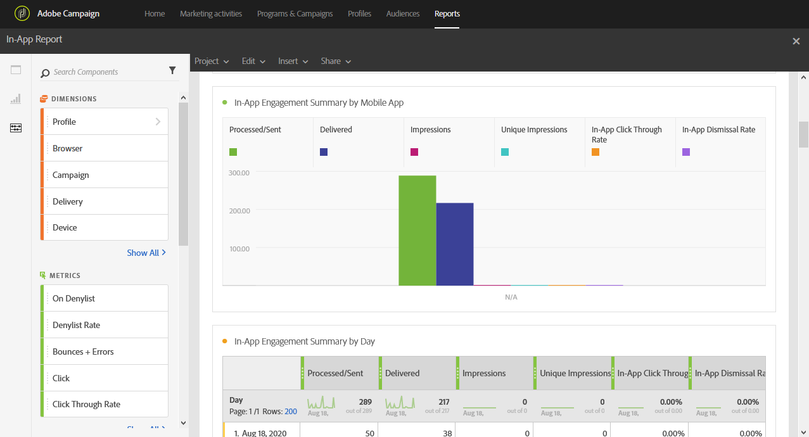

# アプリ内レポート{#in-app-report}

>[!CAUTION]
>
>配信のタイプに応じてデータを分割するには、 **[!UICONTROL Message type]** 指標をテーブルにドラッグ&amp;ドロップする必要があります。この場合、アプリ内配信です。

アプリ **内配信に関する詳細は、アプリ内** レポートに表示されます。

各表は、数値の概要とグラフで表されます。 各ビジュアライゼーション設定での詳細の表示方法を変更できます。

最初の表 **の「アプリ内アクションの概要** 」は、次の3つのカテゴリに分かれます。日別、モバイルアプリ別、配信別 配信に対する受信者の反応性に使用できるデータが含まれます。

* **[!UICONTROL Processed/sent]**:アプリ内配信の送信の合計数です。
* **[!UICONTROL Delivered]**:正常に送信されたアプリ内メッセージの数（送信されたメッセージの合計数に関連）。
* **[!UICONTROL Impressions]**:トリガー条件が満たされたかどうかに応じて、受信者が表示したアプリ内メッセージの合計です。
* **[!UICONTROL Unique impressions]**:受信者別のインプレッション数。
* **[!UICONTROL In-App click through rate]**:メッセージを表示したユーザーと比較して、ボタン1またはボタン2をクリックしたユーザーの割合。
* **[!UICONTROL In-App dismissal rate]**:受信者が却下したアプリ内メッセージの割合。

2つ目の表 **「アプリ内クリック数と却下数** 」は、次の3つのカテゴリに分かれます。日別、モバイルアプリ別、配信別 配信ごとの受信者動作に使用できるデータが含まれます。

* **[!UICONTROL In-App clicks]**:ボタン1またはボタン2をクリックした受信者の合計数です。
* **[!UICONTROL Unique In-App clicks]**:受信者がボタン1またはボタン2をクリックした回数。
* **[!UICONTROL In-App dismissal]**:受信者が閉じるボタンをクリックするか、自動的に閉じたときに閉じたメッセージの合計数です。
* **[!UICONTROL Unique In-App dismissal]**:受信者がアプリ内メッセージを消去した回数です。

