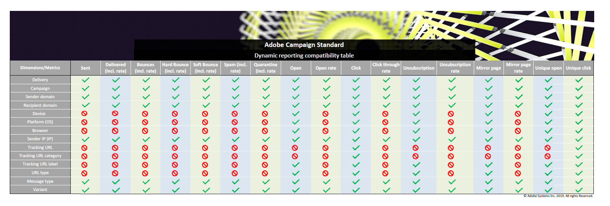

# コンポーネントのリスト {#list-of-components}

ディメンションと指標の互換性について詳しくは、この[表](/help/reporting/using/assets/dynamic_report_compatibility.pdf)を参照してください。 2つのコンポーネントが互換性がない場合、セルには値&#x200B;**None**&#x200B;が表示されます。

## ディメンション {#dimensions}

以下の表は、レポートで使用されるディメンションとその定義を示したものです。

<table> 
 <thead> 
  <tr> 
   <th> ディメンション  </th> 
   <th> 定義  </th> 
  </tr> 
 </thead> 
 <tbody> 
  <tr> 
   <td> ブラウザー  </td> 
   <td> メッセージを開封またはクリックしたブラウザー。  </td> 
  </tr> 
  <tr> 
   <td> キャンペーン  </td> 
   <td> キャンペーンのラベルと ID。  </td> 
  </tr> 
  <tr> 
   <td> 市区町村  </td> 
   <td> 受信者のプロファイルに登録されている市区町村。  </td> 
  </tr> 
  <tr> 
   <td> 国/地域  </td> 
   <td> 受信者のプロファイルに登録されている国。  </td> 
  </tr> 
  <tr> 
   <td> 配信  </td> 
   <td> 配信のラベルと ID。  </td> 
  </tr> 
  <tr> 
   <td> デバイス  </td> 
   <td> メール／SMS／プッシュ通知を、開封／表示／クリックしたデバイス。  </td> 
  </tr> 
  <tr> 
   <td> エラーの理由  </td> 
   <td> 各配信でバウンスを発生させたエラーのタイプ（不明なユーザー、無効なドメイン、メールボックス容量超過など）。  </td> 
  </tr> 
  <tr> 
   <td> 性別  </td> 
   <td> 受信者の性別（男性、女性など）。 受信者のプロファイルで性別フィールドが空の場合、値はnoneになります。  </td> 
  </tr> 
  <tr> 
   <td> アプリ内メッセージアクション   </td> 
   <td> 配信されたアプリ内メッセージに対するアクション （ボタン 1または2に対するアクションや却下など）。  </td> 
  </tr> 
  <tr> 
   <td> メッセージの種類  </td> 
   <td> 電子メール、SMS、プッシュ通知、アプリ内など、配信に使用されるチャネル。  </td> 
  </tr> 
  <tr> 
   <td> モバイルアプリ名  </td> 
   <td> モバイルアプリケーションの名前。  </td> 
  </tr> 
  <tr> 
   <td> プラットフォーム  </td> 
   <td> メッセージを開封／表示／クリックしたデバイスのプラットフォーム。  </td> 
  </tr> 
  <tr> 
   <td> プロファイル  </td> 
   <td> プロファイルリソースの拡張中に作成された、すぐに使用できるプロファイルフィールドとカスタムプロファイルフィールドを再グループ化します。詳しくは、この<a href="../../developing/using/key-steps-to-add-a-resource.md"> ページ </a>または<a href="../../reporting/using/creating-a-custom-profile-dimension.md">例</a>を参照してください。  このディメンションのデータは、プロファイルフィールドにリンクされたカスタムリソースが公開されるとすぐに取得されます。  </td> 
  </tr> 
  <tr> 
   <td> プッシュプラットフォーム   </td> 
   <td> IOSやAndroidなど、プッシュ通知を開いたデバイスのプラットフォーム。  </td> 
  </tr> 
  <tr> 
   <td> 受信者ドメイン  </td> 
   <td> メールを開くために使用されるドメイン。  </td> 
  </tr> 
  <tr> 
   <td> 繰り返し配信  </td> 
   <td> 繰り返し配信のラベルと ID。  </td> 
  </tr> 
  <tr> 
   <td> 送信者ドメイン  </td> 
   <td> メールを送信するために使用されるドメイン。  </td> 
  </tr> 
  <tr> 
   <td> 送信者 IP  </td> 
   <td> メールを送信するために使用される IP。  </td> 
  </tr> 
  <tr> 
   <td> 状態  </td> 
   <td> 受信者のプロファイルに状態が登録されました。  </td> 
  </tr> 
  <tr> 
   <td> トラッキング URL  </td> 
   <td> ユーザーがメッセージからクリックした URL。  </td> 
  </tr> 
  <tr> 
   <td> トラッキング URL カテゴリ  </td> 
   <td> トラッキング URL に割り当てられているカテゴリ。  </td> 
  </tr> 
  <tr> 
   <td> トラッキング URL ラベル  </td> 
   <td> 「ミラーページ」、「お問い合わせ」、「開く」など、URL に付けられるラベル。  </td> 
  </tr> 
  <tr> 
   <td> トランザクション配信  </td> 
   <td> トランザクション配信のラベルと ID。  </td> 
  </tr> 
  <tr> 
   <td> バリアント  </td> 
   <td> A/B テストを行う際のメールのバリアント。  </td> 
  </tr> 
 </tbody> 
</table>

## 指標 {#metrics}

以下の表は、レポートで使用する指標のリストと、配信タイプに応じた定義を示したものです。

### 電子メールとSMS指標 {#email-and-sms-metrics}

<table> 
 <thead> 
  <tr> 
   <th> 指標  </th> 
   <th> 定義  </th> 
  </tr> 
 </thead> 
 <tbody> 
  <tr> 
   <td> ブロックリスト登録済み  </td> 
   <td> メールをスパムまたは迷惑メールとして報告した受信者の数。  </td> 
  </tr> 
  <tr> 
   <td> ブロックリスト登録率  </td> 
   <td> ブロックリストでマークされている配信の割合。  </td> 
  </tr> 
  <tr> 
   <td> バウンス数 + エラー数  </td> 
   <td> 送信されたメッセージの合計数に対して、配信および自動返信処理時のエラー累計の合計。  </td> 
  </tr> 
  <tr> 
   <td> バウンス率 + エラー率  </td> 
   <td> 送信されたメールに対するバウンスしたメールの割合。  </td> 
  </tr> 
  <tr> 
   <td> クリック  </td> 
   <td> 1 つの配信で、あるコンテンツがクリックされた回数。  </td> 
  </tr> 
  <tr> 
   <td> クリックスルー率  </td> 
   <td> 1 つの配信がクリックされた割合。  </td> 
  </tr> 
  <tr> 
   <td> 配信済み  </td> 
   <td> 送信されたメッセージの合計数に対して、正常に送信されたメッセージの数。  </td> 
  </tr> 
  <tr> 
   <td> 配信率  </td> 
   <td> 正常に送信されたメッセージの割合。  </td> 
  </tr> 
  <tr> 
   <td> ハードバウンス  </td> 
   <td> 永続的なエラー（メールアドレスの間違いなど）の合計数。  </td> 
  </tr> 
  <tr> 
   <td> ハードバウンス率  </td> 
   <td> 永続的なエラーが原因で失敗した配信の割合。  </td> 
  </tr> 
  <tr> 
   <td> ミラーページ  </td> 
   <td> ミラーページのリンクをクリックした受信者の数。  </td> 
  </tr> 
  <tr> 
   <td> ミラーページ率  </td> 
   <td> 合計配信メッセージに対するミラーページリンクのクリック数の割合。  </td> 
  </tr> 
  <tr> 
   <td> オファークリック数  </td> 
   <td> 1 つの配信で、あるオファーがクリックされた回数。  </td> 
  </tr> 
  <tr> 
   <td> オファーのクリック率  </td> 
   <td> オファーがクリックされた割合。  </td> 
  </tr> 
  <tr> 
   <td> 開封  </td> 
   <td> 1 つの配信で、あるメッセージが開かれた回数。  </td> 
  </tr> 
  <tr> 
   <td> 開封率  </td> 
   <td> 開封されたメッセージの割合。  </td> 
  </tr> 
  <tr> 
   <td> 処理済み / 送信済み  </td> 
   <td> 配信の合計送信数。  </td> 
  </tr> 
  <tr> 
   <td> 強制隔離  </td> 
   <td> バウンスし、アドレスが強制隔離されたメッセージの数。  </td> 
  </tr> 
  <tr> 
   <td> 強制隔離率  </td> 
   <td> 送信されたメッセージに対する強制隔離の割合。  </td> 
  </tr> 
  <tr> 
   <td> 却下  </td> 
   <td> SMTP サーバーによってスパムとして分類されたメッセージの数。  </td> 
  </tr> 
  <tr> 
   <td> 却下率  </td> 
   <td> 却下としてマークされたメッセージの割合。  </td> 
  </tr> 
  <tr> 
   <td> ソフトバウンス  </td> 
   <td> 一時的なエラー（受信トレイが満杯など）の合計数。  </td> 
  </tr> 
  <tr> 
   <td> ソフトバウンス率  </td> 
   <td> 一時的な理由で失敗した配信の割合。  </td> 
  </tr> 
  <tr> 
   <td> ユニーククリック数  </td> 
   <td> 1 つの配信で、あるコンテンツをクリックした受信者の数。  </td> 
  </tr> 
  <tr> 
   <td> ユニーク開封数  </td> 
   <td> 配信を開いた受信者の数。  </td> 
  </tr> 
  <tr> 
   <td> 一意の購読解除  </td> 
   <td> 購読解除リンクをクリックした受信者の数。  </td> 
  </tr> 
  <tr> 
   <td> 購読解除率  </td> 
   <td> 配信されたメッセージに対するユニーク購読解除数。  </td> 
  </tr> 
  <tr> 
   <td> 購読解除済み  </td> 
   <td> 購読解除リンクがクリックされた回数。  </td> 
  </tr> 
 </tbody> 
</table>

### プッシュ通知指標 {#push-notification-metrics}

<table> 
 <thead> 
  <tr> 
   <th> 指標  </th> 
   <th> 定義  </th> 
  </tr> 
 </thead> 
 <tbody> 
  <tr> 
   <td> バウンス数 + エラー数  </td> 
   <td> 送信済みメッセージの合計数（MCPNSまたはプロバイダーからのエラーなど）に関する配信中に累積されたエラーの合計。  </td> 
  </tr> 
  <tr> 
   <td> バウンス率 + エラー率  </td> 
   <td> 送信されたプッシュ通知とバウンスしたプッシュ通知の割合。  </td> 
  </tr> 
  <tr> 
   <td> クリック  </td> 
   <td> プッシュ通知がデバイスに配信され、ユーザーがクリックした回数。 ユーザーは通知を表示しようとしました。その後、プッシュを開くトラッキングに移動するか、通知を却下します。  </td> 
  </tr> 
  <tr> 
   <td> クリックスルー率  </td> 
   <td> プッシュ通知を操作したユーザーの割合。  </td> 
  </tr> 
  <tr> 
   <td> 配信済み  </td> 
   <td> 送信されたプッシュ通知の合計数に対する、正常に送信されたプッシュ通知の数。  </td> 
  </tr> 
  <tr> 
   <td> 配信率  </td> 
   <td> 正常に送信されたプッシュ通知の割合。  </td> 
  </tr> 
  <tr> 
   <td> インプレッション   </td> 
   <td> プッシュ通知がデバイスに配信され、通知センターで操作されないままになっている回数。 ほとんどの場合、インプレッション数は、配信された数とほぼ同じになります。 これにより、デバイスがメッセージを受信し、その情報をサーバーに確実に中継します。  </td> 
  </tr> 
  <tr> 
   <td> 処理済み / 送信済み  </td> 
   <td> 送信されたプッシュ通知の合計数。  </td> 
  </tr> 
  <tr> 
   <td> 開封  </td> 
   <td> デバイスに配信され、ユーザーがクリックしてアプリを開いたプッシュ通知の合計数。 これは、プッシュクリックと似ていますが、プッシュオープンは、通知が却下された場合にトリガーされません。  </td> 
  </tr> 
  <tr> 
   <td> 開封率  </td> 
   <td> 開封されたプッシュ通知の割合。  </td> 
  </tr> 
  <tr> 
   <td> ユニーククリック数  </td> 
   <td> 一意のユーザーがプッシュ通知を操作した回数（例：通知またはボタンをクリックした回数）。  </td> 
  </tr> 
  <tr> 
   <td> 一意のインプレッション   </td> 
   <td> 受信者によるインプレッション数。  </td> 
  </tr> 
  <tr> 
   <td> ユニーク開封数  </td> 
   <td> 配信を開いた受信者の数。  </td> 
  </tr> 
 </tbody> 
</table>

### アプリ内指標 {#in-app-metrics}

<table> 
 <thead> 
  <tr> 
   <th> 指標  </th> 
   <th> 定義  </th> 
  </tr> 
 </thead> 
 <tbody> 
  <tr> 
   <td> 配信済み  </td> 
   <td> サービスプロバイダーがデバイスに配信したアプリ内メッセージの合計数。  </td> 
  </tr> 
  <tr> 
   <td> インプレッション   </td> 
   <td> トリガー条件が満たされたかどうかに応じて、受信者が確認したアプリ内メッセージの合計。  </td> 
  </tr> 
  <tr> 
   <td> アプリ内クリック数  </td> 
   <td> ボタン 1またはボタン 2をクリックした受信者の合計数。  </td> 
  </tr> 
  <tr> 
   <td> アプリ内クリック率  </td> 
   <td> ボタン 1またはボタン 2をクリックしたユーザーと、メッセージを見たユーザーの割合。  </td> 
  </tr> 
  <tr> 
   <td> アプリ内通知  </td> 
   <td> 閉じるボタンをクリックするか自動却下することにより、受信者が却下したメッセージの合計数。  </td> 
  </tr> 
  <tr> 
   <td> アプリ内解除率  </td> 
   <td> 受信者が拒否したアプリ内メッセージの割合。  </td> 
  </tr> 
  <tr> 
   <td> 処理済み / 送信済み  </td> 
   <td> 配信送信プロセスの一環としてAdobe Campaignから送信されたアプリ内メッセージの合計数。  </td> 
  </tr> 
  <tr> 
   <td> 一意のインプレッション   </td> 
   <td> 一意の受信者によるインプレッション数。  </td> 
  </tr> 
  <tr> 
   <td> アプリ内ユニーク クリック数  </td> 
   <td> 受信者がボタン 1またはボタン 2をクリックした回数  </td> 
  </tr> 
  <tr> 
   <td> アプリ内の一意の却下  </td> 
   <td> アプリ内メッセージを閉じた受信者の数。  </td> 
  </tr> 
 </tbody> 
</table>

## セグメント {#segments}

以下の表は、レポートで使用されるセグメントとその定義を示したものです。

<table> 
 <thead> 
  <tr> 
   <th> セグメント  </th> 
   <th> 定義  </th> 
  </tr> 
 </thead> 
 <tbody> 
  <tr> 
   <td> 年齢：ブーマー 1  </td> 
   <td> 1946～1954年生まれの受信者。  </td> 
  </tr> 
  <tr> 
   <td> 年齢：ブーマー 2  </td> 
   <td> 1955～1965年生まれの受信者。  </td> 
  </tr> 
  <tr> 
   <td> 年齢：18～25 歳  </td> 
   <td> 18～25 歳の受信者。  </td> 
  </tr> 
  <tr> 
   <td> 年齢：26～30 歳  </td> 
   <td> 26～30 歳の受信者。  </td> 
  </tr> 
  <tr> 
   <td> 年齢：31～40 歳  </td> 
   <td> 31～40 歳の受信者。  </td> 
  </tr> 
  <tr> 
   <td> 年齢：41～50 歳  </td> 
   <td> 41 歳～50 歳の受信者。  </td> 
  </tr> 
  <tr> 
   <td> 年齢：X 世代  </td> 
   <td> 1966～1976年生まれの受信者。  </td> 
  </tr> 
  <tr> 
   <td> 年齢：Y 世代（ミレニアル世代）  </td> 
   <td> 1977～1994年生まれの受信者。  </td> 
  </tr> 
  <tr> 
   <td> 年齢：Z 世代  </td> 
   <td> 1995年から現在までに生まれた受信者。  </td> 
  </tr> 
  <tr> 
   <td> 年齢：50 歳超  </td> 
   <td> 年齢が 50 歳を超える受信者。  </td> 
  </tr> 
  <tr> 
   <td> 年齢：25 歳未満  </td> 
   <td> 年齢が 25 歳未満の受信者。  </td> 
  </tr> 
  <tr> 
   <td> 年齢：30 歳未満  </td> 
   <td> 年齢が 30 歳未満の受信者。  </td> 
  </tr> 
  <tr> 
   <td> 年齢：40 歳未満  </td> 
   <td> 年齢が 40 歳未満の受信者。  </td> 
  </tr> 
  <tr> 
   <td> 年齢：50 歳未満  </td> 
   <td> 年齢が 50 歳未満の受信者。  </td> 
  </tr> 
  <tr> 
   <td> 年齢：サイレントジェネレーション  </td> 
   <td> 1945 年以前に生まれた受信者。  </td> 
  </tr> 
  <tr> 
   <td> すべての訪問  </td> 
   <td> すべての受信者  </td> 
  </tr>
 </tbody> 
</table>
