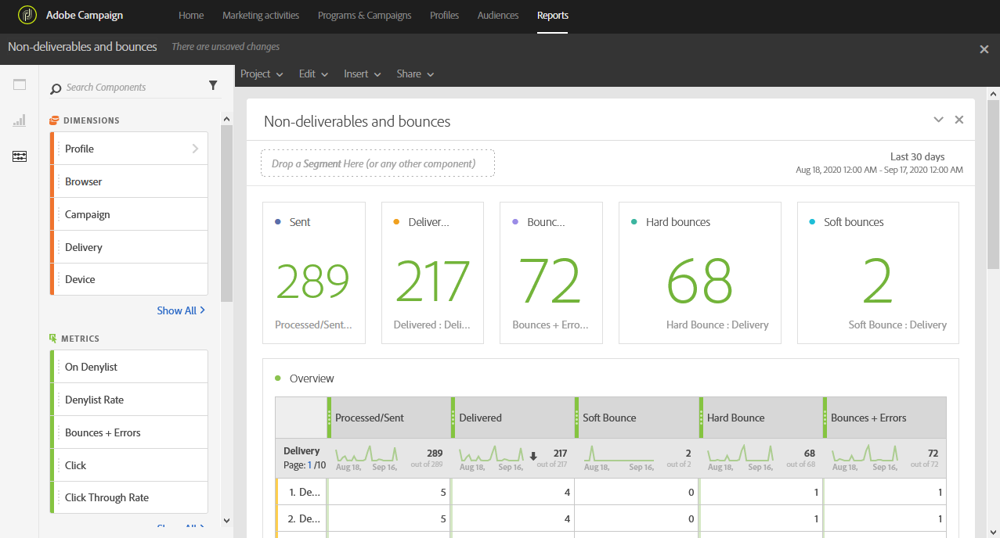

# 配信不能件数とバウンス数{#non-deliverables-and-bounces}

**[!UICONTROL Non-deliverables and bounces]** レポートには、配信中に発生したすべてのエラーの詳細が表示されます。

**[!UICONTROL Overview]** テーブルには、各配信で発生する可能性のあるエラーに関して使用可能なデータが含まれています。例えば、次のとおりです。

* **処理済み / 送信済み**：送信されたメールの数。
* **配信済み**：配信されたメールの数。
* **ソフトバウンス**：一時的なエラー（受信トレイが満杯など）の合計数。
* **ハードバウンス**：永続的なエラー（メールアドレスの間違いなど）の合計数。
* **バウンス数 + エラー数**：配信できなかったメッセージの数。

**ドメイン別の分類**&#x200B;テーブルには、受信者のドメインごとのバウンス数が一覧表示されます。
