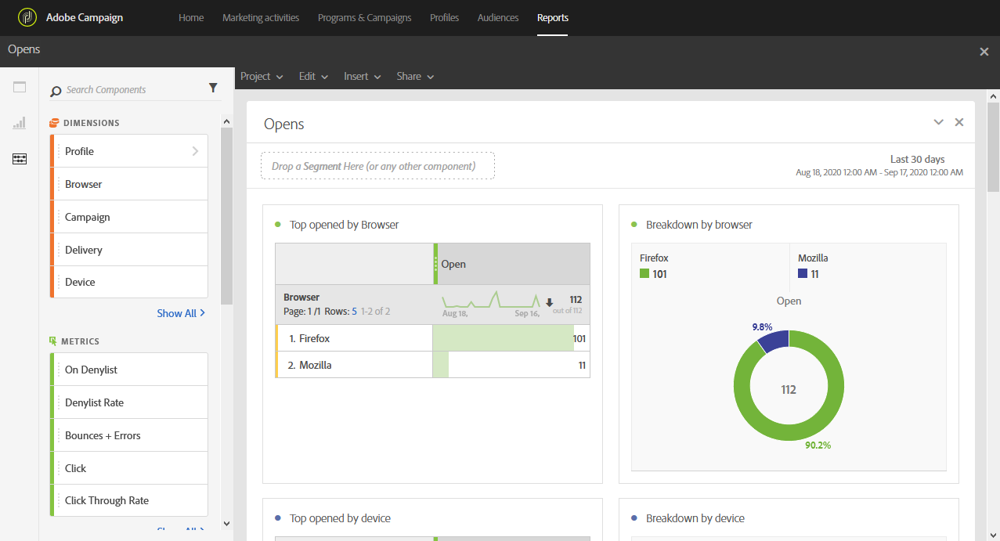

# 開封数{#opens}

**[!UICONTROL Opens]** レポートは、受信者によって最も多く表示された配信を識別します。

4 つの表とグラフが、メールを開封した受信者の合計数を次の条件に基づいて分類します。

* ブラウザー
* デバイス
* プラットフォーム
* ドメイン

**[!UICONTROL TOP 5]** のテーブルとグラフには、配信されたメッセージの数が最も多い配信が表示されます。
