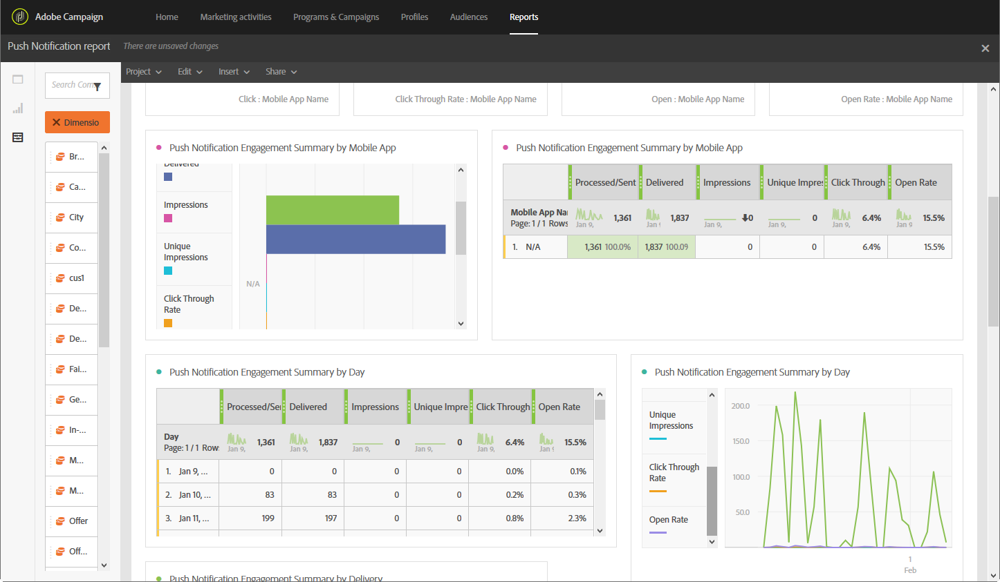
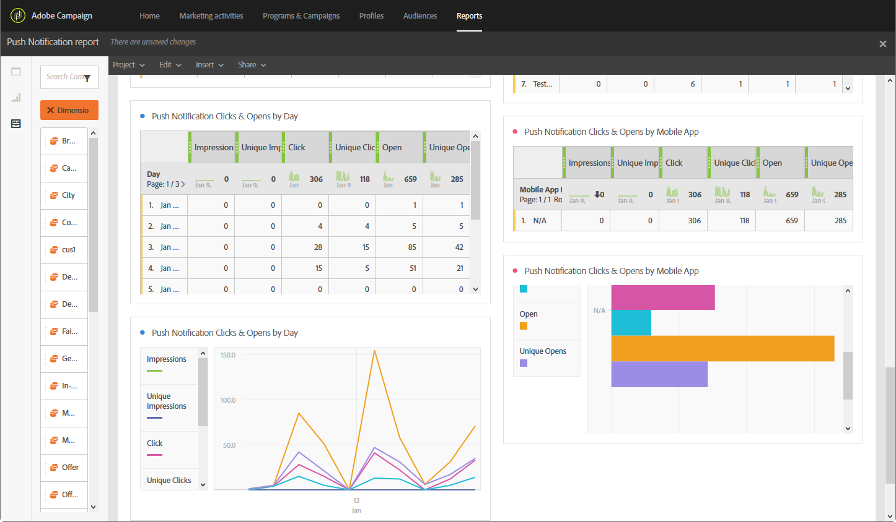

# プッシュ通知レポート{#push-notification-report}

>[!CAUTION]
>
>配信タイプ（この場合はプッシュ通知配信）に応じてデータを分割するには、**[!UICONTROL Message type]**&#x200B;指標をテーブルにドラッグ&amp;ドロップする必要があることに注意してください。

**プッシュ通知**&#x200B;レポートは、Adobe Campaign におけるプッシュ通知のマーケティングパフォーマンスの詳細を提供します。 この標準レポートを使用すると、ユーザーがプッシュ通知、モバイルアプリケーション、配信に対してどのようなアクションを起こしているのかを理解できます。

プッシュトラッキングを実装するには、モバイルアプリケーションで一部の設定が必要です。詳細な手順については、この[ ページ ](../../administration/using/push-tracking.md)を参照してください。

各テーブルは、概要の数値とグラフで表されています。 それぞれのビジュアライゼーション設定で、詳細の表示方法を変更できます。

最初のテーブルの&#x200B;**プッシュ通知エンゲージメントの概要**&#x200B;は、日別、モバイルアプリ別および配信別の 3 つのカテゴリに分類されています。 カテゴリには、配信に対する受信者の反応についての次のような利用可能なデータが含まれます。

* **[!UICONTROL Processed/sent]**：送信されたプッシュ通知の合計数。
* **[!UICONTROL Delivered]**：送信されたプッシュ通知の合計数に対して、正常に送信されたプッシュ通知の数。
* **[!UICONTROL Impressions]**: プッシュ通知がデバイスに配信され、通知センターで操作されないままになっている回数。 ほとんどの場合、インプレッション数は、配信された数とほぼ同じになります。 数が一致することで、デバイスがメッセージを取得して、その情報をサーバーに中継したことを確認できます。
* **[!UICONTROL Unique impressions]**：受信者によるインプレッション数。
* **[!UICONTROL Click through rate]**: プッシュ通知を操作したユーザーの割合。
* **[!UICONTROL Open rate]**：開封されたプッシュ通知の割合。

2 つ目のテーブルの&#x200B;**プッシュ通知のクリック数および開封数**&#x200B;は、日別、モバイルアプリ別および配信別の 3 つのカテゴリに分類されます。 カテゴリには、配信ごとの受信者の行動に関する利用可能なデータが含まれます。

* **[!UICONTROL Impressions]**：受信者が確認したプッシュ通知の合計。
* **[!UICONTROL Unique impressions]**：受信者によるインプレッション数。
* **[!UICONTROL Click]**: プッシュ通知がデバイスに配信され、ユーザーがクリックした回数。 ユーザーが通知を表示（通知はその後プッシュ開封トラッキングに移動します）するか、通知を拒否します。
* **[!UICONTROL Unique clicks]**：一意のユーザーがプッシュ通知を操作した回数（通知またはボタンのクリックなど）。
* **[!UICONTROL Open]**: デバイスに配信され、ユーザーがクリックしてアプリを開いたプッシュ通知の合計数。 プッシュクリックと似ていますが、プッシュ開封は、通知が解除された場合はトリガーされません。
* **[!UICONTROL Unique Opens]**：配信を開いた受信者の数。
