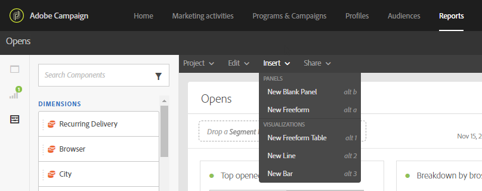
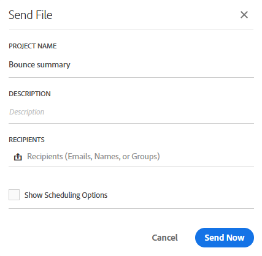
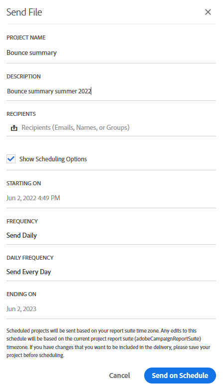
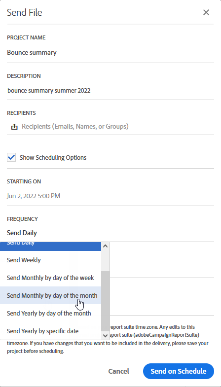

# レポートのインターフェイス{#reporting-interface}

上部のツールバーから、レポートを変更、保存または印刷できます。

「**プロジェクト**」タブでは、次の操作を実行できます。

* **開く…**：以前に作成したレポートまたはテンプレートを開きます。
* **名前を付けて保存…**：テンプレートを複製し、変更できるようにします。
* **プロジェクトを更新**：新しいデータおよびフィルターへの変更に基づいてレポートを更新します。
* **CSV をダウンロード**：CSV ファイルにレポートをエクスポートします。

「**編集**」タブでは、次の操作を実行できます。

* **取り消し**：ダッシュボードで最後に行った操作をキャンセルします。
* **すべてクリア**：ダッシュボードのすべてのパネルを削除します。

「**挿入**」タブでは、ダッシュボードにグラフやテーブルを追加してレポートをカスタマイズできます。

* **新しい空のパネル**：ダッシュボードに新しい空のパネルを追加します。
* **新しいフリーフォーム**：ダッシュボードに新しいフリーフォームテーブルを追加します。
* **新しい折れ線グラフ**：ダッシュボードに新しい折れ線グラフを追加します。
* **新しい棒グラフ**：ダッシュボードに新しい棒グラフを追加します。

**関連トピック：**

* [パネルの追加](../../reporting/using/adding-panels.md)
* [ビジュアライゼーションの追加](../../reporting/using/adding-visualizations.md)
* [コンポーネントの追加](../../reporting/using/adding-components.md)
* [電子メールを通じて関係者とレポートを自動的に共有](https://helpx.adobe.com/campaign/kb/simplify-campaign-management.html#Reportandshareinsightswithallstakeholders)

## タブ {#tabs}

左側のタブを使用して、レポートを作成し、必要に応じてデータをフィルターできます。

これらのタブから、次の項目にアクセスできます。

* **[!UICONTROL Panels]**：空のパネルまたはフリーフォームをレポートに追加して、データのフィルタリングを開始します。 詳しくは、パネルの追加セクションを参照してください。
* **[!UICONTROL Visualizations]**: ビジュアライゼーション項目の選択をドラッグ&amp;ドロップして、レポートにグラフィカル ディメンションを付与します。 詳しくは、ビジュアライゼーションの追加セクションを参照してください。
* **[!UICONTROL Components]**：異なるディメンション、指標、セグメント、期間でレポートをカスタマイズします。

## ツールバー {#toolbar}

ツールバーは、ワークスペースの上にあります。 様々なタブで構成されており、例えば、レポートを変更、保存、共有または印刷できます。

**関連トピック：**

* [パネルの追加](../../reporting/using/adding-panels.md)
* [ビジュアライゼーションの追加](../../reporting/using/adding-visualizations.md)
* [コンポーネントの追加](../../reporting/using/adding-components.md)

### 「プロジェクト」タブ {#project-tab}

「**プロジェクト**」タブでは、次の操作を実行できます。

* **開く…**：以前に作成したレポートまたはテンプレートを開きます。
* **名前を付けて保存…**：テンプレートを複製し、変更できるようにします。
* **プロジェクトを更新**：新しいデータおよびフィルターへの変更に基づいてレポートを更新します。
* **CSV をダウンロード**：CSV ファイルにレポートをエクスポートします。
* **[!UICONTROL Print]**: レポートを印刷します。

### 「編集」タブ {#edit-tab}

「**編集**」タブでは、次の操作を実行できます。

* **取り消し**：ダッシュボードで最後に行った操作をキャンセルします。
* **すべてクリア**：ダッシュボードのすべてのパネルを削除します。

### 「挿入」タブ {#insert-tab}

「**挿入**」タブでは、ダッシュボードにグラフとテーブルを追加してレポートをカスタマイズできます。

* **新しい空のパネル**：ダッシュボードに新しい空のパネルを追加します。
* **新しいフリーフォーム**：ダッシュボードに新しいフリーフォームテーブルを追加します。
* **新しい折れ線グラフ**：ダッシュボードに新しい折れ線グラフを追加します。
* **新しい棒グラフ**：ダッシュボードに新しい棒グラフを追加します。

### タブを共有 {#share-tab}

「**[!UICONTROL Share]**」タブでは、1回限りの電子メールまたは定期的な電子メールを通じて、Adobe Campaign ユーザーにレポートを送信できます。 ターゲットユーザーには、レポートが添付されたメールが届きます。

* **[!UICONTROL Send report now]**：選択した受信者のリストにレポートをワンショットメールで送信します。

   1. **[!UICONTROL Send report]** ウィンドウで、必要に応じて説明を追加します。

      

   1. ドロップダウンから受信者を選択します。 組織外のユーザーは選択できないことに注意してください。
   1. 定期的なメールを送信する場合は、**[!UICONTROL Show scheduling options]**&#x200B;を確認してください。 これは、**[!UICONTROL Share]** タブで&#x200B;**[!UICONTROL Send Report on schedule]**&#x200B;を選択することでも実行できます。
   1. 「**[!UICONTROL Send now]**」をクリックします。 レポートが添付されたメールが受信者に届きます。

* **[!UICONTROL Send report on schedule]**: レポートのスケジュールを設定し、受信者に定期的なメールを送信します。

   1. **[!UICONTROL Send report]** ウィンドウで、必要に応じて説明を追加します。
   1. ドロップダウンから受信者を選択します。 組織外のユーザーは選択できないことに注意してください。

      

   1. 開始日と終了日を選択して、**[!UICONTROL Starting on]**&#x200B;および&#x200B;**[!UICONTROL Ending on]** フィールドで電子メールの有効性を設定します。
   1. メールの送信頻度を選択します。

      

   1. **[!UICONTROL Send on schedule]**&#x200B;をクリックすると、選択した頻度に応じて定期的なメールが受信者に送信されます。

* **[!UICONTROL Scheduled reports]**：すべてのスケジュール済みレポートを検索して設定します。

   1. **[!UICONTROL Scheduled reports]** ウィンドウで、すべての定期的な送信レポートを見つけます。

      

   1. スケジュール済みレポートのいずれかを削除する必要がある場合は、削除するスケジュール済みレポートを選択して、**[!UICONTROL Delete the section]**&#x200B;をクリックします。
   1. スケジュール済みレポートを設定または確認するには、変更する必要があるレポートを直接クリックします。
   1. **[!UICONTROL Edit scheduled report]** ウィンドウが表示されます。必要に応じて、メールの受信者または頻度を変更できるようになりました。

すると、ターゲットオーディエンスには、レポートが添付された電子メールが受信トレイに直接届きます。 利用者は、各定期的なメールで利用可能な購読解除リンクを使用して、定期的なメールの受信をいつでも停止することができます。

**関連トピック：**

* [電子メールを通じて関係者とレポートを自動的に共有](https://helpx.adobe.com/campaign/kb/simplify-campaign-management.html#Reportandshareinsightswithallstakeholders)
