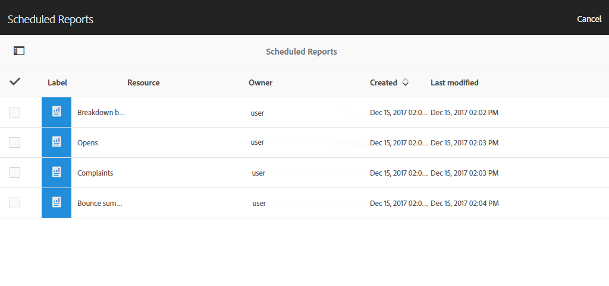

# レポートインターフェイス{#reporting-interface}

上部のツールバーを使用すると、レポートを変更、保存または印刷できます。

**「プロジェクト** 」タブを使用して、次の操作を行います。

* **開く…以前に作成したレポートまたはテンプレートを開きます。**
* **名前を付けて保存…テンプレートを変更して変更できるようにします。**
* **プロジェクトの更新**:新しいデータとフィルターに対する変更に基づいてレポートを更新します。
* **CSVをダウンロード**:レポートをCSVファイルにエクスポートします。

**「編集」** タブでは次のことができます。

* **元に戻す**:ダッシュボードの最後のアクションをキャンセルします。
* **すべてクリア**:ダッシュボードのすべてのパネルを削除します。

**[挿入** ]テーブルを使用すると、ダッシュボードにグラフや表を追加してレポートをカスタマイズできます。

* **新しい空白のパネル**:新しい空のパネルをダッシュボードに追加します。
* **新規フリーフォーム**:新しいフリーフォームテーブルをダッシュボードに追加します。
* **改行**:ダッシュボードに新しい折れ線グラフを追加します。
* **New Bar**:ダッシュボードに新しい棒グラフを追加します。

**関連トピック:**

* [パネルの追加](../../reporting/using/adding-panels.md)
* [ビジュアライゼーションの追加](../../reporting/using/adding-visualizations.md)
* [コンポーネントの追加](../../reporting/using/adding-components.md)
* [電子メールを介したレポートの共有者との自動的な共有](https://helpx.adobe.com/campaign/kb/simplify-campaign-management.html#Reportandshareinsightswithallstakeholders)

## タブ {#tabs}

左側のタブでは、必要に応じてレポートを作成し、データをフィルターできます。

これらのタブでは、次の項目にアクセスできます。

* **[!UICONTROL Panels]**:レポートに空のパネルまたはフリーフォームを追加して、データのフィルタリングを開始します。これについて詳しくは、パネルの追加セクションを参照してください
* **[!UICONTROL Visualizations]**:選択項目をドラッグ&amp;ドロップして、グラフィカルディメンションをレポートに表示します。詳しくは、ビジュアライゼーションの追加セクションを参照してください。
* **[!UICONTROL Components]**:レポートをカスタマイズして、様々なディメンション、指標、セグメント、期間を使用できます。

## ツールバー {#toolbar}

ツールバーはワークスペースの上にあります。異なるタブで構成されているので、レポートを変更、保存、共有、印刷することができます。

**関連トピック:**

* [パネルの追加](../../reporting/using/adding-panels.md)
* [ビジュアライゼーションの追加](../../reporting/using/adding-visualizations.md)
* [コンポーネントの追加](../../reporting/using/adding-components.md)

### 「プロジェクト」タブ {#project-tab}

**「プロジェクト** 」タブを使用して、次の操作を行います。

* **開く…以前に作成したレポートまたはテンプレートを開きます。**
* **名前を付けて保存…テンプレートを変更して変更できるようにします。**
* **プロジェクトの更新**:新しいデータとフィルターに対する変更に基づいてレポートを更新します。
* **CSVをダウンロード**:レポートをCSVファイルにエクスポートします。
* **[!UICONTROL Print]**:レポートを印刷します。

### 「編集」タブ {#edit-tab}

**「編集」** タブでは次のことができます。

* **元に戻す**:ダッシュボードの最後のアクションをキャンセルします。
* **すべてクリア**:ダッシュボードのすべてのパネルを削除します。

### 「挿入」タブ {#insert-tab}

**[挿入** ]タブでは、ダッシュボードにグラフや表を追加してレポートをカスタマイズできます。

* **新しい空白のパネル**:新しい空のパネルをダッシュボードに追加します。
* **新規フリーフォーム**:新しいフリーフォームテーブルをダッシュボードに追加します。
* **改行**:ダッシュボードに新しい折れ線グラフを追加します。
* **New Bar**:ダッシュボードに新しい棒グラフを追加します。

### 「共有」タブ {#share-tab}

**[!UICONTROL Share]** このタブでは、1ショットまたは繰り返しの電子メールを使用して、Adobe Campaignユーザーとレポートを送信できます。ターゲットユーザーは、レポートを添付した電子メールを受信します。

* **[!UICONTROL Send report now]**:1つのショットの電子メールを使用して、選択した受信者のリストにレポートを送信します。

   1. **[!UICONTROL Send report]** ウィンドウで、必要に応じて説明を追加します。

      

   1. 電子メールの受信者を選択するには、フィールドをクリックしてドロップダウンで選択するか、電子メールアドレスを入力します。
   1. 定期的な電子メール送信を行うかどう **[!UICONTROL Show scheduling options]** かをチェックします。これは、タブで選択 **[!UICONTROL Send Report on schedule]** することでも実行 **[!UICONTROL Share]** できます。
   1. **[!UICONTROL Send now]**&#x200B;をクリックします。受信者はレポートを添付して電子メールを受信します。

* **[!UICONTROL Send report on schedule]**:レポートをスケジュールし、受信者に繰り返し電子メールを送信します。

   1. **[!UICONTROL Send report]** ウィンドウで、必要に応じて説明を追加します。
   1. 電子メールの受信者を選択するには、フィールドをクリックしてドロップダウンで選択するか、電子メールアドレスを入力します。

      

   1. 開始日と終了日を選択して、電子メールの有効期間を **[!UICONTROL Starting on]****[!UICONTROL Ending on]** フィールドに設定します。
   1. 電子メールの送信頻度を選択します。

      

   1. をクリック **[!UICONTROL Send on schedule]**&#x200B;すると、選択した頻度に応じて、定期的な電子メールが受信者に送信されます。

* **[!UICONTROL Scheduled reports]**:すべての予定レポートを検索して設定します。

   1. **[!UICONTROL Scheduled reports]** ウィンドウで、定期的な送信レポートをすべて見つけます。

      

   1. 予定レポートのいずれかを削除する必要がある場合は、削除する予定レポートを選択して、をクリック **[!UICONTROL Delete the section]**&#x200B;します。
   1. 予定レポートを設定またはチェックするには、変更する必要のあるレポートを直接クリックします。
   1. **[!UICONTROL Edit scheduled report]** ウィンドウが表示され、必要に応じて電子メールの受信者または頻度を変更できるようになりました。

ターゲットユーザーは、自分のインボックスにレポートを直接添付した電子メールを受信します。ユーザーは、定期的な電子メールごとに購読解除リンクを使用して、定期的な電子メールの受信を停止することができます。

**関連トピック:**

* [電子メールを介したレポートの共有者との自動的な共有](https://helpx.adobe.com/campaign/kb/simplify-campaign-management.html#Reportandshareinsightswithallstakeholders)
