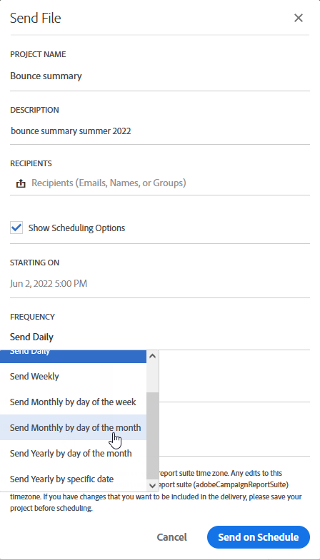

# レポートインターフェイス{#reporting-interface}

上部のツールバーを使用すると、例えば、レポートを変更、保存、印刷できます。

「プロジェクト」タ **ブを使用して** 、次の操作を行います。

* **開く…**:以前に作成したレポートまたはテンプレートを開きます。
* **名前を付けて保存。.**:テンプレートを複製して、変更できるようにします。
* **プロジェクトの更新**:新しいデータとフィルターの変更に基づいてレポートを更新します。
* **CSVのダウンロード**:レポートをCSVファイルにエクスポートします。

「 **Edit** 」タブでは、次の操作を行えます。

* **元に戻す**:ダッシュボードでの最後の操作をキャンセルします。
* **すべてクリア**:ダッシュボードのすべてのパネルを削除します。

[挿入 **]テーブルを使用すると** 、ダッシュボードにグラフや表を追加してレポートをカスタマイズできます。

* **新しい空白パネル**:ダッシュボードに新しい空のパネルを追加します。
* **新しいフリーフォーム**:新しいフリーフォームテーブルをダッシュボードに追加します。
* **改行**:ダッシュボードに新しい折れ線グラフを追加します。
* **新しいバー**:ダッシュボードに新しい棒グラフを追加します。

**関連トピック：**

* [パネルの追加](../../reporting/using/adding-panels.md)
* [ビジュアライゼーションの追加](../../reporting/using/adding-visualizations.md)
* [コンポーネントの追加](../../reporting/using/adding-components.md)
* [電子メールを使用して、自動的に関係者とレポートを共有する](https://helpx.adobe.com/campaign/kb/simplify-campaign-management.html#Reportandshareinsightswithallstakeholders)

## タブ {#tabs}

左のタブを使用すると、レポートを作成し、必要に応じてデータをフィルタリングできます。

これらのタブを使用すると、次の項目にアクセスできます。

* **[!UICONTROL Panels]**:空白のパネルまたはフリーフォームをレポートに追加して、データのフィルタリングを開始します。 詳しくは、パネルの追加の節を参照してください
* **[!UICONTROL Visualizations]**:選択したビジュアライゼーション項目をドラッグ&amp;ドロップして、レポートにグラフィカルなディメンションを設定します。 詳しくは、ビジュアライゼーションの追加の節を参照してください。
* **[!UICONTROL Components]**:様々なディメンション、指標、セグメントおよび期間を使用してレポートをカスタマイズします。

## ツールバー {#toolbar}

ツールバーは、ワークスペースの上にあります。 様々なタブで構成され、例えば、レポートの変更、保存、共有、印刷を行うことができます。

**関連トピック：**

* [パネルの追加](../../reporting/using/adding-panels.md)
* [ビジュアライゼーションの追加](../../reporting/using/adding-visualizations.md)
* [コンポーネントの追加](../../reporting/using/adding-components.md)

### 「プロジェクト」タブ {#project-tab}

「プロジェクト」タ **ブを使用して** 、次の操作を行います。

* **開く…**:以前に作成したレポートまたはテンプレートを開きます。
* **名前を付けて保存。.**:テンプレートを複製して、変更できるようにします。
* **プロジェクトの更新**:新しいデータとフィルターの変更に基づいてレポートを更新します。
* **CSVのダウンロード**:レポートをCSVファイルにエクスポートします。
* **[!UICONTROL Print]**:レポートを印刷します。

### 「編集」タブ {#edit-tab}

「 **Edit** 」タブでは、次の操作を行えます。

* **元に戻す**:ダッシュボードでの最後の操作をキャンセルします。
* **すべてクリア**:ダッシュボードのすべてのパネルを削除します。

### 「挿入」タブ {#insert-tab}

[挿入 **** ]タブでは、ダッシュボードにグラフと表を追加してレポートをカスタマイズできます。

* **新しい空白パネル**:ダッシュボードに新しい空のパネルを追加します。
* **新しいフリーフォーム**:新しいフリーフォームテーブルをダッシュボードに追加します。
* **改行**:ダッシュボードに新しい折れ線グラフを追加します。
* **新しいバー**:ダッシュボードに新しい棒グラフを追加します。

### 「共有」タブ {#share-tab}

このタ **[!UICONTROL Share]** ブでは、1回限りまたは繰り返しの電子メールを使用して、Adobe Campaignユーザーにレポートを送信できます。 その後、ターゲットのユーザーは、レポートが添付された電子メールを受信します。

* **[!UICONTROL Send report now]**:選択した受信者のリストに、ワンショットの電子メールでレポートを送信します。

   1. 必要に応じ **[!UICONTROL Send report]** て、ウィンドウに説明を追加します。

      

   1. 電子メールの受信者を選択するには、フィールドをクリックし、ドロップダウンで選択するか、電子メールアドレスを入力します。
   1. 定期的 **[!UICONTROL Show scheduling options]** な電子メールを送信するかどうかを選択します。 これは、タブでを選択して行うこ **[!UICONTROL Send Report on schedule]** ともでき **[!UICONTROL Share]** ます。
   1. Click **[!UICONTROL Send now]**. その後、受信者に、レポートが添付された電子メールが届きます。

* **[!UICONTROL Send report on schedule]**:レポートのスケジュールを設定し、受信者に定期的な電子メールを送信します。

   1. 必要に応じ **[!UICONTROL Send report]** て、ウィンドウに説明を追加します。
   1. 電子メールの受信者を選択するには、フィールドをクリックし、ドロップダウンで選択するか、電子メールアドレスを入力します。

      

   1. 開始日と終了日を選択して、およびのフィールドに電子メールの有効性を **[!UICONTROL Starting on]** 設定 **[!UICONTROL Ending on]** します。
   1. 電子メールの送信頻度を選択します。

      

   1. をクリ **[!UICONTROL Send on schedule]**&#x200B;ックすると、選択した頻度に応じて、受信者に定期的な電子メールが届きます。

* **[!UICONTROL Scheduled reports]**:すべての予定レポートを検索して設定します。

   1. ウィンドウで、 **[!UICONTROL Scheduled reports]** 定期的に送信されたすべてのレポートを探します。

      

   1. 予定レポートの1つを削除する必要がある場合は、削除する予定レポートを選択し、をクリックしま **[!UICONTROL Delete the section]**&#x200B;す。
   1. 予定レポートを設定または確認するには、変更する必要のあるレポートを直接クリックします。
   1. ウィン **[!UICONTROL Edit scheduled report]** ドウが表示され、必要に応じて電子メールの受信者または頻度を変更できます。

その後、ターゲットユーザーは、レポートが添付された電子メールを受信トレイに直接受信します。 ユーザーは、各定期電子メールで利用できる購読解除リンクを使用して、定期的な電子メールの受信をいつでも停止することができます。

**関連トピック：**

* [電子メールを使用して、自動的に関係者とレポートを共有する](https://helpx.adobe.com/campaign/kb/simplify-campaign-management.html#Reportandshareinsightswithallstakeholders)
