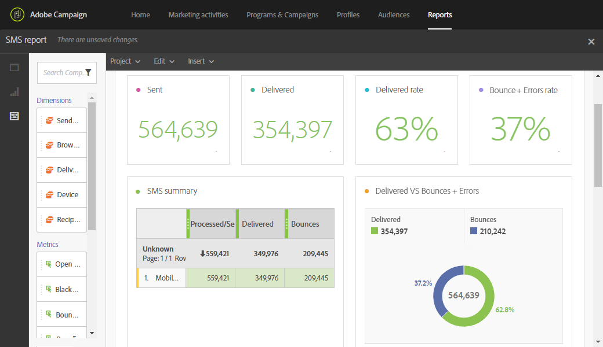

# SMS レポート{#sms-report}

**SMS** レポートは、配信やバウンス率など、SMS 配信に関する詳細を提供します。

**SMS の概要**&#x200B;テーブル、グラフ、概要番号には、送信された SMS 配信に使用できるデータが含まれています。

* **処理済み / 送信済み**：送信された SMS の数。
* **配信済み**：配信された SMS の数。
* **バウンス数 + エラー数**：配信できなかったメッセージの数。
