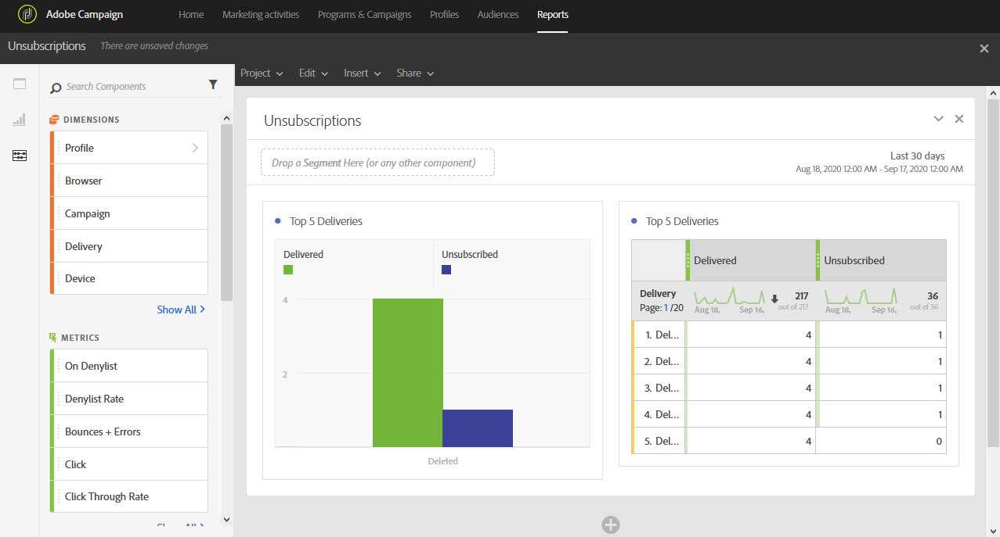

# 購読解除{#unsubscriptions}

**[!UICONTROL Unsubscriptions]** レポートは、購読解除が最も多い配信を特定します。

**[!UICONTROL TOP 5 deliveries]**&#x200B;の表とグラフには、配信されたメッセージの数が最も多い上位5件の配信と、配信停止した受信者の数が表示されます。 ここにリストされるデータは、メッセージの購読解除リンクのクリック数に基づいています。
