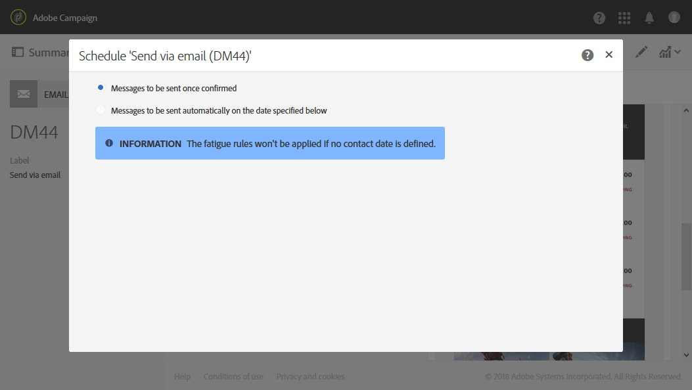

# メッセージのスケジュール設定について{#about-scheduling-messages}

>[!IMPORTANT]
>
>配信のスケジュールを変更する場合は、必ず「**Prepare**」ボタンをクリックして配信を準備し直してから、「**Confirm**」をクリックする必要があります。

メッセージダッシュボードの **[!UICONTROL Schedule]** ブロックを使用すると、メッセージ（メール、SMS、プッシュ通知）を送信するタイミングを定義できます。

**[!UICONTROL Schedule]** プロパティを使用すると、メール、SMS、プッシュ通知の送信オプションを設定できます。

* **[!UICONTROL Messages to be sent once confirmed]**：メッセージは、送信が確認されるとすぐに送信されます。 [送信の確認](../../sending/using/confirming-the-send.md)を参照してください。

  

* **[!UICONTROL Messages to be sent automatically on the date specified below]**：メッセージは、後で送信されます。 「**Start sending from**」フィールドに&#x200B;**連絡日時**&#x200B;を指定します。

  送信の準備と確認はできますが、メッセージは選択した日時まで送信されません。 送信の準備と確認は、[送信の準備](../../sending/using/preparing-the-send.md)および[送信の確認](../../sending/using/confirming-the-send.md)の節に記載されています。

  **[!UICONTROL Time zone of the contact date]** ドロップダウンリストを使用すると、送信時間のタイムゾーンを変更できます。 例えば、**[!UICONTROL Start sending from]** フィールドに「午前9:00」と入力し、**[!UICONTROL Time zone of the contact date]** ドロップダウンリストで「ブリュッセル、コペンハーゲン、マドリード、パリ」（GMT+1）を選択すると、すべての受信者がパリ時間の午前9:00時にメッセージを受け取ります。 したがって、モスクワ（GMT+3）に位置する受信者は、モスクワ時間の午前11:00時にメッセージを受け取ります。

  手動で送信を確認する場合は、「**[!UICONTROL Request confirmation before sending messages]**」オプションをオンにします。 このオプションは、デフォルトでは有効になっています。

  

>[!IMPORTANT]
>
>配信を複製すると、すべてのスケジュール設定が削除されます。 新しい連絡日付をスケジュール設定しない限り、重複した配信は、送信が確認されるとすぐに送信されます。

**関連トピック**：

* [送信時間の最適化](../../sending/using/optimizing-the-sending-time.md)
* [受信者のタイムゾーンでのメッセージの送信](../../sending/using/sending-messages-at-the-recipient-s-time-zone.md)
* [送信日の計算](../../sending/using/computing-the-sending-date.md)
