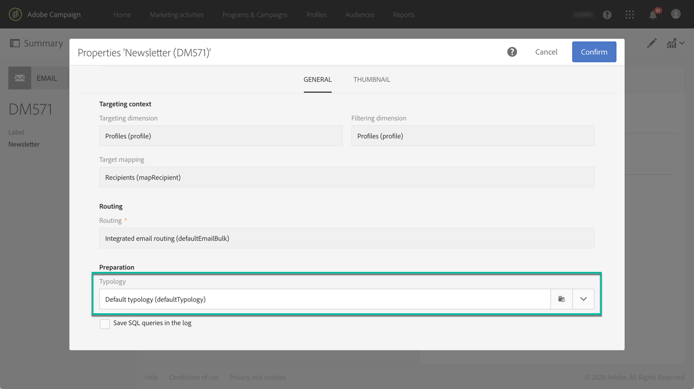

# タイポロジとタイポロジルールについて{#about-typology-rules}

Campaign Standard を使用すると、メッセージを&#x200B;**タイポロジ**&#x200B;にリンクして、メッセージが有効で品質の基準を満たしているかどうかを確認できます。

タイポロジとは、メッセージの分析段階で実行される一連の&#x200B;**タイポロジルール**&#x200B;です。電子メールに常に必要な特定の要素（購読解除リンクや件名行など）が含まれていることを確かめたり、ターゲットグループから特定グループ（非購読者、競合他社、非顧客など）を除外するフィルタールールを設定したりできます。

Campaign Standard には、すぐに使えるタイポロジとタイポロジルールが用意されています。必要に応じて、新しいルールを作成し、既存または新規のタイポロジに追加して、メッセージにリンクすることもできます。

タイポロジを作成してメッセージに適用する手順は次のとおりです。

1. タイポロジルールを作成します（[こちらの節](../../sending/using/managing-typology-rules.md#creating-a-typology-rule)を参照）。
1. タイポロジを作成し、作成したルールを参照させます（[こちらの節](../../sending/using/managing-typologies.md#creating-a-typology)を参照）。
1. 作成したタイポロジを使用するように配信を設定します（[こちらの節](../../sending/using/managing-typologies.md#applying-typologies-to-messages)を参照）。
1. メッセージの準備中、条件が満たされたプロファイルは除外されます。ログを確認して除外を監視できます。
