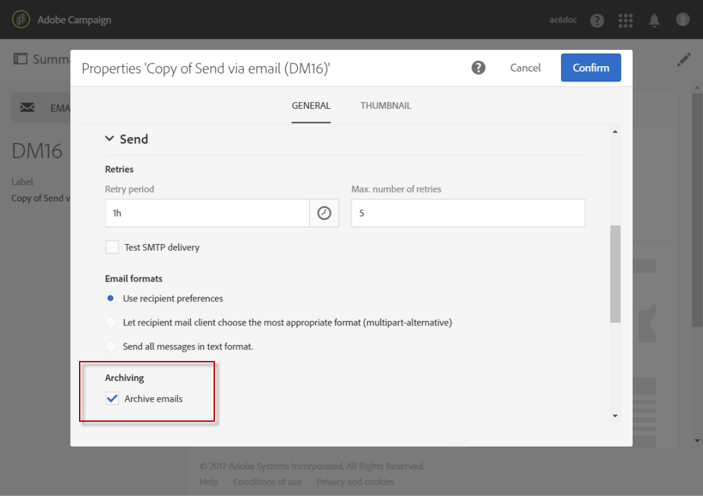

# メールの BCC を使用したアーカイブ{#archiving-emails}

Adobe Campaignを設定して、メール BCCを通じてプラットフォームから送信されたメールのコピーを保持できます。

特に、コンプライアンスのために送信メールのメッセージをすべてアーカイブする必要がある場合は、この機能を有効にできます。 対応する送信済みメッセージの正確な非表示コピーを、指定する必要があるBCC メールアドレス（配信受信者には表示されない）に送信できます。

有効になったら、メール配信テンプレートの&#x200B;**[!UICONTROL Archive emails]** オプションからメール BCCをアクティブ化する必要があります。

>[!NOTE]
>
>Adobe Campaign 自体はアーカイブされたファイルを管理しません。 これにより、選択したメッセージを専用のアドレスに送信し、外部システムを使用して処理およびアーカイブできます。

## 推奨事項と制限事項 {#recommendations-and-limitations}

* この機能はオプションです。 この機能を有効にするには、ライセンス契約を確認したうえで、アカウント担当者にお問い合わせください。
* 選択したBCCアドレスは、ユーザーに対して設定を行うAdobeチームに提供する必要があります。
* BCC に設定できるメールアドレスは 1 つだけです。
* 正常に送信されたメールのみが考慮されます。 バウンスは発生しません。
* プライバシー上の理由から、BCC メールは、個人の身元を特定できる情報（PII）を安全に保存できるアーカイブシステムで処理する必要があります。
* 新しい配信テンプレートを作成する場合、オプションを購入した場合でも、メール BCCはデフォルトで有効になっていません。 使用する各配信テンプレートで手動で有効にする必要があります。

>[!NOTE]
>
>現在、アーカイブされた電子メールは、単純なSMTP リレーを使用する従来のアーカイブモジュールによって送信されます。

## 電子メールアーカイブのアクティブ化 {#activating-email-archiving}

有効にすると、専用オプションを使用して、[電子メールテンプレート ](../../start/using/marketing-activity-templates.md)で電子メール BCCがアクティブ化されます。

1. **リソース**／**テンプレート**／**配信テンプレート**&#x200B;に移動します。
1. すぐに使える&#x200B;**[!UICONTROL Send via email]** テンプレートを複製します。
1. 複製したテンプレートを選択します。
1. 「**[!UICONTROL Edit properties]**」ボタンをクリックして、テンプレートのプロパティを編集します。
1. **[!UICONTROL Send]** セクションを展開します。
1. このテンプレートに基づいて、各配信に送信されたすべてのメッセージのコピーを保持するには、**[!UICONTROL Archive emails]** ボックスをオンにします。

   

>[!NOTE]
>
>BCC アドレスに送信された電子メールを開いてクリックすると、送信分析の&#x200B;**[!UICONTROL Total opens]**&#x200B;と&#x200B;**[!UICONTROL Clicks]**&#x200B;でこれが考慮され、計算ミスが発生する可能性があります。
