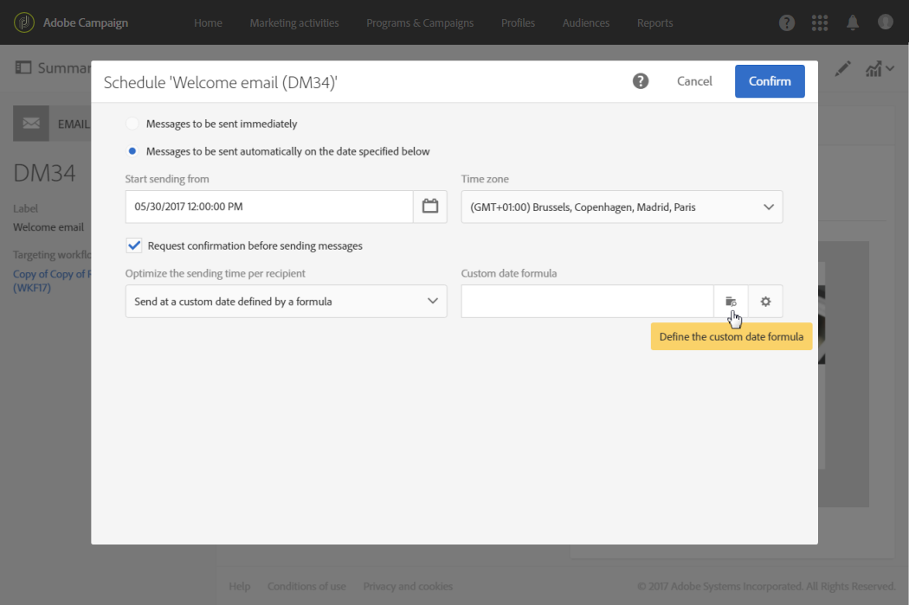

# 送信日の計算{#computing-the-sending-date}

各受信者に特定の日時にメッセージを送信する数式を定義できます。

## 日付式のカスタマイズ {#customizing-date-formula}

例えば、ランプアッププロセス中に送信時間の最適化を使用できます。

新しいプラットフォームを使用してメールが送信された場合、インターネットサービスプロバイダー（ISP）は認識されない IP アドレスを疑わしく思います。多くの場合、大量のメールが突然送信されると、ISP はそれらのメールをスパムとしてマークします。

大量の E メールを異なる時間に配信することで、送信される量を徐々に増やすことができます。 この方法により、スタートアップフェーズをスムーズに進め、無効なアドレスが全体に占める割合を減らすことができます。

例えば、ターゲットオーディエンスをランダムにセグメント化して、配信を 5 つのバッチで送信できます。 ターゲットオーディエンスの 10%を表す最初のバッチを 6 月 1 日の午前 10:00 に、2 番目のバッチを 24 時間後に、15%のオーディエンスについてなどとして送信します。

ワークフローを使用して、スケジュールを設定できます。


1. マーケティングアクティビティリストにアクセスし、新しいワークフローを作成します。 [ワークフローの作成](../../automating/using/building-a-workflow.md#creating-a-workflow)を参照してください。
1. 次をドラッグ&amp;ドロップ： **クエリ** アクティビティをワークフローに追加して開きます。 詳しくは、 [クエリ](../../automating/using/query.md) 」セクションに入力します。
1. オーディエンス（例えば、すべてのゴールド顧客）を選択し、 **[!UICONTROL Confirm]** をクリックしてクエリを保存します。
1. 次をドラッグ&amp;ドロップ： **セグメント化** アクティビティをワークフローに追加して開きます。 詳しくは、 [セグメント化](../../automating/using/segmentation.md) 」セクションに入力します。
1. 5 つのセグメントを定義します。 各セグメントに対して、次の操作を行います。

   * 次の項目に入力： **[!UICONTROL Segment code]** フィールド：メッセージを送信する日時を手動で入力します。

     例えば、6 月 1 日の午前 10:00 GMT+1 に最初のバッチを送信するとします。 次の形式を使用します。 **YYYY-MM-DD hh:mm:s+tz**.

     

     翌日に次のバッチを送信するには、次のように入力します。 **2017-06-02 10:00:00+01** 2 番目のセグメント用。

     残りのセグメントに対して、次のバッチを次のように定義します。

      * **2017-06-03 10:00:00+01**
      * **2017-06-04 10:00:00+01**
      * **2017-06-05 10:00:00+01**

   * 必ず **[!UICONTROL Limit the population of this segment]** オプション。

     Adobe Analytics の **[!UICONTROL Limitation]** タブ、選択 **[!UICONTROL Random sampling]** 「 」をクリックして、各セグメントに対して必要な割合（最初のバッチには 10、2 番目のバッチには 15 など）を入力します。

     

1. すべてのセグメントを定義したら、「 」を選択します。 **[!UICONTROL Generate all segments in the same transition]** をクリックします。 **[!UICONTROL Confirm]**.

   

1. ドラッグ&amp;ドロップ **E メール配信** アクティビティをワークフローに追加して開きます。 詳しくは、 [E メール配信](../../automating/using/email-delivery.md) 」セクションに入力します。
1. 次をクリック： **[!UICONTROL Schedule]** 」セクションをクリックし、「 **[!UICONTROL Messages to be sent automatically on the date specified below]**.
1. Adobe Analytics の **[!UICONTROL Start sending from]** 「 」フィールドで、コンタクト日を定義します。
1. 送信時間の最適化ドロップダウンメニューで、「 」を選択します。 **[!UICONTROL Send at a custom date defined by a formula]**.
1. 次をクリック： **[!UICONTROL Edit an expression]** ボタン **[!UICONTROL Custom date formula]** フィールドに入力します。

   

1. 次の式を **[!UICONTROL ToDateTime]** 関数と **[!UICONTROL Segment code]** フィールドに入力します。 また、式を直接入力することもできますが、正しい構文とスペルを使用するようにしてください。

   ```
   ToDateTime([targetData/@segmentCode])
   ```

   The **[!UICONTROL ToDateTime]** 関数は、セグメントコードをテキスト文字列から日時値に変換します。

   前の画面に戻る式を確認します。

   

   Adobe Analytics の **[!UICONTROL Schedule]** ウィンドウに、カスタムの日付式が次のように表示されます。

   ```
   ToDateTime([targetData/@segmentCode])
   ```

   

1. スケジュールを確定し、配信を保存して、ワークフローを実行します。

配信は、5 日間ですべてのターゲット受信者に順次送信されます。

>[!NOTE]
>
>送信を確認する際は、すべての日付が将来の日付であることを確認します。 それ以外の場合は、送信が確認されるとすぐにメッセージが送信されます。

## 式の使用 {#using-an-expression}

送信時間の最適化も、コールセンターが関与するキャンペーンにも役立ちます。 すべてのメッセージが同時に受信されないようにすることができます。 これにより、組織は処理能力に応じて呼び出し数を処理できます。

例えば、プロモーションオファーを受け取るために、顧客がコールセンターに連絡するように促す E メールを送信するとします。 コールセンターの圧倒を避けるために、ターゲットオーディエンスをランダムにセグメント化して、E メールを 4 つのバッチで送信することにします。

ワークフローを使用して、スケジュールを設定できます。


1. マーケティングアクティビティリストにアクセスし、新しいワークフローを作成します。 [ワークフローの作成](../../automating/using/building-a-workflow.md#creating-a-workflow)を参照してください。
1. 次をドラッグ&amp;ドロップ： **クエリ** アクティビティをワークフローに追加して開きます。 詳しくは、 [クエリ](../../automating/using/query.md) 」セクションに入力します。
1. オーディエンス（例えば、35 件を超えるプロファイル）を選択し、 **[!UICONTROL Confirm]** をクリックしてクエリを保存します。
1. 次をドラッグ&amp;ドロップ： **セグメント化** アクティビティをワークフローに追加して開きます。 詳しくは、 [セグメント化](../../automating/using/segmentation.md) 」セクションに入力します。
1. 4 つのセグメントを定義します。 各セグメントに対して、次の操作を行います。

   * 次のようにセグメントコードを定義します。

      * 午前 8 時～午前 10 時： **0**. メッセージは、ターゲット母集団の第 1 四半期の午前 8:00（コンタクト日）に送信されます。
      * 午前 10:00～午後 12:00: **2**. メッセージは、ターゲット母集団の第 2 四半期の午前 10 時（コンタクト日+ 2 時間）に送信されます。
      * 午後 2 時～午後 4 時： **6**. コールセンターが午後 12 時から午後 2 時の間にクローズされる場合、メッセージはターゲット母集団の第 3 四半期の午後 2 時（コンタクト日+ 6 時間）に送信されます。
      * 午後 4 時～午後 6 時： **8**. メッセージは、ターゲット母集団の前四半期の午後 4 時（コンタクト日+ 8 時間）に送信されます。

     >[!NOTE]
     >
     >コンタクト日は、後のワークフローの「 E メール配信」アクティビティで定義します。

   * 必ず **[!UICONTROL Limit the population of this segment]** オプション。
   * Adobe Analytics の **[!UICONTROL Limitation]** タブ、選択 **[!UICONTROL Random sampling]** をクリックし、各セグメントの目的の割合を入力します。 **25**.

1. すべてのセグメントを定義したら、「 」を選択します。 **[!UICONTROL Generate all segments in the same transition]** をクリックします。 **[!UICONTROL Confirm]**.

   

1. ドラッグ&amp;ドロップ **E メール配信** アクティビティをワークフローに追加して開きます。 詳しくは、 [E メール配信](../../automating/using/email-delivery.md) 」セクションに入力します。
1. 次をクリック： **[!UICONTROL Schedule]** 」セクションをクリックします。
1. 「**[!UICONTROL Messages to be sent automatically on the date specified below]**」を選択します。
1. Adobe Analytics の **[!UICONTROL Start sending from]** 「 」フィールドで、コンタクト日を定義します。

   この例では、5 月 25 日（午前 8:00）に選択します。

1. 送信時間の最適化ドロップダウンメニューで、「 」を選択します。 **[!UICONTROL Send at a custom date defined by a formula]** をクリックし、 **[!UICONTROL Edit an expression]** 」ボタンをクリックします。

   

1. Adobe Analytics の **[!UICONTROL Expression editor]**、日付とセグメントコードを設定して、各顧客のデータを計算します。

   関数のリストで、「 」を選択します。 **[!UICONTROL AddHours]**.

   

   使用可能フィールドで、 **[!UICONTROL Current delivery]** > **[!UICONTROL Delivery scheduling]** > **[!UICONTROL Contact date]**.

   

   これにより、 **[!UICONTROL Start sending from]** フィールドに入力します。

   関数のリストで、「 」を選択します。 **[!UICONTROL ToInteger]**. 使用可能フィールドで、 **[!UICONTROL Additional data]** > **[!UICONTROL Segment code]**.

   

   これにより、セグメントコードで指定した数値を取得できます。

   次の式が取得されます。

   ```
   AddHours([currentDelivery/scheduling/@contactDate], ToInteger([targetData/@segmentCode]))
   ```

1. 確定して式を保存します。 スケジュールを確定し、配信を保存して、ワークフローを実行します。

* 最初のセグメントは、コンタクト日（5 月 25 日午前 8 時）にメッセージを受け取ります。
* 2 番目のセグメントは、2 時間後（5 月 25 日午前 10 時）にメッセージを受信します。
* 3 番目のセグメントは、6 時間後（5 月 25 日午後 2 時）にメッセージを受信します。
* 4 番目のセグメントは、8 時間後（5 月 25 日午後 4 時）にメッセージを受け取ります。
