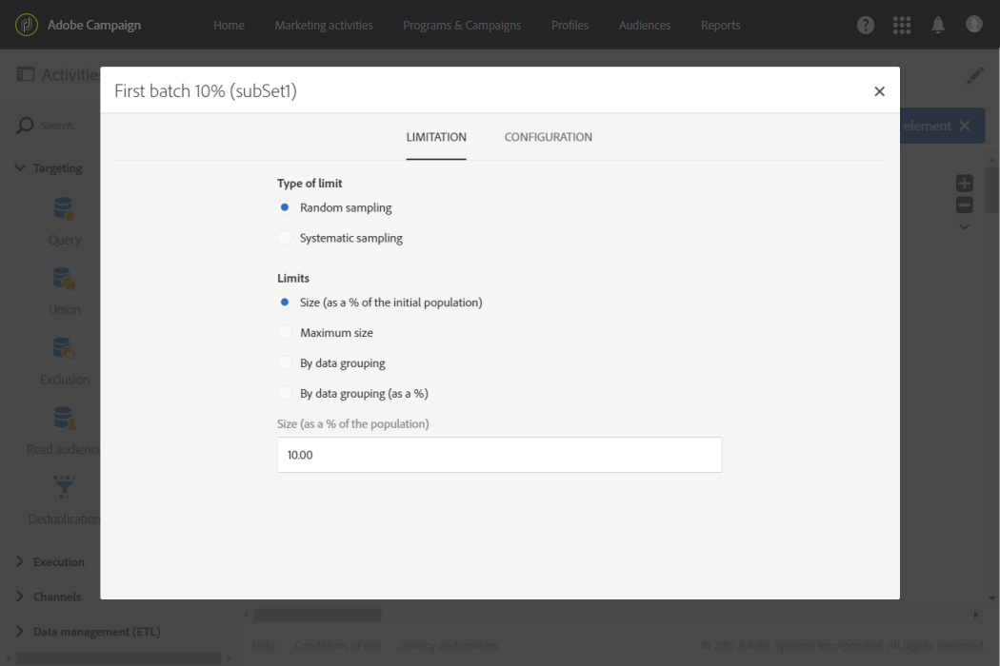
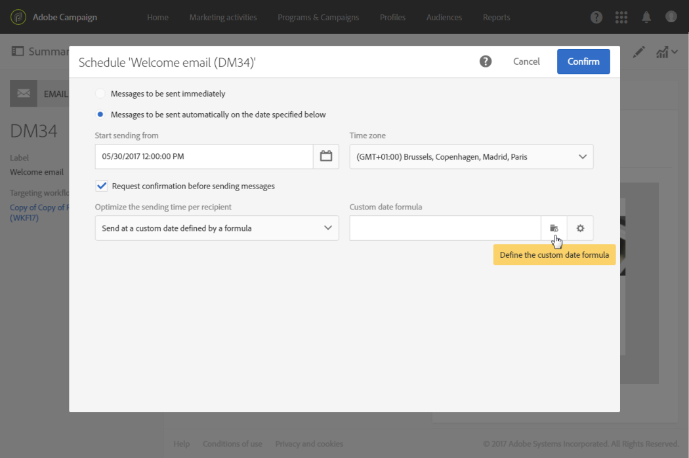
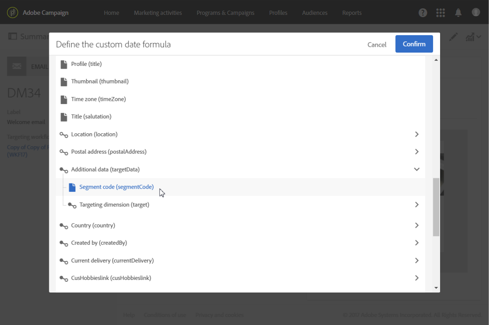
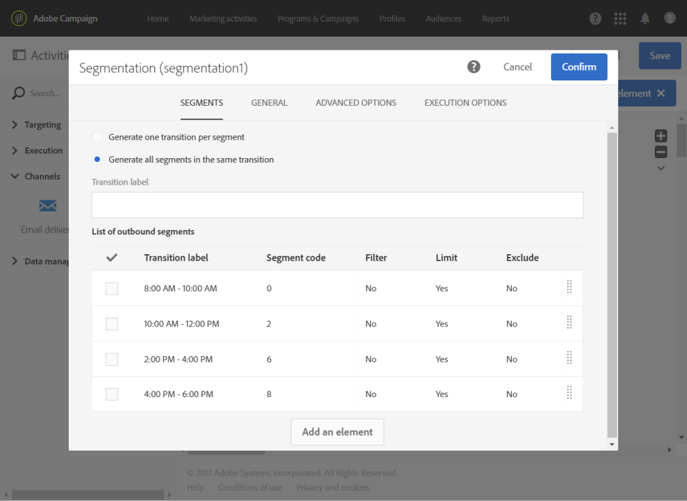
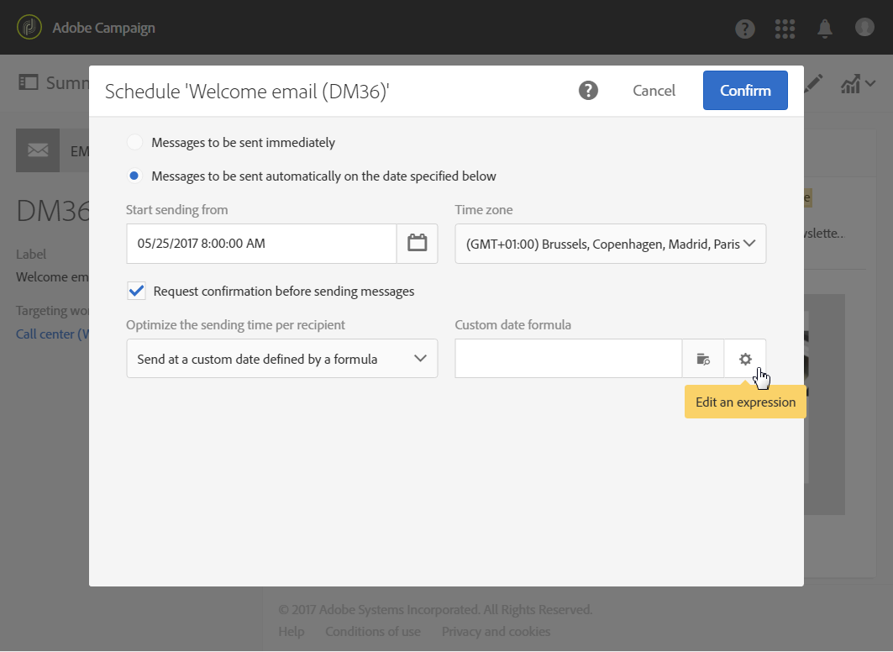
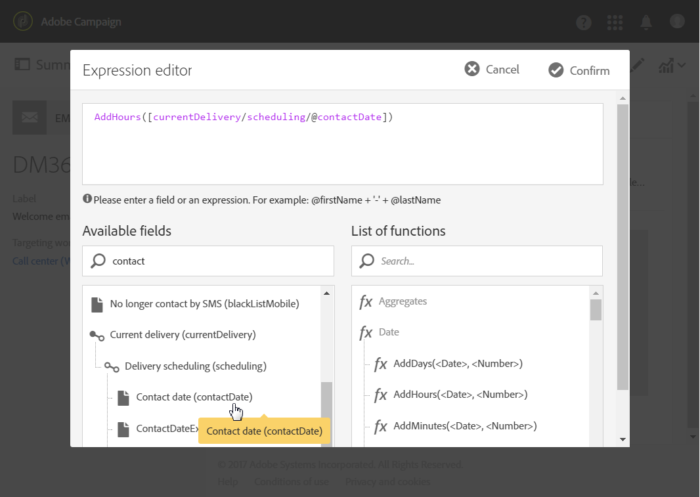

# 送信日の計算{#computing-the-sending-date}

特定の日時に各受信者にメッセージを送信する数式を定義できます。

## 日付式のカスタマイズ {#customizing-date-formula}

例えば、ランプアッププロセスで「送信時間の最適化」を使用できます。

新しいプラットフォームを使用してメールが送信された場合、インターネットサービスプロバイダー（ISP）は認識されない IP アドレスを疑わしく思います。 多くの場合、大量のメールが突然送信されると、ISP はそれらのメールをスパムとしてマークします。

迷惑メールとして判定されないようにするには、異なる期間に大量の電子メールを配信することで、送信量を段階的に増やすことができます。 この方法により、スタートアップフェーズをスムーズに進め、無効なアドレスが全体に占める割合を減らすことができます。

例えば、ターゲットオーディエンスをランダムにセグメンテーションし、5回バッチで配信を送信することができます。 6月1日の午前10:00時にターゲットオーディエンスの10%を表す最初のバッチを送信し、24時間後に15%のオーディエンスを含む2番目のバッチを送信します。

ワークフローを使用してスケジュールすることもできます。


1. マーケティングアクティビティリストにアクセスし、新しいワークフローを作成します。 [ワークフローの作成](../../automating/using/building-a-workflow.md#creating-a-workflow)を参照してください。
1. **クエリ** アクティビティをワークフローにドラッグ&amp;ドロップして開きます。 「[ クエリ ](../../automating/using/query.md)」セクションを参照してください。
1. すべてのゴールド顧客などのオーディエンスを選択し、**[!UICONTROL Confirm]**&#x200B;をクリックしてクエリを保存します。
1. **セグメント化** アクティビティをワークフローにドラッグ&amp;ドロップして開きます。 「[ セグメント化](../../automating/using/segmentation.md)」を参照してください。
1. 5つのセグメントを定義。 各セグメントについて：

   * 「**[!UICONTROL Segment code]**」フィールドに入力します。メッセージを送信する目的の日時を手動で入力します。

     例えば、6月1日午前10:00 GMT+1の最初のバッチを送信する場合です。 次の形式を使用してください：**`YYYY-MM-DD hh:mm:ss+tz`**。

     

     翌日に次のバッチを送信するには、2番目のセグメントに「**2017-06-02 10:00:00+01**」と入力します。

     残りのセグメントについて、次のバッチを次のように定義します。

      * **2017-06-03 10:00:00+01**
      * **2017-06-04 10:00:00+01**
      * **2017-06-05 10:00:00+01**

   * **[!UICONTROL Limit the population of this segment]** オプションを選択してください。

     「**[!UICONTROL Limitation]**」タブで「**[!UICONTROL Random sampling]**」を選択し、各セグメントに対する望ましい割合を入力します。最初のバッチは10、2番目のバッチは15など。

     

1. すべてのセグメントを定義したら、**[!UICONTROL Generate all segments in the same transition]**&#x200B;を選択し、**[!UICONTROL Confirm]**&#x200B;をクリックします。

   

1. **メール配信** アクティビティをワークフローにドラッグ&amp;ドロップして開きます。 「[ メール配信](../../automating/using/email-delivery.md)」セクションを参照してください。
1. 電子メールダッシュボードの「**[!UICONTROL Schedule]**」セクションをクリックし、**[!UICONTROL Messages to be sent automatically on the date specified below]**&#x200B;を選択します。
1. **[!UICONTROL Start sending from]** フィールドで、連絡先日を定義します。
1. 送信時間の最適化ドロップダウンメニューから、**[!UICONTROL Send at a custom date defined by a formula]**&#x200B;を選択します。
1. 「**[!UICONTROL Custom date formula]**」フィールドの「**[!UICONTROL Edit an expression]**」ボタンをクリックします。

   

1. **[!UICONTROL ToDateTime]**&#x200B;関数と&#x200B;**[!UICONTROL Segment code]** フィールドを使用して、次の式を作成します。 式に直接入力することもできますが、構文とスペルが正しいことを確認してください。

   ```
   ToDateTime([targetData/@segmentCode])
   ```

   **[!UICONTROL ToDateTime]**&#x200B;関数は、セグメントコードをテキスト文字列から日時の値に変換します。

   前の画面に戻るには、式を確認します。

   

   **[!UICONTROL Schedule]** ウィンドウでは、カスタム日付数式が次のように表示されます。

   ```
   ToDateTime([targetData/@segmentCode])
   ```

   

1. スケジュールを確認し、配信を保存してワークフローを実行します。

配信は、5日間にわたってすべてのターゲット受信者に段階的に送信されます。

>[!NOTE]
>
>送信を確認する際には、すべての日付が将来のものであることを確認してください。 そうしないと、送信が確認され次第、メッセージが送信されます。

## 式の使用 {#using-an-expression}

送信時間の最適化は、コールセンターを含むキャンペーンにも有効です。 すべてのメッセージが同時に受信されないようにすることができます。 これにより、組織は処理能力に応じて通話数を処理できます。

例えば、顧客がコールセンターに連絡するように促す電子メールを送信して、プロモーションのオファーを受け取ることができます。 コールセンターに負担をかけないようにするために、ターゲットオーディエンスをランダムにセグメント化し、メールを4回に分けて送信することにします。

ワークフローを使用してスケジュールすることもできます。


1. マーケティングアクティビティリストにアクセスし、新しいワークフローを作成します。 [ワークフローの作成](../../automating/using/building-a-workflow.md#creating-a-workflow)を参照してください。
1. **クエリ** アクティビティをワークフローにドラッグ&amp;ドロップして開きます。 「[ クエリ ](../../automating/using/query.md)」セクションを参照してください。
1. 35を超えるプロファイルなどのオーディエンスを選択し、**[!UICONTROL Confirm]**&#x200B;をクリックしてクエリを保存します。
1. **セグメント化** アクティビティをワークフローにドラッグ&amp;ドロップして開きます。 「[ セグメント化](../../automating/using/segmentation.md)」を参照してください。
1. 4つのセグメントを定義。 各セグメントについて：

   * セグメントコードを次のように定義します。

      * 午前8:00～午前10:00: **0**。 メッセージは、午前8:00時（連絡日）にターゲット母集団の第1四半期に送信されます。
      * 午前10:00～午後12:00 : **2**。 メッセージは、午前10:00時（連絡日+2時間）にターゲット母集団の第2四半期に送信されます。
      * 午後2:00 ～午後4:00 : **6**。 コールセンターが午後12:00から午後2:00までの間に閉鎖され、メッセージは午後2:00時にターゲット母集団の第3四半期に送信されます（連絡日+ 6時間）。
      * 午後4:00～午後6:00 : **8**。 メッセージは、午後4:00時（連絡日+8時間）にターゲット母集団の最後の四半期に送信されます。

     >[!NOTE]
     >
     >連絡日は、ワークフローの後でメール配信アクティビティで定義されます。

   * **[!UICONTROL Limit the population of this segment]** オプションを選択してください。
   * 「**[!UICONTROL Limitation]**」タブで「**[!UICONTROL Random sampling]**」を選択し、各セグメントの目的の割合（**25**）を入力します。

1. すべてのセグメントを定義したら、**[!UICONTROL Generate all segments in the same transition]**&#x200B;を選択し、**[!UICONTROL Confirm]**&#x200B;をクリックします。

   

1. **メール配信** アクティビティをワークフローにドラッグ&amp;ドロップして開きます。 「[ メール配信](../../automating/using/email-delivery.md)」セクションを参照してください。
1. 電子メールダッシュボードの「**[!UICONTROL Schedule]**」セクションをクリックします。
1. 「**[!UICONTROL Messages to be sent automatically on the date specified below]**」を選択します。
1. **[!UICONTROL Start sending from]** フィールドで、連絡先日を定義します。

   この例では、午前8:00時に5月25日を選択します。

1. 送信時間最適化ドロップダウンメニューから、**[!UICONTROL Send at a custom date defined by a formula]**&#x200B;を選択し、**[!UICONTROL Edit an expression]** ボタンをクリックします。

   

1. **[!UICONTROL Expression editor]**&#x200B;で、日付とセグメントコードを設定して、各顧客のデータを計算します。

   関数のリストで、**[!UICONTROL AddHours]**&#x200B;を選択します。

   

   使用可能なフィールドで、**[!UICONTROL Current delivery]** > **[!UICONTROL Delivery scheduling]** > **[!UICONTROL Contact date]**&#x200B;を選択します。

   

   これにより、**[!UICONTROL Start sending from]** フィールドで指定された日時を取得できます。

   関数のリストで、**[!UICONTROL ToInteger]**&#x200B;を選択します。 使用可能なフィールドで、**[!UICONTROL Additional data]** > **[!UICONTROL Segment code]**&#x200B;を選択します。

   

   これにより、セグメントコードで指定した数値を取得できます。

   次の式を使用します。

   ```
   AddHours([currentDelivery/scheduling/@contactDate], ToInteger([targetData/@segmentCode]))
   ```

1. 確認して式を保存します。 スケジュールを確認し、配信を保存してワークフローを実行します。

* 最初のセグメントは、連絡日（5月25日の午前8:00）にメッセージを受け取ります。
* 2番目のセグメントは、2時間後（5月25日（PT）午前10:00）にメッセージを受け取ります。
* 3番目のセグメントは、6時間後（5月25日の午後2:00）にメッセージを受け取ります。
* 4番目のセグメントは、8時間後（5月25日の午後4:00）にメッセージを受け取ります。
