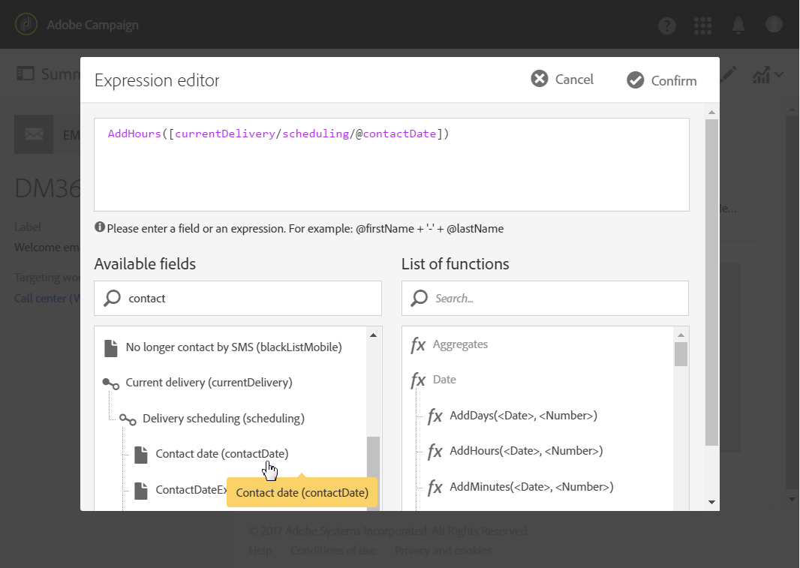

# 送信日の計算{#computing-the-sending-date}

特定の日時に各受信者にメッセージを送信する数式を定義できます。

## 日付式{#customizing-date-formula}のカスタマイズ

例えば、ランプアップ処理中に送信時間の最適化を使用できます。

新しいプラットフォームを使用して E メールが送信された場合、インターネットサービスプロバイダー（ISP）は認識されない IP アドレスを疑わしく思います。多くの場合、大量の E メールが突然送信されると、ISP はそれらの E メールをスパムとしてマークします。

スパムとしてマークされるのを防ぐために、大量の電子メールを異なる時間に配信することで、送信量を徐々に増やすことができます。 この方法により、スタートアップフェーズをスムーズに進め、無効なアドレスが全体に占める割合を減らすことができます。

例えば、ターゲットオーディエンスをランダムにセグメント化して、配信を5つのバッチで送信できます。 6月1日の午前10:00にターゲットオーディエンスの10%を表す最初のバッチを送信し、2回目のバッチを午前24時間後に送信し、15%のオーディエンスを表すバッチを送信します。

ワークフローを使用して、これをスケジュールできます。


1. マーケティングアクティビティリストにアクセスし、新しいワークフローを作成します。 [ワークフローの作成](../../automating/using/building-a-workflow.md#creating-a-workflow)を参照してください。
1. **クエリ**&#x200B;アクティビティをワークフローにドラッグ&amp;ドロップして開きます。 [クエリ](../../automating/using/query.md)の節を参照してください。
1. オーディエンスを選択します。例えば、すべてのゴールド顧客を選択し、**[!UICONTROL Confirm]**&#x200B;をクリックしてクエリを保存します。
1. **セグメント化**&#x200B;アクティビティをワークフローにドラッグ&amp;ドロップして開きます。 「[セグメント化](../../automating/using/segmentation.md)」の節を参照してください。
1. 5つのセグメントを定義します。 各セグメントに対して、次の操作を行います。

   * **[!UICONTROL Segment code]**&#x200B;フィールドに入力します。メッセージを送信する日時を手動で入力します。

      例えば、6月1日の午前10時(GMT+1)に最初のバッチを送信するとします。 次の形式を使用します。**YYYY-MM-DD hh:mm:ss+tz**。

      

      翌日に次のバッチを送信するには、2番目のセグメントに&#x200B;**2017-06-02 10:00:00+01**&#x200B;と入力します。

      残りのセグメントに対して、次のバッチを次のように定義します。

      * **2017-06-03 10:00:00+01**
      * **2017-06-04 10:00:00+01**
      * **2017-06-05 10:00:00+01**
   * **[!UICONTROL Limit the population of this segment]**&#x200B;オプションを選択していることを確認します。

      「**[!UICONTROL Limitation]**」タブで、「**[!UICONTROL Random sampling]**」を選択し、各セグメントに必要な割合を入力します。最初のバッチは10、2番目のバッチは15、以降同様です。

      


1. すべてのセグメントを定義したら、**[!UICONTROL Generate all segments in the same transition]**&#x200B;を選択し、**[!UICONTROL Confirm]**&#x200B;をクリックします。

   

1. **電子メール配信**&#x200B;アクティビティをワークフローにドラッグ&amp;ドロップして開きます。 「[電子メール配信](../../automating/using/email-delivery.md)」の節を参照してください。
1. 電子メールダッシュボードの&#x200B;**[!UICONTROL Schedule]**&#x200B;セクションをクリックし、**[!UICONTROL Messages to be sent automatically on the date specified below]**&#x200B;を選択します。
1. **[!UICONTROL Start sending from]**&#x200B;フィールドに連絡日を定義します。
1. 送信時間の最適化ドロップダウンメニューで、**[!UICONTROL Send at a custom date defined by a formula]**&#x200B;を選択します。
1. **[!UICONTROL Custom date formula]**&#x200B;フィールドの&#x200B;**[!UICONTROL Edit an expression]**&#x200B;ボタンをクリックします。

   

1. **[!UICONTROL ToDateTime]**&#x200B;関数と&#x200B;**[!UICONTROL Segment code]**&#x200B;フィールドを使用して、次の式を作成します。 式に直接入力することもできますが、正しい構文とスペルを使用するようにしてください。

   ```
   ToDateTime([targetData/@segmentCode])
   ```

   **[!UICONTROL ToDateTime]**&#x200B;関数は、セグメントコードをテキスト文字列から日付と時刻の値に変換します。

   前の画面に戻る式を確認します。

   

   **[!UICONTROL Schedule]**&#x200B;ウィンドウには、次のカスタム日付式が表示されます。

   ```
   ToDateTime([targetData/@segmentCode])
   ```

   

1. スケジュールを確認し、配信を保存して、ワークフローを実行します。

配信は、5日間にわたって対象となるすべての受信者にプログレッシブに送信されます。

>[!NOTE]
>
>送信を確認する際は、すべての日付が未来の日付になっていることを確認します。 それ以外の場合は、送信が確認され次第、メッセージが送信されます。

## 式の使用 {#using-an-expression}

送信時間の最適化は、コールセンターに関わるキャンペーンにも役立ちます。 すべてのメッセージを同時に受信しないようにすることができます。 これにより、組織は容量に応じて呼び出し数を処理できます。

例えば、プロモーションオファーを受け取るために、顧客がコールセンターに連絡するように勧める電子メールを送信するとします。 コールセンターの圧倒を避けるために、ターゲットオーディエンスをランダムにセグメント化して、電子メールを4つのバッチで送信することにします。

ワークフローを使用して、これをスケジュールできます。


1. マーケティングアクティビティリストにアクセスし、新しいワークフローを作成します。 [ワークフローの作成](../../automating/using/building-a-workflow.md#creating-a-workflow)を参照してください。
1. **クエリ**&#x200B;アクティビティをワークフローにドラッグ&amp;ドロップして開きます。 [クエリ](../../automating/using/query.md)の節を参照してください。
1. 例えば35プロファイル以上のオーディエンスを選択し、**[!UICONTROL Confirm]**&#x200B;をクリックしてクエリを保存します。
1. **セグメント化**&#x200B;アクティビティをワークフローにドラッグ&amp;ドロップして開きます。 「[セグメント化](../../automating/using/segmentation.md)」の節を参照してください。
1. 4つのセグメントを定義します。 各セグメントに対して、次の操作を行います。

   * セグメントコードを次のように定義します。

      * 8:00 AM ～ 10:00 AM:**0**。 メッセージは、午前8時（連絡先日）にターゲットの人口の第1四半期に送信されます。
      * 10:00 AM - 12:00 PM:**2**。 メッセージは、午前10時（連絡日+ 2時間）にターゲット訪問者の第2四半期に送信されます。
      * 2:00 PM - 4:00 PM:**6**。 コールセンターは午後12時から午後2時の間に閉鎖され、ターゲットの第3四半期の午後2時（連絡日+ 6時間）にメッセージが送信されます。
      * 午後4時～午後6時：**8**。 メッセージは、ターゲットの訪問者の最後の四半期の午後4時（連絡日+ 8時間）に送信されます。

      >[!NOTE]
      >
      >連絡先の日付は、ワークフローの後半の電子メール配信アクティビティで定義されます。

   * **[!UICONTROL Limit the population of this segment]**&#x200B;オプションを選択していることを確認します。
   * 「**[!UICONTROL Limitation]**」タブで、「**[!UICONTROL Random sampling]**」を選択し、各セグメントに必要な割合を入力します。**25**.


1. すべてのセグメントを定義したら、**[!UICONTROL Generate all segments in the same transition]**&#x200B;を選択し、**[!UICONTROL Confirm]**&#x200B;をクリックします。

   

1. **電子メール配信**&#x200B;アクティビティをワークフローにドラッグ&amp;ドロップして開きます。 「[電子メール配信](../../automating/using/email-delivery.md)」の節を参照してください。
1. 電子メールダッシュボードの&#x200B;**[!UICONTROL Schedule]**&#x200B;セクションをクリックします。
1. 「**[!UICONTROL Messages to be sent automatically on the date specified below]**」を選択します。
1. **[!UICONTROL Start sending from]**&#x200B;フィールドに連絡日を定義します。

   この例では、5月25日午前8時を選択します。

1. 送信時間の最適化ドロップダウンメニューで、**[!UICONTROL Send at a custom date defined by a formula]**&#x200B;を選択し、**[!UICONTROL Edit an expression]**&#x200B;ボタンをクリックします。

   

1. **[!UICONTROL Expression editor]**&#x200B;に、各顧客のデータを計算する日付とセグメントコードを設定します。

   関数のリストで、**[!UICONTROL AddHours]**&#x200B;を選択します。

   

   使用可能なフィールドで、**[!UICONTROL Current delivery]** > **[!UICONTROL Delivery scheduling]** > **[!UICONTROL Contact date]**&#x200B;を選択します。

   

   これにより、**[!UICONTROL Start sending from]**&#x200B;フィールドに指定された日時を取得できます。

   関数のリストで、**[!UICONTROL ToInteger]**&#x200B;を選択します。 使用可能なフィールドで、**[!UICONTROL Additional data]** > **[!UICONTROL Segment code]**&#x200B;を選択します。

   

   これにより、セグメントコードで指定した数値を取得できます。

   次の数式が必要です。

   ```
   AddHours([currentDelivery/scheduling/@contactDate], ToInteger([targetData/@segmentCode]))
   ```

1. 確認して式を保存します。 スケジュールを確認し、配信を保存して、ワークフローを実行します。

* 最初のセグメントは、連絡日（5月25日午前8時）にメッセージを受け取ります。
* 2つ目のセグメントは、2時間後（5月25日午前10時）にメッセージを受信します。
* 3つ目のセグメントは、6時間後（5月25日午後2時）にメッセージを受信します。
* 4番目のセグメントには、8時間後（5月25日午後4時）にメッセージが表示されます。

