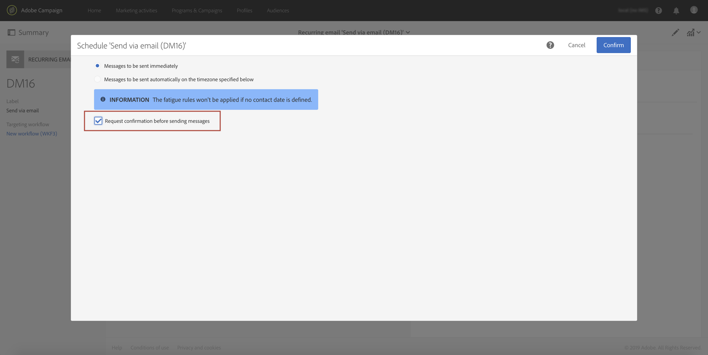
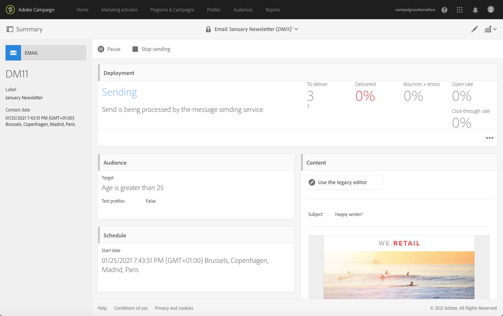

# 送信の確認{#confirming-the-send}

メッセージの準備と承認手順が完了したら、メッセージを送信できます。メッセージの準備について詳しくは、[送信の準備](../../sending/using/preparing-the-send.md)を参照してください。

**[!UICONTROL Start deliveries]** の役割を持つユーザーのみが送信を確認できます。 詳しくは、[役割のリスト](../../administration/using/list-of-roles.md)の節を参照してください。

<!--Users without this role will see the following message: 

-->

## メッセージの送信 {#sending-message}

準備が完了したら、次の手順に従ってメッセージを送信します。

1. メッセージのアクションバーにある「**[!UICONTROL Confirm send]**」ボタンをクリックします。

   

1. 送信ボタンをクリックして送信を完了 **[!UICONTROL OK]** ます。

   

1. メッセージを送信しています。しばらくお待ちください。 **[!UICONTROL Deployment]** ブロックには、送信の進行状況が表示されます。

>[!NOTE]
>
>メッセージがスケジュールされている場合は、送信時間に達すると送信されます。 メッセージのスケジュールについて詳しくは、[この節](../../sending/using/about-scheduling-messages.md)を参照してください。

集計期間のない繰り返し配信を使用している場合は、配信が送信される前に確認をリクエストできます。メッセージを設定する際に、配信ダッシュボードの **[!UICONTROL Schedule]** ブロックを開き、専用オプションを有効にします。

## メッセージ指標について {#message-indicators}

>[!NOTE]
>
> **デプロイメントダッシュボード** は、クイックリファレンス用のデータを提供します。このデータは、動的レポート内の数値と一致しない場合があります。 正確で信頼性の高い情報を得るには、動的レポートを情報源として使用することをお勧めします。 [詳細情報](../../reporting/using/get-started-reporting.md)

メッセージが連絡先に送信されると、**[!UICONTROL Deployment]** ゾーンに次のような KPI （主要業績評価指標） データが表示されます。

* 配信するメッセージの数
* 送信されたメッセージの数
* 配信されたメッセージの割合
* バウンスとエラーの割合
* メッセージの開封率
* メッセージ内クリック率（メールの場合）

  >[!NOTE]
  >
  >**[!UICONTROL Open rate]** と **[!UICONTROL Click-through rate]** は、1 時間ごとに更新されます。

KPI の更新に時間がかかりすぎるか、送信ログの結果が反映されない場合は、**[!UICONTROL Deployment]** ウィンドウの「**[!UICONTROL Compute stats]**」ボタンをクリックします。

メッセージは、ターゲットプロファイルの 1 つの履歴で表示できます。 [統合された顧客プロファイル](../../audiences/using/integrated-customer-profile.md)を参照してください。

メッセージを送信したら、受信者の行動を追跡し、影響を測定するために監視できます。 詳しくは、以下の節を参照してください。

* [メッセージのトラッキング](../../sending/using/tracking-messages.md)
* [配信の監視](../../sending/using/monitoring-a-delivery.md)

### 配信成功レポート {#delivered-status-report}

>[!NOTE]
>
>この節は、メールチャネルにのみ適用されます。

各メールの **[!UICONTROL Summary]** 表示では、**[!UICONTROL Delivered]** の割合は 100% から始まり、ソフトバウンスとハードバウンスがレポートされ返されるので、配信 [ 有効期間 ](../../administration/using/configuring-email-channel.md#validity-period-parameters) を通じて徐々に低下し <!--from the Enhanced MTA to Campaign--> す。

実際、Campaign から Enhanced MTA （メッセージ転送エージェント ](../../sending/using/monitoring-a-delivery.md#sending-logs) に正常に中継されるとすぐに、すべてのメッセージが [ 送信ログ）に **[!UICONTROL Sent]** のように表示されます。 メッセージの[バウンス](../../sending/using/understanding-delivery-failures.md#delivery-failure-types-and-reasons)が Enhanced MTA からキャンペーンに返されるまで、メッセージのステータスは変わりません。

Enhanced MTA からハードバウンスメッセージが報告されると、メッセージのステータスが **[!UICONTROL Sent]** から **[!UICONTROL Failed]** に変わり、それに応じて **[!UICONTROL Delivered]** のパーセンテージが減ります。

Enhanced MTA からソフトバウンスメッセージが返される場合は、引き続き **[!UICONTROL Sent]** と表示され、**[!UICONTROL Delivered]** のパーセンテージはまだ更新されていません。 ソフトバウンスメッセージは、配信の有効期間中ずっと[再試行](../../sending/using/understanding-delivery-failures.md#retries-after-a-delivery-temporary-failure)されます。

* 有効期限が切れる前に再試行が成功した場合、メッセージのステータスは **[!UICONTROL Sent]** のままとなり、**[!UICONTROL Delivered]** のパーセンテージは変わりません。

* それ以外の場合は、ステータスは **[!UICONTROL Failed]** に変わり、それに応じて **[!UICONTROL Delivered]** パーセンテージが減少します。

したがって、有効期間の終わりまで待って、最終的な **[!UICONTROL Delivered]** パーセンテージ、最終的な **[!UICONTROL Sent]** メッセージと **[!UICONTROL Failed]** メッセージの数を確認する必要があります。

### メールフィードバックサービス（ベータ版） {#email-feedback-service}

メールフィードバックサービス（EFS）機能を使用すると、フィードバックが Enhanced MTA（メッセージ転送エージェント）から直接取り込まれるので、各メールのステータスが正確にレポートされます。

>[!IMPORTANT]
>
>メールフィードバックサービスは、現在ベータ版機能としてご利用いただけます。

配信の開始後、Campaign から Enhanced MTA にメッセージが正常に中継されると、**[!UICONTROL Delivered]** のパーセンテージは変更されません。

配信ログには、対象アドレスごとに **[!UICONTROL Pending]** ステータスが表示されます。

ターゲットプロファイルへのメッセージ配信が Enhanced MTA からリアルタイムでレポートされると、配信ログは、メッセージを正常に受信したアドレスごとに **[!UICONTROL Sent]** ステータスを示します。 **[!UICONTROL Delivered]** のパーセンテージは、配信が成功するたびに増加します。

Enhanced MTA からハードバウンスメッセージが報告されると、ログのステータスが **[!UICONTROL Pending]** から **[!UICONTROL Failed]** に変わり、それに応じて **[!UICONTROL Bounces + errors]** のパーセンテージが増えます。

Enhanced MTA からソフトバウンスメッセージが報告されると、ログのステータスも **[!UICONTROL Pending]** から **[!UICONTROL Failed]** に変わり、それに応じて **[!UICONTROL Bounces + errors]** のパーセンテージが増えます。 **[!UICONTROL Delivered]** のパーセンテージは変わりません。 その後、ソフトバウンスメッセージが配信[有効期間](../../administration/using/configuring-email-channel.md#validity-period-parameters)中ずっと再試行されます。

* 有効期間の終了前に再試行が成功した場合、メッセージのステータスは **[!UICONTROL Sent]** に変わり、それに応じて **[!UICONTROL Delivered]** の割合が増えます。

* それ以外の場合、ステータスは **[!UICONTROL Failed]** のままです。 **[!UICONTROL Delivered]** と **[!UICONTROL Bounces + errors]** のパーセンテージは変更されません。

>[!NOTE]
>
>ハードバウンスとソフトバウンスについて詳しくは、[この節](../../sending/using/understanding-delivery-failures.md#delivery-failure-types-and-reasons)を参照してください。
>
>一時的な配信エラー後の再試行について詳しくは、[この節](../../sending/using/understanding-delivery-failures.md#retries-after-a-delivery-temporary-failure)を参照してください。

<!--Soft-bouncing messages increment an error counter. When the error counter reaches the limit threshold or when the validity period is over, the address goes into quarantine and the status remains as **[!UICONTROL Failed]**. For more on conditions for sending an address to quarantine, see [this section](../../help/sending/using/understanding-quarantine-management.md#conditions-for-sending-an-address-to-quarantine).-->

### EFS によって導入された変更 {#changes-introduced-by-efs}

次の表に、KPI の変更と、EFS 機能によって導入された送信ログのステータスを示します。

**メールフィードバックサービスを使用する**

| 送信プロセスの手順 | KPI 概要 | 送信ログのステータス |
|--- |--- |--- |
| Campaign から Enhanced MTA にメッセージが正常に転送される | <ul><li>0%**[!UICONTROL Delivered]** ら始まる割合</li><li>0%**[!UICONTROL Bounces + errors]** ら始まる割合</li></ul> | 保留中 |
| Enhanced MTA からハードバウンスメッセージが返される | <ul><li>パーセンテ **[!UICONTROL Delivered]** ージに変更なし</li><li>それに応じ **[!UICONTROL Bounces + errors]** パーセンテージが増加します</li></ul> | 失敗 |
| ソフトバウンスメッセージが Enhanced MTA から返される | <ul><li>パーセンテ **[!UICONTROL Delivered]** ージに変更なし</li><li>それに応じ **[!UICONTROL Bounces + errors]** パーセンテージが増加します</li></ul> | 失敗 |
| ソフトバウンスメッセージの再試行が成功する | <ul><li>それに応じ **[!UICONTROL Delivered]** パーセンテージが増加します</li><li>それに応じ **[!UICONTROL Bounces + errors]** パーセンテージが減少します</li></ul> | 送信済み |
| ソフトバウンスメッセージの再試行に失敗する | <ul><li> パーセンテ **[!UICONTROL Delivered]** ージに変更なし </li><li> パーセンテ **[!UICONTROL Bounces + errors]** ージに変更なし </li></ul> | 失敗 |

**メールフィードバックサービスを使用しない**

| 送信プロセスの手順 | KPI 概要 | 送信ログのステータス |
|--- |--- |--- |
| Campaign から Enhanced MTA にメッセージが正常に転送される | <ul><li>**[!UICONTROL Delivered]** の割合は 100% から始まります</li><li>0%**[!UICONTROL Bounces + errors]** ら始まる割合</li></ul> | 送信済み |
| Enhanced MTA からハードバウンスメッセージが返される | <ul><li>それに応じ **[!UICONTROL Delivered]** パーセンテージが減少します</li><li>それに応じ **[!UICONTROL Bounces + errors]** パーセンテージが増加します</li></ul> | 失敗 |
| ソフトバウンスメッセージが Enhanced MTA から返される | <ul><li>パーセンテ **[!UICONTROL Delivered]** ージに変更なし</li><li>パーセンテ **[!UICONTROL Bounces + errors]** ージに変更なし</li></ul> | 送信済み |
| ソフトバウンスメッセージの再試行が成功する | <ul><li>パーセンテ **[!UICONTROL Delivered]** ージに変更なし</li><li>パーセンテ **[!UICONTROL Bounces + errors]** ージに変更なし</li></ul> | 送信済み |
| ソフトバウンスメッセージの再試行に失敗する | <ul><li>それに応じ **[!UICONTROL Delivered]** パーセンテージが減少します</li><li>それに応じ **[!UICONTROL Bounces + errors]** パーセンテージが増加します</li></ul> | 失敗 |
