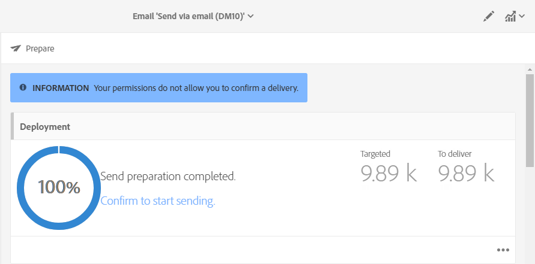
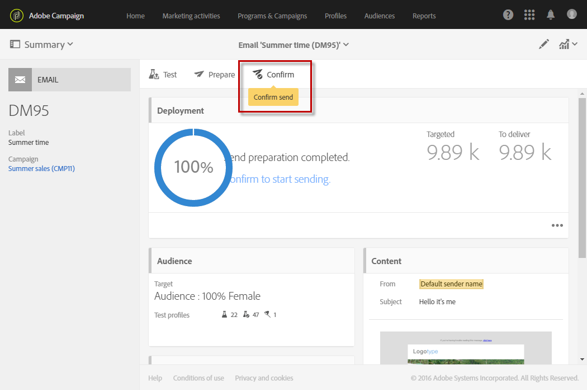
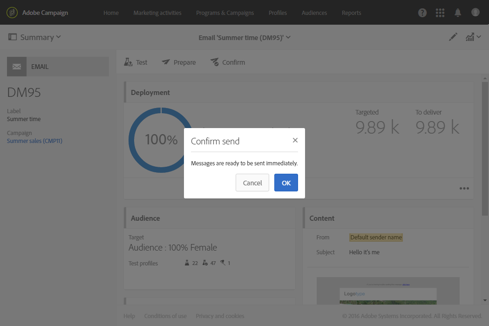
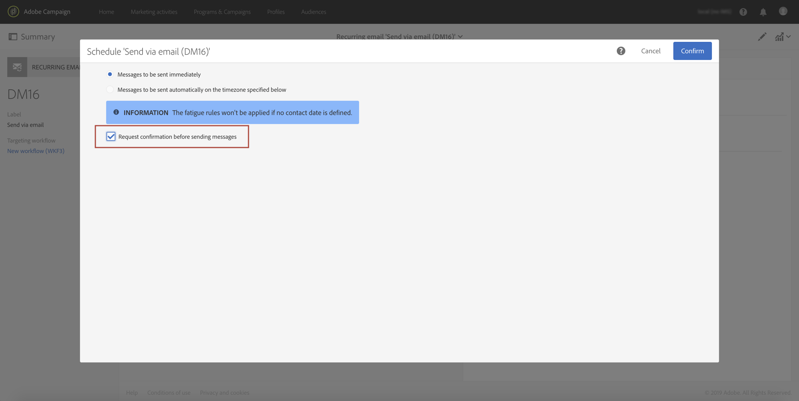
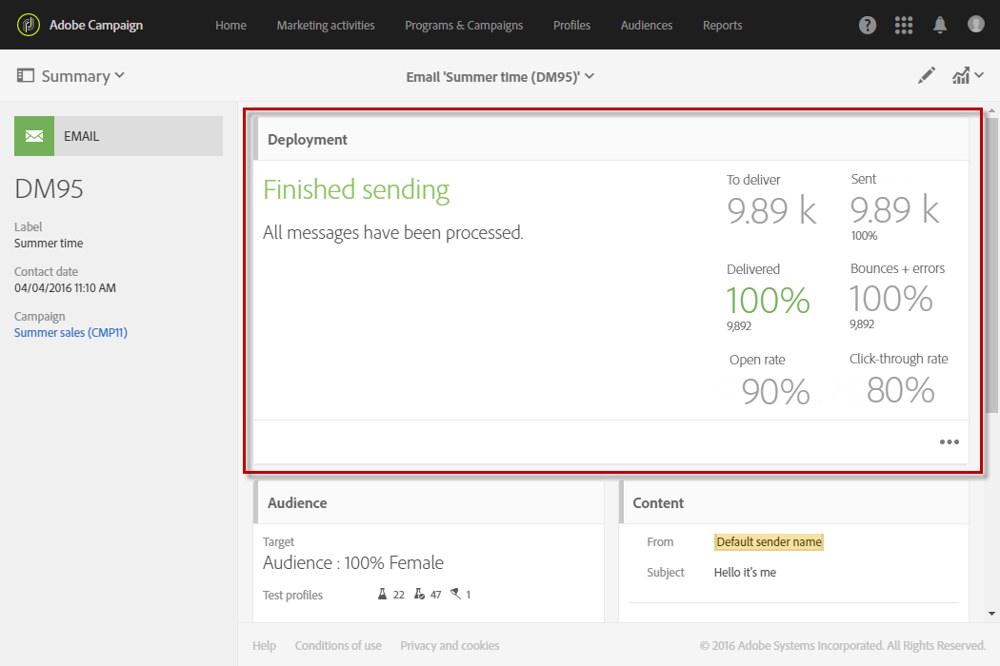
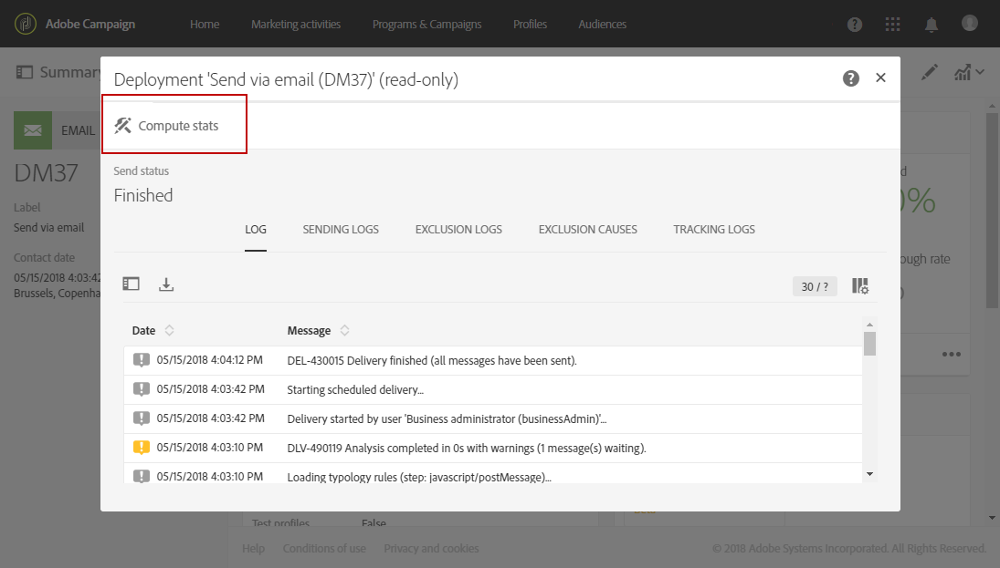
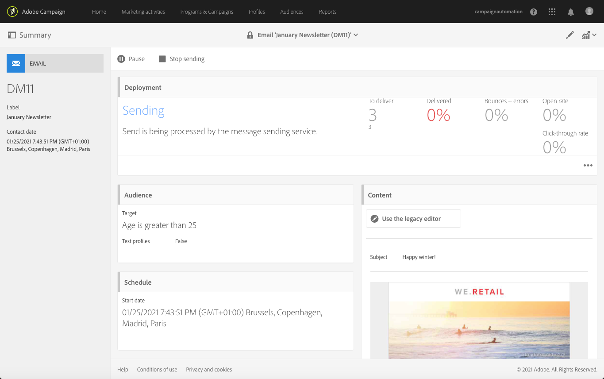
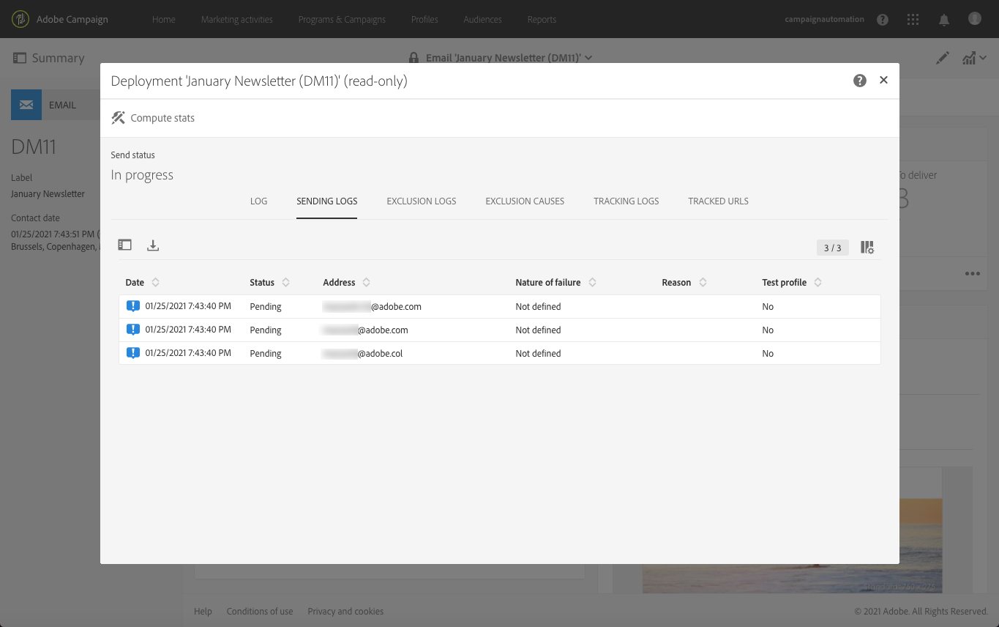

# 送信の確認{#confirming-the-send}

メッセージの準備と承認手順が完了したら、メッセージを送信できます。メッセージの準備について詳しくは、[送信の準備](../../sending/using/preparing-the-send.md)を参照してください。

送信を確認できるのは、**[!UICONTROL Start deliveries]**&#x200B;の役割を持つユーザーのみです。 詳しくは、[役割のリスト](../../administration/using/list-of-roles.md)の節を参照してください。

<!--
Users without this role will see the following message:

-->

## メッセージの送信 {#sending-message}

準備が完了したら、次の手順に従ってメッセージを送信します。

1. メッセージのアクションバーにある&#x200B;**[!UICONTROL Confirm send]** ボタンをクリックします。

   

1. **[!UICONTROL OK]** ボタンをクリックして、送信を確定します。

   

1. メッセージを送信しています。 **[!UICONTROL Deployment]** ブロックには、送信の進行状況が表示されます。

>[!NOTE]
>
>メッセージがスケジュールされている場合は、送信時間に達したときに送信されます。 メッセージのスケジュールについて詳しくは、[この節](../../sending/using/about-scheduling-messages.md)を参照してください。

集計期間のない繰り返し配信を使用している場合は、配信が送信される前に確認をリクエストできます。メッセージを設定する際に、配信ダッシュボードの&#x200B;**[!UICONTROL Schedule]** ブロックを開き、専用オプションを有効にします。

## メッセージ指標について {#message-indicators}

>[!NOTE]
>
> **デプロイメントダッシュボード**&#x200B;は、クイック参照用のデータを提供しますが、動的レポートの数値と一致しない場合があります。 正確で信頼性の高い情報を得るには、信頼できる唯一の情報源として動的レポートを使用することをお勧めします。 [詳細情報](../../reporting/using/get-started-reporting.md)

メッセージが連絡先に送信されると、**[!UICONTROL Deployment]** ゾーンには、次のようなKPI （主要業績評価指標）データが表示されます。

* 配信するメッセージの数
* 送信されたメッセージの数
* 配信されたメッセージの割合
* バウンスとエラーの割合
* メッセージの開封率
* メッセージ内クリック率（メールの場合）

  >[!NOTE]
  >
  >**[!UICONTROL Open rate]** と **[!UICONTROL Click-through rate]** は、1 時間ごとに更新されます。

KPIの更新に時間がかかりすぎたり、送信ログの結果が反映されない場合は、**[!UICONTROL Compute stats]** ウィンドウの「**[!UICONTROL Deployment]**」ボタンをクリックします。

メッセージは、ターゲットプロファイルの1つの履歴で表示できます。 [統合された顧客プロファイル](../../audiences/using/integrated-customer-profile.md)を参照してください。

メッセージを送信したら、受信者の行動を追跡し、その影響を測定するために監視することができます。 詳しくは、以下の節を参照してください。

* [メッセージのトラッキング](../../sending/using/tracking-messages.md)
* [配信の監視](../../sending/using/monitoring-a-delivery.md)

### 配信成功レポート {#delivered-status-report}

>[!NOTE]
>
>このセクションは、メールチャネルにのみ適用されます。

各メールの&#x200B;**[!UICONTROL Summary]** ビューでは、**[!UICONTROL Delivered]**&#x200B;の割合は100%で始まり、ソフトバウンスとハードバウンスが報告されるので、配信[有効期限](../../administration/using/configuring-email-channel.md#validity-period-parameters)を通じて徐々に下がります<!--from the Enhanced MTA to Campaign-->。

実際、すべてのメッセージは、CampaignからEnhanced MTA （Message Transfer Agent）に正常に中継されるとすぐに、**[!UICONTROL Sent]**&#x200B;送信ログ [に](../../sending/using/monitoring-a-delivery.md#sending-logs)と表示されます。 メッセージの[バウンス](../../sending/using/understanding-delivery-failures.md#delivery-failure-types-and-reasons)が Enhanced MTA からキャンペーンに返されるまで、メッセージのステータスは変わりません。

強化されたMTAからハードバウンス メッセージが報告されると、ステータスが&#x200B;**[!UICONTROL Sent]**&#x200B;から&#x200B;**[!UICONTROL Failed]**&#x200B;に変更され、それに応じて&#x200B;**[!UICONTROL Delivered]**&#x200B;の割合が減少します。

ソフトバウンスのメッセージが拡張MTAから報告された場合、まだ&#x200B;**[!UICONTROL Sent]**&#x200B;として表示され、**[!UICONTROL Delivered]**&#x200B;の割合はまだ更新されていません。 ソフトバウンスメッセージは、配信の有効期間中ずっと[再試行](../../sending/using/understanding-delivery-failures.md#retries-after-a-delivery-temporary-failure)されます。

* 有効期間が終了する前に再試行が成功した場合、メッセージのステータスは&#x200B;**[!UICONTROL Sent]**&#x200B;のままとなり、**[!UICONTROL Delivered]**&#x200B;の割合は変更されません。

* それ以外の場合、ステータスは&#x200B;**[!UICONTROL Failed]**&#x200B;に変更され、それに応じて&#x200B;**[!UICONTROL Delivered]**&#x200B;の割合が減少します。

したがって、有効期間が終了するまで待って、最終的な&#x200B;**[!UICONTROL Delivered]** パーセンテージ、および最終的なメッセージ数&#x200B;**[!UICONTROL Sent]**&#x200B;と&#x200B;**[!UICONTROL Failed]**&#x200B;を確認する必要があります。

### メールフィードバックサービス（ベータ版） {#email-feedback-service}

メールフィードバックサービス（EFS）機能を使用すると、フィードバックが Enhanced MTA（メッセージ転送エージェント）から直接取り込まれるので、各メールのステータスが正確にレポートされます。

>[!IMPORTANT]
>
>メールフィードバックサービスは、現在ベータ版機能としてご利用いただけます。

配信が開始されると、メッセージがCampaignからEnhanced MTAに正常に中継される際に、**[!UICONTROL Delivered]** パーセントに変更はありません。

配信ログには、ターゲットアドレスごとに&#x200B;**[!UICONTROL Pending]** ステータスが表示されます。

ターゲット プロファイルへのメッセージ配信がEnhanced MTAからリアルタイムで報告されると、配信ログには、メッセージを正常に受信した各アドレスの&#x200B;**[!UICONTROL Sent]** ステータスが表示されます。 配信が成功するたびに、**[!UICONTROL Delivered]** パーセンテージが増加します。

強化されたMTAからハードバウンスメッセージが報告されると、ログステータスが&#x200B;**[!UICONTROL Pending]**&#x200B;から&#x200B;**[!UICONTROL Failed]**&#x200B;に変更され、それに応じて&#x200B;**[!UICONTROL Bounces + errors]**&#x200B;の割合が増加します。

ソフトバウンスメッセージが拡張MTAから報告されると、ログステータスも&#x200B;**[!UICONTROL Pending]**&#x200B;から&#x200B;**[!UICONTROL Failed]**&#x200B;に変更され、それに応じて&#x200B;**[!UICONTROL Bounces + errors]**&#x200B;の割合が増加します。 **[!UICONTROL Delivered]**&#x200B;の割合は変更されません。 その後、ソフトバウンスメッセージが配信[有効期間](../../administration/using/configuring-email-channel.md#validity-period-parameters)中ずっと再試行されます。

* 有効期限が終了する前に再試行が成功した場合、メッセージステータスは&#x200B;**[!UICONTROL Sent]**&#x200B;に変わり、それに応じて&#x200B;**[!UICONTROL Delivered]**&#x200B;の割合が増加します。

* それ以外の場合、ステータスは&#x200B;**[!UICONTROL Failed]**&#x200B;のままです。 **[!UICONTROL Delivered]**&#x200B;と&#x200B;**[!UICONTROL Bounces + errors]**&#x200B;の割合は変更されません。

>[!NOTE]
>
>ハードバウンスとソフトバウンスについて詳しくは、[この節](../../sending/using/understanding-delivery-failures.md#delivery-failure-types-and-reasons)を参照してください。
>
>一時的な配信エラー後の再試行について詳しくは、[この節](../../sending/using/understanding-delivery-failures.md#retries-after-a-delivery-temporary-failure)を参照してください。

<!--Soft-bouncing messages increment an error counter. When the error counter reaches the limit threshold or when the validity period is over, the address goes into quarantine and the status remains as **[!UICONTROL Failed]**. For more on conditions for sending an address to quarantine, see [this section](../../help/sending/using/understanding-quarantine-management.md#conditions-for-sending-an-address-to-quarantine).-->

### EFSによって導入された変更 {#changes-introduced-by-efs}

次の表に、KPI の変更と、EFS 機能によって導入された送信ログのステータスを示します。

**メールフィードバックサービスを使用する**

| 送信プロセスの手順 | KPI 概要 | 送信ログのステータス |
|--- |--- |--- |
| Campaign から Enhanced MTA にメッセージが正常に転送される | <ul><li>**[!UICONTROL Delivered]**&#x200B;の割合は0%から始まります</li><li>**[!UICONTROL Bounces + errors]**&#x200B;の割合は0%から始まります</li></ul> | 保留中 |
| Enhanced MTA からハードバウンスメッセージが返される | <ul><li>**[!UICONTROL Delivered]** パーセンテージに変更はありません</li><li>それに応じて&#x200B;**[!UICONTROL Bounces + errors]**&#x200B;の割合が増加します</li></ul> | 失敗 |
| ソフトバウンスメッセージが Enhanced MTA から返される | <ul><li>**[!UICONTROL Delivered]** パーセンテージに変更はありません</li><li>それに応じて&#x200B;**[!UICONTROL Bounces + errors]**&#x200B;の割合が増加します</li></ul> | 失敗 |
| ソフトバウンスメッセージの再試行が成功する | <ul><li>それに応じて&#x200B;**[!UICONTROL Delivered]**&#x200B;の割合が増加します</li><li>それに応じて&#x200B;**[!UICONTROL Bounces + errors]** パーセントが減少します</li></ul> | 送信済み |
| ソフトバウンスメッセージの再試行に失敗する | <ul><li> **[!UICONTROL Delivered]** パーセンテージに変更はありません </li><li> **[!UICONTROL Bounces + errors]** パーセンテージに変更はありません </li></ul> | 失敗 |

**メールフィードバックサービスを使用しない**

| 送信プロセスの手順 | KPI 概要 | 送信ログのステータス |
|--- |--- |--- |
| Campaign から Enhanced MTA にメッセージが正常に転送される | <ul><li>**[!UICONTROL Delivered]**&#x200B;の割合は100%から始まります</li><li>**[!UICONTROL Bounces + errors]**&#x200B;の割合は0%から始まります</li></ul> | 送信済み |
| Enhanced MTA からハードバウンスメッセージが返される | <ul><li>それに応じて&#x200B;**[!UICONTROL Delivered]** パーセントが減少します</li><li>それに応じて&#x200B;**[!UICONTROL Bounces + errors]**&#x200B;の割合が増加します</li></ul> | 失敗 |
| ソフトバウンスメッセージが Enhanced MTA から返される | <ul><li>**[!UICONTROL Delivered]** パーセンテージに変更はありません</li><li>**[!UICONTROL Bounces + errors]** パーセンテージに変更はありません</li></ul> | 送信済み |
| ソフトバウンスメッセージの再試行が成功する | <ul><li>**[!UICONTROL Delivered]** パーセンテージに変更はありません</li><li>**[!UICONTROL Bounces + errors]** パーセンテージに変更はありません</li></ul> | 送信済み |
| ソフトバウンスメッセージの再試行に失敗する | <ul><li>それに応じて&#x200B;**[!UICONTROL Delivered]** パーセントが減少します</li><li>それに応じて&#x200B;**[!UICONTROL Bounces + errors]**&#x200B;の割合が増加します</li></ul> | 失敗 |
