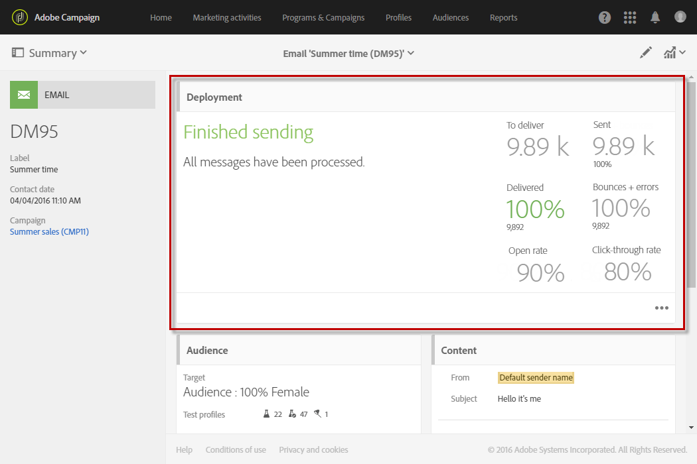
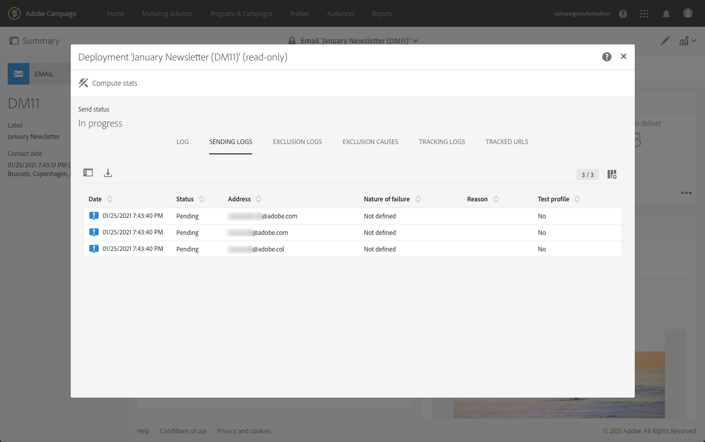

# 送信の確認{#confirming-the-send}

メッセージの準備と承認手順が完了したら、メッセージを送信できます。メッセージの準備について詳しくは、[送信の準備](../../sending/using/preparing-the-send.md)を参照してください。

送信を確認できるのは、**[!UICONTROL Start deliveries]**&#x200B;の役割を持つユーザーのみです。 詳しくは、[役割のリスト](../../administration/using/list-of-roles.md)の節を参照してください。

<!--Users without this role will see the following message: 

-->

## メッセージの送信 {#sending-message}

準備が完了したら、次の手順に従ってメッセージを送信します。

1. メッセージのアクションバーにある「**[!UICONTROL Confirm send]**」ボタンをクリックします。

   

1. 「**[!UICONTROL OK]**」ボタンをクリックして送信を完了します。

   

1. メッセージの送信中です。しばらくお待ちください。 **[!UICONTROL Deployment]** ブロックには、送信の進行状況が表示されます。

>[!NOTE]
>
>メッセージがスケジュールされている場合は、送信時間に達したときに送信されます。 メッセージのスケジュールについて詳しくは、[この節](../../sending/using/about-scheduling-messages.md)を参照してください。

集計期間のない繰り返し配信を使用している場合は、配信が送信される前に確認をリクエストできます。メッセージを設定する際に、配信ダッシュボードの&#x200B;**[!UICONTROL Schedule]**&#x200B;ブロックを開き、専用オプションを有効にします。

## メッセージ指標について {#message-indicators}

メッセージが連絡先に送信されると、**[!UICONTROL Deployment]** ゾーンには次のような KPI（主要業績評価指標）データが表示されます。

* 配信するメッセージの数
* 送信されたメッセージの数
* 配信されたメッセージの割合
* バウンスとエラーの割合
* メッセージの開封率
* メッセージ内クリック率（E メールの場合）

   >[!NOTE]
   >
   >**[!UICONTROL Open rate]** と **[!UICONTROL Click-through rate]** は、1 時間ごとに更新されます。

KPIの更新に時間がかかりすぎる場合、または送信ログの結果が反映されていない場合は、**[!UICONTROL Deployment]**&#x200B;ウィンドウの「**[!UICONTROL Compute stats]**」ボタンをクリックします。

メッセージは、ターゲットプロファイルの1つの履歴で表示できます。 [統合された顧客プロファイル](../../audiences/using/integrated-customer-profile.md)を参照してください。

メッセージが送信されたら、その受信者の行動をトラッキングし、メッセージを監視して影響を測定できます。 詳しくは、以下の節を参照してください。

* [メッセージのトラッキング](../../sending/using/tracking-messages.md)
* [配信の監視](../../sending/using/monitoring-a-delivery.md)

### 配信成功レポート {#delivered-status-report}

>[!NOTE]
>
>この節は、Eメールチャネルにのみ適用されます。

各Eメールの&#x200B;**[!UICONTROL Summary]**&#x200B;表示では、**[!UICONTROL Delivered]**&#x200B;の割合は100%から始まり、配信の有効期間を通して徐々に減少します。これは、ソフトバウンスとハードバウンスが<!--from the Enhanced MTA to Campaign-->に報告されるからです。

実際、すべてのメッセージは、CampaignからEnhanced MTA（メッセージ転送エージェント）に正常にリレーされるとすぐに、[送信ログ](../../sending/using/monitoring-a-delivery.md#sending-logs)に&#x200B;**[!UICONTROL Sent]**&#x200B;として表示されます。 メッセージの[バウンス](../../sending/using/understanding-delivery-failures.md#delivery-failure-types-and-reasons)が Enhanced MTA からキャンペーンに返されるまで、メッセージのステータスは変わりません。

ハードバウンスメッセージがEnhanced MTAから返されると、そのステータスが&#x200B;**[!UICONTROL Sent]**&#x200B;から&#x200B;**[!UICONTROL Failed]**&#x200B;に変わり、それに応じて&#x200B;**[!UICONTROL Delivered]**&#x200B;の割合が減少します。

ソフトバウンスメッセージがEnhanced MTAから返された場合でも、**[!UICONTROL Sent]**&#x200B;と表示され、**[!UICONTROL Delivered]**&#x200B;の割合はまだ更新されていません。 ソフトバウンスメッセージは、配信の有効期間中ずっと[再試行](../../sending/using/understanding-delivery-failures.md#retries-after-a-delivery-temporary-failure)されます。

* 有効期間が終了する前に再試行が成功した場合、メッセージのステータスは&#x200B;**[!UICONTROL Sent]**&#x200B;のままになり、**[!UICONTROL Delivered]**&#x200B;の割合は変わりません。

* それ以外の場合は、ステータスが&#x200B;**[!UICONTROL Failed]**&#x200B;に変わり、それに応じて&#x200B;**[!UICONTROL Delivered]**&#x200B;の割合が減ります。

したがって、有効期間が終わるまで待って、最終的な&#x200B;**[!UICONTROL Delivered]**&#x200B;の割合と、**[!UICONTROL Sent]**&#x200B;および&#x200B;**[!UICONTROL Failed]**&#x200B;メッセージの最終値を確認する必要があります。

### E メールフィードバックサービス（ベータ版）  {#email-feedback-service}

E メールフィードバックサービス（EFS）機能を使用すると、フィードバックが Enhanced MTA（メッセージ転送エージェント）から直接取り込まれるので、各 E メールのステータスが正確にレポートされます。

>[!IMPORTANT]
>
>E メールフィードバックサービスは、現在ベータ版機能としてご利用いただけます。

配信が開始された後、メッセージがCampaignからEnhanced MTAに正常にリレーされたときに、**[!UICONTROL Delivered]**&#x200B;の割合に変化はありません。

配信ログには、ターゲットアドレスごとに&#x200B;**[!UICONTROL Pending]**&#x200B;ステータスが表示されます。

ターゲットプロファイルへのメッセージ配信がEnhanced MTAからリアルタイムでレポートされると、配信ログには、メッセージを正常に受信した各アドレスの&#x200B;**[!UICONTROL Sent]**&#x200B;ステータスが表示されます。 配信が成功するたびに、**[!UICONTROL Delivered]**&#x200B;の割合が増えます。

ハードバウンスメッセージがEnhanced MTAから返されると、ログのステータスが&#x200B;**[!UICONTROL Pending]**&#x200B;から&#x200B;**[!UICONTROL Failed]**&#x200B;に変わり、それに応じて&#x200B;**[!UICONTROL Bounces + errors]**&#x200B;の割合が増加します。

ソフトバウンスメッセージがEnhanced MTAから返されると、ログのステータスも&#x200B;**[!UICONTROL Pending]**&#x200B;から&#x200B;**[!UICONTROL Failed]**&#x200B;に変わり、それに応じて&#x200B;**[!UICONTROL Bounces + errors]**&#x200B;の割合が増加します。 **[!UICONTROL Delivered]**&#x200B;の割合は変更されません。 その後、ソフトバウンスメッセージが配信[有効期間](../../administration/using/configuring-email-channel.md#validity-period-parameters)中ずっと再試行されます。

* 有効期間が終了する前に再試行が成功した場合、メッセージのステータスが&#x200B;**[!UICONTROL Sent]**&#x200B;に変わり、それに応じて&#x200B;**[!UICONTROL Delivered]**&#x200B;の割合が増加します。

* それ以外の場合、ステータスは&#x200B;**[!UICONTROL Failed]**&#x200B;のままになります。 **[!UICONTROL Delivered]**&#x200B;と&#x200B;**[!UICONTROL Bounces + errors]**&#x200B;の割合は変更されません。

>[!NOTE]
>
>ハードバウンスとソフトバウンスについて詳しくは、[この節](../../sending/using/understanding-delivery-failures.md#delivery-failure-types-and-reasons)を参照してください。
>
>一時的な配信エラー後の再試行について詳しくは、[この節](../../sending/using/understanding-delivery-failures.md#retries-after-a-delivery-temporary-failure)を参照してください。

<!--Soft-bouncing messages increment an error counter. When the error counter reaches the limit threshold or when the validity period is over, the address goes into quarantine and the status remains as **[!UICONTROL Failed]**. For more on conditions for sending an address to quarantine, see [this section](../../help/sending/using/understanding-quarantine-management.md#conditions-for-sending-an-address-to-quarantine).-->

### EFSによって導入された変更 {#changes-introduced-by-efs}

次の表に、KPI の変更と、EFS 機能によって導入された送信ログのステータスを示します。

**E メールフィードバックサービスを使用する**

| 送信プロセスの手順 | KPI 概要 | 送信ログのステータス |
|--- |--- |--- |
| Campaign から Enhanced MTA にメッセージが正常に転送される | <ul><li>**[!UICONTROL Delivered]** 0%から始まる割合</li><li>**[!UICONTROL Bounces + errors]** 0%から始まる割合</li></ul> | 保留中 |
| Enhanced MTA からハードバウンスメッセージが返される | <ul><li>**[!UICONTROL Delivered]**&#x200B;パーセントの変化はありません</li><li>**[!UICONTROL Bounces + errors]** それに応じて割合が増加する</li></ul> | 失敗 |
| ソフトバウンスメッセージが Enhanced MTA から返される | <ul><li>**[!UICONTROL Delivered]**&#x200B;パーセントの変化はありません</li><li>**[!UICONTROL Bounces + errors]** それに応じて割合が増加する</li></ul> | 失敗 |
| ソフトバウンスメッセージの再試行が成功する | <ul><li>**[!UICONTROL Delivered]** それに応じて割合が増加する</li><li>**[!UICONTROL Bounces + errors]** それに応じて割合が減少する</li></ul> | 送信済み |
| ソフトバウンスメッセージの再試行に失敗する | <ul><li> **[!UICONTROL Delivered]**&#x200B;パーセントの変化はありません </li><li> **[!UICONTROL Bounces + errors]**&#x200B;パーセントの変化はありません </li></ul> | 失敗 |

**E メールフィードバックサービスを使用しない**

| 送信プロセスの手順 | KPI 概要 | 送信ログのステータス |
|--- |--- |--- |
| Campaign から Enhanced MTA にメッセージが正常に転送される | <ul><li>**[!UICONTROL Delivered]** 100%から始まる割合</li><li>**[!UICONTROL Bounces + errors]** 0%から始まる割合</li></ul> | 送信済み |
| Enhanced MTA からハードバウンスメッセージが返される | <ul><li>**[!UICONTROL Delivered]** それに応じて割合が減少する</li><li>**[!UICONTROL Bounces + errors]** それに応じて割合が増加する</li></ul> | 失敗 |
| ソフトバウンスメッセージが Enhanced MTA から返される | <ul><li>**[!UICONTROL Delivered]**&#x200B;パーセントの変化はありません</li><li>**[!UICONTROL Bounces + errors]**&#x200B;パーセントの変化はありません</li></ul> | 送信済み |
| ソフトバウンスメッセージの再試行が成功する | <ul><li>**[!UICONTROL Delivered]**&#x200B;パーセントの変化はありません</li><li>**[!UICONTROL Bounces + errors]**&#x200B;パーセントの変化はありません</li></ul> | 送信済み |
| ソフトバウンスメッセージの再試行に失敗する | <ul><li>**[!UICONTROL Delivered]** それに応じて割合が減少する</li><li>**[!UICONTROL Bounces + errors]** それに応じて割合が増加する</li></ul> | 失敗 |
