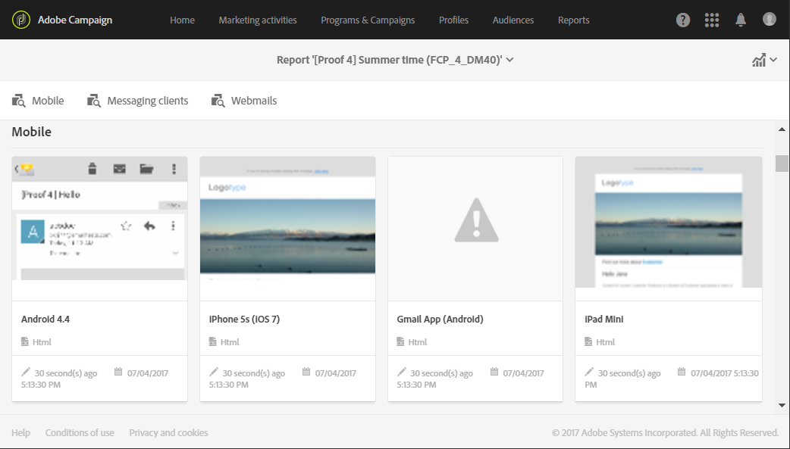

# メールコンテンツの制御{#control-email-content}

<!--TO KEEP because specific to Campaign-->

メールが受信者に確実に届くようにし、メールの配信品質率を向上させるには、メールがいくつかのルールに従う必要があります。 従わない場合は、特定のメッセージのコンテンツがスパムとして検出される可能性があります。 Adobe Campaign には、コンテンツがこれらのルールに従うようにするためのツールがいくつか用意されています。

メッセージのコンテンツを設計する際は、以下の原則に従います。

* [送信者の名前と住所](#sender-name): アドレスは、送信者を明示的に識別する必要があります。 ドメインは、送信者に所有および登録されている必要があります。 ドメイン登録は非公開にはしません。
  <!--**Subject**: Avoid excessive capitalization and punctuation, and words that are frequently used by spammers ("Win", "Free", etc.).-->
* [Personalizationと送信時間の最適化](#perso-send-time-optimization)：コンテンツをパーソナライズし、受信者ごとに送信時間を定義すると、メッセージが開く可能性が高まります。
* 画像とテキスト：適切なテキスト／画像比率（例：テキスト 60%、画像 40％）に従います。
* [購読解除リンク](#opt-out)とランディングページ：購読解除リンクは必須です。 表示されており、有効である必要があります。また、フォームは機能している必要があります。
* プレビュー：Adobe Campaignのツールを使用して、電子メールの内容を確認および最適化します（[ スパム対策分析](#anti-spam-analysis)、[電子メールレンダリング ](#message-responsiveness)）。

コンテンツの設計時に配信品質を最適化するためのその他のヒントについては、[アドビの配信品質のベストプラクティスガイド](https://experienceleague.adobe.com/docs/deliverability-learn/deliverability-best-practice-guide/content-best-practices-for-optimal-delivery.html?lang=ja)を参照してください。

>[!NOTE]
>
>電子メールコンテンツの編集について詳しくは、[電子メールDesignerの概要](../../designing/using/designing-content-in-adobe-campaign.md)および[ メッセージデザインのベストプラクティス ](../../designing/using/designing-content-in-adobe-campaign.md#content-design-best-practices)を参照してください。

## 送信者の名前と住所 {#sender-name}

一部のISPは、メッセージを受け入れる前に、送信者アドレス（**[!UICONTROL From]**）の有効性を確認します。 不正な形式のアドレスは、受信サーバーによって拒否される可能性があります。

インスタンスレベルまたは最も頻繁に使用されるシナリオで、正しいアドレスが指定されていることを確認する必要があります。 これをおこなうには、管理者にお問い合わせください。

詳しくは、[電子メールの送信者の定義](../../designing/using/subject-line.md#email-sender)を参照してください。

## Personalizationと送信時間の最適化 {#perso-send-time-optimization}

Adobe Campaignを使用すれば、受信者の体験を向上させ、電子メールを開封してもらうために、メッセージをパーソナライズできます。 詳しくは、[この節](../../designing/using/personalization.md)を参照してください。

メッセージの開封率を高めるには、受信者ごとに送信時間を手動で定義することもできます。 各プロファイルは、可能な限り、それぞれ指定された日時にメッセージを受信します。 詳しくは、[送信時間の最適化](../../sending/using/optimizing-the-sending-time.md)を参照してください。

## オプトアウトリンクとフォーム {#opt-out}

デフォルトでは、メッセージが分析される場合、タイポロジルールでオプトアウトリンクが含まれているかどうかがチェックされ、見つからない場合は警告が表示されます。 リンクの管理について詳しくは、[このセクション ](../../designing/using/links.md)を参照してください。

毎回、送信前に、オプトアウトリンクが適切に機能することを確認する必要があります。 例えば、[ プルーフ ](../../sending/using/sending-proofs.md)を送信する場合、リンクが有効であること、フォームがオンラインであること、およびこれを検証することで&#x200B;**[!UICONTROL No longer contact]** ボックスがチェックされていることを確認します。 リンクの入力時やフォームの変更時にヒューマンエラーが発生する可能性は常にあるので、このチェックは体系的におこなう必要があります。 オプトインとオプトアウトの管理について詳しくは、[この節](../../audiences/using/managing-opt-in-and-opt-out-in-campaign.md)を参照してください。

オプトアウトリンクをクリックした受信者が選択を確認できないとしても、配信開始後に購読解除に関する問題が検出された場合は購読解除を手動で実行できます（一括更新機能を使用するなど）。

一般的なルールとして、オプトアウトを希望する受信者に対して、メールアドレスや名前などのフィールドに入力するように求めるのは避けるべきです。 購読解除ランディングページには、1つの検証ボタンのみを含める必要があります。

追加の確認のリクエストは信頼できません。ユーザーが 2 つのメールアドレスを同じボックスにリダイレクトさせている可能性があります（firstname.lastname@club.com と firstname.lastname@internet-club.com など）。 プロファイルが最初のアドレスのみを記憶でき、もう一方のアドレスに送信されたメッセージを介して購読解除を希望する場合、暗号化された識別子と入力されたメールアドレスが一致しないため、フォームはこれを拒否します。

## スパム対策分析 {#anti-spam-analysis}

Adobe Campaignのメッセージエディターには、**スパム対策分析**&#x200B;が統合されています。この分析では、電子メールをスコアリングして、受信時に使用されるスパム対策ツールによってスパムと見なされるリスクがあるかどうかを判断できます。 詳しくは、[ メッセージのプレビュー](../../sending/using/previewing-messages.md)を参照してください。

メッセージコンテンツエディターで、**[!UICONTROL Preview]**&#x200B;をクリックします。 迷惑メール対策チェックによって、このメッセージの高いリスクが検出された場合は、メッセージが警告されます。 **[!UICONTROL Anti-spam analysis]**&#x200B;をクリックして詳細を表示します。

## メールのレンダリング {#message-responsiveness}

メッセージを送信する前に、メッセージが様々なデバイスでどのように表示されるかを確認して、メッセージの応答性をテストできます。 これは、各種の web クライアント、web メール、デバイスでメッセージの表示が確実に最適化されるようにするためです。

この確認のために、Adobe Campaign ではレンダリングをキャプチャして専用のレポートで利用できるようにしています。 これにより、異なるコンテキストで受信される可能性のある送信済みのメッセージをプレビューできます。

詳しくは、[メールのレンダリング](../../sending/using/email-rendering.md)を参照してください。
