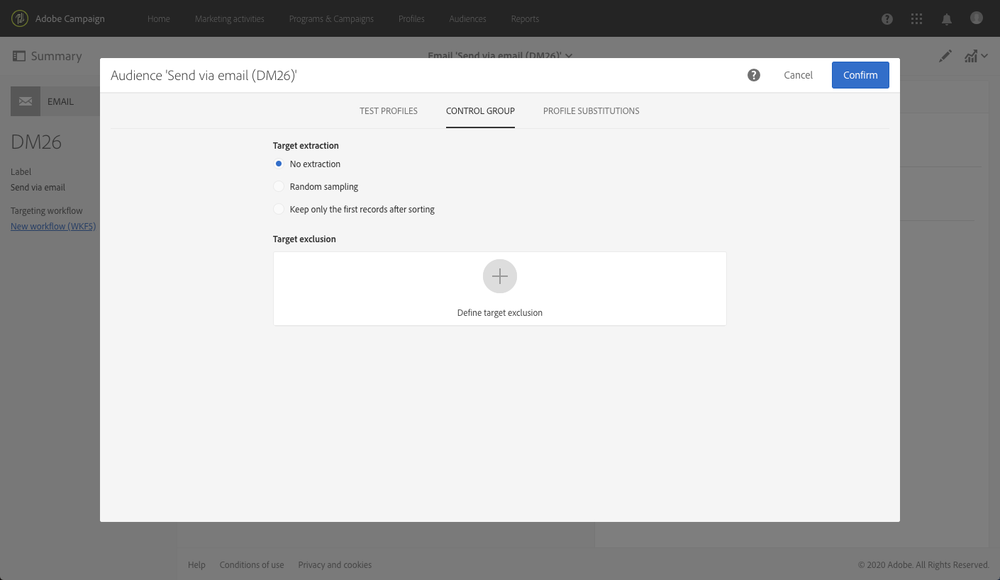

# コントロール母集団の追加 {#adding-control-group}

コントロール母集団を使用すると、キャンペーンの影響を測定するために、オーディエンスの一部にメッセージを送信しないようにできます。

これを Adobe Campaign でおこなうには、配信のターゲットを定義する際に<b>コントロール母集団</b>を作成します。プロファイルは、無作為、フィルターの有無、または条件に基づいてコントロール母集団に追加されます。

その後、メッセージを受け取ったターゲット母集団の行動と、ターゲット設定されていない連絡先の行動を比較できます。送信ログに基づいて、今後のキャンペーンでコントロール母集団をターゲットすることもできます。

<!--The control group is built when the delivery is prepared.-->

## 概要 {#overview}

コントロール母集団は、メインターゲットから無作為に抽出できます。特定の母集団から選択することもできます。したがって、コントロール母集団を定義する方法は主に 2 つあります。
* メインターゲットから複数のプロファイルを&#x200B;**抽出**&#x200B;します。
* クエリで定義された条件に基づいて、一部のプロファイルを&#x200B;**除外**&#x200B;します。

コントロール母集団を定義する際は、両方の方法を使用できます。

配信の準備手順でコントロール母集団に含まれているすべてのプロファイルが、メインターゲットから削除されます。これらのプロファイルは、送信されたメッセージを受信しません。

## ターゲット母集団からの抽出 {#extraction-target-population}

コントロール母集団を定義するには、ターゲット母集団から一定の割合または一定数のプロファイルを、無作為または並べ替えに基づいて抽出できます。

### ターゲットからの抽出 {#target-extraction}

まず、ターゲットからプロファイルを抽出する方法（**無作為**&#x200B;または&#x200B;**並べ替えに基づいて選択**）を定義します。

「**[!UICONTROL Target extraction]**」セクションで、次のいずれかを選択します。

* **[!UICONTROL Random sampling]**：配信を準備すると、[サイズ制限](#size-limit)として設定する割合または最大数に応じてプロファイルが無作為に抽出されます。

   例：「**[!UICONTROL Limits]**」セクションでしきい値を 10 に設定した場合、コントロール母集団は、ターゲット母集団から無作為に選択された 10％で構成されます。<!--Change screenshot to match example)-->

   

* **[!UICONTROL Keep only the first records after sorting]**：このオプションを使用すると、1 つ以上の並べ替え順に基づく制限を定義できます。

   例：

   * 「**[!UICONTROL Age]**」フィールドを並べ替え条件として選択します。
   * 「**[!UICONTROL Limits]**」セクションで 100 をしきい値として定義します（[サイズ制限](#size-limit)を参照）。
   * 「**[!UICONTROL Descending sort]**」オプションは選択したままにします。

   これで、このコントロール母集団は年齢が高い順の受信者 100 人で構成されるようになります。<!--Change screenshot to match example)-->

   

   ほとんど購入していないプロファイルや、頻繁に購入するプロファイルを含むコントロール母集団を定義して、その行動をメッセージを受信した集団の行動と比較すると、興味深い結果が得られる可能性があります。

>[!NOTE]
>
>「**[!UICONTROL No extraction]**」は、「**[!UICONTROL Target extraction]**」オプションを使用しない場合に選択します。

<!---->

### サイズ制限 {#size-limit}

「**[!UICONTROL Random sampling]**」と「**[!UICONTROL Keep only the first records after sorting]**」のいずれを選択した場合でも、メインターゲットから抽出するプロファイル数を制限する方法を設定する必要があります。次のいずれかを実行します。

* 「**[!UICONTROL Size (as a % of the initial population)]**」を選択して対応するフレームに値を入力します。

   例えば、10 を設定した場合、上で選択したオプションに応じて、Adobe Campaign は次のいずれかを実行します。
   * ターゲットの母集団の 10％ を無作為に抽出します。
   * 並べ替え条件として「**[!UICONTROL Age]**」フィールドを選択した場合は、ターゲット母集団から年齢の高い順に 10％ のプロファイルを抽出します。

   >[!NOTE]
   >
   >「**[!UICONTROL Descending sort]**」オプションをオフにすると、年齢の低い順に 10％ のプロファイルが抽出されます。

* 「**[!UICONTROL Maximum size]**」を選択して対応するフレームに値を入力します。

   例えば、100 を設定した場合、Adobe Campaign は次のいずれかを実行します。
   * ターゲット母集団から 100 人のプロファイルを無作為に抽出します。
   * 並べ替え条件として「**[!UICONTROL Age]**」フィールドを選択した場合は、ターゲット母集団から年齢の高い順に 100 人のプロファイルを抽出します。

   >[!NOTE]
   >
   >「**[!UICONTROL Descending sort]**」オプションをオフにすると、年齢の低い順に 100 人のプロファイルが抽出されます。

## 特定の母集団の除外 {#excluding-specific-population}

コントロール母集団を定義するもう 1 つの方法は、クエリを使用してターゲットから特定のプロファイルを除外することです。

手順は次のとおりです。

1. 「**[!UICONTROL Target exclusion]**」セクションで、「**[!UICONTROL Define target exclusion]**」をクリックします。

   

1. [クエリエディター](../../automating/using/editing-queries.md)を使用して除外条件を定義します。また、以前に作成した[オーディエンス](../../audiences/using/about-audiences.md)も選択できます。

   

1. 「**[!UICONTROL Confirm]**」をクリックします。

クエリの結果に一致するプロファイルは、ターゲットから除外されます。

<!--For more on using the query editor, see the [Editing queries](../../automating/using/editing-queries.md) section.-->

## 使用例：コントロール母集団の設定 {#control-group-example}

次の例では、メインターゲットからプロファイルを抽出する方法と、クエリを使用して特定の母集団を除外する方法の 2 つの方法により、コントロール母集団を定義します。

1. ワークフローを作成します。ワークフローを作成する詳細な手順については、[ワークフローの作成](../../automating/using/building-a-workflow.md)の節を参照してください。
1. **[!UICONTROL Activities]**／**[!UICONTROL Targeting]** で、「[クエリ](../../automating/using/query.md)」アクティビティをドラッグ＆ドロップします。アクティビティをダブルクリックし、ターゲットを定義します。<!--For example, in **[!UICONTROL Shortcuts]**, drag and drop **[!UICONTROL Profile]**, select **[!UICONTROL Age]** with the operator **[!UICONTROL Greater than]** and type 25 in the **[!UICONTROL Value]** field.-->

1. **[!UICONTROL Activities]**／**[!UICONTROL Channels]** で、メインターゲットのセグメントの後に「[E メール配信](../../automating/using/email-delivery.md)」アクティビティをドラッグ＆ドロップして編集します。
1. 配信ダッシュボードの「**[!UICONTROL Audience]**」ブロックをクリックします。

1. 「**[!UICONTROL Control group]**」タブを選択します。

   

1. 「**[!UICONTROL Target extraction]**」セクションで、「**[!UICONTROL Keep only the first records after sorting]**」を選択します。
1. 年齢による並べ替えを選択し、「**[!UICONTROL Descending]**」並べ替えオプションをオンのままにします。

   

1. 最大サイズを 100 に設定します。ターゲットから年齢の高い順に 100 人のプロファイルが抽出されます。

1. 「**[!UICONTROL Target exclusion]**」セクションで、[クエリエディター](../../automating/using/editing-queries.md)で選択した条件に基づいて、ターゲットから除外するプロファイルを定義します。例えば、「Age is less than 20」とします。

   

   これにより、20 歳未満のプロファイルは除外されます。

1. [配信の準備](../../sending/using/preparing-the-send.md)を開始し、[送信を確認](../../sending/using/confirming-the-send.md)します。

抽出されたプロファイル（年齢の高い順の 100 人のプロファイル）と、クエリ（20 歳未満のプロファイル）に基づいて定義されたプロファイルは、メインターゲットから排除されます。これらのプロファイルは、メッセージを受信しません。

## 結果の比較 {#delivery-logs}

配信後のコントロール母集団の処理について説明します。

**送信ログ**&#x200B;を抽出して、メッセージを受信しなかったコントロール母集団と有効なターゲットの行動を比較できます。また、配信ログを使用して&#x200B;**別のターゲティングを作成**&#x200B;することもできます。

>[!IMPORTANT]
>
>Adobe Campaign に接続するには、[管理者の役割](../../administration/using/users-management.md#functional-administrators)が割り当てられており、**[!UICONTROL All]**[&#x200B;組織単位](../../administration/using/organizational-units.md)の一部である必要があります。特定のユーザーまたはユーザーグループに対するアクセスを制限する場合は、配信ログにアクセスできる **[!UICONTROL All]** 単位にこれらのユーザーを関連付けないでください。

### 配信ログの確認 {#checking-logs}

メッセージの送信後にターゲットから削除されたプロファイルを確認するには、**[!UICONTROL Delivery logs]** を確認します。配信ログとそのアクセス方法について詳しくは、[この節](../../sending/using/monitoring-a-delivery.md#delivery-logs)を参照してください。

* 「**[!UICONTROL Sending logs]**」タブで、抽出および除外されたプロファイルを確認できます。ステータスが「**[!UICONTROL Ignored]**」、失敗の理由が「**[!UICONTROL Control group]**」となっています。

   

* また、「**[!UICONTROL Exclusion causes]**」タブでは、配信に含まれていないプロファイルの数を確認できます。

   

### コントロール母集団ログの使用 {#using-logs}

配信が送信されたら、配信ログを使用して、メッセージを受信しなかったプロファイルをフィルターできます。次の手順に従います。

1. ワークフローを作成します。ワークフローを作成する詳細な手順については、[ワークフローの作成](../../automating/using/building-a-workflow.md)の節を参照してください。
1. **[!UICONTROL Activities]**／**[!UICONTROL Targeting]** で、「[クエリ](../../automating/using/query.md)」アクティビティをドラッグ＆ドロップします。
1. 「**[!UICONTROL Properties]**」タブで、「**[!UICONTROL Delivery logs]**」を「**[!UICONTROL Resource]**」として設定し、「**[!UICONTROL Profile]**」を「**[!UICONTROL Targeting dimension]**」として設定します。

   

1. 「**[!UICONTROL Target]**」タブで、「**[!UICONTROL Delivery logs]**」をクリックします。
1. 「**[!UICONTROL Status]**」をドラッグ＆ドロップし、フィルター条件として「**[!UICONTROL Ignored]**」を選択します。

   

1. 「**[!UICONTROL Confirm]**」をクリックします。

1. 引き続き「**[!UICONTROL Target]**」タブで、「**[!UICONTROL Nature of failure]**」をドラッグ＆ドロップし、フィルター条件として「**[!UICONTROL Control group]**」を選択します。

   

1. 「**[!UICONTROL Confirm]**」をクリックします。

   

次に、例えば、「**ファイルを抽出**」アクティビティに続いて「**ファイルを転送**」アクティビティを実行して、ログデータを書き出します。これにより、コントロール母集団と比較した効果的なターゲットに対するキャンペーンの結果を、独自のレポートツールで分析できます。ログの書き出しについて詳しくは、[この節](../../automating/using/exporting-logs.md)を参照してください。

### コントロール母集団のターゲティング{#targeting-control-group}

メッセージを受信しなかったプロファイルに基づいてターゲティングをおこなう場合は、配信ログも使用できます。次の手順に従います。

1. ワークフローを作成します。ワークフローを作成する詳細な手順については、[ワークフローの作成](../../automating/using/building-a-workflow.md)の節を参照してください。
1. **[!UICONTROL Activities]**／**[!UICONTROL Targeting]** で、最初の「[クエリ](../../automating/using/query.md)」アクティビティをドラッグ＆ドロップします。
1. 「**[!UICONTROL Properties]**」タブで、**[!UICONTROL Profile]** リソースが「**[!UICONTROL Resource]**」および「**[!UICONTROL Targeting dimension]**」として選択されていることを確認します。

   

1. 「**[!UICONTROL Target]**」タブで「**[!UICONTROL Delivery]**」を展開し、「**[!UICONTROL Delivery logs]**」をドラッグ&amp;ドロップします。

   

1. **[!UICONTROL Add a rule]** ウィンドウで、「**[!UICONTROL Delivery]**」をドラッグ＆ドロップします。

   

1. 送信した E メールをフィルター条件として選択します。「**[!UICONTROL Confirm]**」をクリックします。

   

1. **[!UICONTROL Add a rule]** ウィンドウに戻り、「**[!UICONTROL Status]**」をドラッグ＆ドロップして、フィルター条件として「**[!UICONTROL Ignored]**」を選択します。「**[!UICONTROL Confirm]**」をクリックします。

   

1. 「**[!UICONTROL Nature of failure]**」をドラッグ＆ドロップし、フィルター条件として「**[!UICONTROL Control group]**」を選択します。「**[!UICONTROL Confirm]**」をクリックします。

   

1. 条件がすべて、**AND** ブール演算子で整列していることを確認します。

   

1. 「**[!UICONTROL Confirm]**」をクリックします。

これで、コントロール母集団の一部であったために最初のメッセージを受信しなかったプロファイルをターゲットし、別の E メールを送信できるようになります。

同じワークフローで、E メールを受信したプロファイルにターゲットし、別のメッセージを送信するために別のクエリを作成することもできます。

