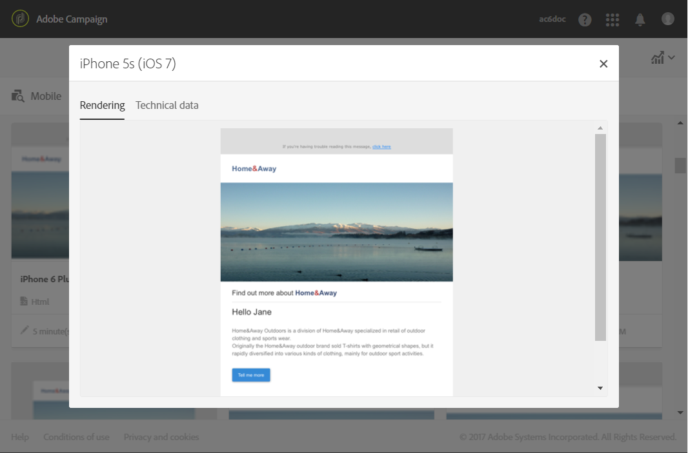

# Email rendering{#email-rendering}

**[!UICONTROL Send]** ボタンを使用する前に、様々なWebクライアント、Webメールおよびデバイスで、最適な方法でメッセージが表示されるようにしてください。

これを許可するために、Adobe Campaignはレンダリングをキャプチャし、専用のレポートで使用できるようにします。これにより、受信した様々なコンテキストで送信されたメッセージをプレビューできます。

The mobile, messaging and webmail clients available for **Email rendering** in Adobe Campaign are listed on the Litmus [website](https://litmus.com/email-testing) (click **View all email clients**).

## Checking the Email rendering report {#checking-the-email-rendering-report}

電子メール配信を作成して、ターゲット母集団とターゲット母集団を定義したら、次の手順に従います。

1. Click **Audience** to access the **[!UICONTROL Test profiles]** tab.

   

1. Use the query editor to define the test profiles that you want to use, including the test profiles that are for **Email rendering** use. See [About test profiles](../../sending/using/managing-test-profiles-and-sending-proofs.md#about-test-profiles).

   

1. クエリを確認して確認し、変更を保存します。
1. Click the **[!UICONTROL Test]** button in the action bar.

   

1. **[!UICONTROL Email rendering]** このオプションを選択して、をクリック **[!UICONTROL OK]**&#x200B;します。

   

   >[!NOTE]
   >
   >**[!UICONTROL Proof + Email rendering]** このオプションを使用すると、配達確認を送信して電子メールレンダリング機能を同時に使用できます。配達確認の受信者によってメッセージを承認し、ターゲット設定されたボックスに応じてメッセージの受信方法をテストできます。この場合、テストプロファイルを校正する必要もあります。See [About test profiles](../../sending/using/managing-test-profiles-and-sending-proofs.md#about-test-profiles).

   テスト配信が送信されます。

1. メッセージを送信してから数分後に、レンダリングサムネールを使用できます。To access them, select **[!UICONTROL Proofs]** in the **[!UICONTROL Summary]** drop-down list.

   

1. From the **[!UICONTROL Proofs]** list, click the **[!UICONTROL Access email rendering]** icon.

   

専用の電子メールレンダリングレポートが表示されます。[電子メールレンダリングレポートの説明](../../sending/using/email-rendering.md#email-rendering-report-description)を参照してください。

**関連トピック**:

* [電子メールの作成](../../channels/using/creating-an-email.md)
* [テストプロファイルの管理と配達確認の送信](../../sending/using/managing-test-profiles-and-sending-proofs.md)
* [クエリエディター](../../automating/using/editing-queries.md#about-query-editor)

## Email rendering report description {#email-rendering-report-description}

このレポートは、受信者に表示される電子メールのレンダリングを表示します。電子メールのレンダリングは、受信者が電子メール配信を開く方法によって異なる可能性があります。ブラウザー、モバイルデバイス、または電子メールアプリケーションを使用します。

>[!NOTE]
>
>使用可能なレンダリングの数が使用許諾契約に一覧表示されます。**電子メールレンダリング** を有効にするたびに、使用可能なレンダリング（トークンと呼ばれる）が1つずつ減少します。Litechクライアントの場合、独自のLitmtアカウントを使用して、Adobe Campaignでの電子メールレンダリングのプロビジョニングと使用を行うことができます。詳しくは、アドビのアカウント担当者にお問い合わせください。

レポートサマリには、受信したメッセージ、不要（スパム）、受信待ちのメッセージ、受信待ちのメッセージ数が表示されます。

The report is divided into three parts: **[!UICONTROL Mobile]**, **[!UICONTROL Messaging clients]**, and **[!UICONTROL Webmails]**. レポートを下にスクロールすると、これらの3つのカテゴリにグループ化されたすべてのレンダリングが表示されます。

各レポートの詳細を取得するには、対応するカードをクリックします。選択した受信方法に対してレンダリングが表示されます。

**[!UICONTROL Technical data]** このタブでは、受信日や取得日、電子メールの完全なヘッダーなどの情報を取得できます。
