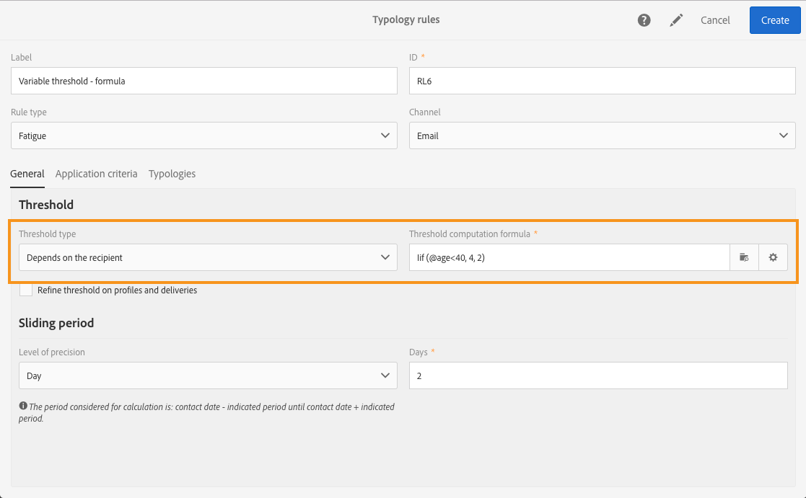

# 疲労ルール{#fatigue-rules}

## 疲労ルールについて {#about-fatigue-rules}

疲労ルールを設定すると、マーケティング担当者は、過剰に配信を受けているプロファイルをキャンペーンから自動的に除外することができます。疲労ルールは、グローバルでクロスチャネルなビジネスルールです。

疲労ルールを実装するには、プロファイルごとの最大メッセージ数を定義し、ルールを適用する期間を選択します。配信の準備中に、既に配信が最大数を超えているプロファイルはメッセージから除外されます。

>[!NOTE]
>
>疲労ルールを適用するには、メッセージの配信日を定義する必要があります。メッセージをすぐに送信する場合は、疲労ルールは適用されません。

関連トピック ： 

* [準備](../../administration/using/configuring-email-channel.md#preparation)
* [タイポロジの管理](../../sending/using/managing-typologies.md)
* [タイポロジルール](../../sending/using/managing-typology-rules.md)
* [過剰なコンタクトによる疲労を防ぐための通信頻度の最適化](https://helpx.adobe.com/jp/campaign/kb/simplify-campaign-management.html#Engageyourcustomersateverystep)

## 疲労ルールの作成 {#creating-a-fatigue-rule}

**[!UICONTROL Fatigue]**&#x200B;のタイポロジルールを作成および設定するには、次の手順に従います。

1. Adobe Campaign のロゴをクリックし、インターフェイスの左上隅で **[!UICONTROL Administration]**／**[!UICONTROL Channels]**／**[!UICONTROL Typologies]**／**[!UICONTROL Typology rules]**&#x200B;を選択します。

   

1. タイポロジルールのリストで、「**[!UICONTROL Create]**」をクリックします。

   

1. 「**[!UICONTROL Rule type]**」フィールドで「**[!UICONTROL Fatigue]**」を選択します。

   

1. 「**[!UICONTROL Channel]**」フィールドで、ルールを適用するチャネルを選択します。1 つのチャネル（電子メール、SMS、ダイレクトメール、モバイルアプリケーション）を選択するか、「**[!UICONTROL All channels]**」を選択します。詳しくは、[チャネルの選択](#choosing-the-channel)を参照してください。

   

1. 「**[!UICONTROL General]**」タブで、プロファイルあたりの最大メッセージ数の計算方法を定義します。定数のしきい値または変数を選択できます。また、プロファイルや配信のしきい値を調整することもできます。詳しくは、[しきい値の定義](#defining-the-threshold)を参照してください。

   

1. タイポロジルールを適用する「**[!UICONTROL Sliding period]**」を選択します。詳しくは、[期間の設定](#setting-the-sliding-period)を参照してください。

   

   この例（前のスクリーンショットを参照）では、スライド期間 15 日間に最大 4 つのメッセージを送信することを選択しています。

1. 「**[!UICONTROL Application criteria]**」タブでは、すべての配信にこのルールを適用するか、送信するメッセージに応じてルールの適用を制限するかを選択できます。ルールは、適用条件が満たされた場合にのみ実行されます。例えば、特定の単語で始まるラベルを持つメッセージや、特定の文字を含む ID を持つメッセージに対してのみ、ルールを適用できます。詳しくは、[フィルタリングルールの適用の制限](../../sending/using/filtering-rules.md#restricting-the-applicability-of-a-filtering-rule)を参照してください。

   

1. 「**[!UICONTROL Typologies]**」タブを選択し、配信に使用するタイポロジにタイポロジルールをリンクします。[タイポロジの管理](../../sending/using/managing-typologies.md)と[タイポロジルール](../../sending/using/managing-typology-rules.md)を参照してください。

   

   >[!NOTE]
   >
   >配信テンプレートで定義したタイポロジは、そのテンプレートを使用して作成されるすべての配信に自動的に適用されます。

配信の準備中に、既に配信が最大数を超えているプロファイルはメッセージから除外されます。疲労ルールの実行結果を配信ログに表示できます。[疲労ルールの実行結果の表示](#viewing-the-fatigue-results)を参照してください。

>[!IMPORTANT]
>
>疲労ルールを機能させるには、メッセージの配信日を定義する必要があります。メッセージをすぐに送信する場合は、疲労ルールは適用されません。

## チャネルの選択 {#choosing-the-channel}

疲労ルールは様々なチャネルで使用できます。チャネルは、タイポロジルール設定の「**[!UICONTROL Channel]**」フィールドで定義します。1 つのチャネルを選択するか、「**[!UICONTROL All channels]**」を選択します。

**使用可能なチャネル**

次のチャネルを使用できます。

* 電子メール
* モバイル（SMS）
* ダイレクトメール
* モバイルアプリ：このチャネルを使用すると、プロファイルまたはアプリの購読者にプッシュ通知を送信できます。通知をプロファイルに送信する場合、マルチチャネルの疲労ルールと互換性があります。

   >[!IMPORTANT]
   >
   >疲労ルールは、アプリの購読者に送信されるプッシュ通知と互換性がありません。アプリの購読者にメッセージを送信する場合、疲労ルールは適用されません。

* All channels：このオプションを使用すると、すべてのチャネルに適用するルールを設定できます。例えば、任意のチャネルで１ ヶ月に送信できるメッセージを最大 3 つと設定した場合、あるプロファイルに先週2通の電子メールを送信したのであれば、今日プッシュ通知を送信しようとするとそのプロファイルは除外されます。

**配信タイプ**

疲労ルールは、すべての配信タイプ（ワンショット配信、定期配信、ワークフロー配信、トランザクションメッセージ）と互換性があります。

**トランザクションメッセージ**&#x200B;は、イベント（rtEvent）をターゲットとするサービスメッセージと、リマーケティングメッセージなどのプロファイルをターゲットとするマーケティングメッセージを送信するために使用できます。このうち、プロファイルをターゲットとしたマーケティングメッセージのみが、疲労ルールと互換性があります。イベントトランザクションメッセージにはプロファイル情報が含まれないので、（プロファイルとのエンリッチメントの場合でも）疲労ルールとの互換性はありません。トランザクションメッセージでマーケティングメッセージのサポートがあれば、**マーケティングトランザクションメッセージを含むすべてのチャネルに疲労ルールを適用できます**。

## しきい値の定義 {#defining-the-threshold}

各疲労ルールには、しきい値が定義されます。しきい値は、特定の期間に 1 つのプロファイルに送信できる最大メッセージ数を表します。しきい値に達すると、その後は指定された期間が完了するまで、配信は実施できなくなります。このプロセスにより、メッセージの数がしきい値を超過したプロファイルは配信から自動的に除外されるので、過剰な配信が回避できます。

しきい値は、定数または変数のいずれかです。したがって、ある期間、しきい値はプロファイルによって異なる場合も、同じプロファイルで異なる場合もあります。

**固定しきい値の使用**

しきい値は、該当期間内にプロファイルに送信できるメッセージの最大数を表します。

デフォルトでは、定数のしきい値が使用されます。この場合は、ルールで許可されるメッセージの最大数の値を指定する必要があります。

**可変しきい値の使用**

可変しきい値を定義するには、「**[!UICONTROL Depends on the recipient]**」フィールドで「**[!UICONTROL Threshold type]**」値を選択します。

次の 2 つのオプションがあります。

* プロファイルフィールドの選択から：しきい値は、選択したフィールドに応じてプロファイルごとに異なります。例えば、プロファイルリソースを「Communication frequency」フィールドで拡張した場合は、フィールドの右側のボタンをクリックし、「**[!UICONTROL Threshold computation formula]**」フィールドを選択します。各プロファイルに対して、しきい値は「Communication frequency」フィールドの値をとります。

   

* 式の定義から：「**[!UICONTROL Threshold computation formula]**」フィールドの右側にある 2 番目のボタンをクリックして、高度なしきい値の計算式を定義します。ここでは、プロファイルが所属するセグメントに従ってインデックス付けして、許可するメッセージの数を変えることができます。例えば、Web セグメントに属する受信者に、他の受信者より多くのメッセージを送信するように設定できます。タイプ式&#x200B;**[!UICONTROL Iif (@origin='Web', 5, 3)]**&#x200B;の場合、Web セグメントのプロファイルに対して 5 つのメッセージを配信し、他のセグメントのプロファイルに対して 3 つのメッセージを配信します。

   

**プロファイルと配信のしきい値の調整**

デフォルトでは、しきい値の計算にはすべてのメッセージが考慮されます。配信の準備中にカウントするプロファイルと配信をフィルターするには、「**[!UICONTROL Refine Threshold on profiles and deliveries]**」チェックボックスをオンにします。

次の例では、男性のプロファイルのみがカウントされ、**ニュースレター**&#x200B;で始まるラベルを持つ配信のみがカウントされます。

配信のしきい値の調整は、ルール全体（「**[!UICONTROL Application criteria]**」タブ）の適用を制限するのとは異なります。

* **[!UICONTROL Application criteria]**：ルールを実行するか、特定の条件に従わないかを選択します。例えば、「Newsletterがラベルの冒頭にある」を適用条件とした場合、ルールはこの条件に従う配信にのみ適用されます。配信のラベルが「プロモーション」で開始する場合、ルールはまったく実行されません。
* **[!UICONTROL Refine threshold on profiles and deliveries > Deliveries to count]**：このタイポロジルールを使用するすべての配信がルールを実行しますが、ユーザーが過去の配信とスケジュールされている配信の中から、カウントするものを選択します。例えば、条件が「Newsletterがラベルの冒頭にある」の場合、配信のラベルが「プロモーション」で始まっていても、ルールが実行されます。選択したスライド期間中に、「Newsletter」がラベルの先頭にある配信の数がカウントされます。

## スライド期間の設定{#setting-the-sliding-period}

疲労ルールは n 日周期で定義されます。期間は、2 週間、7 日間、5 時間など、「**[!UICONTROL Sliding period]**」セクションで設定します。

ルールを実行すると、過去の配信と、予定された配信の両方が考慮されます。これにより、所定のスライド期間でしきい値を超えることがなくなります。

例えば、48 時間という期間を定義した場合、配信日の 48 時間&#x200B;**前**&#x200B;と配信日の 48 時間&#x200B;**後**&#x200B;が検索されます。つまり、選択した期間が 2 倍になり、過去の配信に加えて、今後予定されている配信も考慮されます。

考慮に入れる配信の期間を 2 週間に制限するには、「**Day**」と「**７**」つまり「1 週間」を「**Sliding period**」セクションに入力します。そうすれば、配信日の最大 ７ 日前までに送信され、配信日の最大 7 日後まで予定されている配信がルールの適用対象となり、計算で考慮されます。

## 疲労ルールの実行結果の表示 {#viewing-the-fatigue-results}

配信の準備中に、既に配信が最大数を超えているプロファイルはメッセージから除外されます。疲労ルールの実行結果を表示するには、「**[!UICONTROL Deployment]**」ブロックの右下隅にあるボタンをクリックします。

3 つのタブが使用可能で、適用したルールの名前を含む疲労ルールの実行結果の詳細を示します。

* 配信ログ：

   

* 除外ログ：

   

* 除外の原因：

   

## 疲労ルールの概要レポートの表示 {#viewing-the-fatigue-rule-summary-report}

Adobe Campaign には、疲労ルールがキャンペーンにどのように適用されているかを理解するのに役立つ、疲労ルール専用のレポートが用意されています。レポートの内容から、お客様のキャンペーンが相互に与える影響を把握し、適切な調整をおこな行うことができます。

**[!UICONTROL Fatigue rules summary]**&#x200B;レポートは、各プログラム、キャンペーンおよびメッセージの右上隅にある「**[!UICONTROL Reports]**」ボタンからアクセスできます。

画面の左側では、配信のコンタクト日に関するレポートデータをフィルタリングできます。選択される期間は、デフォルトで、現在の日付の 15 日前から 15 日後までです。また、特定の疲労ルールに基づいてフィルタリングすることもできます。

円グラフには、選択された期間に関する次の情報が表示されます。

* **[!UICONTROL Total targeted]**：メッセージの準備前のターゲット総数
* **[!UICONTROL Excluded]**：疲労ルールの適用による除外件数の合計
* **[!UICONTROL Other exclusions]**：他のタイポロジルールによる除外件数の合計
* **[!UICONTROL To deliver]**：メッセージの準備後に配信されるメッセージの総数（**[!UICONTROL To deliver]** = **[!UICONTROL Total targeted]** - **[!UICONTROL Excluded]** - **[!UICONTROL Other exclusions]**）

グラフの右側に、疲労ルール別に分類された除外件数が表示されます。

画面下の表には、選択した期間内のすべての配信が表示されます。配信ごとに、適用された疲労ルールと、それに対応する除外件数を確認できます。コンタクト日のない配信も表に表示されます。

* 「**[!UICONTROL 0]**」は、疲労ルールが適用されたが除外がなかったことを示します。
* 「**[!UICONTROL -N]**」は、除外件数が N であったことを表します。
* 空のフィールドは、疲労ルールが適用されなかったことを意味します。

>[!NOTE]
>
>表示されるデータは、レポートにアクセスするプログラム、メッセージ、キャンペーンのコンテキストに依存しません。このレポートには、すべての組織単位のすべての疲労ルールと配信が表示されます。これにより、すべての配信の全体像を把握して、キャンペーンが他のユーザーにどのように影響されているかを理解できます。

## 例 {#examples}

疲労管理は用途に応じて様々さまざまに実装することができます。実行できる実装例を次に示します。

* **すべてのチャネル**&#x200B;に適用される&#x200B;**定数しきい値**&#x200B;で疲労ルールを作成した場合：

   ここで、スライド期間 7 日間で、定数 3 のしきい値を持つマルチチャネルルールを適用した場合：

   先週、プレミアムプロファイルにプロモーション用の E メールとトランザクションリマーケティング用の E メールを配信しました。SMS を来週送信するようにスケジュールしました。今日は、すべてのプロファイルにプッシュ通知を送信することにしました。結果：2 週間で送信できるメッセージの最大数に達しているため、プレミアムプロファイルは今日のプッシュから除外されます。

   

* **プロファイルフィールド**&#x200B;に基づく&#x200B;**可変しきい値**&#x200B;を使用して、疲労ルールを作成した場合：

   プロファイルリソースを「Communication limit」フィールドで拡張してあるので、プロファイルごとに異なるしきい値の定義が可能です。疲労ルールで、このフィールドに基づいて可変しきい値を定義し、スライド期間を 2 日に設定します。プロファイルの例を 2 つ見てみましょう。John の配信最大数は 1 で、David のしきい値は 2 です。両方とも昨日、既にニュースレターの E メールを受け取っています。今日もう一度 E メールを送ることにしました。John はターゲットから除外されたので、David だけが今日の E メールを受け取ります。

   

* **しきい値の計算式**&#x200B;を使用して疲労ルールを作成した場合：

   プロファイルの年齢に応じてしきい値を変更するのが目的です。プロファイルが 40 才未満の場合は、4 を配信最大数と定義し、40 才以上の場合は、2 を配信最大数にします。プロファイルごとに拡張フィールドでこのしきい値を定義する代わりに、疲労ルールに式を直接作成して、年齢に応じたしきい値を計算することができます。この例では、数式は次のようになります。**[!UICONTROL Iif (@age<40, 4, 2)]**

   

   >[!NOTE]
   >
   >ここでは、しきい値計算式を使用した疲労ルールの例を順を追って紹介しています。

* プロファイルと配信の&#x200B;**しきい値を微調整した**&#x200B;疲労ルールを作成した場合：

   プロファイルリソースを「Score」フィールドで拡張したほか、配信リソースを 「Type」フィールドで拡張したことを前提とします。定数しきい値 3 を定義したいのですが、「Alert」と「Black Friday」のタイプの配信と、スコアが 10 より大きいプロファイルをすべてカウントから除外するのが目的です。ルールを実行すると、過去および予定された配信の中で、スコアが 10 未満のプロファイルに送信された、「Alert」と「Black Friday」以外のすべての配信がカウントされます。

   

しきい値計算式を使用した疲労ルールの例を順を追って説明します。

このユースケースでは、プレミアムプロファイルには 1 週間に 3 メッセージ以上、標準プロファイルには 1 週間に 2 メッセージが配信されないようにタイポロジルールを作成する必要があります。

顧客や見込み客を特定するために、プロファイルリソースを「**[!UICONTROL Status]**」フィールドを使って拡張しました。このフィールドには、プレミアムプロファイルの場合は 0、標準プロファイルの場合は 1 が含まれています。

ルールを作成するには、次の手順に従います。

1. **Fatigue**&#x200B;タイプのタイポロジルールを新規作成します。
1. 「**[!UICONTROL Threshold]**」セクションでは、各プロファイルに応じてしきい値を計算する数式を作成します。「**[!UICONTROL Depends on the recipient]**」値を「**[!UICONTROL Threshold type]**」フィールドで選択し、「**[!UICONTROL Threshold computation formula]**」フィールドの右側にある 2 番目のボタンのアイコンをクリックします。

   

1. 「**[!UICONTROL List of functions]**」セクションで、**[!UICONTROL Others]**&#x200B;ノード内の **Iif** 関数をダブルクリックします。

   

1. 次に、プロファイルの&#x200B;**ステータス**&#x200B;を「**[!UICONTROL Available fields]**」セクションで選択します。

   

1. 必要な値を入力して、数式 **Iif(@status=0,2,4)** を作成します。

   

   この数式により、プロファイルのステータスが 0 の場合は 2、その他のステータスの場合は 4 が割り当てられます。

1. 「**[!UICONTROL Confirm]**」をクリックして、数式を承認します。
1. ルールを適用する「**[!UICONTROL Sliding period]**」を指定します。この例では、7 日間に設定し、考慮に入れる配信の期間を 2 週間に制限します。

   

1. 次に、作成したルールをタイポロジにリンクして、配信に適用します。「**[!UICONTROL Typologies]**」タブを選択し、「**[!UICONTROL Create element]**」をクリックして、配信に使用するタイポロジを選択します。

   

1. ルールを保存して、作成ルールを承認します。

ルールは、タイポロジに基づくすべての配信に適用されます。
