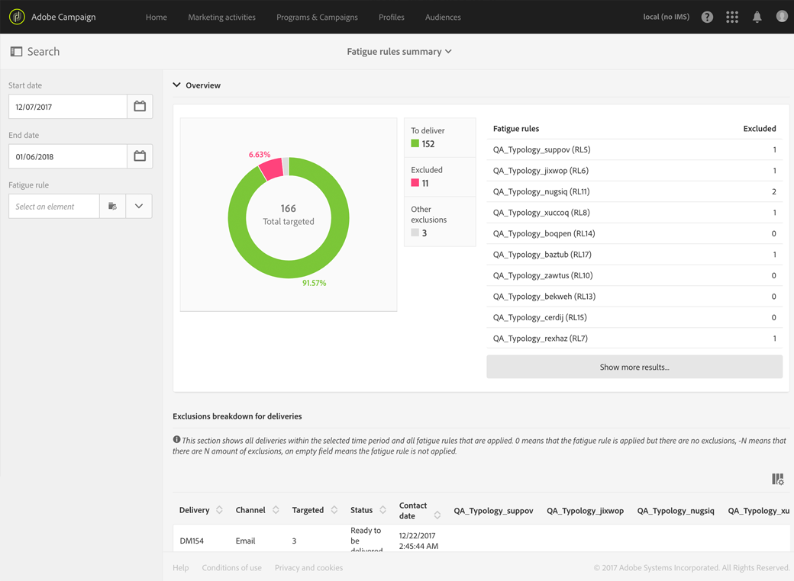
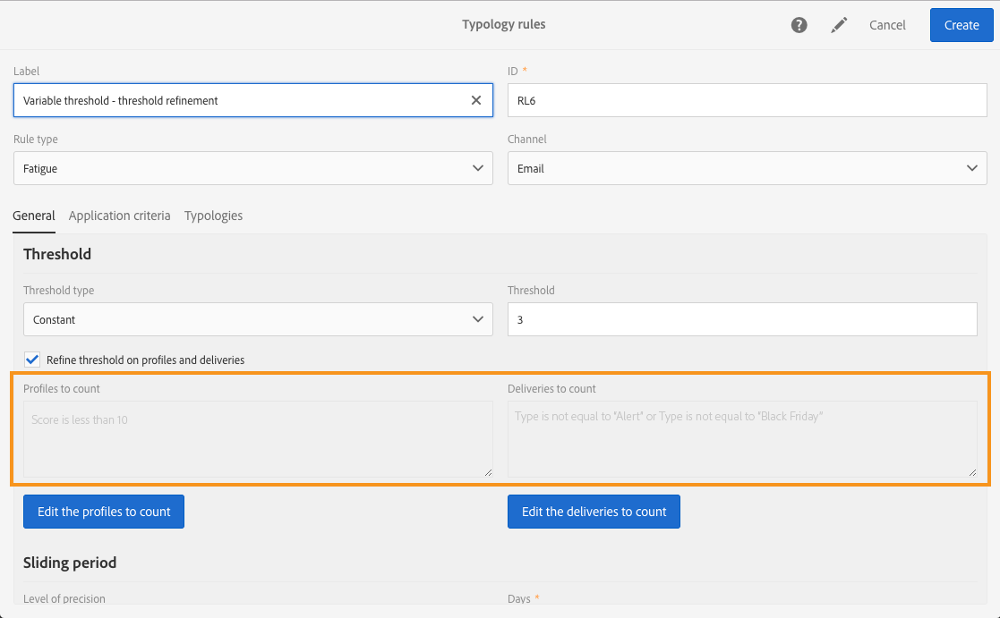
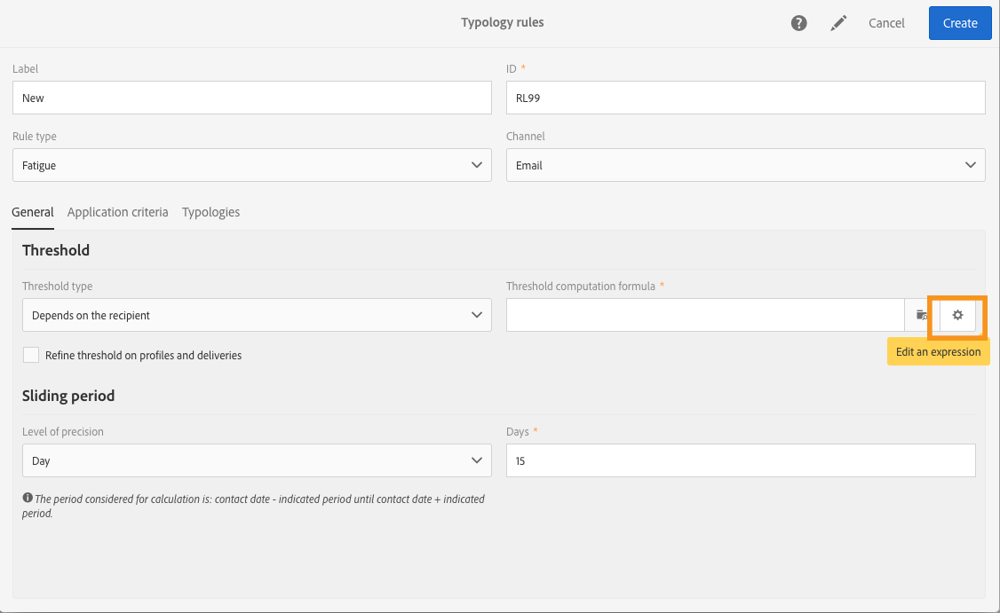

# 疲労ルール{#fatigue-rules}

## 疲労ルールについて {#about-fatigue-rules}

疲労ルールを使用すると、マーケティング担当者は、過剰に要請されたチャネルをキャンペーンから自動的に除外する、グローバルなクロスビジネスルールを設定できます。

疲労ルールを実装するには、プロファイルごとの最大メッセージ数を定義し、ルールを適用する期間を選択します。 配信の準備中、プロファイルは、既に送信されている配信の数に応じて、該当する場合はメッセージから除外されます。

>[!NOTE]
>
>疲労ルールを適用するには、担当者の連絡日を定義する必要があります。配信 メッセージをすぐに送信する場合は、疲労ルールは適用されません。

関連トピック：

* [準備](../../administration/using/configuring-email-channel.md#preparation)
* [タイポロジの管理](../../sending/using/about-typology-rules.md#managing-typologies)
* [タイポロジルール](../../sending/using/about-typology-rules.md#typology-rules)
* [接触疲労を防ぐための通信頻度の最適化](https://helpx.adobe.com/campaign/kb/simplify-campaign-management.html#Engageyourcustomersateverystep)

## Creating a fatigue rule {#creating-a-fatigue-rule}

To create and configure a **[!UICONTROL Fatigue]** typology rule, apply the following steps:

1. Adobe Campaignのロゴをクリックし、インターフェイスの左上隅で// **[!UICONTROL Administration]** を選 **[!UICONTROL Channels]** 択し **[!UICONTROL Typologies]** ます **[!UICONTROL Typology rules]**。

   

1. [リスト]で、をクリックしま **[!UICONTROL Create]**&#x200B;す。

   

1. フィールド **[!UICONTROL Rule type]** で、を選択しま **[!UICONTROL Fatigue]**&#x200B;す。

   

1. フィールド **[!UICONTROL Channel]** で、ルールを適用するチャネルを選択します。 1つのチャネル（電子メール、SMS、ダイレクトメール、モバイルアプリケーション）を選択するか、を選択できま **[!UICONTROL All channels]**&#x200B;す。 詳しくは、 [チャネルの選択](#choosing-the-channel)。

   

1. タブで、 **[!UICONTROL General]** メッセージごとの最大メッセージ数の計算方法を定義します。プロファイル 一定のしきい値または変数を選択できます。 しきい値を調整することもできます。プロファイルと配信。 For more on this, refer to [Defining the threshold](#defining-the-threshold).

   

1. 適用する **[!UICONTROL Sliding period]** タイポロジルールを選択します。 For more on this, refer to [Setting the sliding period](#setting-the-sliding-period).

   

   この例（前のスクリーンショットを参照）では、スライド期間15日間に最大4つのメッセージを送信することを選択しています。

1. このタブで **[!UICONTROL Application criteria]** は、このルールをすべての配信に適用するか、送信するメッセージに従ってルールの適用を制限するかを選択できます。 ルールは、適用条件が満たされた場合にのみ実行されます。 例えば、特定の単語で始まるラベルを持つメッセージや、特定の文字を含むIDを持つメッセージにのみルールを適用できます。 詳しくは、 [フィルタリングルールの適用の制限を参照してくださ](../../sending/using/filtering-rules.md#restricting-the-applicability-of-a-filtering-rule)い。

   

1. タブを選択 **[!UICONTROL Typologies]** し、タイポロジルールをユーザーのタイポロジにリンクします。配信 詳しくは、タ [イポロジと](../../sending/using/about-typology-rules.md#managing-typologies) タイポロジルールの管 [理を参照](../../sending/using/about-typology-rules.md#typology-rules)。

   

   >[!NOTE]
   >
   >配信テンプレートでタイポロジを定義すると、このテンプレートを使用して作成されるすべての配信に自動的にこのタイポロジを適用できます。

配信の準備中、プロファイルは、既に送信されている配信の数に応じて、該当する場合は配信から除外されます。 疲労ルールの実行結果を表示できます。配信ログ。 疲労結 [果の表示を参照してください](#viewing-the-fatigue-results)。

>[!IMPORTANT]
>
>疲労ルールを機能させるには、担当者の連絡日を定義する必要があります。配信 メッセージをすぐに送信する場合は、疲労ルールは適用されません。

## チャネル {#choosing-the-channel}

疲労ルールは様々なチャネルで使用できます。 チャネルは、タイポロジルール設定のフ **[!UICONTROL Channel]** ィールドで定義します。 1つのオプションを選択するか、チャネルを選択できま **[!UICONTROL All channels]**&#x200B;す。

**使用可能なチャネル**

次のチャネルを使用できます。

* E メール
* モバイル (SMS)
* ダイレクトメール
* モバイルアプリ：このチャネルを使用すると、プッシュ通知をプロファイルやアプリの購読者に送信できます。 通知をプロファイルに送信する場合、複数チャネルの疲労ルールと互換性があります。

   >[!IMPORTANT]
   >
   >疲労ルールは、アプリの購読者に送信されるプッシュ通知と互換性がありません。 アプリの購読者にメッセージを送信する場合、疲労ルールは適用されません。

* すべてのチャネル:このオプションを使用すると、すべてのオプションにルールをチャネルできます。 例えば、任意のメッセージで1か月に最大3個のメッセージを送信することができます。チャネル 先週2通の電子メールをプロファイルに送信し、今日プッシュ通知を送信しようとすると、同じプロファイルは除外されます。

**配信タイプ**

疲労ルールは、次のすべてのタイプの配信と互換性があります。ワンショット配信、定期配信、ワークフロー配信およびトランザクションメッセージ。

**トランザクション** ・メッセージは、イベント(rtEvent)をターゲットとするサービス・メッセージと、リマーケティング・メッセージ(ターゲットプロファイル)などをターゲットとするサービス・メッセージの送信に使用できます。 疲労ルールは、マーケティングメッセージ(ターゲットプロファイル)とのみ互換性があります。 イベントトランザクションメッセージにはプロファイル情報が含まれないので、疲労ルール(プロファイルとエンリッチメントした場合でも)との互換性がありません。 トランザクションメッセージでのマーケティングメッセージのサポートにより、マーケティング **メッセージを含むすべてのチャネルに疲労ルールを適用できま**&#x200B;す。

## しきい値の定義 {#defining-the-threshold}

各疲労ルールは、しきい値を定義します。つまり、特定の期間に1つのプロファイルに送信できる最大メッセージ数を示します。 しきい値に達すると、その後は指定された期間が完了するまで、配信は実施できなくなります。このプロセスにより、メッセージが設定されたプロファイルを超えた場合に、配信からメッセージを自動的に除外し、過剰な要請を回避できます。

しきい値は、定数または変数のいずれかです。 つまり、ある期間、しきい値はプロファイルによって異なる場合も、同じプロファイルでも異なる場合もあります。

**固定しきい値の使用**

しきい値は、該当期間中にプロファイルに送信できる最大メッセージ数を表します。

デフォルトでは、定数のしきい値が使用されます。この場合は、ルールで許可されるメッセージの最大数の値を指定してください。

**可変しきい値の使用**

可変しきい値を定義するには、フィールド **[!UICONTROL Depends on the recipient]** で値を選択し **[!UICONTROL Threshold type]** ます。

次に、2つのオプションがあります。

* プロファイルフィールド：しきい値は、選択したフィールドに応じてプロファイルごとに異なります。 例えば、プロファイルリソースを[通信頻度]フィールドで拡張した場合は、フィールドの右側のボタンをクリックし、フィー **[!UICONTROL Threshold computation formula]** ルドを選択します。 しきい値は、各プロファイルに対して「通信頻度」フィールドの値を取ります。

   

* 式の定義：フィールドの右側の2番目のボタンをクリックし **[!UICONTROL Threshold computation formula]** て、高度なしきい値の計算式を定義します。 例えば、承認されたメッセージの数を、メッセージが属するセグメントに従ってインデックス付けすることができます。プロファイルは これは、「Web」セグメントに属するプロファイルが他のメッセージよりも多くのメッセージを受信する可能性があることを意味します。プロファイル タイプ **[!UICONTROL Iif (@origin='Web', 5, 3)]** 式は、ウェブセグメントのプロファイルに対する5つのメッセージの配信を許可し、他のセグメントに対する3つのメッセージを許可します。

   

**しきい値の調整プロファイルと配信**

デフォルトでは、しきい値の計算にはすべてのメッセージが考慮されます。チェックボックス **[!UICONTROL Refine Threshold on profiles and deliveries]** をオンにして、カウントするプロファイルと配信をフィルタリングし、配信を準備します。

次の例では、男性のプロファイルのみがカウントされ、配信がニュースレターで始まるラベルのみが **カウントさ** れます。

配信のしきい値の調整は、ルール全体（タブ）の適用を制限するのとは異 **[!UICONTROL Application criteria]** なります。

* **[!UICONTROL Application criteria]**:ルールを実行するか、特定の条件に従わないかを選択します。 例えば、申し込み条件が「ニュースレターで開始のラベル付け」の場合、ルールはこの条件を考慮する配信にのみ適用されます。 配信のラベル開始が「プロモーション」の場合、ルールはまったく実行されません。
* **[!UICONTROL Refine threshold on profiles and deliveries > Deliveries to count]**:このタイポロジルールを使用するすべての配信はルールを実行しますが、過去とスケジュールされた配信の中から、カウントするものを選択します。 例えば、制限が「ニュースレターを含む開始のラベル付け」の場合、配信のラベルが「Promo」を含む開始でもルールが実行されます。 選択したスライド期間中に、「ニュースレター」のラベル開始を持つ配信の数がカウントされます。

## Setting the sliding period {#setting-the-sliding-period}

疲労ルールは、n日周期で定義されます。 期間は、例えば2週間、7 **[!UICONTROL Sliding period]** 日、5時間など、セクションで設定します。

ルールを実行すると、過去の配信とスケジュールされた配信の両方が考慮されます。 これにより、所定のスライド期間でしきい値を超えることがなくなります。

例えば、48時間の期間を定義した場合、連絡日の48時間前と **48時間後** が表示さ **れます**。 したがって、選択した期間が2倍になり、今後の期間と以前の配信との統合が可能になります。

考慮する配信を2週間の期間に制限するには、「引 **違い期間** 」セクションに **「日」と「7週間」または「1週間****** 」と入力します。 配信は、配信日の7日前までに送信され、ルールが適用される配信日の7日後までにスケジュールされます。

## 疲労結果の表示 {#viewing-the-fatigue-results}

配信の準備中、プロファイルは、既に送信されている配信の数に応じて、該当する場合は配信から除外されます。 疲労ルールの表示を行うには、ブロックの右下隅にあるボタンをクリック **[!UICONTROL Deployment]** します。

3つのタブが使用でき、適用したルールの名前を含む疲労実行結果の詳細が表示されます。

* 配信ログ：

   

* 除外ログ:

   

* 除外の原因：

   

## 疲労ルールの概要レポートの表示 {#viewing-the-fatigue-rule-summary-report}

Adobe Campaignには、疲労ルールがどのようにキャンペーンに適用されているかを理解するのに役立つ、疲労ルールに関する専用のレポートが用意されています。 これにより、お客様のキャンペーンが相互に与える影響を把握し、適切な調整を行うことができます。

レポー **[!UICONTROL Fatigue rules summary]** トには、各プログラム、 **[!UICONTROL Reports]** キャンペーンおよびメッセージの右上隅にあるボタンからアクセスできます。

画面の左側で、レポートデータをフィルタして配信の連絡日に表示できます。 デフォルトでは、選択した開始は現在の日付の15日前、15日後に終了します。 また、特定の疲労ルールに基づいてフィルターを適用することもできます。

円グラフには、選択した期間に関する次の情報が表示されます。

* **[!UICONTROL Total targeted]**:メッセージの準備前のターゲットの合計
* **[!UICONTROL Excluded]**:疲労ルールの適用による除外の合計数
* **[!UICONTROL Other exclusions]**:他のタイポロジルールによる除外の合計数
* **[!UICONTROL To deliver]**:メッセージの準備後に配信されるメッセージの合 **[!UICONTROL To deliver]** 計数( **[!UICONTROL Total targeted]** = - **[!UICONTROL Excluded]** - **[!UICONTROL Other exclusions]** )

グラフの右側に、除外数が疲労ルール別に表示されます。

下の表には、選択した期間内のすべての配信が表示されます。 各配信に対して、適用された疲労ルールと対応する除外を確認できます。 配信に連絡日がない場合も、表に表示されます。

* **[!UICONTROL 0]** 疲労ルールが適用されたが除外されなかったことを意味します。
* **[!UICONTROL -N]** は、N個の除外が発生したことを意味します。
* 空のフィールドは、疲労ルールが適用されなかったことを意味します。

>[!NOTE]
>
>表示されるデータは、レポートにアクセスするプログラム、メッセージ、キャンペーンにはコンテキストに依存しません。 このレポートには、すべての組織単位の疲労ルールと配信がすべて表示されます。 これにより、すべての配信のグローバル表示を得て、自分のキャンペーンが他のユーザーにどのように影響されているかを把握できます。

## 例 {#examples}

疲労管理の実装には、多くの可能性があります。 実行できる操作の例を次に示します。

* すべてのしきい値に適用する定数のしき **い値を使用し** 、疲労ルー **ルを作成します**。

   スライド期間が7日間で、常に3のしきい値を持つマルチチャネルルールを作成するとします。

   先週、プレミアムプロファイルにプロモーションの電子メールとトランザクションリマーケティングの電子メールが届きました。 また、来週送信されるSMSもスケジュールしました。 今日は、すべてのユーザーを対象としたプッシュ通知を送信することにプロファイルします。 プレミアムプロファイルは、2週間の期間での最大メッセージ数に達しているので、今日のプッシュから除外されます。

   

* 「しきい値」フィールドに基づいて **、変数しきい値** を使用して疲労ル **ールを作成します**。

   [通信制限]フィールドを使用してプロファイルリソースを拡張し、各リソースに異なるしきい値を定義しました。プロファイル 疲労ルールで、このフィールドに基づいて可変しきい値を定義し、スライド期間を2日に設定します。 次に、2つの例を示します。プロファイル:Johnの通信制限は1で、Davidの通信制限は2です。 両方とも昨日ニュースレターの電子メールを受信しています。 今日もう一度メールを送ることにした。 ジョンはターゲットから除外されたので，ダビデだけがそれを受け取る。

   

* しきい値の計算式を使用して疲労 **規則を作成します**。

   しきい値をプロファイルの年齢に応じて変更する。 プロファイルが40未満の場合は4の制限を定義し、古いプロファイルの場合は2の制限を定義します。 拡張フィールドを含む各プロファイルに対してこのしきい値を定義する代わりに、疲労ルールで直接式を作成し、プロファイルの年齢に従ってしきい値を計算できます。 この例では、数式は次のようになりま **[!UICONTROL Iif (@age<40, 4, 2)]**&#x200B;す。

   

   >[!NOTE]
   >
   >また、しきい値の計算式を使用した疲労ルールのステップバイステップの例も含みます。

* 疲労ルールを作成し、しきい値 **を絞り込みます** (プロファイルと配信)。

   [スコア]フィールドを使用してプロファイルリソースを拡張し、[タイプ]フィールドを使用して配信リソースを拡張しました。 一定のしきい値を3に定義し、「アラート」または「ブラックフライデー」タイプのすべての配信と、スコアが10を超えるすべてのプロファイルをカウントから除外する場合。 ルールを実行すると、過去の配信とスケジュールされた配信の中で、スコアが10未満のプロファイルに送信された「アラート」または「黒金曜日」以外のすべてのがカウントされます。

   

しきい値の計算式を使用した疲労ルールのステップバイステップの例を示します。

この使用例では、プレミアムプロファイルに対して1週間に2メッセージ以上、標準プロファイルに対して1週間に2メッセージを配信しないようにタイポロジルールを作成します。

顧客や見込み客を特定するために、プロファイルリソースを拡張しました。このフィールドには、プレミアムプロファイル **[!UICONTROL Status]** の場合は0、標準プロファイルの場合は1が含まれます。

ルールを作成するには、次の手順に従います。

1. Create a new **Fatigue** type typology rule.
1. この節で **[!UICONTROL Threshold]** は、各しきい値に応じてしきい値を計算する数式を作成します。プロファイル フィールド **[!UICONTROL Depends on the recipient]** 内の値を選 **[!UICONTROL Threshold type]** 択し、次に、フィールドの右側の2番目のボタンのアイコンをクリックし **[!UICONTROL Threshold computation formula]** ます。

   

1. セクション **[!UICONTROL List of functions]** で、重複を押しながらノ **ードの** Iif関数をクリック **[!UICONTROL Others]** します。

   

1. 次に、セクションでプロファイルの **ステータス** を選択 **[!UICONTROL Available fields]** します。

   

1. 必要な値を入力して、次の式を作成します。 **Iif(@status=0,2,4)**

   

   この数式により、受信者のステータスが 0 の場合は 2、その他のステータスの場合は 4 が割り当てられます。

1. Click **[!UICONTROL Confirm]** to approve the formula.
1. ルールを適 **[!UICONTROL Sliding period]** 用する対象を指定します。この場合、7日間を設定し、配信の対象を2週間に制限します。

   

1. ここで、作成したルールをタイポロジにリンクして、配信に適用します。 これを行うには、タブを選択し、 **[!UICONTROL Typologies]** をクリックし **[!UICONTROL Create element]** て、使用するタイポロジを配信します。

   

1. ルールを保存して、作成を実行します。

ルールは、タイポロジに基づくすべての配信に適用されます。
