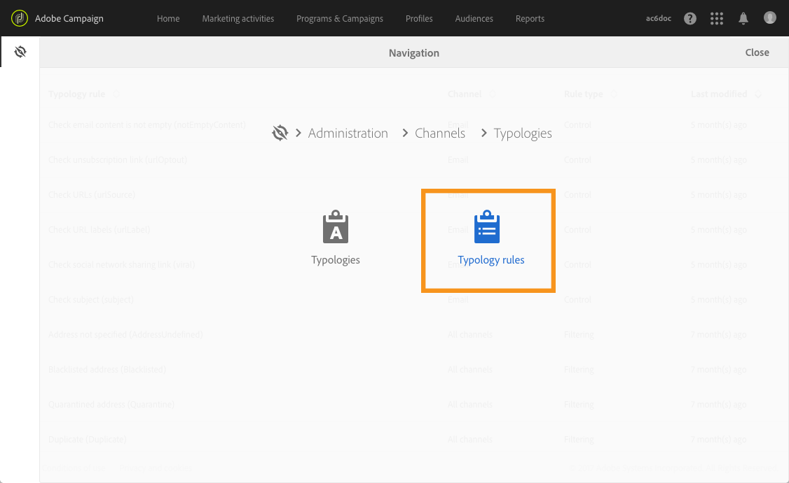
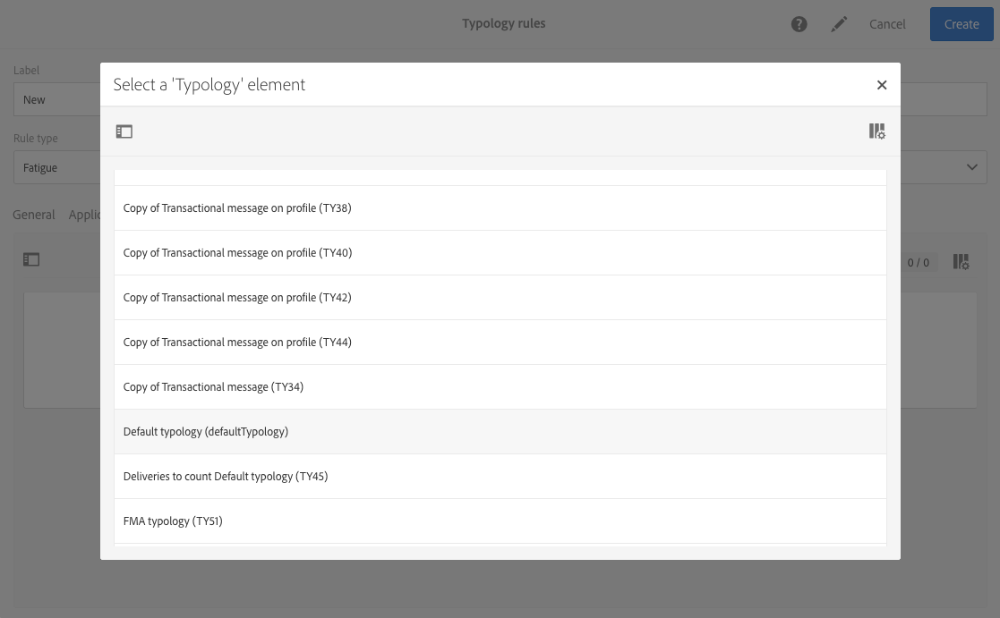
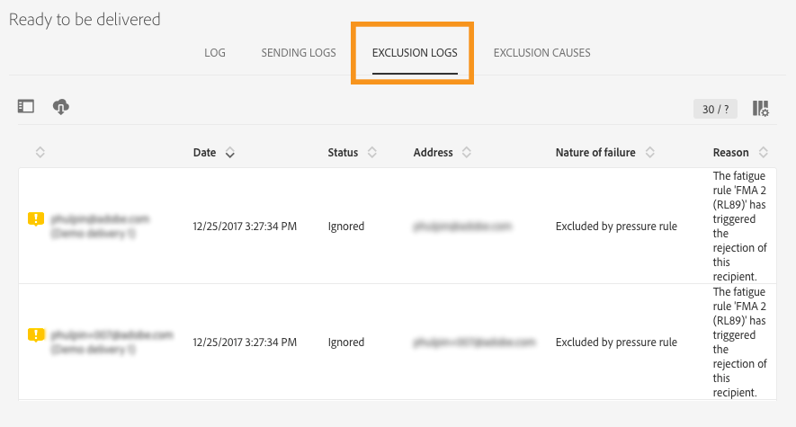
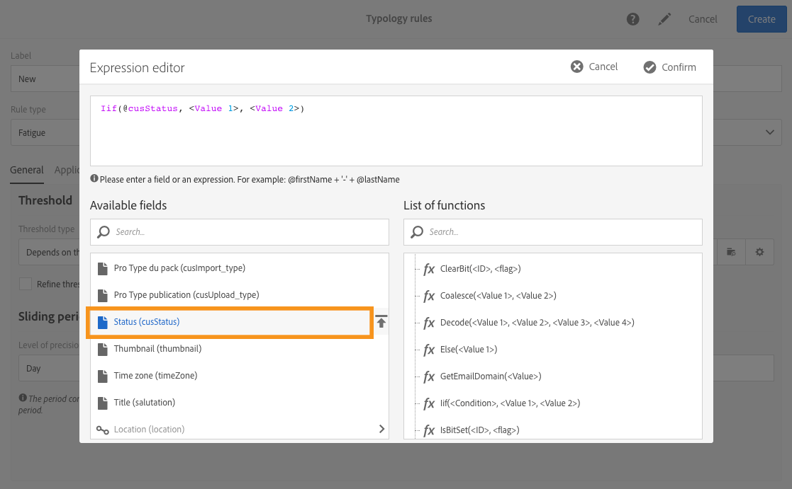

# 疲労ルール{#fatigue-rules}

## 疲労ルールについて {#about-fatigue-rules}

疲労ルールを使用すると、マーケターは、過剰に要請されたプロファイルをキャンペーンから自動的に除外する、チャネル間のグローバルなビジネスルールを設定できます。

疲労ルールを実装するには、プロファイルごとの最大メッセージ数を定義し、ルールを適用する期間を選択します。 配信の準備中、既に送信されているプロファイルの数に応じて、該当する場合は配信からメッセージが除外されます。

>[!NOTE]
>
>疲労ルールを適用するには、配信の連絡日を定義する必要があります。 メッセージをすぐに送信する場合は、疲労ルールは適用されません。

関連トピック:

* [準備](../../administration/using/configuring-email-channel.md#preparation)
* [タイポロジの管理](../../sending/using/managing-typologies.md)
* [タイポロジルール](../../sending/using/managing-typology-rules.md)
* [接触疲労を防ぐための通信頻度の最適化](https://helpx.adobe.com/campaign/kb/simplify-campaign-management.html#Engageyourcustomersateverystep)

## Creating a fatigue rule {#creating-a-fatigue-rule}

**[!UICONTROL Fatigue]** タイポロジルールを作成および設定するには、次の手順を適用します。

1. Adobe Campaignのロゴをクリックし、インターフェイスの左上隅にある **[!UICONTROL Administration]** / **[!UICONTROL Channels]** / **[!UICONTROL Typologies]** /を選択し **[!UICONTROL Typology rules]**&#x200B;ます。

   

1. タイポロジルールのリストで、をクリックし **[!UICONTROL Create]**&#x200B;ます。

   

1. フィールドでを選択 **[!UICONTROL Rule type]** し **[!UICONTROL Fatigue]**&#x200B;ます。

   

1. フィールドで、ルールを適用するチャネルを選択し **[!UICONTROL Channel]** ます。 1つのチャネル（電子メール、SMS、ダイレクトメール、モバイルアプリケーション）を選択するか、を選択でき **[!UICONTROL All channels]**&#x200B;ます。 「チャネル [の選択](#choosing-the-channel)」を参照してください。

   

1. タブで、プロファイルあたりの最大メッセージ数を計算する方法を定義し **[!UICONTROL General]** ます。 一定のしきい値または変数を選択できます。 また、プロファイルや配信のしきい値を調整することもできます。 For more on this, refer to [Defining the threshold](#defining-the-threshold).

   

1. タイポロジルール **[!UICONTROL Sliding period]** を適用するオンを選択します。 For more on this, refer to [Setting the sliding period](#setting-the-sliding-period).

   

   この例（前のスクリーンショットを参照）では、スライド期間15日間に最大4つのメッセージを送信することを選択しています。

1. タブでは、すべての配信にこのルールを適用するか、送信するメッセージに従ってルールの適用を制限するかを選択できます。 **[!UICONTROL Application criteria]** ルールは、適用条件が満たされた場合にのみ実行されます。 例えば、特定の単語で始まるラベルを持つメッセージや、特定の文字を含むIDを持つメッセージに対してのみ、ルールを適用できます。 詳しくは、フィルタリングルールの適用の [制限を参照してください](../../sending/using/filtering-rules.md#restricting-the-applicability-of-a-filtering-rule)。

   

1. タブを選択し、配信に使用するタイポロジにタイポロジルールをリンクします。 **[!UICONTROL Typologies]** タイポロジ [と](../../sending/using/managing-typologies.md) タイポロジルールの管理を参照してください 。

   

   >[!NOTE]
   >
   >配信テンプレートでタイポロジを定義すると、このテンプレートを使用して作成されるすべての配信に自動的にこのタイポロジを適用できます。

配信の準備中、既に配信に送信されている配信の数に応じて、該当する場合はプロファイルがから除外されます。 疲労ルールの実行結果を配信ログに表示できます。 「疲労結果の [表示](#viewing-the-fatigue-results)」を参照してください。

>[!IMPORTANT]
>
>疲労ルールを機能させるには、配信の連絡日を定義する必要があります。 メッセージをすぐに送信する場合は、疲労ルールは適用されません。

## チャネルの選択 {#choosing-the-channel}

疲労ルールは様々なチャネルで使用できます。 チャネルは、タイポロジルール設定の **[!UICONTROL Channel]** フィールドで定義します。 1つのチャネルを選択するか、を選択しま **[!UICONTROL All channels]**&#x200B;す。

**使用可能なチャネル**

次のチャネルを使用できます。

* E メール
* モバイル (SMS)
* ダイレクトメール
* モバイルアプリケーション： このチャネルを使用すると、プロファイルまたはアプリのサブスクリプションにプッシュ通知を送信できます。 プロファイルに通知を送信する場合、通知はマルチチャネルの疲労ルールと互換性があります。

   >[!IMPORTANT]
   >
   >疲労ルールは、アプリの購読者に送信されるプッシュ通知と互換性がありません。 アプリの購読者にメッセージを送信する場合、疲労ルールは適用されません。

* すべてのチャネル: このオプションを使用すると、すべてのチャネルにルールを適用できます。 例えば、任意のチャネルで1か月に最大3個のメッセージを送信することができます。 先週プロファイルに2通の電子メールを送信し、今日プッシュ通知を送信しようとすると、同じプロファイルが除外されます。

**配信タイプ**

疲労ルールは、次のすべての配信タイプと互換性があります。 ワンショット配信、定期配信、ワークフロー配信およびトランザクションメッセージ。

**トランザクションメッセージング** は、イベント(rtEvent)をターゲットとするサービスメッセージと、リマーケティングメッセージなどのマーケティングプロファイル（ターゲットメッセージ）を送信するために使用できます。 疲労ルールは、マーケティングメッセージ(ターゲットプロファイル)とのみ互換性があります。 イベントトランザクションメッセージにはプロファイル情報が含まれないので、疲労ルールとの互換性はありません(プロファイルとのエンリッチメントの場合でも)。 トランザクショントランザクションメッセージでのマーケティングメッセージのサポートを受けて、マーケティングメッセージを含むすべてのチャネルに疲労ルールを **適用できます**。

## しきい値の定義 {#defining-the-threshold}

各疲労ルールは、しきい値を定義します。つまり、あるプロファイルに対して指定した期間に送信できる最大メッセージ数を示します。 しきい値に達すると、その後は指定された期間が完了するまで、配信は実施できなくなります。このプロセスにより、メッセージが設定されたしきい値を超えた場合に、配信からプロファイルを自動的に除外できるので、過剰勧誘を回避できます。

しきい値は、定数または変数にすることができます。 つまり、ある期間に限り、プロファイル間や同じプロファイルに対しても、しきい値は異なる場合があります。

**固定しきい値の使用**

しきい値は、該当期間中にプロファイルに送信できる最大メッセージ数を表します。

デフォルトでは、定数のしきい値が使用されます。この場合は、ルールで許可されるメッセージの最大数の値を指定してください。

**可変しきい値の使用**

可変しきい値を定義するには、フィールドで **[!UICONTROL Depends on the recipient]** 値を選択し **[!UICONTROL Threshold type]** ます。

次の2つのオプションがあります。

* プロファイルフィールドを選択します。 しきい値は、選択したフィールドに応じてプロファイルごとに異なります。 例えば、プロファイルリソースを[通信頻度]フィールドで拡張した場合は、フィールドの右側のボタンをクリックし、 **[!UICONTROL Threshold computation formula]** フィールドを選択します。 各プロファイルに対して、しきい値は「通信頻度」フィールドの値をとります。

   

* 式を定義します。 フィールドの右側にある2番目のボタンをクリックして、アドバンスしきい値の計算式を定義し **[!UICONTROL Threshold computation formula]** ます。 例えば、プロファイルが属するセグメントに従って、承認されたメッセージ数のインデックスを作成できます。 これは、「Web」セグメントに属するプロファイルが他のプロファイルよりも多くのメッセージを受信する可能性があることを意味します。 Webセグメントのプロファイルに対して5つのメッセージを配信し、他のセグメントに対して3つのメッセージをメッセージするタイプ式。 **[!UICONTROL Iif (@origin='Web', 5, 3)]**

   

**プロファイルと配信のしきい値の調整**

デフォルトでは、しきい値の計算にはすべてのメッセージが考慮されます。配信の準備時にカウントするプロファイルと配信をフィルターするには、この **[!UICONTROL Refine Threshold on profiles and deliveries]** ボックスをオンにします。

次の例では、男性のプロファイルのみがカウントされ、 **ニュースレター** ()で始まるラベルを持つ配信のみがカウントされます。

配信のしきい値の調整は、ルール全体( **[!UICONTROL Application criteria]** タブ)の適用を制限するのとは異なります。

* **[!UICONTROL Application criteria]**: ルールを実行するか、特定の条件に従わないかを選択します。 例えば、申し込み条件が「ニュースレターで開始のラベル付け」の場合、ルールはこの条件を尊重する配信にのみ適用されます。 配信のラベル開始が「プロモーション」を持つ場合、ルールはまったく実行されません。
* **[!UICONTROL Refine threshold on profiles and deliveries > Deliveries to count]**: このタイポロジルールを使用するすべての配信がルールを実行しますが、過去とスケジュールされた配信の中から、カウントするを決定します。 例えば、制限が「ニュースレターで開始のラベルを付ける」の場合、配信のラベルが「プロモーション」の開始であっても、ルールが実行されます。 選択したスライド期間中に、「ニュースレター」のラベル開始を持つ配信の数がカウントされます。

## Setting the sliding period {#setting-the-sliding-period}

疲労ルールはn日周期で定義されます。 期間は、2週間、7日、5時間など、 **[!UICONTROL Sliding period]** セクションで設定します。

ルールを実行すると、過去の配信とスケジュールされた配信の両方が考慮されます。 これにより、所定のスライド期間でしきい値を超えることがない。

例えば、48時間という期間を定義した場合、連絡日の48時間 **前** 、連絡日の48時間 **後が検索されます**。 したがって、選択した期間が2倍になり、今後の配信と以前の期間を統合できるようになります。

2週間の期間に対して配信を制限するには、「 **引当期間****** 」セクションに「日 **** 」と「1週間」を入力します。 配信日の7日前までに送信され、ルールが適用される配信日の7日後までにスケジュールされた配信は、計算に考慮されます。

## 疲労の結果の表示 {#viewing-the-fatigue-results}

配信の準備中、既に配信に送信されている配信の数に応じて、該当する場合はプロファイルがから除外されます。 疲労ルールの実行結果を表示するには、ブ **[!UICONTROL Deployment]** ロックの右下隅にあるボタンをクリックします。

3つのタブが使用可能で、適用したルールの名前を含む疲労実行結果の詳細を示します。

* 配信ログ：

   

* 除外ログ:

   

* 除外の原因：

   

## 疲労ルールの概要レポートの表示 {#viewing-the-fatigue-rule-summary-report}

Adobe Campaignには、疲労ルールがキャンペーンにどのように適用されているかを理解するために役立つ、疲労ルールに関する専用のレポートが用意されています。 これにより、キャンペーンがお互いにどのように影響を与えるかを学び、適切な調整を行うことができます。

レポ **[!UICONTROL Fatigue rules summary]** ートには、各プログラム、キャンペーンおよびメッセージの右上隅にある **[!UICONTROL Reports]** ボタンからアクセスできます。

画面の左側で、配信の連絡日に関するレポートデータをフィルターできます。 デフォルトでは、選択した開始は現在の日付の15日前に終了し、15日後に終了します。 また、特定の疲労ルールに基づいてフィルタリングすることもできます。

選択した期間に関する次の情報が円グラフに表示されます。

* **[!UICONTROL Total targeted]**: メッセージの準備前の総ターゲット
* **[!UICONTROL Excluded]**: 疲労ルールの適用による除外の合計数
* **[!UICONTROL Other exclusions]**: 他のタイポロジルールによる除外の総数
* **[!UICONTROL To deliver]**: メッセージの準備後に配信されるメッセージの合計数( **[!UICONTROL To deliver]** = **[!UICONTROL Total targeted]** - **[!UICONTROL Excluded]** - **[!UICONTROL Other exclusions]** )

グラフの右側に、疲労ルール別に分類された除外数が表示されます。

下の表には、選択した期間内のすべての配信が表示されます。 各配信に適用された疲労ルールと対応する除外を確認できます。 連絡日のない配信も表に表示されます。

* **[!UICONTROL 0]** とは、疲労ルールが適用されたが除外されていなかったことを意味します。
* **[!UICONTROL -N]** は、N個の除外が発生したことを意味します。
* 空のフィールドは、疲労ルールが適用されなかったことを意味します。

>[!NOTE]
>
>表示されるデータは、レポートにアクセスしたプログラム、メッセージ、キャンペーンに対してコンテキストを示すものではありません。 このレポートには、すべての組織単位の疲労ルールと配信が表示されます。 これにより、すべての配信のグローバル表示を得て、キャンペーンが他のユーザーにどのように影響を与えているかを理解できます。

## 例 {#examples}

疲労管理の実装には多くの可能性があります。 実行できる操作の例を以下に示します。

* 疲労ルールを作成します。疲労ルールは、 **すべてのチャネルに適用される** 一定のしきい値 ****(

   スライド期間7日間で、常に3のしきい値を持つマルチチャネルルールを作成するとします。

   先週、プレミアムプロファイルにプロモーション用の電子メールとトランザクションリマーケティング用の電子メールが届きました。 また、来週送信するSMSをスケジュールしました。 今日は、すべてのプロファイルを対象としたプッシュ通知を送信することにしました。 2週間の期間におけるメッセージの最大数に達しているため、プレミアムプロファイルは今日のプッシュから除外されます。

   

* **プロファイルフィールドに基づく** 可変しきい値を使用して、疲労ルールを作成します ****。

   プロファイルリソースを[通信制限]フィールドで拡張し、プロファイルごとに異なるしきい値を定義しました。 疲労ルールで、このフィールドに基づいて可変しきい値を定義し、スライド期間を2日に設定します。 プロファイルの例を2つ見てみましょう。 Johnの通信制限は1で、Davidのしきい値は2です。 両方とも昨日、既にニュースレターの電子メールを受け取っています。 今日もう一度メールを送ることにした。 ヨハネがターゲットから除外されたので，ダビデだけがそれを受け取る。

   

* し **きい値の計算式を使用して疲労ルールを作成します**。

   プロファイルの年齢に応じてしきい値を変更する必要がある。 プロファイルが40未満の場合は、4の制限を定義し、古いプロファイルの場合は、2の制限を定義します。 拡張フィールドを持つ各プロファイルにこのしきい値を定義する代わりに、疲労ルールに式を直接作成して、プロファイルの年齢に応じてしきい値を計算できます。 この例では、数式は次のようになり **[!UICONTROL Iif (@age<40, 4, 2)]**&#x200B;ます。

   

   >[!NOTE]
   >
   >この節では、しきい値計算式を使用した疲労ルールのステップバイステップの例も紹介します。

* プロファイルと配信のしきい値を **調整する疲労ルールを作成します** 。

   プロファイルリソースを「スコア」フィールドで拡張したほか、配信リソースを「タイプ」フィールドで拡張した場合。 一定のしきい値3を定義したいが、タイプが「アラート」または「黒の金曜日」のすべての配信と、スコアが10より大きいすべてのプロファイルをカウントから除外したい。 ルールを実行すると、過去および予定された配信の中で、スコアが10未満のプロファイルに送信された、「アラート」または「黒の金曜日」以外のすべての配信がカウントされます。

   

しきい値計算式を使用した疲労ルールの例を1つずつ示します。

この使用例では、プレミアムプロファイルに対して1週間に2メッセージ以上、標準プロファイルに対して1週間に2メッセージが配信されないようにタイポロジルールを作成する必要があります。

顧客や見込み客を特定するために、プロファイルリソースを拡張しました。このフィールドには、プレミアムプロファイルの場合は0、標準プロファイルの場合は1が含まれ **[!UICONTROL Status]** ます。

ルールを作成するには、次の手順に従います。

1. Create a new **Fatigue** type typology rule.
1. この節では、各プロファイルに応じてしきい値を計算する数式を作成し **[!UICONTROL Threshold]** ます。 フィールド内の **[!UICONTROL Depends on the recipient]** 値を選択し、フィールドの右側にある2番目のボタンのアイコンをクリックし **[!UICONTROL Threshold type]****[!UICONTROL Threshold computation formula]** ます。

   

1. セクションで、 **[!UICONTROL List of functions]** 重複に対して、 **ノード内の****[!UICONTROL Others]** Iif関数をクリックします。

   

1. 次に、 **セクションでプロファイルの** ステータス **[!UICONTROL Available fields]** を選択します。

   

1. 必要な値を入力して、次の数式を作成します。 **Iif(@status=0,2,4)**

   

   この数式により、受信者のステータスが 0 の場合は 2、その他のステータスの場合は 4 が割り当てられます。

1. Click **[!UICONTROL Confirm]** to approve the formula.
1. ルールを適用 **[!UICONTROL Sliding period]** する対象を指定します。 この場合、7日間に制限し、考慮に入れる配信を2週間に制限します。

   

1. ここで、作成したルールをタイポロジにリンクし、配信に適用します。 これを行うには、 **[!UICONTROL Typologies]** タブを選択し、をクリックして、配信に使用するタイポロジ **[!UICONTROL Create element]** を選択します。

   

1. ルールを保存して、作成を実行します。

ルールは、タイポロジに基づくすべての配信に適用されます。
