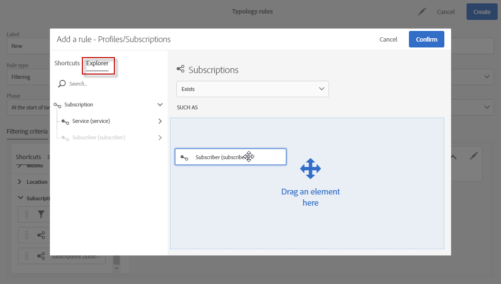
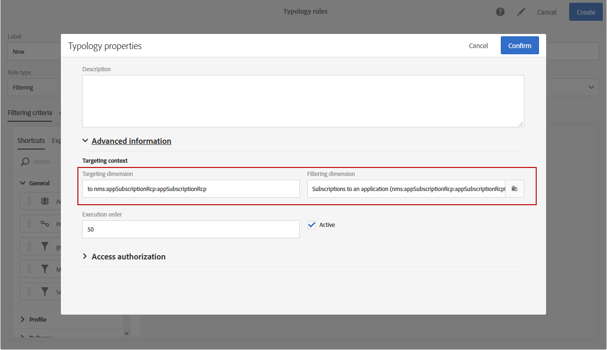

# フィルタリングルール {#filtering-rules}

フィルタリングルールを使用すると、隔離されたプロファイルや一定数のメールが既に送信されているプロファイルなど、クエリで定義された基準に従って、メッセージターゲットの一部を除外できます。

## デフォルトのフィルタリングタイポロジルール {#default-filtering-typology-rules}

次の表に、すぐに使用できるフィルタリングルールと、その関連チャネルに関する情報を示します。

| ラベル | チャネル | 説明 |
| ---------|----------|---------|
| **[!UICONTROL Address not specified]** | すべて | 指定されたアドレス（選択したチャネルに従って電子メール、郵便アドレスなど）を持たないターゲット母集団を除外します。 |
| **[!UICONTROL Address on denylist]** | すべて | ブロックリスト上のアドレスを除外します。 |
| **[!UICONTROL Duplicate]** | すべて | ターゲット母集団&#x200B;**[!UICONTROL Address]** フィールドに基づいて重複を除外します。 |
| **[!UICONTROL Exclude mobile applications]** | モバイルアプリケーション | メッセージで定義されたモバイルアプリケーションと一致しないアプリサブスクリプションを除外します。 |
| **[!UICONTROL Exclude mobile applications for In-App]** | アプリ内 | メッセージ（アプリ内テンプレート）で定義されたモバイルアプリケーションと一致しないアプリのサブスクリプションを除外します。 |
| **[!UICONTROL Exclude mobile applications for In-App broadcast]** | アプリ内 | メッセージで定義されたモバイルアプリケーションと一致しないアプリのサブスクリプションを除外します（アプリ内放送テンプレート） |
| **[!UICONTROL Exclude mobile applications for Push]** | モバイルアプリケーション | メッセージで定義されたモバイルアプリケーションと一致しないアプリサブスクリプションを除外します（プッシュ用） |
| **[!UICONTROL Quarantined address]** | すべて | 強制隔離されたアドレスを除外します。 |
| **[!UICONTROL Target limited in size]** | すべて | ターゲットの最大配信サイズに達したかどうかを確認します。 「配信制限」オプションがアクティブになっているダイレクトメール配信に適用されます。 |

これらのデフォルトのフィルタリングルールに加えて、次の2つの除外ルールを使用できます。

* **[!UICONTROL Exclusion of addresses]** ( **[!UICONTROL addressExclusions]** )
* **[!UICONTROL Exclusion of domains]** ( **[!UICONTROL domainExclusions]** ).

電子メールの分析時には、配信性能インスタンスで管理された暗号化グローバル抑止リストに含まれている禁止アドレスや禁止ドメイン名がこれらのルールによって照合され、受信者の電子メールアドレスが該当していないかどうかの確認処理が実行されます。 該当した場合、その受信者宛てにはメッセージが送信されません。

これは、Spamtrap などの悪意あるアクティビティによってブロックリストに登録されることを防ぐためです。 例えば、会社の web フォーム経由で Spamtrap を使用して購読処理が実行されると、Spamtrap 宛てに確認メールが自動送信され、お使いのアドレスが自動的にブロックリスト登録される結果になります。

>[!NOTE]
>
>グローバル抑止リストに含まれているアドレスやドメイン名は非公開です。 除外された受信者の数に関する情報だけが配信分析ログに記録されます。

## フィルタールールの作成 {#creating-a-filtering-rule}

ニーズに応じて、独自のフィルタリングルールを作成できます。 例えば、ニュースレターのターゲット母集団をフィルタリングして、18歳未満の購読者がコミュニケーションを受け取らないようにすることができます。

フィルタータイポロジルールを作成するには、次の手順に従います。

1. 新しいタイポロジルールを作成します。 タイポロジルールを作成するための主な手順について詳しくは、[この節](../../sending/using/managing-typology-rules.md)を参照してください。

1. **[!UICONTROL Filtering]** ルールの種類を選択し、目的のチャネルを指定します。

1. 「**[!UICONTROL Filtering criteria]**」タブで、**[!UICONTROL Subscription]** カテゴリのサブスクリプションを選択します。

   

1. クエリエディターの「**[!UICONTROL Explorer]**」タブで、**[!UICONTROL Subscriber]** ノードを画面のメイン部分にドラッグ&amp;ドロップします。

   

1. 「**[!UICONTROL Age]**」フィールドを選択し、購読者の年齢が18歳未満になるようにフィルタリング条件を定義します。

   

1. 「**[!UICONTROL Typologies]**」タブで、このルールをタイポロジにリンクします。

   

1. 使用する配信または配信テンプレートでタイポロジが選択されていることを確認します。 詳しくは、[この節](../../sending/using/managing-typologies.md#applying-typologies-to-messages)を参照してください。

   

このルールがメッセージで使用されるたびに、未成年者と見なされる購読者は自動的に除外されます。

## フィルタールールのターゲティングコンテキストの設定 {#configuring-filtering-rules-targeting-context}

Campaign Standardでは、ターゲットにするデータに応じて、**ターゲティング**&#x200B;および&#x200B;**フィルタリング** ディメンションを使用するように設定できます。

これを行うには、タイポロジルールのプロパティを開き、**[!UICONTROL Advanced information]** セクションにアクセスします。

デフォルトでは、フィルタリングは&#x200B;**[!UICONTROL Profiles]**&#x200B;で実行されます。 例えば、ルールがモバイルアプリケーションを対象としている場合、**[!UICONTROL Filtering dimension]**&#x200B;を&#x200B;**[!UICONTROL Subscriptions to an application]**&#x200B;に変更できます。

## フィルタリングルールの適用の制限 {#restricting-the-applicability-of-a-filtering-rule}

送信するメッセージに応じて、フィルタリングルールの適用を制限できます。

1. タイポロジルールの「**[!UICONTROL Application criteria]**」タブで、デフォルトで有効になっている「**[!UICONTROL Apply the rule on all deliveries]**」オプションのチェックを外します。

   

1. クエリエディターを使用してフィルターを定義します。 例えば、ラベルが特定の単語で始まるメッセージ、またはIDが特定の文字を含むメッセージにのみルールを適用できます。

   

この場合、ルールは、定義された条件に対応するメッセージにのみ適用されます。
