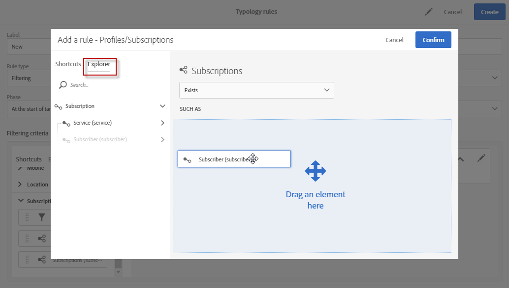

# フィルタールール {#filtering-rules}

フィルタールールを使用すると、隔離されたプロファイルや、特定の数の電子メールが既に送信されたプロファイルなど、クエリで定義された条件に従って、メッセージターゲットの一部を除外できます。

## 既定のフィルタタイポロジルール {#default-filtering-typology-rules}

次の表に、そのまま使用できるフィルタリングルールと、その関連チャネルに関する情報を示します。

| ラベル | チャネル | 説明 |
---------|----------|---------
| **[!UICONTROL Address not specified]** | すべて | 指定したアドレス（電子メール、住所など）を持たないターゲットの人口を除外します。 」をクリックします)。 |
| **[!UICONTROL Address on denylist]** | すべて | 上のアドレスを除外ブロックリストします。 |
| **[!UICONTROL Duplicate]** | すべて | ターゲット母集団 **[!UICONTROL Address]** フィールドに基づいて重複を除外します。 |
| **[!UICONTROL Exclude mobile applications]** | モバイルアプリケーション | メッセージ内で定義されているモバイルアプリと一致しないアプリ購読を除外します。 |
| **[!UICONTROL Exclude mobile applications for In-App]** | アプリ内 | メッセージ内で定義されているモバイルアプリ（アプリ内テンプレート）と一致しない購読を除外します。 |
| **[!UICONTROL Exclude mobile applications for In-App broadcast]** | アプリ内 | メッセージ内で定義されているモバイルアプリ（アプリ内ブロードキャストテンプレート）に一致しないアプリ購読を除外します。 |
| **[!UICONTROL Exclude mobile applications for Push]** | モバイルアプリケーション | メッセージ内で定義されているモバイルアプリと一致しないアプリ購読を除外します（プッシュの場合） |
| **[!UICONTROL Quarantined address]** | すべて | 隔離されたアドレスを除外します。 |
| **[!UICONTROL Target limited in size]** | すべて | ターゲットの最大配信サイズに達したかどうかを確認します。 「配信制限」オプションが有効になっているダイレクトメール配信に適用されます。 |

これらのデフォルトのフィルタールールに加えて、2つの除外ルールを使用できます。

* **[!UICONTROL Exclusion of addresses]** ( **[!UICONTROL addressExclusions]** )
* **[!UICONTROL Exclusion of domains]** ( **[!UICONTROL domainExclusions]** ).

電子メールの分析時には、配信性能インスタンスで管理された暗号化グローバル抑止リストに含まれている禁止アドレスや禁止ドメイン名がこれらのルールによって照合され、受信者の電子メールアドレスが該当していないかどうかの確認処理が実行されます。該当した場合、その受信者宛てにはメッセージが送信されません。

これは、Spamtrap などの悪意あるアクティビティによってブロックリストに登録されることを防ぐためです。例えば、会社の Web フォーム経由で Spamtrap を使用して購読処理が実行されると、Spamtrap 宛てに確認メールが自動送信され、お使いのアドレスが自動的にブロックリスト登録される結果になります。

>[!NOTE]
>
>グローバル抑止リストに含まれているアドレスやドメイン名は非公開です。除外された受信者の数に関する情報だけが配信分析ログに記録されます。

## フィルタールールの作成 {#creating-a-filtering-rule}

必要に応じて独自のフィルタールールを作成できます。 例えば、ニュースレターのターゲット数をフィルタリングして、18歳未満の購読者が通信を受け取らないようにすることができます。

フィルタリングタイポロジルールを作成するには、次の手順に従います。

1. 新しいタイポロジルールを作成します。 The main steps to create typology rules are detailed in [this section](../../sending/using/managing-typology-rules.md).

1. ルールタイプを選択し、 **[!UICONTROL Filtering]** 目的のチャネルを指定します。

1. タブで **[!UICONTROL Filtering criteria]** 、 **[!UICONTROL Subscription]** カテゴリの購読を選択します。

   

1. クエリエディターの **[!UICONTROL Explorer]** タブで、ノードを画面のメイン部分にドラッグ&amp;ドロップし **[!UICONTROL Subscriber]** ます。

   

1. フィールドを選択し、 **[!UICONTROL Age]** フィルター条件を定義して、サブスクライバーの年齢が18才以上になるようにします。

   

1. タブで、このルールをタイポロジにリンクし **[!UICONTROL Typologies]** ます。

   

1. 使用する配信または配信テンプレートでタイポロジが選択されていることを確認します。 詳しくは、[この節](../../sending/using/managing-typologies.md#applying-typologies-to-messages)を参照してください。

   

このルールがメッセージで使用される場合は、未成年と見なされる購読者が自動的に除外されます。

## フィルタールールのターゲット設定コンテキストの設定 {#configuring-filtering-rules-targeting-context}

Campaign Standardでは、ターゲットするデータに応じて **ターゲット化** ディメンションと **** フィルターディメンションが使用されるように設定できます。

これを行うには、タイポロジルールのプロパティを開き、 **[!UICONTROL Advanced information]** セクションにアクセスします。

By default, filtering is carried out on the **[!UICONTROL Profiles]**. 例えば、モバイルアプリを対象としたルールの場合は、をに変更 **[!UICONTROL Filtering dimension]** でき **[!UICONTROL Subscriptions to an application]**&#x200B;ます。

## Restricting the applicability of a filtering rule {#restricting-the-applicability-of-a-filtering-rule}

送信するメッセージに従って、フィルタリングルールの適用を制限できます。

1. タイポロジルールの **[!UICONTROL Application criteria]** タブで、デフォルトで有効になっている **[!UICONTROL Apply the rule on all deliveries]** オプションをオフにします。

   

1. クエリエディターを使用して、フィルターを定義します。 例えば、特定の単語を含むラベル開始のメッセージや、IDに特定の文字が含まれるメッセージに対してのみ、ルールを適用できます。

   

この場合、ルールは、定義された条件に対応するメッセージにのみ適用されます。
