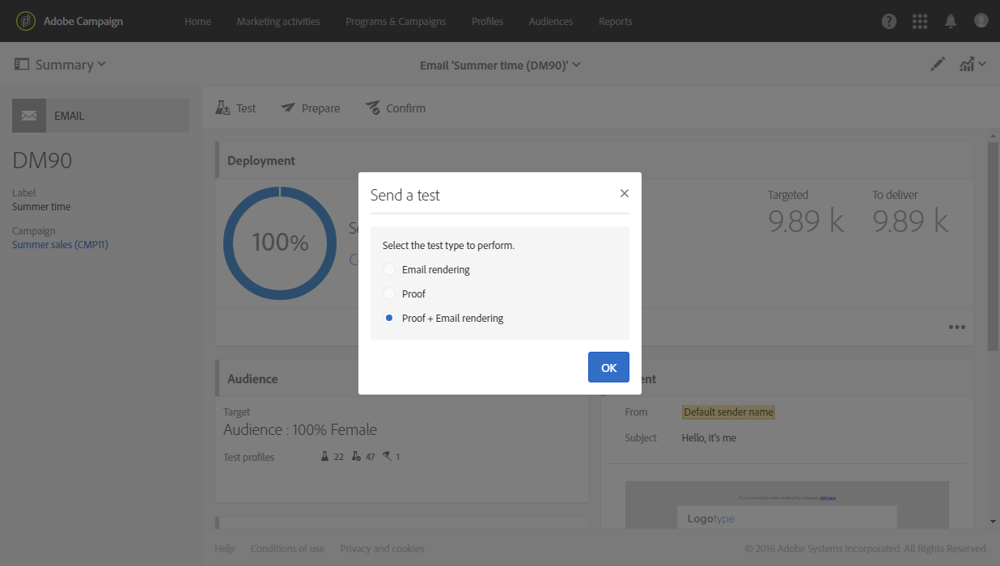
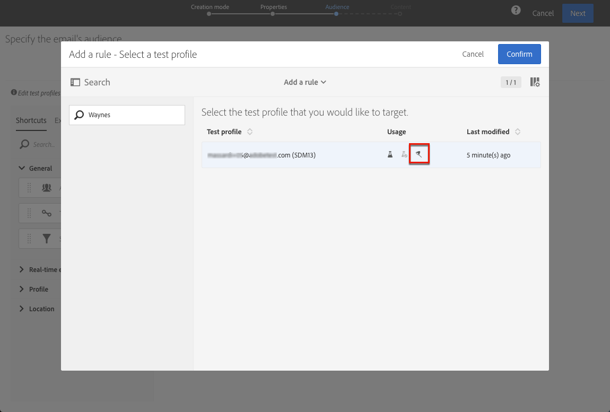

# テストプロファイルの管理と証明書の送信{#managing-test-profiles-and-sending-proofs}

## テストプロファイルについて {#about-test-profiles}

テストプロファイルを使用すると、定義されたターゲット条件と一致しない追加の受信者をターゲットにすることができます。これらは、受信者データベースの不正使用を検出したり、電子メールをインボックスに確実に着信させるために、メッセージの視聴者に追加されます。

テストプロファイルは、詳細メニューから管理 **[!UICONTROL Profiles & audiences > Test profiles]**&#x200B;できます。

テストプロファイルには、架空の連絡先情報、または送信者によって制御される連絡先情報が含まれています。これらの情報は、次のコンテキストのメッセージで使用できます。

* **証明**&#x200B;書の送信:Proofは、最終的な配信を受信者に送信する前にメッセージを確認するために使用される特定のメッセージです。証明テストプロファイルは、その内容および形式に関して、配送のチェックを担当します。証明 [の送信を参照](../../sending/using/managing-test-profiles-and-sending-proofs.md#sending-proofs)してください。
* **電子メールレンダリング**:電子メールレンダリングテストプロファイルは、メッセージの受信トレイに応じたメッセージの表示方法をチェックするために使用されます。たとえば、Webメール、メッセージサービス、モバイルなどです。[電子メールのレンダリング](../../sending/using/email-rendering.md)を参照してください。

   **電子メールレンダリング** の使用は読み取り専用です。この使用を使用したテストプロファイルは、Adobe Campaignでのみ使用できます。

* トラップと **し**&#x200B;て:メッセージは、メインターゲットに送信されると同様にテストプロファイルに送信されます。トラップ [の使用を参照](../../sending/using/managing-test-profiles-and-sending-proofs.md#using-traps)してください。
* メッセージ **をプレビュー** するには:パーソナル化要素をテストするメッセージをプレビューするときに、テストプロファイルを選択できます。「メッセージ [のプレビュー」を参照](/help/sending/using/previewing-messages.md)してください。

## テストプロファイルの管理 {#managing-test-profiles}

### テストプロファイルの作成 {#creating-test-profiles}

1. 詳細メニューから、Adobe Campaignロゴを使用して、プロファイルとユーザーを選択 **し、テストプロファイルのリストにアクセスするプロファイルを** テストします。

   

1. **[!UICONTROL Test profiles]** ダッシュボードから **「作成**」をクリックします。

   

1. このプロファイルのデータを入力します。

   

1. テストプロファイルの使用目的を選択します。

   

1. 必要に応じて、接触チャネル **[!UICONTROL Email, Telephone, Mobile, Mobile app]**&#x200B;とテストプロファイルアドレスを入力します。

   >[!NOTE]
   >
   >次のように、優先電子メール形式を定義できます。 **[!UICONTROL Text]****[!UICONTROL HTML]**&#x200B;または

1. このテストプロファイルを使用してトランザクションメッセージのパーソナル化をテストする場合は、イベントの種類とこのイベントのデータを指定します。
1. テスト **[!UICONTROL Create]** プロファイルを保存するときにクリックします。

その後、プロファイルのリストにテストプロファイルが追加されます。

**関連トピック:**

[テストプロファイル](https://helpx.adobe.com/campaign/kt/acs/using/acs-test-profiles-feature-video-use.html) ビデオの作成

### テストプロファイルの編集 {#editing-test-profiles}

テストプロファイルを編集し、そのプロファイルにリンクされているデータを確認して変更するには、次の手順に従います。

1. 編集するテストプロファイルを、そのイメージをクリックして選択します。
1. フィールドを参照または変更します。

   

1. 変更を入力した場合はクリック **[!UICONTROL Save]** するか、テストプロファイルの名前を選択して、画面上部のセクション **[!UICONTROL Test profiles]** でテストプロファイルダッシュボードに戻ります。

## 証明書の送信 {#sending-proofs}

証明は、メッセージをメインターゲットに送信する前にテストできる特定のメッセージです。

証明の受信者は、メッセージ（内容およびフォーム）の承認を担当します。これらは **テストプロファイルで定義**&#x200B;されます。詳細については、「テストプロファイル [の管理」を参照](../../sending/using/managing-test-profiles-and-sending-proofs.md#managing-test-profiles)してください。

証明書を送信するには、テストプロファイルをメッセージの視聴者に含める必要があります。

メッセージで:

1. ボタンをクリック **[!UICONTROL Send a test]** します。

   

1. 使用する証明の種類を選択します:

   * **[!UICONTROL Email rendering]**:このオプションを選択すると、対象のインボックスに従ってメッセージの受信方法をテストできます。詳細については [、電子メールのレンダリング](../../sending/using/email-rendering.md)を参照してください。
   * **[!UICONTROL Proof]**:このオプションを選択すると、メッセージをメインターゲットに送信する前にテストできます。証明受信者は、コンテンツとその形式の両方を確認することによって、配信の承認を担当します。
   * **[!UICONTROL Proof + Email rendering]**:このオプションは、前の2つのオプションを組み合わせます。
   

1. 選択を確認してください。

   証明書はテストプロファイルに送信されます。

   

1. ドロップダウンリストを使用して、証明書 **[!UICONTROL Proofs]** を表示できます。

   

1. その概要にアクセスする証明を選択します。電子メールでは、証明書の種類として **「電子メール」レンダリング** オプションを選択した場合は、校正ラベルの右側に **[!UICONTROL Access email rendering]** アイコンが表示されます。[電子メールのレンダリング](../../sending/using/email-rendering.md)を参照してください。

   

証明書を受け取った人のコメントに応じて、配信の内容を変更するように求められることがあります。変更が行われたら、電子メールの準備を再起動し、証明書を再送信する必要があります。各新しい証明書には、ボタン **[!UICONTROL Show proofs]** を使用してアクセスできます。

必要に応じて、配信の内容を確定するまで、必要な数の証明書を送信する必要があります。これが完了したら、配送をメインターゲットに送信し、承認サイクルを終了できます。

**関連トピック:**

[テストの送信、電子メール](https://helpx.adobe.com/campaign/kt/acs/using/acs-sending-test-preparing-sending-email-feature-video-use.html) ビデオの準備および送信

## トラップの使用 {#using-traps}

トラップを使用すると、クライアントファイルが不正に使用されているかどうかを識別する手段として、メッセージはメインターゲットに送信されるときと同様にテストプロファイルに送信されます。

トラップは、本来ダイレクトメール配信用に設計されたものです。これにより、次のことができます。
* ダイレクトメールプロバイダーが実際に通信を送信していることを確認します。
* お客様と同じ条件でメールを受信します。
* 送信されたメールの正確なコピーを保持します。
* あなたのクライアントリストがダイレクトメールプロバイダーによって悪用されないことを確認してください。実際に、テストプロファイルのアドレスに他の通信が送信された場合は、クライアントファイルが使用されていない可能性があります。このため、テストプロファイルのアドレスは、この目的にのみ使用する必要があります。

ダイレクトメールの視聴者にトラップを追加する方法について詳しくは、テストプロファイルとトラッププロファイル [の追加を参照](../../channels/using/defining-the-direct-mail-audience.md#adding-test-and-trap-profiles)してください。

他の通信チャネルでは、次の手順に従って、メインターゲットにトラップテストプロファイルを追加できます。
* メッセージが正常に送信されたことを確認します。
* メッセージの正確なコピーを取得して保存します。
* 送信および受信時に追跡します。

テストプロファイルをトラップとして使用するには、そのプロファイルをメッセージの視聴者に含める必要があります。

>[!NOTE]
>
>[証明書](../../sending/using/managing-test-profiles-and-sending-proofs.md#sending-proofs) や [電子メールのレンダリング](../../sending/using/email-rendering.md)に使用されるテストプロファイルとは異なり、メッセージは、メインターゲットとトラップとして使用されるテストプロファイルに同時に送信されます。

メッセージの視聴者を定義する場合:

1. **[!UICONTROL Test profiles]** タブからテスト・プロファイルを選択します。意図した用途 **[!UICONTROL Trap]** であることを確認します。

   

1. メッセージの内容が準備できたら、 **[!UICONTROL Prepare]** ボタンをクリックします。「送信 [の準備」を参照](../../sending/using/preparing-the-send.md)してください。
   >[!NOTE]
   >
   >メインターゲットを選択したことを確認します。それ以外の場合は、メッセージを送信できません。

1. ボタンをクリック **[!UICONTROL Confirm]** します。「送信 [の確認」を参照](../../sending/using/confirming-the-send.md)してください。

   

メッセージはメインターゲットとテストプロファイルに送信されます。

>[!NOTE]
>
>テストプロファイルをトラップとして使用する場合、メッセージ内の豊富なフィールドに対して、対応する追加データは実際の対象のプロファイルからランダムに選択され、トラップテストプロファイルに割り当てられます。詳細については、この例を 参照してください。
