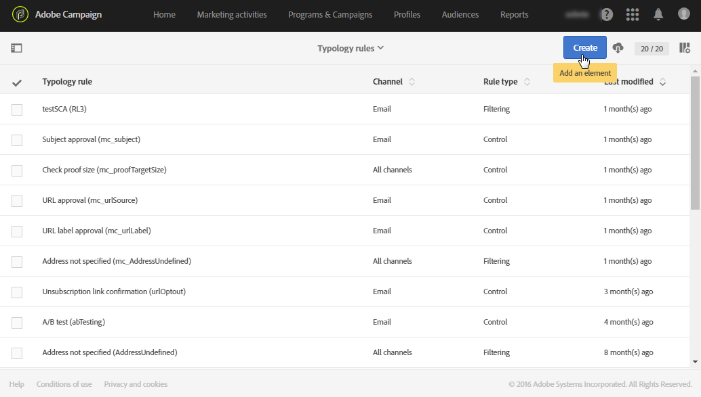

# タイポロジルールの管理{#managing-typology-rules}

## タイポロジルールについて{#about-typology-rules}

タイポロジルールとは、メッセージを送信する前に、メッセージのチェックやフィルタリングを実行できるビジネスルールです。使用できるタイポロジルールのタイプは次のとおりです。

* **フィルター**&#x200B;ルール：このタイプのルールを使用すると、強制隔離されたプロファイルや、既に一定数の E メールを送信したプロファイルなど、クエリで定義された条件に従って、メッセージターゲットの一部を除外できます。詳しくは、[この節](../../sending/using/filtering-rules.md)を参照してください。

* **疲労**&#x200B;ルール：このタイプのルールを使用すると、プロファイルあたり最大メッセージ数を定義して、メッセージの過剰送信を回避できます。詳しくは、[この節](../../sending/using/fatigue-rules.md)を参照してください。

* **コントロール**&#x200B;ルール：このタイプのルールを使用すると、文字表示、SMS メッセージサイズ、アドレス形式など、メッセージが送信される前に、メッセージの有効性と品質を確認できます。詳しくは、[この節](../../sending/using/control-rules.md)を参照してください。

タイポロジルールは、**[!UICONTROL Administration]**／**[!UICONTROL Channels]**／**[!UICONTROL Typologies]**／**[!UICONTROL Typology rules]** メニューから利用できます。

デフォルトでは、あらかじめ用意されている&#x200B;**フィルター**&#x200B;および&#x200B;**コントロール**&#x200B;タイポロジルールのいくつかを使用できます。これらの詳細は、[フィルタールール](../../sending/using/fatigue-rules.md)および[コントロールルール](../../sending/using/control-rules.md)の節を参照してください。

必要に応じて、既存のタイポロジルールを変更したり、新規作成できます。ただし、「**[!UICONTROL Control]**」ルールは読み取り専用で、変更はできません。

## タイポロジルールの作成{#creating-a-typology-rule}

タイポロジルールを作成する主な手順は次のとおりです。

1. **[!UICONTROL Administration]**／**[!UICONTROL Channels]**／**[!UICONTROL Typologies]**／**[!UICONTROL Typology rules]** メニューにアクセスし、「**[!UICONTROL Create]**」をクリックします。

   

1. タイポロジ「**[!UICONTROL Label]**」を入力し、ルールを適用する「**[!UICONTROL Channel]**」を指定します。

   

1. タイポロジルール「**[!UICONTROL Type]**」を指定し、必要に応じて設定します。タイポロジルールの設定は、タイプによって異なります。詳しくは、**[フィルタールール](../../sending/using/filtering-rules.md)**&#x200B;および&#x200B;**[疲労ルール](../../sending/using/fatigue-rules.md)**&#x200B;の節を参照してください。

1. 新しいルールを含めるタイポロジを選択します。これをおこなうには、「**[!UICONTROL Typologies]**」タブを選択し、「**[!UICONTROL Create element]**」ボタンをクリックします。

   

1. 目的のタイポロジを選択し、「**[!UICONTROL Confirm]**」をクリックします。

   

1. すべてのタイポロジを選択したら、「**[!UICONTROL Create]**」をクリックしてタイポロジルールの作成を確認します。

## タイポロジルールの実行順序{#typology-rules-execution-order}

タイポロジルールは、ターゲティング、分析、およびメッセージのパーソナライズ機能の各段階で指定された順序で実行されます。

標準の操作モードでは、ルールは次の順序で適用されます。

1. ターゲティングの開始時に適用されるコントロールルール
1. フィルタールール:

   * 住所資格のネイティブアプリケーションルール：定義されたアドレス/未確認のアドレス/ブロックリストに加えるアドレス/隔離されたアドレス/アドレスの質。
   * ユーザーによって定義されたフィルタールール

1. ターゲティングの終了時に適用されるコントロールルール
1. パーソナライズ機能の開始時に適用されるコントロールルール
1. パーソナライズ機能の終了時に適用されるコントロールルール

ただし、各タイポロジで同じタイプのルールの実行順序を適応させることができます。実際、同じメッセージ処理段階で複数のルールが実行される場合は、適用する順序を選択できます。

例えば、実行順序が 20 番のフィルタールールは、実行順序が 30 番のフィルタールールの前に実行されます。

タイポロジルールの「**[!UICONTROL Properties]**」で、実行順序を設定できます。複数のルールを適用する必要がある場合、各ルールの実行順序によって、最初に処理するルールが決まります。詳しくは、[タイポロジルールの実行順序](#typology-rules-execution-order)の節を参照してください。

ルールに関連するメッセージを分析する際に、ルールを適用したくない場合は、タイポロジールールの「**[!UICONTROL Properties]**」を通じて非アクティブ化できます。

