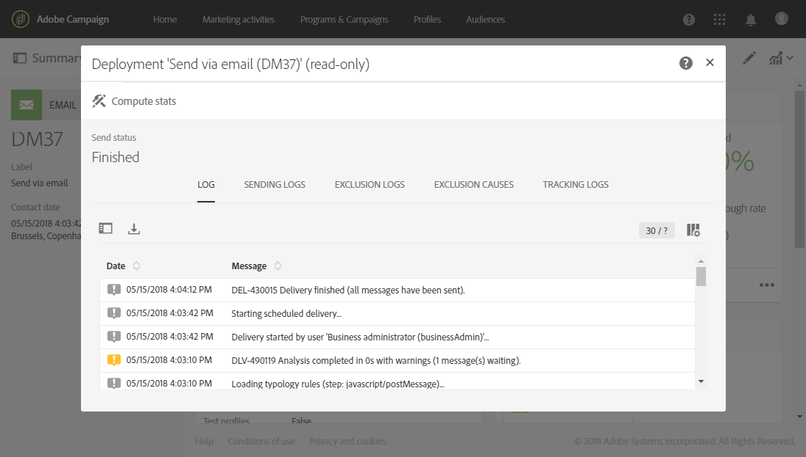

# 配信品質の監視{#monitor-deliverability}

以下では、**[!UICONTROL Delivery throughput]** レポートの詳細と、Adobe Campaignが提供する様々な監視ツールについて説明します。 配信品質の監視に関する追加のガイドラインを示します。

* プラットフォーム全体で配信スループットを定期的にチェックして、元のセットアップと整合性が取れているかどうかを検証します。
* 配信テンプレートで再試行が適切に設定されていることを確認します（再試行期間が 30 分、再試行回数が 21 回以上）。
* バウンスメールボックスがアクセス可能で、アカウントの有効期限近づいていないかを定期的に検証します。
* 各配信スループットをチェックして、配信コンテンツの有効期限と整合性が取れていることを確認します（例：「フラッシュセール」は数日ではなく、数分で配信される必要があります）。
* エラーの数と新しい強制隔離が他の配信と整合性が取れていることをチェックします。
* 配信ログを詳しく調べて、ハイライト表示されるエラーの種類（メール配信のルール、DNSの問題、迷惑メール対策のブロックリストなど）を確認します。

## 配信スループット {#delivery-throughput}

このレポートには、メッセージの配信速度を測定するために、一定期間のプラットフォーム全体の配信スループットに関する情報が含まれます。

詳しくは、[配信スループット](../../reporting/using/delivery-throughput.md)を参照してください。

タイムスケールを変更することで、表示される値を設定できます。

**[!UICONTROL Delivery summary]**&#x200B;や&#x200B;**[!UICONTROL Non-deliverables and bounces]**&#x200B;など、その他のレポートを利用できます。 詳しくは、[動的レポート ](../../reporting/using/about-dynamic-reports.md)を参照してください。

## 配信の監視 {#monitoring-deliveries}

メッセージダッシュボードでは、**[!UICONTROL Sending logs]**、**[!UICONTROL Exclusion logs]**、**[!UICONTROL Exclusion causes]**、**[!UICONTROL Tracking logs]**、**[!UICONTROL Tracked URLs]**&#x200B;の配信ログにアクセスできます。 送信の詳細、除外されたターゲットとその理由、および開封数やクリック数などの追跡情報が表示されます。

詳しくは、[配信の監視](../../sending/using/monitoring-a-delivery.md)を参照してください。

## アラートの受信 {#receiving-alerts}

**[!UICONTROL Delivery alerting]**&#x200B;機能は、ユーザーのグループが配信の実行に関する情報を含む通知を自動的に受信できるようにするアラート管理システムです。

詳しくは、「[ エラーが発生したときにアラートを受信する](../../sending/using/receiving-alerts-when-failures-happen.md)」を参照してください。

<!--
## External tools (#external-tools)

### Signal Spam {#signal-spam}

Signal Spam is a French service which offers anonymized feedback loop reporting for French ISPs (Orange, SFR).

This service allows you to follow the reputation of the French ISPs and track customers' activity evolution.

Signal Spam also provides direct complaints that end users log through a dedicated interface. Those complaints are then quarantined from the email address database.

### 250ok {#solution-250ok}

250ok is a monitoring solution which provides IP and domain denylists, as well as reputation indicators.

The information provided is real-time, which allows for a pro-active assistance. 250ok a complementary solution to the Adobe deliverability internal tools.
-->
