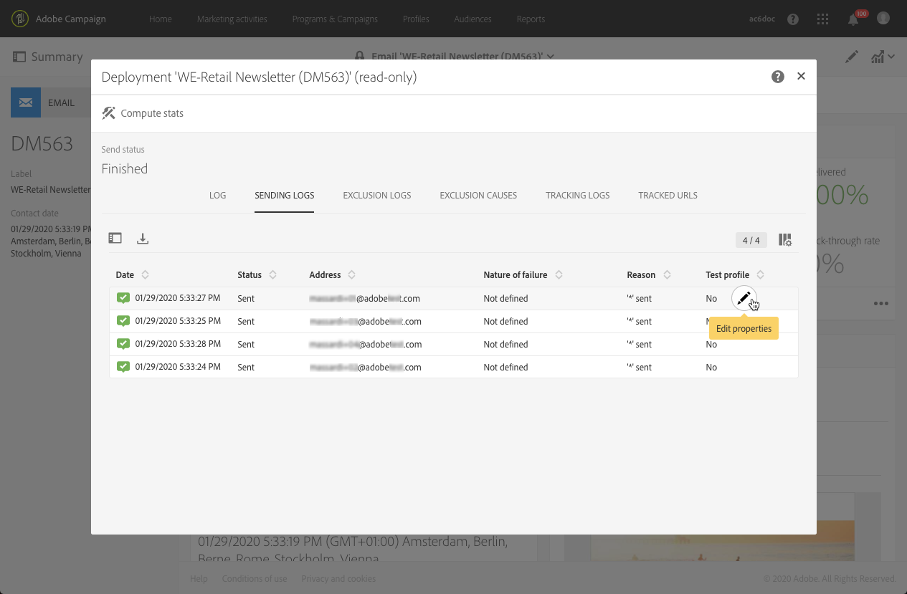

# 配信の監視{#monitoring-a-delivery}

配信を監視し、その影響を測定する方法はいくつかあります。 機能管理者は、メッセージログと配信ログにアクセスできます。

>[!IMPORTANT]
>
>**[!UICONTROL Administration]**&#x200B;役割と&#x200B;****&#x200B;へのアクセス権を持つ機能的な[管理者](../../administration/using/users-management.md#functional-administrators)のみが、送信ログ、メッセージログ、トラッキングログ、除外、または購読ログにアクセスできます。 管理者以外のユーザーは、これらのログにターゲットできますが、リンクされたテーブル(プロファイル、配信)から開始できます。

* **メッセージログ**：これらのログは、メッセージダッシュボードから直接アクセスできます。送信の詳細、除外されたターゲットとその理由、および開封数やクリック数などの追跡情報が表示されます。

   メッセージログを表示するには、**[!UICONTROL Deployment]** ブロックの右下にあるアイコンをクリックします。

   いくつかのタブには、**[!UICONTROL Sending logs]**、**[!UICONTROL Exclusion logs]**、**[!UICONTROL Exclusion causes]**、**[!UICONTROL Tracking logs]**、**[!UICONTROL Tracked URLs]** に関する情報（存在する場合）が含まれます。[配信ログ](#delivery-logs)を参照してください。

   

   ログには、配信と配達確認に関するすべてのメッセージが含まれます。特別なアイコンによって、エラーまたは警告を識別できます。詳しくは、[メッセージの承認](../../sending/using/previewing-messages.md)を参照してください。

   「**[!UICONTROL Export list]**」ボタンをクリックすると、ログをエクスポートすることができます。

   

* **配信アラート**：配信の成功または失敗を追跡するために、Adobe Campaign は重要なシステムアクティビティをユーザーに通知する E メールアラートシステムを備えています。
* **レポート**：メッセージダッシュボードから、この特定のメッセージに関する複数のレポートにアクセスできます。また、組み込みレポートやカスタムレポートの完全なリストにアクセスできる **[!UICONTROL Reports]** メニューもあり、メッセージやキャンペーンに関連する特定の指標の概要を示すのに使用できます。
* 管理者は、独自のレポートまたは BI ツールで処理できる個別のファイルにログをエクスポートすることもできます。詳しくは、[ログのエクスポート](../../automating/using/exporting-logs.md)を参照してください。

**関連トピック：**

* [エラー発生時のアラートの受信](../../sending/using/receiving-alerts-when-failures-happen.md)
* [レポート](../../reporting/using/about-dynamic-reports.md)

## 配信ログ {#delivery-logs}

### ログの送信 {#sending-logs}

「**[!UICONTROL Sending logs]**」タブには、この配信のすべての発生履歴が表示されます。送信されたメッセージのリストとそのステータスがここに保存されます。各受信者の配信ステータスを表示できます。

**[!UICONTROL Date]** 列には、「**[!UICONTROL Sent]**」ステータスを持つ各プロファイルに対してメッセージが送信された日時が表示されます。

特定の送信ログの詳細にアクセスするには、対応する行の右側にある鉛筆アイコンをクリックします。

送信ログの詳細は、すべて読み取り専用です。ミラーページのプレビューを表示することもできます。

>[!NOTE]
>
>ミラーページレンダリングを Campaign ユーザーインターフェイスに表示するには、ミラーページサーバーの URL がセキュリティで保護されている必要があります。この場合、[ブランドを設定](../../administration/using/branding.md#configuring-and-using-brands)する際に http:// ではなく https:// を使用してこの URL を設定します。

### 除外ログ {#exclusion-logs}

「**[!UICONTROL Exclusion logs]**」タブには、送信されたターゲットから除外されたすべてのメッセージがリスト表示され、送信が失敗した理由を特定します。

### 除外の原因 {#exclusion-causes}

「**[!UICONTROL Exclusion causes]**」タブには、ターゲット送信から除外されたメッセージの量（メッセージ数）が表示されます。

